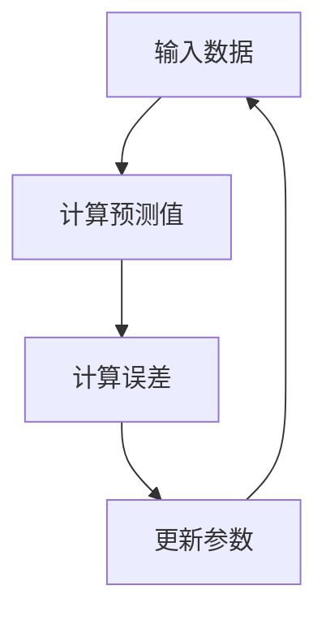
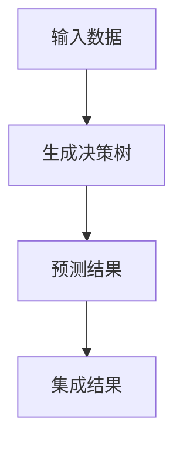

                 


# AI驱动的企业战略规划：大数据分析与预测性情景模拟

> **关键词**：AI、大数据分析、预测性情景模拟、战略规划、机器学习、时间序列分析

> **摘要**：  
> 在当今快速变化的商业环境中，企业需要更加高效和精确的方法来制定和优化其战略规划。AI驱动的企业战略规划结合了大数据分析与预测性情景模拟，为企业提供了前所未有的洞察力和决策支持能力。本文将详细探讨AI在企业战略规划中的应用，从数据分析的基础到预测模型的构建，再到实际项目中的应用，全面解析如何利用AI技术提升企业战略规划的效率和准确性。

---

## 第一部分: AI驱动的企业战略规划概述

### 第1章: AI驱动的企业战略规划背景

#### 1.1 问题背景与定义

现代商业环境的复杂性要求企业能够快速响应市场变化，制定前瞻性的战略规划。然而，传统的方法往往依赖于经验丰富的管理人员和大量的试错成本，效率低下且不够精准。AI技术的引入为企业提供了一种更高效、更数据驱动的方法。

**AI驱动的战略规划**结合了**大数据分析**和**预测性情景模拟**，通过机器学习算法和先进的数据分析技术，帮助企业预测市场趋势、优化资源配置并制定最优策略。这种方法不仅提高了决策的准确性，还大大缩短了规划周期。

#### 1.2 核心概念与联系

AI、大数据分析与预测性情景模拟三者之间存在密切的联系：

1. **AI**提供了强大的计算能力和智能算法，是实现预测性分析的核心技术。
2. **大数据分析**提供了海量的数据支持，是预测模型的基础。
3. **预测性情景模拟**则是将AI和大数据分析的结果应用于实际场景，帮助企业提前预判各种可能的结果。

**ER实体关系图架构**  
以下是一个简单的ER图，展示了AI、大数据分析与预测性情景模拟之间的关系：

```mermaid
er
    entity AI技术
    entity 大数据分析
    entity 预测性情景模拟
    AI技术 --> 大数据分析
    大数据分析 --> 预测性情景模拟
```

#### 1.3 本章小结

本章通过背景介绍和核心概念的分析，阐述了AI驱动的企业战略规划的重要性和基本框架。AI技术的引入不仅提高了战略规划的效率，还为企业的决策提供了更强大的数据支持。

---

## 第二部分: 大数据分析与预测性建模

### 第2章: 大数据分析基础

#### 2.1 数据预处理与特征工程

在进行预测性建模之前，数据预处理是至关重要的一步。

**2.1.1 数据清洗与标准化**  
数据清洗包括去除重复数据、处理缺失值和异常值。标准化则是将数据归一化到同一范围内，通常使用最小-最大标准化或z-score标准化。

**示例代码：**  
```python
import pandas as pd
from sklearn.preprocessing import StandardScaler

# 假设data是原始数据
data_clean = data.drop_duplicates()
data_clean = data_clean.dropna()
scaler = StandardScaler()
data_normalized = scaler.fit_transform(data_clean)
```

**2.1.2 特征选择与降维**  
特征选择可以通过统计检验（如卡方检验）或模型评估（如LASSO回归）来实现。降维通常使用主成分分析（PCA）。

**数学公式：**  
$$ PCA \text{ 的主成分} = X \cdot \lambda^{1/2} v $$

#### 2.2 机器学习模型简介

**2.2.1 监督学习与无监督学习**  
监督学习适用于有标签的数据，如回归和分类问题。无监督学习适用于无标签的数据，如聚类和异常检测。

**常见算法对比：**

| 算法类型 | 示例算法 |
|----------|----------|
| 监督学习 | 线性回归、支持向量机（SVM） |
| 无监督学习 | K-means、主成分分析（PCA） |

**2.2.2 时间序列分析与预测**  
时间序列分析关注数据的时间相关性，常用模型包括ARIMA、Prophet和LSTM。

**ARIMA模型公式：**  
$$ ARIMA(p, d, q) $$  
其中，p为自回归阶数，d为差分阶数，q为移动平均阶数。

---

## 第三部分: 预测性情景模拟的算法原理

### 第3章: 预测性建模算法

#### 3.1 线性回归模型

**3.1.1 线性回归的数学模型**  
线性回归是最简单的预测模型，适用于线性关系。

$$ y = \beta_0 + \beta_1x + \epsilon $$

**算法流程图：**



#### 3.2 随机森林模型

**3.2.1 随机森林的工作原理**  
随机森林是一种集成学习方法，通过构建多个决策树并进行投票或平均来提高预测准确性。

**算法流程图：**



---

## 第四部分: 系统架构设计

### 第4章: 系统架构与实现

#### 4.1 项目介绍与问题场景

假设我们正在为一家零售企业开发一个预测性情景模拟系统，用于预测未来的销售趋势并制定库存管理策略。

**系统功能模块：**

1. **数据采集与处理**  
2. **模型训练与部署**  
3. **情景模拟与报告生成**

**系统架构图：**


---

## 第五部分: 项目实战

### 第5章: 项目实战与分析

#### 5.1 环境安装与数据准备

**安装必要的库：**  
```bash
pip install numpy pandas scikit-learn
```

**数据准备：**  
假设我们使用零售企业的销售数据，包括时间、销售额、价格等。

#### 5.2 系统核心实现

**代码实现：**  
```python
import pandas as pd
from sklearn.ensemble import RandomForestRegressor
from sklearn.metrics import mean_absolute_error

# 加载数据
data = pd.read_csv('sales.csv')

# 特征工程
X = data[['price', 'time', 'category']]
y = data['sales']

# 模型训练
model = RandomForestRegressor()
model.fit(X, y)

# 预测与评估
y_pred = model.predict(X)
print(mean_absolute_error(y, y_pred))
```

---

## 第六部分: 最佳实践与小结

### 第6章: 最佳实践与注意事项

#### 6.1 最佳实践

1. **数据清洗与特征工程**是预测模型成功的关键。
2. **模型评估**需要结合业务目标选择合适的指标。
3. **持续优化**模型，根据实际效果调整参数。

#### 6.2 小结

本文详细介绍了AI驱动的企业战略规划的核心概念、算法原理和系统架构设计，并通过实际项目展示了如何将理论应用于实践。AI技术的应用不仅提高了战略规划的效率，还为企业带来了更大的竞争优势。

---

## 作者信息

作者：AI天才研究院/AI Genius Institute & 禅与计算机程序设计艺术 /Zen And The Art of Computer Programming

