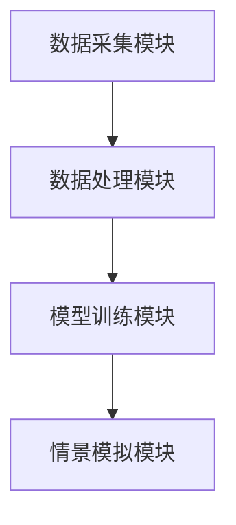

                 


# AI驱动的企业战略规划：大数据分析与预测性情景模拟

> **关键词**: AI, 大数据分析, 预测性情景模拟, 企业战略规划, 机器学习

> **摘要**: 本文深入探讨了AI驱动的企业战略规划方法，结合大数据分析与预测性情景模拟技术，为企业提供科学的战略决策支持。通过分析AI和大数据的核心原理，预测性情景模拟的数学模型与算法，系统架构与设计，以及项目实战案例，本文为企业在复杂多变的商业环境中制定高效的战略规划提供了理论与实践指导。

---

## 第1章: AI与大数据在企业战略规划中的应用

### 1.1 企业战略规划的背景与挑战

#### 1.1.1 传统企业战略规划的局限性
传统的企业战略规划主要依赖于经验判断和历史数据分析，存在以下局限性：
- 数据来源有限，难以捕捉市场变化的全貌。
- 分析过程主观性较强，缺乏客观数据支持。
- 预测结果精度不高，难以应对快速变化的市场环境。

#### 1.1.2 大数据时代的战略规划需求
在大数据时代，企业需要利用海量数据进行深度分析，以支持更科学的战略决策。大数据的特点包括：
- 数据量大（Volume）
- 数据种类多（Variety）
- 数据处理速度快（Velocity）
- 数据价值密度高（Value）

#### 1.1.3 AI驱动的战略规划优势
AI技术的引入，使得企业战略规划更加智能化和自动化。AI的优势体现在：
- 高效的数据处理能力。
- 精准的预测能力。
- 实时的反馈与优化能力。

### 1.2 预测性情景模拟的核心概念

#### 1.2.1 预测性情景模拟的定义
预测性情景模拟是一种基于大数据分析和AI技术，对未来可能发生的各种情况进行预测和模拟的技术。

#### 1.2.2 预测性情景模拟的特征
- **数据驱动**：依赖于大量数据的输入。
- **动态性**：能够实时更新和调整预测结果。
- **情景多样性**：能够模拟多种不同的市场情景。

#### 1.2.3 预测性情景模拟与传统预测方法的区别
| 特性               | 传统预测方法         | 预测性情景模拟       |
|--------------------|----------------------|--------------------|
| 数据来源           | 有限，主要依赖历史数据 | 海量数据，实时更新   |
| 分析方式           | 主观判断为主         | 客观数据驱动       |
| 预测精度           | 较低                 | 较高               |
| 应用场景           | 单一场景             | 多情景模拟         |

### 1.3 本章小结
本章介绍了AI和大数据在企业战略规划中的重要性，以及预测性情景模拟的核心概念和优势。

---

## 第2章: AI与大数据分析的原理

### 2.1 AI的核心原理

#### 2.1.1 机器学习的基本原理
机器学习是一种通过数据训练模型，使其能够从数据中学习并做出预测的技术。其核心流程包括：
1. 数据采集与预处理
2. 模型训练
3. 模型评估
4. 模型优化

#### 2.1.2 深度学习的基本原理
深度学习是一种基于人工神经网络的机器学习技术，其核心在于通过多层神经网络提取数据的高层次特征。

#### 2.1.3 自然语言处理的原理
自然语言处理（NLP）是让计算机理解人类语言的技术，常用于文本分析和情感分析。

### 2.2 大数据分析的原理

#### 2.2.1 数据清洗与预处理
数据清洗是去除噪声数据，确保数据质量的过程。预处理包括数据归一化、缺失值处理等。

#### 2.2.2 数据分析与建模
数据分析包括描述性分析、诊断性分析和预测性分析。建模是通过算法对数据进行建模，以实现预测目标。

#### 2.2.3 数据可视化与洞察提取
数据可视化是将数据以图表形式展示，便于发现数据中的规律和趋势。

### 2.3 预测性情景模拟的数学模型

#### 2.3.1 时间序列分析模型
时间序列分析是一种基于时间数据的预测方法。常用模型包括ARIMA（自回归积分滑动平均模型）。

#### 2.3.2 预测模型的评估指标
常用的评估指标包括均方误差（MSE）、平均绝对误差（MAE）、R平方值（R²）。

#### 2.3.3 模型优化与调参
模型优化包括参数调优和模型超参数的选择，常用的方法有网格搜索和随机搜索。

---

## 第3章: AI驱动的预测性情景模拟算法

### 3.1 机器学习算法

#### 3.1.1 线性回归算法
线性回归是一种简单而有效的回归算法，适用于线性关系的数据。

公式：
$$ y = \beta_0 + \beta_1x + \epsilon $$

#### 3.1.2 支持向量机算法
支持向量机（SVM）是一种监督学习算法，适用于分类和回归问题。

#### 3.1.3 随机森林算法
随机森林是一种基于决策树的集成学习算法，具有较高的鲁棒性。

### 3.2 深度学习算法

#### 3.2.1 LSTM网络
长短时记忆网络（LSTM）是一种特殊的RNN，适用于时间序列数据的预测。

#### 3.2.2 Transformer模型
Transformer模型是一种基于自注意力机制的深度学习模型，广泛应用于NLP领域。

#### 3.2.3 图神经网络
图神经网络（GNN）是一种处理图结构数据的深度学习算法。

### 3.3 算法实现与代码示例

#### 3.3.1 Python代码实现线性回归
```python
import numpy as np
from sklearn.linear_model import LinearRegression

# 生成数据
X = np.linspace(0, 10, 100)
y = 2 * X + 1 + np.random.randn(100)

# 训练模型
model = LinearRegression()
model.fit(X.reshape(-1, 1), y)

# 预测
y_pred = model.predict(X.reshape(-1, 1))
print("斜率:", model.coef_[0], "截距:", model.intercept_)
```

#### 3.3.2 使用Keras实现LSTM网络
```python
from keras.models import Sequential
from keras.layers import LSTM, Dense

# 定义模型
model = Sequential()
model.add(LSTM(64, input_shape=(1, 1)))
model.add(Dense(1))

# 编译模型
model.compile(loss='mean_squared_error', optimizer='adam')
```

---

## 第4章: 系统架构与设计

### 4.1 系统功能设计

#### 4.1.1 数据采集模块
数据采集模块负责从多种数据源获取数据，包括数据库、API接口等。

#### 4.1.2 数据处理模块
数据处理模块对采集到的数据进行清洗、转换和预处理。

#### 4.1.3 模型训练模块
模型训练模块基于处理后的数据，训练预测性情景模拟模型。

#### 4.1.4 情景模拟模块
情景模拟模块根据输入的情景参数，生成预测结果并提供可视化展示。

### 4.2 系统架构设计

#### 4.2.1 系统架构图


#### 4.2.2 接口设计
系统接口设计包括数据接口、模型接口和用户接口。

#### 4.2.3 交互设计
用户可以通过图形界面输入参数，系统根据参数生成预测结果。

---

## 第5章: 项目实战

### 5.1 环境安装
安装必要的Python库，如numpy、pandas、scikit-learn、keras等。

### 5.2 核心实现

#### 5.2.1 数据预处理
```python
import pandas as pd
data = pd.read_csv('data.csv')
data = data.dropna().reset_index(drop=True)
```

#### 5.2.2 模型训练
```python
from sklearn.model_selection import train_test_split
from sklearn.linear_model import LinearRegression

X_train, X_test, y_train, y_test = train_test_split(data[['feature1', 'feature2']], data['target'])
model = LinearRegression()
model.fit(X_train, y_train)
```

### 5.3 案例分析
以某公司市场预测为例，展示如何利用AI和大数据进行预测性情景模拟。

### 5.4 详细讲解
通过具体案例，详细分析模型的训练、调优和应用过程。

---

## 第6章: 总结与展望

### 6.1 本章总结
总结本文的主要内容和研究成果。

### 6.2 未来展望
展望AI和大数据在企业战略规划中的未来发展和应用前景。

---

## 作者信息

作者：AI天才研究院/AI Genius Institute & 禅与计算机程序设计艺术 /Zen And The Art of Computer Programming

---

这篇文章结合了理论与实践，通过详细的讲解和代码示例，为企业在AI驱动的战略规划中提供了全面的指导。希望对您有所帮助！

