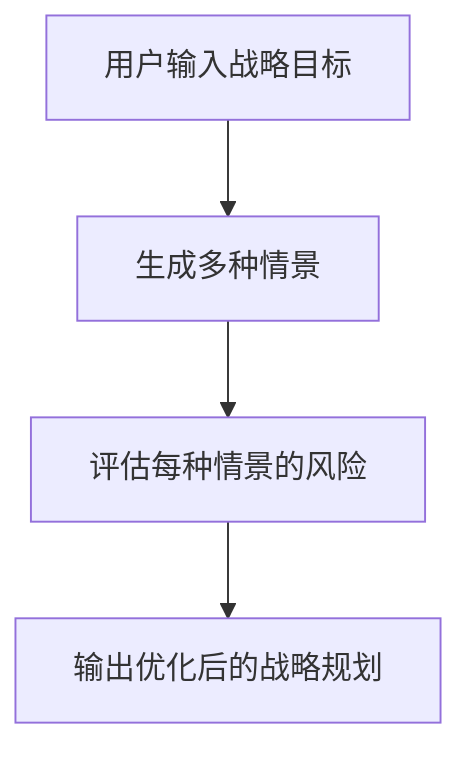
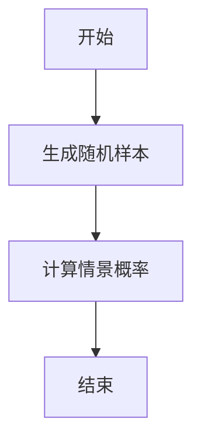
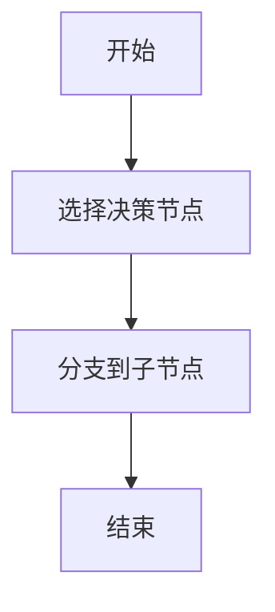
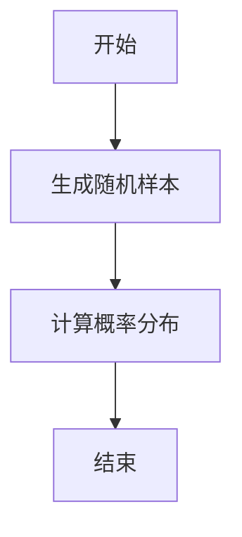
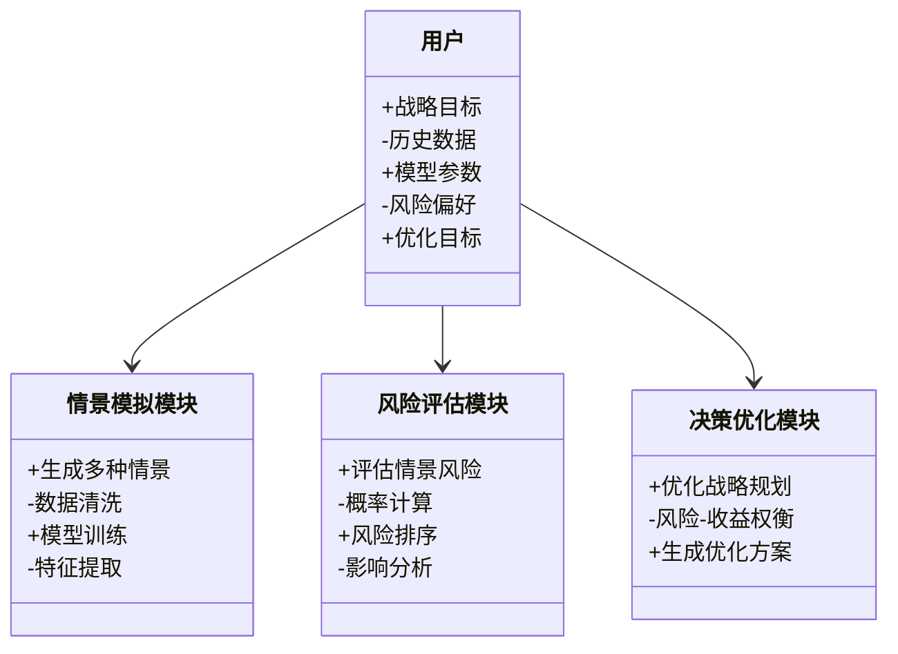
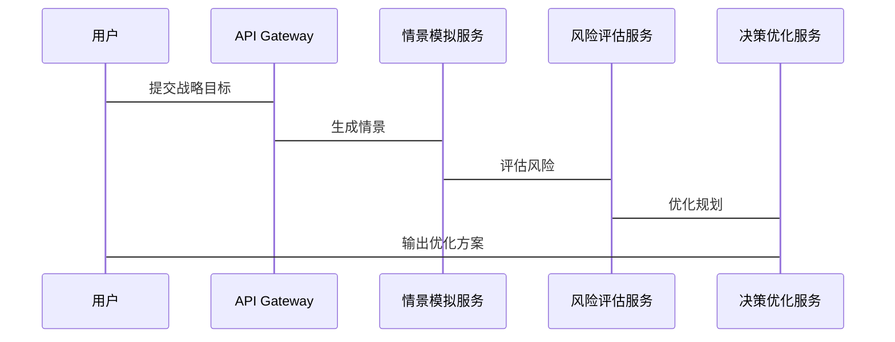

                 


# AI驱动的企业战略规划：情景模拟与风险评估

> 关键词：人工智能, 企业战略规划, 情景模拟, 风险评估, 企业风险管理

> 摘要：随着人工智能技术的迅速发展，企业战略规划的制定和执行正面临前所未有的机遇和挑战。本文将深入探讨如何利用AI技术驱动企业战略规划，重点分析情景模拟与风险评估的核心原理、算法实现及其在实际应用中的价值。通过结合具体案例，本文将为企业提供一套基于AI的情景模拟与风险评估的方法论，帮助企业在复杂多变的商业环境中做出更明智的决策。

---

# 第一部分: AI驱动的企业战略规划背景与基础

# 第1章: AI驱动的企业战略规划概述

## 1.1 问题背景与问题描述
### 1.1.1 传统企业战略规划的局限性
传统的战略规划方法依赖于人工分析和经验判断，存在以下问题：
- **信息处理能力有限**：面对海量数据和复杂变量时，难以快速生成多种可能的情景。
- **主观性较强**：依赖于决策者的经验和判断，可能导致偏差。
- **实时性不足**：难以快速响应市场变化和不确定性。

### 1.1.2 AI技术对企业战略规划的变革作用
AI技术的引入为企业战略规划带来了革命性的变化：
- **数据驱动决策**：通过AI算法处理海量数据，生成更准确的情景模拟。
- **自动化与实时性**：AI能够快速分析市场变化，实时调整战略规划。
- **增强决策的科学性**：通过机器学习模型，优化决策的客观性和准确性。

### 1.1.3 情景模拟与风险评估的核心地位
情景模拟与风险评估是企业战略规划中的关键环节，其作用包括：
- **预测未来趋势**：通过模拟不同情景，预测市场、竞争和经济的变化。
- **量化风险**：通过风险评估，识别潜在风险并制定应对策略。
- **优化决策**：基于情景模拟和风险评估结果，优化战略规划。

## 1.2 问题解决与边界定义
### 1.2.1 AI驱动战略规划的解决方案
AI驱动的战略规划解决方案包括以下步骤：
1. 数据收集与预处理：整合市场、竞争、经济等多源数据。
2. 情景生成：基于历史数据和机器学习模型，生成多种可能的情景。
3. 风险评估：对每种情景进行风险量化和排序。
4. 决策优化：结合风险评估结果，优化战略规划。

### 1.2.2 情景模拟与风险评估的边界与外延
- **边界**：情景模拟和风险评估仅针对战略规划中的特定变量，如市场趋势、竞争策略。
- **外延**：通过AI技术扩展到其他领域，如供应链优化、产品开发等。

### 1.2.3 核心概念与关键要素组成
- **核心概念**：情景模拟、风险评估、AI技术。
- **关键要素**：数据来源、模型选择、风险量化方法。

## 1.3 本章小结
本章通过分析传统战略规划的局限性和AI技术的变革作用，明确了情景模拟与风险评估在企业战略规划中的核心地位。通过定义问题边界和关键要素，为后续的算法实现和系统设计奠定了基础。

---

# 第二部分: 核心概念与联系

# 第2章: AI驱动的情景模拟与风险评估原理

## 2.1 核心概念原理
### 2.1.1 情景模拟的定义与实现原理
- **定义**：情景模拟是通过生成多种可能的市场和竞争情景，帮助企业预测未来趋势。
- **实现原理**：基于机器学习模型（如时间序列分析、随机森林）生成情景。

### 2.1.2 风险评估的定义与实现原理
- **定义**：风险评估是通过量化每种情景的风险，帮助企业识别潜在威胁。
- **实现原理**：基于概率论和统计学模型（如蒙特卡洛模拟）评估风险。

### 2.1.3 AI在情景模拟与风险评估中的作用
AI通过数据处理、模型训练和自动化分析，显著提升了情景模拟和风险评估的效率和准确性。

## 2.2 核心概念对比与联系
### 2.2.1 情景模拟与风险评估的特征对比
| 特征         | 情景模拟                 | 风险评估                 |
|--------------|--------------------------|--------------------------|
| 目标         | 预测未来趋势             | 量化潜在风险             |
| 方法         | 数据分析与模型模拟       | 统计分析与概率模型       |
| 输入         | 历史数据、市场变量       | 情景数据、风险因素       |
| 输出         | 多种可能情景             | 风险概率、影响程度       |

### 2.2.2 AI技术在情景模拟与风险评估中的应用对比
| 技术         | 情景模拟中的应用         | 风险评估中的应用         |
|--------------|--------------------------|--------------------------|
| 数据处理     | 数据清洗与特征提取       | 数据清洗与特征提取       |
| 模型选择     | 时间序列模型、随机森林   | 蒙特卡洛模拟、线性回归   |
| 自动化       | 自动生成情景             | 自动生成风险评估报告     |

### 2.2.3 核心概念的ER实体关系图
```mermaid
er
actor: 用户
scenarioSimulation: 情景模拟
riskAssessment: 风险评估
```

## 2.3 核心概念的流程图


---

# 第三部分: 算法原理讲解

# 第3章: 情景模拟与风险评估的算法实现

## 3.1 情景模拟算法
### 3.1.1 蒙特卡洛模拟
- **原理**：通过随机采样生成多种可能的情景，计算每种情景的概率。
- **流程图**：

- **Python代码示例**：
```python
import numpy as np
def generate_scenario():
    # 示例代码：生成随机市场情景
    market_size = np.random.normal(100, 20)
    return market_size

# 示例调用
for _ in range(1000):
    print(generate_scenario())
```

### 3.1.2 决策树算法
- **原理**：通过构建决策树，分析不同决策路径下的风险和收益。
- **流程图**：

- **Python代码示例**：
```python
from sklearn.tree import DecisionTreeClassifier
# 示例代码：训练决策树模型
model = DecisionTreeClassifier()
model.fit(X, y)
```

## 3.2 风险评估算法
### 3.2.1 蒙特卡洛模拟
- **数学模型**：通过概率分布函数生成随机变量，模拟市场变化。
- **公式**：$$ P(X \leq x) = \sum_{i=1}^{n} \frac{1}{n} \cdot I(X_i \leq x) $$
- **流程图**：


### 3.2.2 决策树算法
- **数学模型**：基于特征重要性构建决策树，评估不同情景的风险。
- **公式**：$$ \text{风险值} = \sum_{i=1}^{n} \text{概率} \times \text{影响} $$
- **流程图**：


---

# 第四部分: 系统分析与架构设计

# 第4章: 基于AI的情景模拟与风险评估系统设计

## 4.1 问题场景介绍
- **问题场景**：企业在制定市场进入战略时，需要预测不同市场情景下的风险和收益。

## 4.2 系统功能设计
### 4.2.1 领域模型


### 4.2.2 系统架构设计


### 4.2.3 系统接口设计
- **输入接口**：接收用户的战略目标和历史数据。
- **输出接口**：输出优化后的战略规划和风险评估报告。

### 4.2.4 系统交互


---

# 第五部分: 项目实战

# 第5章: 基于AI的情景模拟与风险评估的项目实现

## 5.1 项目介绍
- **项目目标**：帮助企业制定市场进入战略。
- **项目范围**：分析市场规模、竞争格局、经济趋势。

## 5.2 环境安装与配置
- **环境要求**：Python 3.8+，安装numpy、pandas、scikit-learn等库。

## 5.3 核心功能实现
### 5.3.1 情景生成
```python
import numpy as np
def generate_scenario():
    market_size = np.random.normal(100, 20)
    return market_size

# 示例调用
for _ in range(1000):
    print(generate_scenario())
```

### 5.3.2 风险评估
```python
from sklearn.tree import DecisionTreeClassifier
# 示例代码：训练决策树模型
model = DecisionTreeClassifier()
model.fit(X, y)
```

### 5.3.3 优化决策
```python
# 示例代码：优化战略规划
def optimize_strategy(scenarios, risks):
    # 示例优化逻辑
    return best_strategy
```

## 5.4 项目实战分析
- **案例分析**：假设某企业计划进入新兴市场，通过AI生成多种情景并评估风险。
- **代码解读**：详细解释代码的功能和实现逻辑。
- **结果分析**：分析优化后的战略规划和风险评估结果。

---

# 第六部分: 最佳实践与总结

# 第6章: 最佳实践与总结

## 6.1 最佳实践
- **数据质量**：确保数据的完整性和准确性。
- **模型选择**：根据具体问题选择合适的AI算法。
- **持续优化**：定期更新模型和数据，保持战略规划的动态性。

## 6.2 小结
本文详细介绍了AI驱动的企业战略规划的方法论，包括情景模拟与风险评估的核心原理、算法实现和系统设计。通过实际案例，展示了如何利用AI技术提升战略规划的科学性和效率。

## 6.3 注意事项
- **数据隐私**：注意保护企业的敏感数据。
- **模型解释性**：确保模型的可解释性，便于决策者理解。
- **多场景验证**：在实际应用中，应多次验证模型的准确性和鲁棒性。

## 6.4 拓展阅读
- **推荐书籍**：《集体智慧编程》、《机器学习实战》。
- **推荐博客**：Tech Insights、AI Chronicles。

---

# 作者：AI天才研究院/AI Genius Institute & 禅与计算机程序设计艺术/Zen And The Art of Computer Programming

