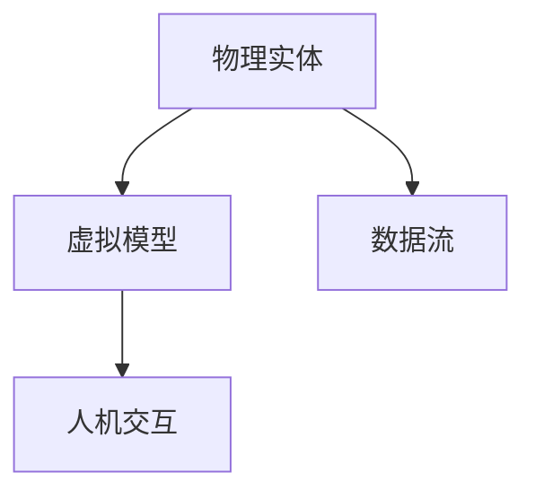
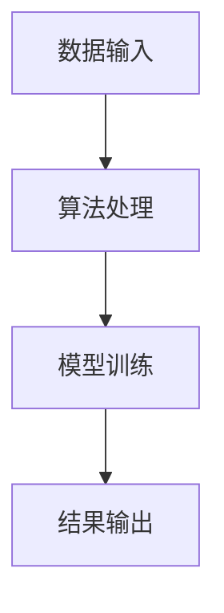
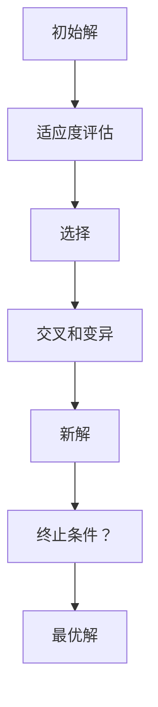
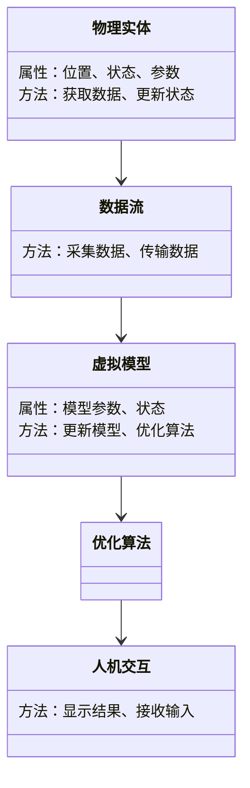
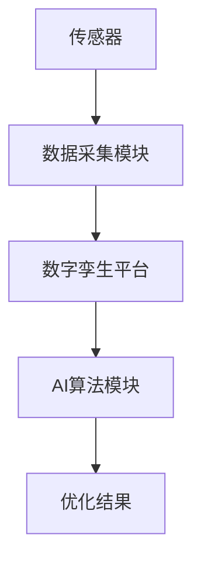

                 


# AI驱动的企业数字孪生技术：虚拟环境中的业务流程优化

> **关键词**：数字孪生、AI驱动、业务流程优化、虚拟环境、企业数字化转型、流程管理、人工智能

> **摘要**：  
> 在企业数字化转型的浪潮中，数字孪生与人工智能的结合为企业业务流程优化提供了新的可能性。本文深入探讨AI驱动的企业数字孪生技术，从核心概念、算法原理到系统架构，再到实际应用案例，全面解析如何利用虚拟环境中的数字孪生模型优化企业业务流程。通过理论与实践结合，为企业在数字化转型中提供有价值的指导和启示。

---

# 引言

随着企业数字化转型的深入推进，业务流程优化已成为企业提升竞争力的关键。数字孪生技术通过在虚拟环境中构建物理世界的数字化模型，为业务流程优化提供了新的工具。而人工智能（AI）的引入，则进一步增强了数字孪生的分析能力和优化能力。本文将从AI驱动的企业数字孪生技术出发，探讨其在虚拟环境中的应用，以及如何优化企业的业务流程。

---

# 第一部分：AI驱动的企业数字孪生技术概述

## 第1章：数字孪生与AI驱动技术概述

### 1.1 数字孪生的定义与特点

#### 1.1.1 数字孪生的定义  
数字孪生（Digital Twin）是一种通过物理实体的数字化模型，实时反映物理实体的状态、属性和行为的技术。它通过传感器、物联网（IoT）和数据采集技术，将物理世界的数据映射到虚拟世界，形成一个动态的、可交互的数字化模型。

#### 1.1.2 数字孪生的核心特点  
1. **实时性**：数字孪生模型能够实时反映物理实体的状态。
2. **互动性**：用户可以通过虚拟模型与物理实体进行交互。
3. **动态性**：数字孪生模型能够动态更新，反映物理实体的变化。
4. **多维性**：数字孪生模型可以包含物理实体的几何、物理、行为等多个维度的信息。

#### 1.1.3 数字孪生与传统信息化的区别  
数字孪生不仅仅是简单的信息化，它更注重物理世界与虚拟世界的实时映射和交互。传统的信息化系统通常基于静态数据，而数字孪生则基于动态数据，能够提供实时的、动态的决策支持。

### 1.2 AI驱动技术的定义与特点

#### 1.2.1 AI驱动技术的定义  
AI驱动技术是指利用人工智能算法和技术，驱动系统完成特定任务的技术。它通过机器学习、深度学习、自然语言处理等技术，实现数据的自动分析、模式识别和智能决策。

#### 1.2.2 AI驱动技术的核心特点  
1. **数据驱动**：AI驱动技术依赖于大量数据进行训练和推理。
2. **自动化**：AI系统能够自动完成数据处理、模型训练和决策过程。
3. **适应性**：AI系统能够根据数据的变化自适应调整模型和策略。
4. **智能化**：AI系统具备一定的认知能力和问题解决能力。

#### 1.2.3 AI驱动技术与传统IT技术的区别  
AI驱动技术与传统IT技术的核心区别在于，前者注重数据的分析和决策，而后者注重数据的存储和处理。AI驱动技术通过数据驱动的方式实现智能决策，而传统IT技术更多关注数据的结构化存储和管理。

### 1.3 数字孪生与AI驱动技术的结合

#### 1.3.1 数字孪生与AI驱动技术的协同关系  
数字孪生提供了一个动态的虚拟模型，AI驱动技术则通过分析模型中的数据，提供优化建议和决策支持。两者结合，形成了一个闭环的优化系统。

#### 1.3.2 AI驱动技术在数字孪生中的应用领域  
1. **生产优化**：通过AI分析数字孪生模型，优化生产流程。
2. **设备维护**：基于数字孪生的设备状态数据，AI算法预测设备故障，提前进行维护。
3. **供应链优化**：通过数字孪生的供应链模型，AI算法优化供应链的库存和物流。
4. **客户服务**：基于数字孪生的客户行为数据，AI算法提供个性化的客户服务。

#### 1.3.3 数字孪生与AI驱动技术的未来发展趋势  
1. **智能化增强**：AI算法的不断进步将使数字孪生模型更加智能化。
2. **实时性提升**：通过边缘计算和实时数据处理，数字孪生模型的实时性将进一步提升。
3. **多领域融合**：数字孪生将与更多的领域（如物联网、区块链等）结合，形成更加复杂的优化系统。

---

## 第2章：企业数字孪生的核心概念与业务流程优化

### 2.1 企业数字孪生的背景与问题背景

#### 2.1.1 企业数字化转型的背景  
随着数字化转型的深入推进，企业越来越依赖数据和智能系统来提升效率和竞争力。数字孪生技术为企业提供了一个虚拟环境，可以在虚拟空间中模拟和优化业务流程。

#### 2.1.2 传统业务流程优化的局限性  
传统的业务流程优化方法通常基于经验判断和静态数据分析，难以实时反映业务流程的变化。同时，传统方法缺乏对复杂系统的动态模拟能力，优化效果有限。

#### 2.1.3 数字孪生在业务流程优化中的作用  
数字孪生通过虚拟模型的动态模拟和实时反馈，为企业提供了更精准的优化工具。AI驱动的数字孪生系统能够快速分析数据，提供优化建议，并实时调整业务流程。

### 2.2 数字孪生与业务流程优化的核心概念

#### 2.2.1 数字孪生在业务流程优化中的核心要素  
1. **虚拟模型**：数字孪生模型是业务流程优化的基础。
2. **实时数据**：实时数据是数字孪生模型的核心输入。
3. **AI算法**：AI算法是数字孪生模型优化的关键工具。
4. **人机交互**：人机交互是数字孪生优化结果的输出方式。

#### 2.2.2 业务流程优化的边界与外延  
业务流程优化的边界通常包括企业的核心业务流程，而外延则扩展到企业的上下游供应链、客户和合作伙伴。

#### 2.2.3 数字孪生与业务流程优化的关系  
数字孪生是业务流程优化的工具和平台，而业务流程优化则是数字孪生技术的应用场景和目标。

### 2.3 业务流程优化的实现路径

#### 2.3.1 业务流程优化的步骤与方法  
1. **问题识别**：识别业务流程中的瓶颈和问题。
2. **模型构建**：构建数字孪生模型。
3. **数据采集**：采集实时数据。
4. **模型优化**：利用AI算法优化模型。
5. **结果反馈**：将优化结果反馈到实际业务流程中。

#### 2.3.2 数字孪生在业务流程优化中的具体应用  
1. **生产流程优化**：通过数字孪生模型优化生产流程中的资源分配和调度。
2. **供应链优化**：通过数字孪生模型优化供应链中的库存管理和物流调度。
3. **客户服务优化**：通过数字孪生模型优化客户服务流程，提高客户满意度。

#### 2.3.3 业务流程优化的成功案例分析  
以某制造企业为例，通过数字孪生技术优化生产流程，降低了生产成本，提高了生产效率。

---

## 第3章：数字孪生与AI驱动技术的核心概念与联系

### 3.1 数字孪生与AI驱动技术的核心概念

#### 3.1.1 数字孪生的概念模型  
数字孪生的概念模型包括物理实体、虚拟模型、数据流和人机交互四个部分。



#### 3.1.2 AI驱动技术的概念模型  
AI驱动技术的概念模型包括数据输入、算法处理、模型训练和结果输出四个部分。



#### 3.1.3 数字孪生与AI驱动技术的协同关系  
数字孪生提供数据和模型，AI驱动技术提供算法和优化能力，两者结合形成一个闭环的优化系统。

### 3.2 数字孪生与AI驱动技术的核心算法

#### 3.2.1 优化算法  
优化算法是数字孪生与AI驱动技术的核心，常用的优化算法包括遗传算法、模拟退火算法和粒子群算法。



#### 3.2.2 机器学习算法  
机器学习算法是AI驱动技术的核心，常用的机器学习算法包括线性回归、支持向量机和神经网络。

#### 3.2.3 深度学习算法  
深度学习算法是机器学习的一种，通过多层神经网络实现更复杂的模式识别。

---

## 第4章：数字孪生与AI驱动技术的系统架构设计

### 4.1 问题场景介绍  
以某制造企业的生产流程优化为例，构建数字孪生模型，利用AI算法优化生产流程。

### 4.2 系统功能设计  
系统功能包括数据采集、模型构建、优化算法和结果反馈。



### 4.3 系统架构设计  
系统架构包括传感器、数据采集模块、数字孪生平台和AI算法模块。



### 4.4 系统接口设计  
系统接口包括数据接口、模型接口和人机交互接口。

### 4.5 系统交互流程  
系统交互流程包括数据采集、模型更新、算法优化和结果反馈。

```mermaid
sequenceDiagram
参与者 用户
参与者 系统
参与者 传感器
参与者 数据库

用户 -> 系统: 请求优化
系统 -> 传感器: 获取实时数据
传感器 -> 系统: 返回数据
系统 -> 数据库: 更新模型
系统 -> 算法模块: 执行优化
算法模块 -> 系统: 返回优化结果
系统 -> 用户: 显示结果
```

---

## 第5章：数字孪生与AI驱动技术的项目实战

### 5.1 环境配置  
项目需要安装Python、NumPy、scikit-learn、TensorFlow和Mermaid工具。

### 5.2 核心代码实现

#### 5.2.1 数据采集代码  
```python
import numpy as np
import pandas as pd

# 采集数据
data = pd.DataFrame({
    '时间': [1, 2, 3, 4, 5],
    '温度': [20, 22, 25, 23, 20],
    '湿度': [50, 55, 60, 58, 52]
})
```

#### 5.2.2 模型构建代码  
```python
from sklearn.linear_model import LinearRegression

# 训练模型
model = LinearRegression()
model.fit(data[['时间']], data['温度'])
```

#### 5.2.3 优化算法代码  
```python
import numpy as np

def optimize(parameters):
    # 定义目标函数
    return np.sum((model.predict(parameters) - target)^2)
```

#### 5.2.4 优化结果展示  
```python
print("优化后的参数：", optimized_parameters)
```

### 5.3 案例分析  
以某制造企业的生产流程优化为例，通过数字孪生技术优化生产流程，降低生产成本。

### 5.4 项目小结  
通过本项目，我们验证了数字孪生与AI驱动技术在业务流程优化中的有效性。

---

## 第6章：数字孪生与AI驱动技术的最佳实践

### 6.1 最佳实践  
1. **数据质量**：确保数据的准确性和完整性。
2. **模型选择**：根据具体问题选择合适的算法和模型。
3. **系统集成**：确保数字孪生系统与其他系统的良好集成。

### 6.2 小结  
数字孪生与AI驱动技术的结合为企业业务流程优化提供了新的工具和方法。

### 6.3 注意事项  
1. **数据隐私**：注意数据的安全和隐私保护。
2. **系统稳定性**：确保系统的稳定性和可靠性。
3. **用户培训**：对用户进行充分的培训，确保系统能够顺利应用。

### 6.4 拓展阅读  
推荐阅读《数字孪生技术与应用》和《人工智能算法实战》。

---

# 结论

AI驱动的企业数字孪生技术通过虚拟环境中的数字化模型，为企业业务流程优化提供了新的思路和工具。通过数字孪生与AI驱动技术的结合，企业可以在虚拟环境中实时优化业务流程，提高效率和竞争力。未来，随着技术的不断进步，数字孪生与AI驱动技术的应用将更加广泛和深入。

---

# 作者

**作者：AI天才研究院/AI Genius Institute & 禅与计算机程序设计艺术 /Zen And The Art of Computer Programming**

