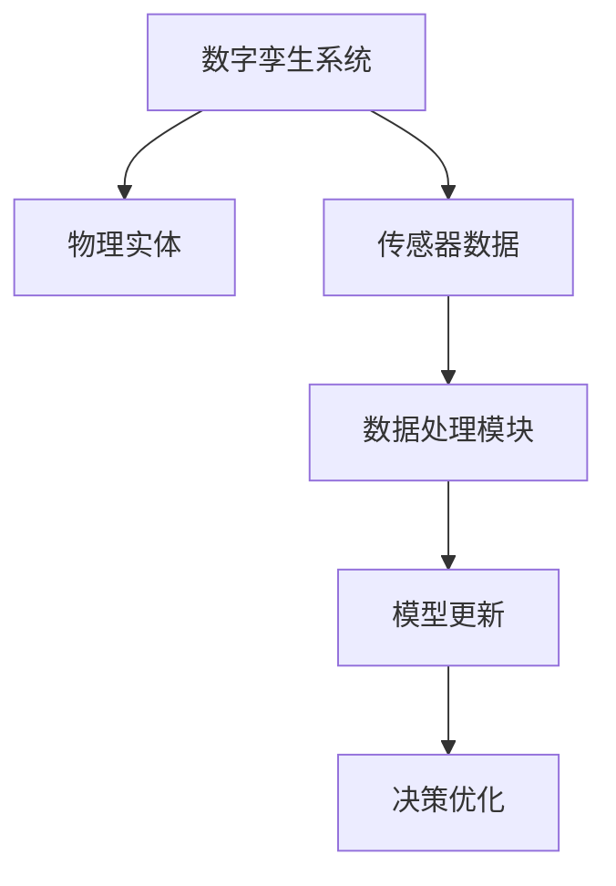
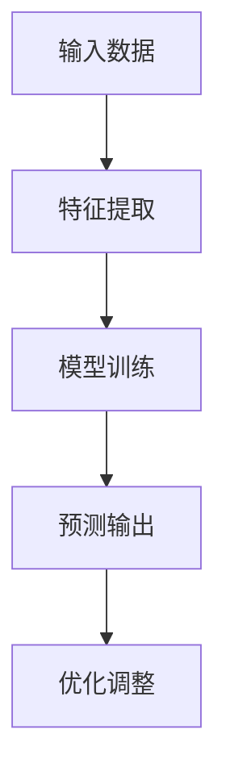
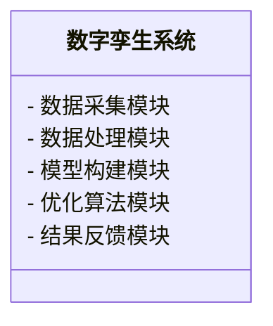
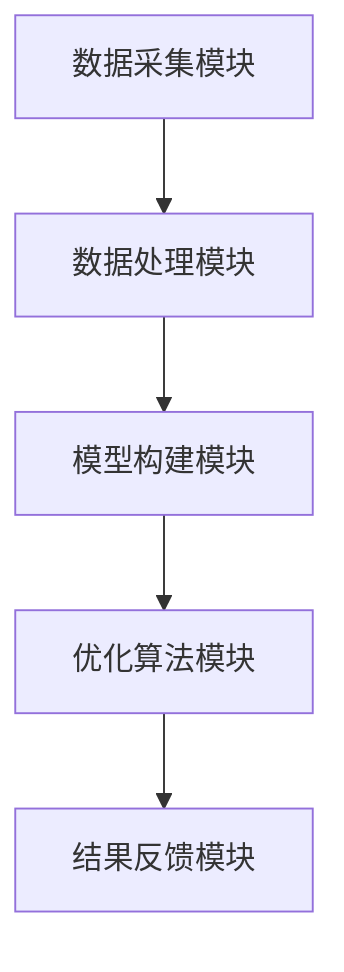
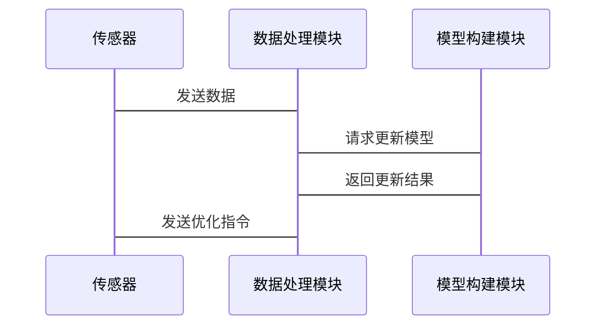

                 


# AI驱动的企业数字孪生技术：虚拟环境中的决策优化与验证

## 关键词：AI、数字孪生、决策优化、虚拟环境、企业数字化转型

## 摘要：本文详细探讨了AI驱动的企业数字孪生技术在虚拟环境中的应用，分析了数字孪生的核心概念、AI算法的优化机制、系统架构设计以及实际项目中的应用案例。通过理论与实践相结合的方式，本文揭示了数字孪生技术如何助力企业在虚拟环境中实现决策优化与验证，为企业数字化转型提供了新的思路和方法。

---

## 第一章：企业数字孪生技术的背景与概念

### 1.1 数字孪生技术的基本概念
数字孪生（Digital Twin）是一种将物理世界中的实体或系统在虚拟环境中进行数字化建模的技术。它通过实时数据采集、模型构建和动态仿真，实现对物理世界的精准映射。数字孪生的核心在于数据驱动的动态更新和AI算法的优化作用。

#### 1.1.1 数字孪生的定义与核心要素
数字孪生通过传感器、物联网（IoT）和大数据技术，将物理实体的实时状态映射到虚拟模型中。其核心要素包括：
1. **数据源**：传感器、数据库、日志文件等。
2. **模型构建**：几何模型、行为模型、规则模型等。
3. **动态更新**：实时数据驱动模型的动态调整。
4. **仿真引擎**：用于虚拟环境中的模拟与预测。

#### 1.1.2 数字孪生与物理世界的映射关系
数字孪生通过数据流将物理世界与虚拟世界连接起来。例如，传感器数据输入虚拟模型，模型通过AI算法进行优化，再将优化结果反馈到物理系统中。这种双向互动是数字孪生的核心特征。

#### 1.1.3 数字孪生技术的发展历程与现状
数字孪生技术起源于制造业和物联网领域，近年来随着AI和大数据技术的发展，逐渐扩展到企业数字化转型的各个领域，如供应链优化、设备维护、智慧城市等。

### 1.2 AI在数字孪生中的作用
AI技术的引入，使数字孪生从简单的数据映射发展为智能化的决策支持系统。

#### 1.2.1 AI驱动数字孪生的核心价值
1. **实时优化**：通过AI算法实时优化虚拟模型，提高决策效率。
2. **预测分析**：基于历史数据和实时数据，预测未来趋势。
3. **自适应学习**：AI模型能够根据反馈不断优化自身的预测能力。

#### 1.2.2 AI在数字孪生中的应用场景
1. **智能制造**：优化生产流程，预测设备故障。
2. **智慧城市**：模拟交通流量，优化城市规划。
3. **供应链管理**：预测库存需求，优化物流路径。

#### 1.2.3 AI与数字孪生的融合趋势
随着深度学习和强化学习技术的进步，AI驱动的数字孪生将更加智能化和自动化，能够处理更复杂的决策问题。

### 1.3 企业数字孪生技术的挑战与机遇
#### 1.3.1 技术挑战
1. 数据量大：需要处理来自多个传感器和系统的海量数据。
2. 模型复杂：构建高精度的虚拟模型需要复杂的算法支持。
3. 实时性要求高：需要快速响应和处理实时数据。

#### 1.3.2 企业应用中的机遇
1. 提高效率：通过虚拟仿真优化企业运营流程。
2. 降低成本：通过预测维护减少设备故障，降低维修成本。
3. 创新商业模式：基于数字孪生的虚拟服务和数据变现。

#### 1.3.3 未来发展趋势
数字孪生将与5G、边缘计算和区块链等新技术结合，进一步提升数据处理能力和安全性。

---

## 第二章：数字孪生技术的核心概念与联系

### 2.1 数字孪生的核心概念原理
数字孪生通过数据驱动的动态更新和AI算法的优化，实现对物理世界的精准映射。

#### 2.1.1 数字孪生的系统模型构建
数字孪生模型通常包括几何模型、行为模型和规则模型。几何模型用于描述物理实体的形状和空间关系；行为模型用于模拟实体的行为和动态变化；规则模型用于定义实体的约束条件和运行规则。

#### 2.1.2 数据驱动的动态更新机制
数字孪生模型通过实时数据输入不断更新，确保虚拟模型与物理实体保持一致。动态更新机制包括数据采集、数据处理、模型更新和结果反馈四个步骤。

#### 2.1.3 AI算法的优化作用
AI算法通过分析历史数据和实时数据，优化数字孪生模型的预测能力和决策能力。例如，使用深度学习算法进行时间序列预测，优化虚拟模型的仿真精度。

### 2.2 核心概念属性特征对比表格

| **属性**       | **数字孪生**                | **传统仿真技术**              |
|----------------|-----------------------------|-------------------------------|
| 数据来源       | 实时传感器数据和历史数据    | 静态数据或人工输入数据        |
| 更新频率       | 实时或高频                  | 低频或手动更新                |
| 模型精度       | 高精度，基于AI优化          | 中等精度，依赖人工调整        |
| 应用场景       | 智能制造、智慧城市、供应链管理 | 工程设计、科学研究              |

### 2.3 ER实体关系图架构（Mermaid流程图）



---

## 第三章：AI驱动的数字孪生算法原理

### 3.1 算法原理讲解
AI驱动的数字孪生算法通过实时数据和历史数据，构建高精度的虚拟模型，并进行预测和优化。

#### 3.1.1 算法流程图（Mermaid）



#### 3.1.2 Python源代码实现

```python
def ai_driven_twin(data):
    features = extract_features(data)
    model = train_model(features)
    predictions = model.predict(features)
    return predictions

# 示例数据
data = [1, 2, 3, 4, 5]
print(ai_driven_twin(data))
```

#### 3.1.3 数学模型和公式
数字孪生的预测模型可以基于时间序列预测，例如使用LSTM（长短期记忆网络）算法。模型的数学表示如下：

$$
y_t = \alpha \cdot y_{t-1} + \beta \cdot x_t + \epsilon
$$

其中，$y_t$ 是预测值，$y_{t-1}$ 是前一个时间点的值，$x_t$ 是当前时间点的输入数据，$\alpha$ 和 $\beta$ 是模型参数，$\epsilon$ 是误差项。

---

## 第四章：系统架构设计

### 4.1 问题场景介绍
以智能制造为例，数字孪生系统需要实时监控生产设备的运行状态，预测设备故障，优化生产流程。

### 4.2 系统功能设计
系统功能包括数据采集、模型构建、仿真优化和结果反馈。

#### 4.2.1 领域模型（Mermaid类图）



#### 4.2.2 系统架构设计（Mermaid架构图）



#### 4.2.3 系统接口设计
系统接口包括传感器数据接口、模型参数接口和结果反馈接口。

#### 4.2.4 系统交互流程（Mermaid序列图）



---

## 第五章：项目实战

### 5.1 环境安装与配置
1. 安装Python和相关库（如NumPy、TensorFlow、Keras）。
2. 配置传感器数据采集模块（如MQTT协议）。

### 5.2 系统核心实现源代码
```python
import numpy as np
import tensorflow as tf

# 数据预处理
def preprocess(data):
    # 数据标准化
    mean = np.mean(data)
    std = np.std(data)
    normalized_data = (data - mean) / std
    return normalized_data

# LSTM模型构建
def build_model(input_shape):
    model = tf.keras.Sequential()
    model.add(tf.keras.layers.LSTM(64, input_shape=input_shape))
    model.add(tf.keras.layers.Dense(1))
    model.compile(optimizer='adam', loss='mse')
    return model

# 模型训练
def train_model(features, labels):
    model = build_model((features.shape[1], features.shape[2]))
    model.fit(features, labels, epochs=100, batch_size=32)
    return model

# 模型预测
def predict_model(model, data):
    normalized_data = preprocess(data)
    prediction = model.predict(np.array([normalized_data]))
    return prediction[0][0]
```

### 5.3 代码应用解读与分析
以上代码实现了一个基于LSTM的数字孪生预测模型。数据预处理部分对传感器数据进行标准化，模型构建部分使用LSTM网络进行时间序列预测，模型训练部分通过反向传播优化模型参数，模型预测部分输出预测结果。

### 5.4 实际案例分析
以智能工厂设备预测维护为例，通过数字孪生系统实时监控设备状态，预测设备故障时间，优化维护计划，降低设备 downtime。

### 5.5 测试与优化
1. 数据测试：验证数据预处理和模型训练的正确性。
2. 模型优化：调整LSTM网络的参数，提高预测精度。
3. 系统测试：测试系统接口和交互流程的稳定性。

---

## 第六章：总结与展望

### 6.1 内容总结
本文详细介绍了AI驱动的企业数字孪生技术，从基本概念到算法原理，再到系统架构和项目实战，全面阐述了数字孪生技术的核心内容和应用价值。

### 6.2 挑战与未来趋势
尽管数字孪生技术在企业数字化转型中展现出巨大潜力，但仍面临数据安全、模型精度和实时性等挑战。未来，随着AI和边缘计算技术的进步，数字孪生将更加智能化和自动化。

### 6.3 最佳实践 tips
1. 数据是数字孪生的核心，确保数据质量和实时性。
2. 结合企业的实际需求，选择合适的数字孪生技术方案。
3. 定期更新模型，保持数字孪生系统的准确性。

---

## 附录

### 附录A：术语表
1. 数字孪生（Digital Twin）：虚拟环境中对物理实体的数字化映射。
2. AI算法：人工智能算法，用于优化数字孪生模型的预测和决策能力。

### 附录B：参考文献
1.《数字孪生技术与应用》，某某出版社，2023年。
2.《人工智能与数字孪生》，某某出版社，2023年。

---

## 作者：AI天才研究院/AI Genius Institute & 禅与计算机程序设计艺术 /Zen And The Art of Computer Programming

---

以上就是《AI驱动的企业数字孪生技术：虚拟环境中的决策优化与验证》的完整内容，希望对您有所帮助！

