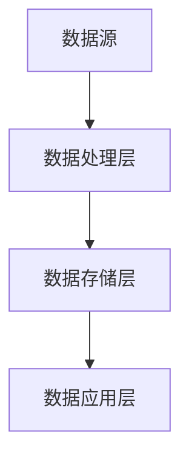
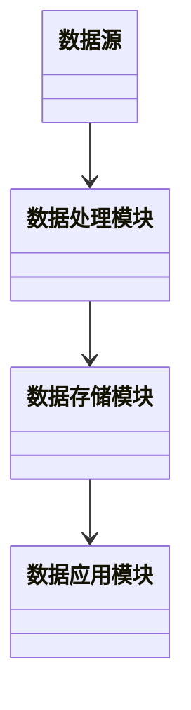
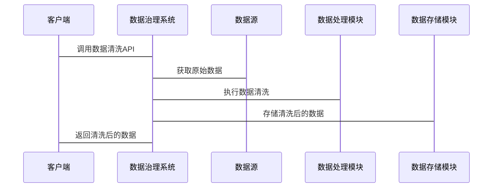

                 


---

# AI驱动的企业数据质量管理与治理

> **关键词**：企业数据质量管理、数据治理、人工智能、数据清洗、数据安全、数据标准化、数据集成

> **摘要**：随着企业对数据依赖的增加，数据质量管理与治理变得至关重要。AI技术的应用为企业提供了智能化的数据管理解决方案，通过机器学习和自然语言处理等技术，提升了数据清洗、标准化和集成的效率和准确性。本文系统地介绍了AI在数据质量管理中的应用，分析了相关的算法和系统架构，并通过实际案例展示了如何在企业中实施AI驱动的数据质量管理。最后，总结了最佳实践和未来发展趋势。

---

## 第1章：AI驱动的企业数据质量管理与治理概述

### 1.1 数据质量管理的背景

数据质量管理（Data Quality Management，DQM）是企业在信息化和智能化转型过程中不可或缺的一环。随着企业逐渐从信息化迈向智能化，数据作为企业的核心资产，其质量直接关系到企业的决策能力和竞争力。数据质量管理的目标是确保数据的准确性、完整性、一致性和及时性，从而为企业提供可靠的数据支持。

#### 问题背景与描述

在企业信息化建设过程中，数据孤岛、数据不一致、数据冗余等问题屡见不鲜。这些数据问题不仅影响了企业的运营效率，还可能导致错误的决策。例如，销售部门可能使用不同的客户信息，导致客户数据重复或不准确，进而影响客户关系管理。此外，随着企业规模的扩大和业务的复杂化，数据来源多样化，数据格式和标准不统一，数据清洗和整合的难度也随之增加。

#### 问题解决与边界

AI技术的引入为数据质量管理带来了新的可能性。通过机器学习算法，企业可以自动识别数据中的错误和异常，并进行智能清洗。例如，利用聚类算法可以识别出数据中的重复项，使用分类模型可以自动标注数据中的错误项。AI不仅提高了数据清洗的效率，还减少了人工操作的错误率。

#### 核心要素与结构

数据质量管理的核心要素包括数据质量维度、数据清洗流程和数据质量管理框架。数据质量维度通常包括准确性、完整性、一致性、及时性和规范性。数据清洗流程包括数据收集、预处理、转换和验证。数据质量管理框架则涵盖了数据生命周期模型和数据治理的组织架构与职责。

---

### 1.2 数据治理的必要性

数据治理（Data Governance）是确保数据在企业中得到正确使用和管理的关键过程。随着企业数据的快速增长，数据治理的重要性日益凸显。

#### 数据孤岛与不一致

数据孤岛是指数据分散在不同的系统中，缺乏统一的管理和标准，导致数据无法有效共享和利用。数据不一致则是指同一数据在不同的系统中表现形式不同，例如客户名称在A系统中是“有限公司”，而在B系统中是“公司”。这些问题会导致数据整合困难，影响数据分析的准确性。

#### 数据安全与合规性

随着数据保护法规的日益严格，企业必须确保数据的合规性。例如，欧盟的GDPR法规要求企业保护个人数据的隐私和安全。数据治理可以帮助企业建立数据安全策略，确保数据在采集、存储和使用过程中的安全性。

#### 数据治理对企业决策的影响

数据治理不仅仅是技术问题，更是管理问题。通过数据治理，企业可以确保数据的准确性和一致性，从而提高决策的可靠性。例如，销售部门可以根据统一的客户数据进行销售预测，避免因数据不一致而导致的错误预测。

---

### 1.3 AI在数据质量管理中的作用

AI技术的应用极大地提升了数据质量管理的效率和准确性。以下是AI在数据质量管理中的主要作用：

#### 数据清洗与标准化

AI可以通过机器学习算法自动识别数据中的错误和异常，并进行智能清洗。例如，使用聚类算法可以识别出数据中的重复项，使用分类模型可以自动标注数据中的错误项。此外，自然语言处理（NLP）技术可以用于清洗文本数据，例如识别并纠正拼写错误。

#### 数据异常识别

通过AI技术，企业可以实时监控数据流，识别数据中的异常值和趋势。例如，使用时间序列分析可以检测数据中的异常波动，使用聚类算法可以识别出数据中的异常群集。

#### 数据质量管理的自动化

AI驱动的数据质量管理可以实现自动化，减少人工干预。例如，数据清洗流程可以完全由AI算法自动执行，数据验证可以通过机器学习模型自动完成。

---

## 第2章：数据质量管理的核心概念与框架

### 2.1 数据质量维度

数据质量维度是衡量数据质量的关键指标，主要包括以下五个方面：

| 数据质量维度 | 描述 |
|---------------|------|
| 准确性        | 数据与真实值的接近程度 |
| 完整性        | 数据的完整性和是否存在缺失值 |
| 一致性        | 数据在不同系统中的统一性 |
| 及时性        | 数据的更新频率和及时性 |
| 规范性        | 数据是否符合预定义的格式和标准 |

### 2.2 数据清洗流程

数据清洗是数据质量管理的重要步骤，通常包括以下几个阶段：

1. **数据收集**：从多个数据源收集数据，例如数据库、API接口、文件等。
2. **数据预处理**：对收集到的数据进行初步处理，例如去除重复项、处理缺失值。
3. **数据转换**：将数据转换为统一的格式和标准，例如将日期格式统一为ISO标准。
4. **数据验证**：验证数据的准确性和一致性，例如通过数据校验规则检查数据的有效性。

### 2.3 数据质量管理框架

数据质量管理框架是企业数据治理的组织架构和职责分配的指导框架。它包括以下几个关键部分：

1. **数据生命周期模型**：描述数据从创建、存储、使用到销毁的全过程。
2. **数据治理组织架构**：明确数据治理的组织结构和职责分配，例如数据治理委员会、数据管理员等。
3. **数据治理职责**：定义各个角色在数据治理中的具体职责，例如数据管理员负责数据清洗，数据审计员负责数据合规性检查。

---

## 第3章：AI驱动数据质量管理的核心算法

### 3.1 机器学习在数据清洗中的应用

#### 聚类算法识别数据异常

聚类算法是一种无监督学习算法，可以通过数据点的相似性将数据分成不同的簇。在数据清洗中，聚类算法可以用于识别数据中的异常值。例如，使用K-Means算法将客户数据分成不同的簇，然后检查每个簇中的数据点是否符合预期。

**K-Means算法步骤：**

1. **初始化**：随机选择K个初始质心。
2. **聚类分配**：将每个数据点分配到距离最近的质心所在的簇。
3. **更新质心**：计算每个簇的质心，并更新质心位置。
4. **收敛检查**：检查质心是否发生变化，如果没有变化则算法收敛。

#### 分类模型自动标注数据

分类模型是一种监督学习算法，可以通过训练数据预测新数据的类别。在数据清洗中，分类模型可以用于自动标注数据中的错误项。例如，使用支持向量机（SVM）或随机森林（Random Forest）算法训练一个分类器，识别数据中的错误项。

---

### 3.2 自然语言处理在文本数据中的应用

#### 使用NLP技术清洗文本数据

自然语言处理（NLP）技术可以用于清洗文本数据，例如识别和纠正拼写错误、去除停用词等。常用的NLP技术包括分词、实体识别、情感分析等。

#### 基于深度学习的实体识别

实体识别是一种NLP任务，旨在识别文本中的实体（如人名、地名、组织名等）。基于深度学习的实体识别可以利用预训练的语言模型（如BERT）进行微调，从而提高识别的准确性。

---

### 3.3 数据增强与数据生成

#### 使用数据生成技术补充缺失数据

数据增强是一种通过生成新数据来补充缺失数据的技术。例如，使用生成对抗网络（GAN）生成新的客户数据，或者使用变种自编码器（VAE）生成新的产品数据。

#### 数据增强方法提升数据质量

数据增强可以通过多种方式提升数据质量，例如通过数据变换（如旋转、翻转）增强图像数据，通过数据扩充（如添加噪声、改变速度）增强音频数据。

---

## 第4章：数据治理的系统架构与设计

### 4.1 数据治理系统架构

数据治理系统架构是企业数据治理的技术实现的基础。通常，数据治理系统可以分为以下几个层次：

1. **数据源层**：数据的原始存储位置，例如数据库、文件、API接口等。
2. **数据处理层**：对数据进行清洗、转换和验证的模块。
3. **数据存储层**：存储清洗后的数据，例如数据仓库、数据湖等。
4. **数据应用层**：数据的应用场景，例如数据分析、数据可视化等。

**数据治理系统架构图：**



---

### 4.2 系统功能设计

#### 领域模型类图

领域模型类图描述了数据治理系统中的核心实体及其关系。以下是数据治理系统的主要实体和关系：

- **数据源**：数据的原始存储位置。
- **数据处理模块**：负责数据清洗、转换和验证。
- **数据存储模块**：负责存储清洗后的数据。
- **数据应用模块**：负责数据的应用和展示。

**领域模型类图：**



---

### 4.3 系统接口与交互设计

#### API设计与调用流程

数据治理系统通常提供一组API接口，供其他系统调用。以下是API设计与调用流程的示例：

1. **数据采集API**：从数据源采集数据。
2. **数据清洗API**：对数据进行清洗和转换。
3. **数据存储API**：将清洗后的数据存储到数据存储层。
4. **数据查询API**：根据查询条件检索数据。

**API调用流程图：**



---

## 第5章：数据治理的AI驱动算法实现

### 5.1 数据清洗算法实现

#### 使用Python代码实现数据清洗

以下是使用Python代码实现数据清洗的示例：

```python
import pandas as pd
import numpy as np

# 加载数据
data = pd.read_csv('raw_data.csv')

# 处理缺失值
data.dropna(inplace=True)

# 去除重复项
data.drop_duplicates(inplace=True)

# 转换数据格式
data['date'] = pd.to_datetime(data['date'])

# 数据验证
assert data['id'].duplicated().sum() == 0, "存在重复的ID"
```

#### 正则表达式匹配与替换

使用正则表达式进行数据清洗是常见的技术。例如，使用正则表达式去除文本中的特殊字符。

```python
import re

# 去除文本中的特殊字符
data['text'] = data['text'].apply(lambda x: re.sub(r'[^\w\s]', '', x))
```

---

### 5.2 数据标准化与转换

#### 编写Python脚本进行数据转换

以下是编写Python脚本进行数据标准化的示例：

```python
from sklearn.preprocessing import StandardScaler

# 标准化数据
scaler = StandardScaler()
data标准化 = scaler.fit_transform(data[['age', 'income']])
```

#### 数据格式统一化处理

数据格式统一化处理是数据标准化的重要步骤。例如，将日期格式统一为ISO标准。

```python
data['date'] = data['date'].apply(lambda x: x.strftime('%Y-%m-%d'))
```

---

### 5.3 数据增强与生成

#### 使用深度学习模型生成数据

以下是使用深度学习模型生成数据的示例：

```python
import tensorflow as tf
from tensorflow.keras import layers

# 定义生成器模型
def generator():
    model = tf.keras.Sequential()
    model.add(layers.Dense(256, activation='relu', input_dim=100))
    model.add(layers.Dense(784, activation='sigmoid'))
    return model

# 定义判别器模型
def discriminator():
    model = tf.keras.Sequential()
    model.add(layers.Dense(256, activation='relu', input_dim=784))
    model.add(layers.Dense(1, activation='sigmoid'))
    return model

# 初始化生成器和判别器
generator_model = generator()
discriminator_model = discriminator()
```

---

## 第6章：企业级数据质量管理项目实战

### 6.1 项目背景与目标

#### 项目需求分析

假设我们正在为一家电子商务公司实施数据质量管理项目。公司目前面临数据孤岛、数据不一致和数据质量低劣的问题，导致数据分析结果不可靠。我们的目标是通过AI驱动的数据质量管理，提高数据的准确性和一致性，从而提升数据分析的准确性。

#### 项目范围界定

项目范围包括以下内容：

1. 数据源的识别与整合。
2. 数据清洗与标准化。
3. 数据验证与测试。
4. 数据治理的持续监控与优化。

---

### 6.2 系统功能设计

#### 数据采集模块

数据采集模块负责从多个数据源采集数据，例如数据库、API接口、文件等。

```python
import requests

# 从API接口采集数据
response = requests.get('http://api.example.com/data')
data = response.json()
```

#### 数据处理模块

数据处理模块负责对采集到的数据进行清洗和转换。

```python
import pandas as pd

# 数据清洗
data_clean = pd.DataFrame(data)
data_clean.dropna(inplace=True)
```

#### 数据验证模块

数据验证模块负责验证数据的准确性和一致性。

```python
assert data_clean['id'].duplicated().sum() == 0, "存在重复的ID"
```

---

### 6.3 系统实现

#### 环境安装与配置

以下是安装所需库的示例：

```bash
pip install pandas numpy scikit-learn tensorflow
```

#### 核心代码实现与解读

以下是核心代码实现的示例：

```python
from sklearn.preprocessing import StandardScaler
import pandas as pd

# 加载数据
data = pd.read_csv('raw_data.csv')

# 标准化数据
scaler = StandardScaler()
data_normalized = scaler.fit_transform(data[['age', 'income']])

# 保存标准化数据
data_normalized_df = pd.DataFrame(data_normalized, columns=['age_normalized', 'income_normalized'])
data_normalized_df.to_csv('normalized_data.csv', index=False)
```

---

### 6.4 案例分析

#### 项目实施效果与评估

通过实施AI驱动的数据质量管理项目，公司成功解决了数据孤岛和数据不一致的问题，提高了数据的准确性和一致性。数据分析的准确性显著提升，为企业决策提供了可靠的数据支持。

---

## 第7章：数据治理的最佳实践与注意事项

### 7.1 最佳实践

#### 数据治理的组织与文化

数据治理不仅仅是技术问题，更是管理问题。企业需要建立数据治理的组织架构和文化，明确各个角色的职责，并建立数据治理的制度和流程。

#### 数据安全与隐私保护

数据安全与隐私保护是数据治理的重要组成部分。企业需要采取措施保护数据的隐私和安全，例如加密数据、访问控制等。

---

### 7.2 小结与总结

通过本文的介绍，我们了解了AI在数据质量管理中的重要作用，以及如何通过系统架构和算法实现数据治理。企业可以通过实施AI驱动的数据质量管理，提高数据的准确性和一致性，从而提升数据分析的准确性。

---

### 7.3 拓展阅读

以下是一些与数据质量管理相关的书籍和资源：

1. **《Data Quality: The Zen of Z.EntityFramework.Plus》** - 一本关于数据质量管理的实践指南。
2. **《Data Governance: A practical guide to achieving compliance》** - 一本关于数据治理的实践指南。
3. **《Machine Learning for Data Quality》** - 一本关于机器学习在数据质量管理中的应用的书籍。

---

## 作者信息

**作者**：AI天才研究院/AI Genius Institute & 禅与计算机程序设计艺术 /Zen And The Art of Computer Programming

---

以上是《AI驱动的企业数据质量管理与治理》的完整目录大纲和文章内容。每一章都详细介绍了数据质量管理的核心概念、AI驱动的算法实现、系统架构设计以及实际项目案例。通过本文，读者可以全面了解AI在数据质量管理中的应用，并掌握如何在企业中实施AI驱动的数据质量管理。

