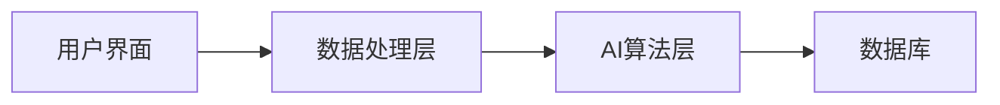

                 


# AI驱动的企业知识产权战略：专利组合优化与布局的智能化

## 关键词：人工智能，知识产权，专利布局，知识产权战略，专利组合优化

## 摘要：  
随着人工智能技术的飞速发展，企业知识产权管理正在经历一场深刻的变革。本文系统探讨了AI技术在企业知识产权战略中的应用，特别是专利组合优化与布局的智能化。通过分析AI在专利数据处理、分析和优化中的优势，本文提出了一套基于AI的知识产权管理解决方案，并通过实际案例展示了其在企业创新中的巨大潜力。文章内容涵盖了AI驱动的专利组合优化算法、系统架构设计以及项目实战，为企业制定智能化知识产权战略提供了理论和实践指导。

---

# 第1章: AI驱动的企业知识产权战略概述

## 1.1 企业知识产权战略的背景与意义

### 1.1.1 知识产权在企业竞争中的作用  
知识产权是企业在市场竞争中的核心资产之一，尤其是在技术创新驱动的 industries，专利、商标和版权等知识产权形式能够为企业提供法律保护，防止技术被他人滥用或抄袭。知识产权不仅能够保护企业的创新成果，还能通过授权、转让等方式为企业创造额外的经济价值。

### 1.1.2 传统知识产权管理的挑战  
传统的知识产权管理依赖人工分析和经验判断，这种方式存在效率低、成本高、主观性强等问题。随着技术领域日益复杂化，专利数量的激增使得传统方法难以应对海量数据的处理和分析需求。此外，企业在全球范围内的专利布局也需要更加智能化的解决方案。

### 1.1.3 AI技术对企业知识产权管理的机遇  
AI技术的引入为知识产权管理带来了革命性的变化。通过自然语言处理（NLP）、机器学习和大数据分析等技术，企业可以高效地处理海量专利数据，发现潜在的技术趋势，优化专利布局，并预测知识产权风险。AI不仅提高了管理效率，还能通过数据驱动的方式帮助企业制定更科学的知识产权战略。

---

## 1.2 AI在知识产权战略中的应用前景

### 1.2.1 AI技术在专利分析中的潜力  
AI技术可以通过对专利文本的深度分析，提取关键词、识别技术领域、分析技术发展趋势，从而帮助企业更好地理解技术动态。例如，通过主题建模（Topic Modeling）技术，可以将大量专利数据归纳为若干主题，帮助企业发现技术空白点。

### 1.2.2 智能化专利布局的必要性  
在全球化竞争中，企业需要在全球范围内进行专利布局，以覆盖主要市场和技术领域。然而，手动制定专利布局策略不仅耗时耗力，还可能因为主观判断失误而导致资源浪费。通过AI技术，企业可以根据技术发展趋势和市场需求，自动优化专利布局策略，确保资源的最优分配。

### 1.2.3 企业创新与知识产权保护的结合  
AI技术不仅可以帮助企业保护现有创新成果，还能通过技术预测和竞争分析，为企业提供创新方向的建议。例如，通过分析竞争对手的专利布局，企业可以发现技术空白点，提前布局相关技术，从而在竞争中占据优势。

---

## 1.3 本章小结  
本章从企业知识产权战略的背景和意义出发，分析了传统知识产权管理的挑战，并探讨了AI技术在知识产权管理中的潜力和应用前景。通过AI技术，企业可以实现知识产权管理的智能化，从而在竞争中获得更大的优势。

---

# 第2章: 企业知识产权管理的核心概念

## 2.1 知识产权的基本概念与分类

### 2.1.1 专利、商标、版权的基本定义  
- **专利**：是保护发明的法律文件，主要保护技术方案的创新性。  
- **商标**：是企业品牌的核心标识，用于区分不同企业的商品或服务。  
- **版权**：保护文学、艺术和科学作品的原创性，包括软件代码、书籍、音乐等。  

### 2.1.2 专利分类与技术领域分布  
专利可以根据技术领域分为多个类别，例如通信、计算机、生物技术等。通过AI技术，可以对专利进行分类和聚类分析，帮助企业了解不同技术领域的专利分布情况。

### 2.1.3 知识产权保护的法律框架  
知识产权的保护离不开法律的支持。不同国家和地区有不同的专利法、商标法和版权法，企业需要遵守这些法律规则，才能有效保护自己的知识产权。

---

## 2.2 AI驱动的知识产权管理特点

### 2.2.1 数据驱动的专利分析  
AI技术可以通过对海量专利数据的分析，提取有价值的信息，例如技术趋势、竞争对手的专利布局等。通过数据驱动的方式，企业可以制定更加科学的专利分析策略。

### 2.2.2 智能化专利布局策略  
通过AI技术，企业可以根据技术发展趋势和市场需求，自动优化专利布局策略。例如，AI可以通过分析技术领域的竞争情况，建议企业在哪些领域优先申请专利。

### 2.2.3 自动化知识产权风险评估  
AI技术可以帮助企业进行知识产权风险评估，例如分析是否存在专利侵权风险，或者是否存在专利被无效的风险。通过自动化的方式，企业可以及时发现和应对知识产权风险。

---

## 2.3 核心概念与联系

### 2.3.1 AI技术与知识产权管理的实体关系图  
通过以下mermaid图，我们可以清晰地看到AI技术与知识产权管理的核心要素之间的关系：


---

## 2.4 本章小结  
本章详细介绍了知识产权的基本概念和分类，并分析了AI技术在知识产权管理中的应用特点。通过数据驱动的专利分析、智能化的专利布局策略和自动化风险评估，企业可以更高效地管理知识产权。

---

# 第3章: AI驱动的专利组合优化算法原理

## 3.1 专利组合优化的基本原理

### 3.1.1 专利组合优化的目标  
专利组合优化的目标是通过优化专利的组合，使企业的知识产权资产最大化。具体目标包括：  
- 提高专利资产的经济价值。  
- 避免专利布局的重复或遗漏。  
- 降低专利维护的成本。  

### 3.1.2 专利组合优化的约束条件  
专利组合优化需要考虑以下约束条件：  
- 技术领域分布的合理性。  
- 专利的有效期限。  
- 专利的法律状态（如是否有效）。  

### 3.1.3 基于AI的优化方法  
基于AI的优化方法通常包括以下步骤：  
1. 数据采集与预处理。  
2. 专利数据建模。  
3. 优化算法设计与实现。  

---

## 3.2 基于机器学习的专利组合优化算法

### 3.2.1 算法流程图  
以下是一个基于机器学习的专利组合优化算法的流程图：


### 3.2.2 示例说明  
假设我们有一个包含1000项专利的数据集，我们需要从中选出50项专利组成最优组合。通过特征提取，我们可以提取每项专利的关键词、技术领域等特征。然后，通过机器学习模型（如随机森林或神经网络）进行训练，最终输出最优的专利组合。

---

## 3.3 算法实现的数学模型

### 3.3.1 优化目标函数  
$$ \text{max} \sum_{i=1}^{n} w_i x_i $$  
其中，$w_i$是第$i$项专利的权重，$x_i$是决策变量（取值为0或1，表示是否选择该项专利）。

### 3.3.2 约束条件  
$$ \sum_{i=1}^{n} x_i \leq k $$  
其中，$k$是企业希望选择的专利数量上限。

### 3.3.3 示例说明  
假设我们有以下两项专利：  
- 专利A：权重$w_A=0.8$，价值$V_A=100$  
- 专利B：权重$w_B=0.6$，价值$V_B=80$  

通过优化算法，我们可以选择专利A，因为它的权重更高，价值也更大。

---

## 3.4 本章小结  
本章详细介绍了专利组合优化的基本原理，并通过机器学习算法展示了如何实现专利组合的优化。通过数据驱动的方式，企业可以更科学地管理知识产权资产。

---

# 第4章: 知识产权战略的系统架构设计

## 4.1 系统功能设计

### 4.1.1 专利数据采集模块  
专利数据采集模块负责从公开的专利数据库中获取专利数据，包括专利名称、申请人、申请日期、技术领域等。

### 4.1.2 专利分析模块  
专利分析模块通过对专利数据的分析，生成技术趋势报告、竞争对手分析报告等。

### 4.1.3 专利布局优化模块  
专利布局优化模块根据分析结果，优化企业的专利布局策略，例如建议在哪些技术领域优先申请专利。

---

## 4.2 系统架构图  

以下是一个典型的知识产权管理系统架构图：



---

## 4.3 接口设计与交互流程

### 4.3.1 系统交互流程图  
以下是一个典型的系统交互流程图：


---

## 4.4 本章小结  
本章详细介绍了知识产权管理系统的功能设计和系统架构，并通过mermaid图展示了系统的整体架构。

---

# 第5章: 项目实战——AI驱动的专利布局优化

## 5.1 项目环境安装与配置

### 5.1.1 开发工具安装  
- 安装Python和必要的开发库（如Pandas、Scikit-learn、NLTK）。  
- 安装Jupyter Notebook用于数据处理和分析。

### 5.1.2 数据集准备  
- 下载专利数据集（例如从USPTO数据库获取）。  
- 数据预处理（清洗、归一化）。

### 5.1.3 环境配置  
- 安装虚拟环境并激活。  
- 安装依赖库：`pip install pandas scikit-learn nltk`。

---

## 5.2 核心算法实现

### 5.2.1 专利数据预处理  
```python
import pandas as pd

# 读取数据
data = pd.read_csv('patent_data.csv')

# 数据清洗
data.dropna(inplace=True)
data = data[~data['technology_field'].isnull()]
```

### 5.2.2 模型训练与优化  
```python
from sklearn.feature_extraction.text import TfidfVectorizer
from sklearn.cluster import KMeans

# 特征提取
vectorizer = TfidfVectorizer()
X = vectorizer.fit_transform(data['technology_field'])

# K-means聚类
num_clusters = 5
km = KMeans(n_clusters=num_clusters)
km.fit(X)
```

### 5.2.3 结果可视化  
```python
import matplotlib.pyplot as plt

# 可视化聚类结果
plt.scatter(X[:, 0], X[:, 1], c=km.labels_)
plt.xlabel('TF-IDF Score')
plt.ylabel('技术领域')
plt.show()
```

---

## 5.3 代码实现与解读

### 5.3.1 数据处理代码  
```python
import pandas as pd

# 读取数据
data = pd.read_csv('patent_data.csv')

# 数据清洗
data.dropna(inplace=True)
data = data[~data['technology_field'].isnull()]
```

### 5.3.2 模型训练代码  
```python
from sklearn.feature_extraction.text import TfidfVectorizer
from sklearn.cluster import KMeans

# 特征提取
vectorizer = TfidfVectorizer()
X = vectorizer.fit_transform(data['technology_field'])

# K-means聚类
num_clusters = 5
km = KMeans(n_clusters=num_clusters)
km.fit(X)
```

---

## 5.4 本章小结  
本章通过一个实际项目展示了如何使用AI技术优化专利布局。通过数据预处理、模型训练和结果可视化，我们可以帮助企业制定更加科学的知识产权战略。

---

# 第6章: 总结与展望

## 6.1 本章总结  
本文详细探讨了AI技术在企业知识产权战略中的应用，特别是专利组合优化与布局的智能化。通过AI技术，企业可以更高效地管理知识产权资产，制定更加科学的知识产权战略。

## 6.2 未来展望  
随着AI技术的不断发展，企业知识产权管理将更加智能化和自动化。未来，我们可以期待更多基于AI的知识产权管理工具和技术，帮助企业在全球竞争中占据优势。

---

# 作者：AI天才研究院/AI Genius Institute & 禅与计算机程序设计艺术 /Zen And The Art of Computer Programming

