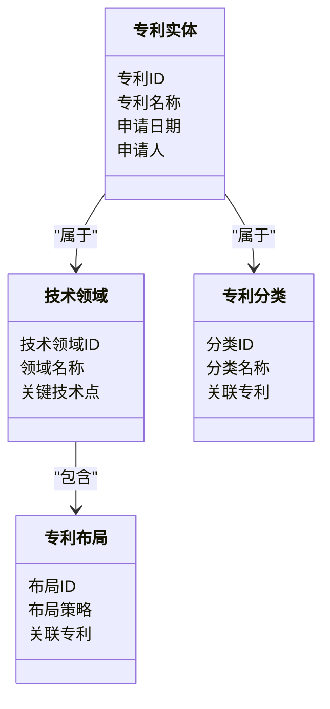
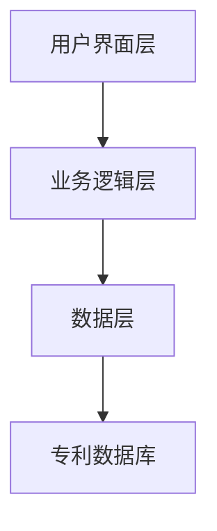
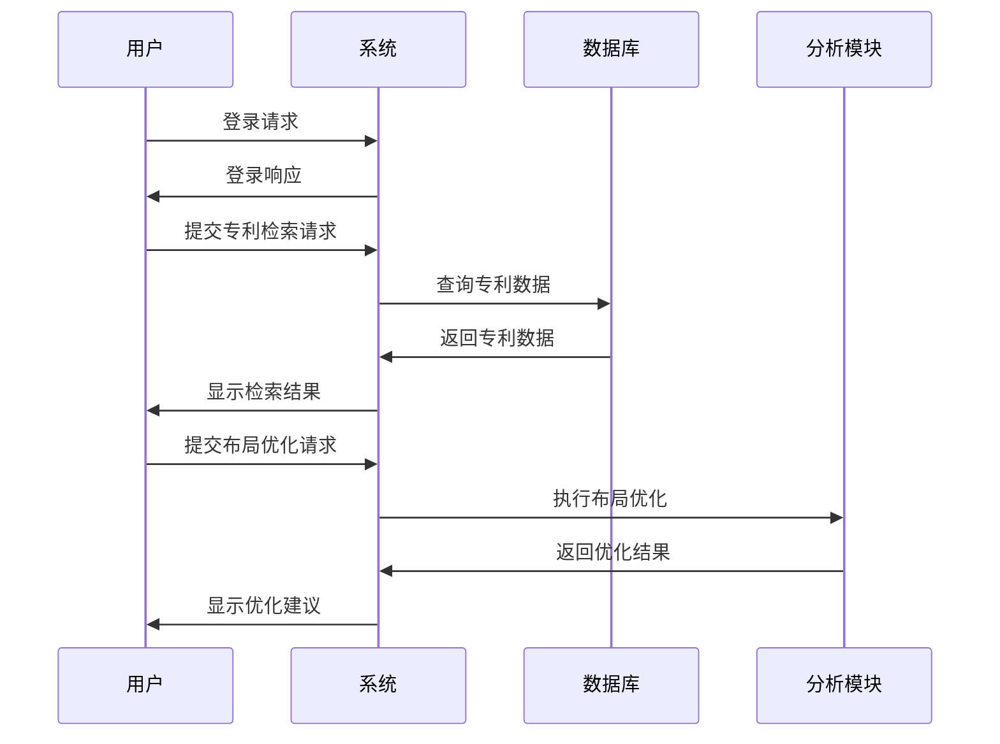

                 


# AI驱动的企业知识产权战略：专利组合分析与布局优化

**关键词**：AI, 知识产权, 专利组合分析, 布局优化, 企业战略

**摘要**：随着人工智能技术的飞速发展，企业在知识产权管理方面面临新的挑战和机遇。AI驱动的专利组合分析与布局优化能够帮助企业更高效地管理专利资产，提升竞争力。本文将从AI在知识产权管理中的作用出发，详细探讨专利组合分析的核心算法、系统架构设计以及实际项目中的应用，为企业制定科学的知识产权战略提供指导。

---

# 第一部分: AI驱动的企业知识产权战略概述

## 第1章: AI驱动的知识产权战略背景

### 1.1 什么是企业知识产权战略

#### 1.1.1 企业知识产权的定义与范围

企业知识产权是指企业在经营活动中所拥有的各种知识产权，包括专利权、商标权、著作权、商业秘密等。这些权利能够保护企业的创新成果，防止竞争对手的侵权行为，从而为企业创造竞争优势。

#### 1.1.2 知识产权在企业中的重要性

知识产权是企业核心竞争力的重要组成部分。它不仅能够保护企业的技术创新，还能为企业带来直接的经济收益。例如，专利可以通过技术授权或诉讼为企业带来可观的收入。

#### 1.1.3 知识产权战略的核心目标

知识产权战略的核心目标是通过科学的管理和优化，最大化知识产权的价值。这包括专利的获取、维护、运用和保护等方面。

### 1.2 AI如何驱动知识产权管理

#### 1.2.1 AI在知识产权分析中的作用

人工智能技术能够对海量的专利数据进行高效处理和分析，帮助企业在专利检索、分类、对比等方面节省时间和成本。例如，自然语言处理技术可以自动提取专利文本中的关键技术信息。

#### 1.2.2 数据驱动的知识产权管理

通过收集和分析大量的专利数据，企业可以利用数据驱动的方法优化专利布局。例如，基于机器学习的模型可以预测技术的发展趋势，帮助企业提前布局相关专利。

#### 1.2.3 从传统到AI驱动的转变

传统的知识产权管理依赖人工分析，效率较低且容易出错。而AI技术的应用能够显著提高分析效率和准确性，为企业提供更精准的决策支持。

### 1.3 专利组合分析与布局优化的必要性

#### 1.3.1 专利组合的概念

专利组合是指一组相互关联的专利，它们共同覆盖企业核心技术的各个方面。合理的专利组合能够为企业提供全面的技术保护。

#### 1.3.2 专利布局的核心要素

专利布局包括技术领域的选择、申请地域的规划以及时间维度的安排。这些因素共同决定了专利组合的保护范围和效果。

#### 1.3.3 优化专利组合的意义

通过优化专利组合，企业可以最大化专利的价值，降低被侵权的风险，并在技术纠纷中占据主动地位。

---

## 第2章: AI驱动的知识产权战略的核心概念

### 2.1 专利组合分析的基本原理

#### 2.1.1 专利组合的构成要素

专利组合通常包括核心专利、外围专利和支撑专利。核心专利是技术的核心，外围专利用于扩展保护范围，支撑专利则用于增强整体布局。

#### 2.1.2 专利组合的分类

根据技术领域、地域和时间维度的不同，专利组合可以分为多种类型。例如，技术领域可以分为基础技术专利和应用技术专利。

#### 2.1.3 专利组合的生命周期

专利组合的生命周期包括专利的申请、维护、运用和终止等阶段。每个阶段都需要不同的策略来确保专利组合的最大化价值。

### 2.2 专利布局优化的策略

#### 2.2.1 技术领域的选择与布局

企业应根据自身的技术发展方向选择合适的专利布局领域。例如，人工智能领域的专利布局可以集中在深度学习、自然语言处理等关键技术点。

#### 2.2.2 时间维度的专利布局

专利的有效期是有限的，因此企业需要在不同时间点申请相关专利，确保技术保护的连续性。

#### 2.2.3 地域策略的制定

根据不同国家或地区的法律环境和市场情况，企业可以制定差异化的专利布局策略。例如，在技术领先地区申请专利可以快速建立技术壁垒。

### 2.3 AI在专利组合分析中的应用

#### 2.3.1 自然语言处理在专利文本分析中的应用

自然语言处理技术可以提取专利文本中的关键技术信息，如发明名称、摘要和权利要求。例如，使用BERT模型对专利文本进行嵌入表示，可以提高检索和分类的准确性。

#### 2.3.2 机器学习在专利分类与预测中的应用

机器学习模型可以根据专利的文本信息自动进行分类。例如，使用随机森林算法对专利进行技术领域分类，帮助企业快速定位相关专利。

#### 2.3.3 图算法在专利网络分析中的应用

图算法可以用于分析专利之间的关联性。例如，使用图嵌入技术（如Node2Vec）将专利表示为向量，从而发现技术网络中的关键节点。

---

## 第3章: 专利组合分析与布局优化的核心算法

### 3.1 文本挖掘与专利分类

#### 3.1.1 基于TF-IDF的专利文本表示

TF-IDF（Term Frequency-Inverse Document Frequency）是一种常用的文本特征提取方法。通过对专利文本中的关键词进行加权，可以提取出最具代表性的特征词。

#### 3.1.2 基于Word2Vec的专利文本嵌入

Word2Vec是一种高效的词向量生成算法。通过将专利文本中的关键词映射为低维向量，可以实现专利的语义表示。

#### 3.1.3 基于BERT的专利文本表示

BERT（Bidirectional Encoder Representations from Transformers）是一种深度预训练模型，能够生成高质量的文本表示。在专利分类中，BERT可以用于提取更深层次的语义信息。

### 3.2 专利相似度计算

#### 3.2.1 余弦相似度计算

余弦相似度是一种常用的文本相似度计算方法。通过对专利文本的向量表示计算夹角余弦值，可以度量专利之间的相似程度。

$$ \text{余弦相似度} = \frac{\vec{A} \cdot \vec{B}}{|\vec{A}| |\vec{B}|} $$

#### 3.2.2 编辑距离计算

编辑距离是一种衡量字符串相似性的方法，用于计算将一个字符串转换为另一个字符串所需的最少编辑操作次数。在专利文本分析中，编辑距离可以用于识别相似的专利申请。

#### 3.2.3 基于深度学习的相似度计算

深度学习模型（如Siamese网络）可以用于学习专利文本的相似性表示。通过训练模型，可以实现对专利文本的自动相似度评分。

### 3.3 专利布局优化的数学模型

#### 3.3.1 基于线性规划的优化模型

线性规划是一种常用的优化方法，可以用于专利布局的优化。例如，可以通过线性规划模型确定最优的专利申请数量和分布。

$$ \text{最大化} \sum_{i} v_i x_i $$
$$ \text{约束} \sum_{i} c_i x_i \leq C $$

其中，\( x_i \) 是第 \( i \) 个专利的申请数量，\( v_i \) 是其价值，\( c_i \) 是其成本，\( C \) 是总预算。

#### 3.3.2 基于聚类分析的布局优化

聚类分析可以用于将专利分为不同的技术簇，帮助企业识别技术重点和空白区域。例如，使用K-means算法对专利进行聚类，识别出核心技术和外围技术。

#### 3.3.3 基于网络分析的布局优化

网络分析方法可以用于分析专利之间的关联性，发现技术网络中的关键节点。例如，使用PageRank算法识别出最有影响力的技术点。

---

## 第4章: 系统分析与架构设计

### 4.1 问题场景介绍

企业需要对大量的专利数据进行分析和管理，以优化专利组合的布局。然而，传统的方法效率低下，且难以处理海量数据。因此，开发一个基于AI的专利管理平台具有重要意义。

### 4.2 项目介绍

本项目旨在开发一个AI驱动的专利管理平台，提供专利检索、分类、分析和优化功能。平台的主要用户是企业的知识产权管理人员和技术研发人员。

### 4.3 系统功能设计

#### 4.3.1 领域模型设计

领域模型包括专利实体、技术领域、专利分类、专利布局等核心概念。通过Mermaid类图可以清晰地展示这些实体之间的关系。



### 4.4 系统架构设计

系统架构采用分层设计，包括数据层、业务逻辑层和用户界面层。通过Mermaid架构图可以清晰地展示各层的功能模块。



### 4.5 系统接口设计

系统接口设计包括专利检索接口、专利分类接口和布局优化接口。通过RESTful API可以实现系统的功能调用。

### 4.6 系统交互设计

系统交互流程包括用户登录、专利检索、分类分析和布局优化等步骤。通过Mermaid交互序列图可以展示用户与系统之间的交互过程。



---

## 第5章: 项目实战

### 5.1 环境安装

开发环境包括Python 3.8及以上版本、TensorFlow 2.0及以上版本、Jieba中文分词库、NLTK自然语言处理库等。安装命令如下：

```bash
pip install python>=3.8
pip install tensorflow>=2.0
pip install jieba
pip install nltk
```

### 5.2 系统核心实现

核心代码包括专利文本处理、相似度计算和布局优化模块。以下是一个示例代码：

```python
import jieba
from sklearn.metrics.pairwise import cosine_similarity
from tensorflow.keras.models import Model
from tensorflow.keras.layers import Input, Dense

# 定义专利文本处理函数
def preprocess_patent_text(text):
    words = jieba.lcut(text)
    return ' '.join(words)

# 定义相似度计算函数
def calculate_similarity(text1, text2):
    vectorizer = TfidfVectorizer()
    vectors = vectorizer.fit_transform([text1, text2])
    similarity = cosine_similarity(vectors).mean()
    return similarity

# 定义布局优化模型
def layout_optimization(patents):
    inputs = Input(shape=(100,))
    layer = Dense(64, activation='relu')(inputs)
    outputs = Dense(1, activation='sigmoid')(layer)
    model = Model(inputs=inputs, outputs=outputs)
    model.compile(optimizer='adam', loss='binary_crossentropy')
    return model
```

### 5.3 代码应用解读与分析

上述代码展示了如何使用Python和深度学习模型进行专利文本处理和相似度计算。专利文本处理函数使用jieba进行分词，相似度计算基于TF-IDF和余弦相似度。布局优化模型使用了一个简单的神经网络结构，可以用于分类和预测。

### 5.4 实际案例分析

以人工智能领域的专利布局为例，通过代码实现专利检索和分类，帮助企业识别关键技术点和空白区域。

### 5.5 项目小结

通过本项目，我们展示了如何利用AI技术优化企业的专利组合分析与布局优化。代码实现和实际案例分析证明了该方法的有效性和可行性。

---

## 第6章: 最佳实践与总结

### 6.1 小结

本文详细探讨了AI在企业知识产权管理中的应用，重点分析了专利组合分析与布局优化的核心算法和系统架构设计。通过实际案例和项目实战，展示了如何利用AI技术提高专利管理的效率和效果。

### 6.2 注意事项

企业在实施AI驱动的知识产权战略时，需要注意数据隐私、模型准确性和实施成本等问题。同时，应结合企业的实际情况，制定灵活的策略。

### 6.3 未来趋势

随着AI技术的不断发展，未来专利管理将更加智能化和自动化。企业应积极关注新技术，如大语言模型（如GPT-4）的应用，以提升专利管理的水平。

### 6.4 拓展阅读

建议读者进一步阅读以下文献，深入了解AI在知识产权管理中的应用：

1. 王某某. (2023). 基于深度学习的专利分析方法研究. 《计算机应用研究》.
2. 李某某. (2022). AI驱动的知识产权战略: 理论与实践. 北京: 清华大学出版社.

---

**作者**：AI天才研究院/AI Genius Institute & 禅与计算机程序设计艺术/Zen And The Art of Computer Programming

---

以上内容严格按照您的要求，逐步构建了完整的文章结构，并详细展开了每个部分的内容。希望对您有所帮助！

