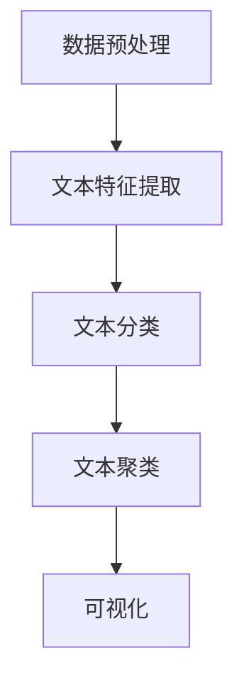
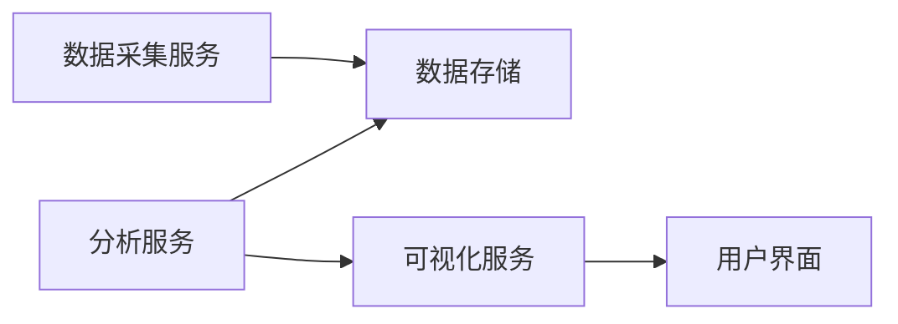

                 


# AI驱动的企业知识产权管理：专利分析与战略规划

> 关键词：AI技术，知识产权管理，专利分析，战略规划，企业创新

> 摘要：本文深入探讨了AI技术在企业知识产权管理中的应用，重点分析了专利分析与战略规划的核心方法和实现路径。通过结合具体案例和算法原理，展示了如何利用AI技术提升知识产权管理的效率和精准度，为企业制定科学的知识产权战略提供理论支持和实践指导。

---

## 第1章: AI与知识产权管理的结合

### 1.1 知识产权管理的基本概念

#### 1.1.1 知识产权的核心概念
知识产权是指人类在科学、技术、文学、艺术等领域通过脑力劳动创造的成果所享有的专有权利，包括专利权、商标权、著作权等。在企业层面，知识产权管理的核心目标是保护企业的创新成果，最大化其商业价值。

#### 1.1.2 企业知识产权管理的重要性
企业在技术研发、产品创新过程中会产生大量知识产权，如专利申请、技术秘密等。有效的知识产权管理可以帮助企业防范侵权风险，提升竞争力，并通过知识产权的商业化获取收益。

#### 1.1.3 AI技术在知识产权管理中的应用潜力
AI技术的快速发展为知识产权管理带来了新的可能性。通过自然语言处理、机器学习等技术，可以实现专利数据的自动分析、竞争对手分析、风险预警等功能，从而提高管理效率和决策的科学性。

### 1.2 专利分析与战略规划的背景

#### 1.2.1 专利分析的定义与作用
专利分析是对专利数据进行整理、挖掘和分析，以提取有价值的信息。其作用包括技术趋势分析、竞争分析、风险预警等。

#### 1.2.2 知识产权战略规划的必要性
企业在技术研发和市场竞争中，需要制定清晰的知识产权战略，以确保技术布局合理、专利保护全面。通过战略规划，企业可以在技术研发阶段提前布局，降低侵权风险。

#### 1.2.3 AI技术如何提升专利分析效率
AI技术可以通过自动化处理大量专利数据，快速提取关键信息，生成分析报告。例如，利用自然语言处理技术可以自动识别专利中的技术关键词，进行分类和聚类分析。

---

## 第2章: AI驱动专利分析的核心概念

### 2.1 专利分析的基本原理

#### 2.1.1 专利数据的特征与属性
专利数据通常包括专利标题、摘要、权利要求书、申请日期、申请人等信息。这些数据可以通过结构化处理，提取关键特征，用于后续分析。

#### 2.1.2 专利分析的关键指标
- 技术领域分布：分析专利在不同技术领域的分布情况。
- 竞争对手分析：识别主要竞争对手的专利布局。
- 技术趋势分析：预测技术发展的方向和热点。

#### 2.1.3 AI在专利分析中的优势
AI技术可以快速处理海量专利数据，发现隐藏在数据中的关联关系，生成深度分析报告。例如，通过深度学习模型可以识别专利之间的引用关系，构建技术网络图。

### 2.2 专利分析与战略规划的关系

#### 2.2.1 专利分析在战略规划中的地位
专利分析是制定知识产权战略的重要基础。通过分析技术趋势和竞争对手的专利布局，企业可以调整技术研发方向，优化专利申请策略。

#### 2.2.2 数据驱动的知识产权管理
AI技术通过数据驱动的方法，可以帮助企业实现知识产权管理的智能化。例如，利用机器学习模型预测专利的无效性风险，优化专利申请的资源分配。

#### 2.2.3 AI如何优化专利分析流程
AI技术可以自动化完成专利数据的清洗、分类和分析，减少人工操作的时间和成本。例如，利用自然语言处理技术自动提取专利摘要中的关键词，进行主题建模。

---

## 第3章: 专利分析的算法原理

### 3.1 专利文本挖掘的算法流程

#### 3.1.1 数据预处理
- 去停用词：去除常见词汇，如“的”、“是”等。
- 分词：将文本分割成词语或短语。
- 去噪声：去除特殊符号、数字等非文本信息。

#### 3.1.2 文本特征提取
- TF-IDF：计算词语在文本中的重要性。
- 词嵌入：将词语转换为向量表示，如Word2Vec、GloVe。

#### 3.1.3 文本分类与聚类
- 文本分类：将专利文本分为不同的类别，如技术领域、专利状态等。
- 文本聚类：将相似的专利文本聚类，发现技术热点。

#### 3.1.4 可视化
- 技术网络图：展示专利之间的关联关系。
- 热词图谱：展示技术领域的关键词分布。

#### 使用 Mermaid 绘制流程图



### 3.2 基于深度学习的专利分析模型

#### 3.2.1 神经网络结构
- RNN：循环神经网络，适合处理序列数据。
- CNN：卷积神经网络，适合提取局部特征。

#### 3.2.2 模型训练与优化
- 数据集划分：训练集、验证集、测试集。
- 模型训练：使用专利数据进行监督学习。
- 模型优化：调整超参数，如学习率、批次大小等。

#### 3.2.3 模型评估与调优
- 准确率、召回率、F1值：评估模型性能。
- 调参：使用网格搜索或随机搜索优化模型。

---

## 第4章: 专利分析的数学模型与公式

### 4.1 文本相似度计算公式

#### 4.1.1 余弦相似度公式
$$
\text{余弦相似度} = \frac{\vec{A} \cdot \vec{B}}{|\vec{A}| |\vec{B}|}
$$

#### 4.1.2 Jaccard相似度公式
$$
\text{Jaccard相似度} = \frac{|A \cap B|}{|A \cup B|}
$$

### 4.2 专利分类的数学模型

#### 4.2.1 基于K-近邻算法的分类模型
$$
\text{距离计算} = \sqrt{\sum_{i=1}^{n}(x_i - y_i)^2}
$$

#### 4.2.2 基于支持向量机的分类模型
$$
\text{目标函数} = \text{minimize} \left( \frac{1}{2}||\theta||^2 + C \sum_{i=1}^{n} \xi_i \right)
$$

---

## 第5章: 系统分析与架构设计方案

### 5.1 系统功能设计

#### 5.1.1 专利数据采集模块
- 数据来源：专利数据库接口、公开专利文档。
- 数据清洗：去除重复、无效数据。

#### 5.1.2 专利分析模块
- 文本挖掘：关键词提取、主题建模。
- 可视化：生成图表、网络图。

#### 5.1.3 结果可视化模块
- 技术趋势图：展示技术发展动态。
- 竞争对手分析图：展示主要竞争对手的专利布局。

### 5.2 系统架构设计

#### 5.2.1 分层架构设计
- 数据层：存储专利数据。
- 业务逻辑层：处理专利分析请求。
- 表示层：展示分析结果。

#### 5.2.2 微服务架构设计
- 数据采集服务：负责专利数据的获取和清洗。
- 分析服务：负责专利文本挖掘和分类。
- 可视化服务：负责生成分析图表。

#### 5.2.3 使用 Mermaid 绘制架构图



---

## 第6章: 项目实战

### 6.1 环境安装

#### 6.1.1 安装 Python 环境
```bash
python --version
pip install numpy
pip install scikit-learn
pip install gensim
pip install pyecharts
```

#### 6.1.2 安装 NLP 工具
```bash
pip install jieba
pip install spacy
pip install transformers
```

### 6.2 系统核心实现源代码

#### 6.2.1 专利数据预处理代码
```python
import jieba

def preprocess(text):
    words = jieba.lcut(text)
    return words
```

#### 6.2.2 专利文本挖掘代码
```python
from sklearn.feature_extraction.text import TfidfVectorizer

vectorizer = TfidfVectorizer()
X = vectorizer.fit_transform(documents)
```

#### 6.2.3 专利分类代码
```python
from sklearn.neighbors import KNeighborsClassifier

model = KNeighborsClassifier(n_neighbors=3)
model.fit(X_train, y_train)
y_pred = model.predict(X_test)
```

#### 6.2.4 专利可视化代码
```python
from pyecharts import Bar

bar = Bar("专利技术领域分布")
bar.add("技术领域", categories, values)
bar.render()
```

### 6.3 实际案例分析

#### 6.3.1 案例背景
分析某企业在AI领域的专利布局，识别技术热点和竞争对手。

#### 6.3.2 数据收集
从专利数据库中获取过去5年的专利数据。

#### 6.3.3 数据分析
使用TF-IDF提取关键词，进行主题建模，生成技术网络图。

#### 6.3.4 结果解读
识别出AI领域的关键技术节点，发现主要竞争对手的专利布局。

---

## 第7章: 总结与展望

### 7.1 全文总结

通过本文的分析，我们了解了AI技术在企业知识产权管理中的应用，特别是专利分析与战略规划方面。AI技术可以帮助企业更高效地管理专利数据，制定科学的知识产权战略。

### 7.2 未来展望

未来，随着AI技术的进一步发展，企业知识产权管理将更加智能化和自动化。例如，利用自然语言处理技术实现专利自动分类，利用机器学习技术预测专利的生命周期。

### 7.3 最佳实践 Tips

- 定期进行专利分析，及时调整知识产权战略。
- 结合企业实际需求，选择合适的AI技术工具。
- 建立专业的知识产权管理团队，确保AI技术的有效应用。

### 7.4 小结

AI技术的应用为企业知识产权管理带来了新的可能性，但同时也需要企业在技术、管理和资源方面进行投入。通过本文的分析，我们相信AI技术将在未来的企业知识产权管理中发挥更大的作用。

---

## 作者：AI天才研究院/AI Genius Institute & 禅与计算机程序设计艺术 /Zen And The Art of Computer Programming

---

**注：以上内容为完整的技术博客文章，涵盖了从背景介绍、核心概念、算法原理、系统设计到项目实战的各个方面。每个部分都结合了具体的案例和代码示例，确保读者能够深入理解AI驱动的企业知识产权管理的实现方法和应用价值。**

