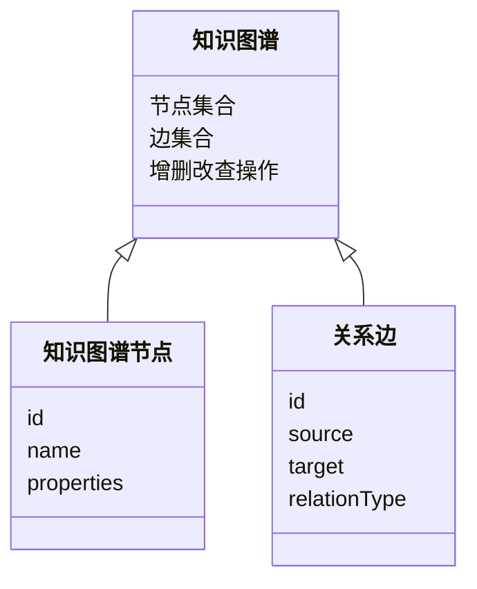
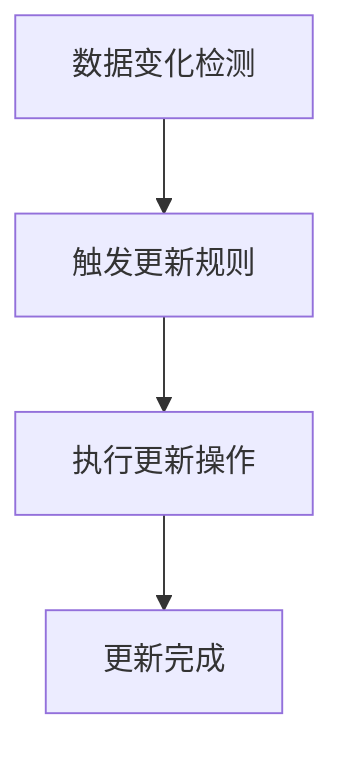

                 


# AI驱动的企业知识图谱：动态更新与智能推理机制

---

## 关键词

- 企业知识图谱
- 动态更新
- 智能推理
- 图数据库
- 人工智能

---

## 摘要

本文详细探讨了AI驱动的企业知识图谱的构建、动态更新与智能推理机制。首先，我们介绍了知识图谱的基本概念及其在企业中的应用背景。接着，重点分析了知识图谱的构建过程，包括数据获取、预处理、本体论构建以及存储管理。随后，深入探讨了动态更新机制的设计与实现，包括动态更新的需求、算法设计及优化策略。最后，详细讲解了智能推理机制的原理与实现方法，结合实际案例分析了知识图谱在企业中的应用场景。本文旨在为企业提供一套高效的知识图谱构建与管理方案，助力企业实现智能化决策。

---

# 第1章：知识图谱的基本概念

## 1.1 知识图谱的定义与特点

知识图谱是一种以图结构形式表示知识的语义网络，由节点（实体）和边（关系）组成。其特点包括：

- **语义性**：节点和边具有明确的语义属性，能够表示复杂的实体关系。
- **动态性**：能够实时更新以反映数据变化。
- **可扩展性**：支持大规模数据的存储与处理。

## 1.2 企业知识图谱的应用背景

企业知识图谱在多个领域具有广泛应用，例如：

- **企业信息管理**：整合企业内外部信息，提升数据利用率。
- **智能搜索**：通过语义搜索提高信息检索效率。
- **决策支持**：基于知识图谱进行数据分析与决策支持。

---

# 第2章：知识图谱的构建过程

## 2.1 数据的获取与预处理

### 2.1.1 数据来源分析

数据来源包括企业内部数据库、外部公开数据集等。数据预处理步骤如下：

1. 数据清洗：去除重复、错误数据。
2. 数据标准化：统一数据格式与命名规范。
3. 数据融合：将多源数据整合，建立关联关系。

## 2.2 知识图谱的本体论构建

### 2.2.1 本体论的基本概念

本体论定义了知识图谱中的基本概念、属性及关系。例如：

- 实体：企业中的具体事物，如“员工”、“部门”。
- 属性：描述实体的特征，如“员工ID”、“职位”。
- 关系：实体之间的关联，如“属于”、“管理”。

## 2.3 知识图谱的存储与管理

### 2.3.1 图数据库的选择

常用图数据库包括Neo4j、RDF4J等。选择图数据库时需考虑：

- 数据规模：支持大规模数据存储。
- 查询性能：支持高效的图遍历操作。

---

# 第3章：动态更新机制

## 3.1 动态更新的需求与挑战

### 3.1.1 动态更新的必要性

知识图谱需要实时更新以反映数据变化。例如：

- 新员工入职：需要新增“员工”实体及关联关系。
- 组织结构调整：需要更新实体间的“属于”关系。

### 3.1.2 动态更新的实现方法

动态更新可基于规则或机器学习模型。例如：

- 基于规则的更新：根据预定义的规则自动更新数据。
- 基于机器学习的更新：利用自然语言处理技术自动识别实体关系变化。

---

# 第4章：智能推理机制

## 4.1 智能推理的基本原理

智能推理通过分析知识图谱中的实体关系，推导隐含信息。例如：

- 实体分类：根据已有属性推断实体类型。
- 关系推理：通过已知关系推导未知关系。

### 4.1.1 推理算法的分类与选择

常用的推理算法包括：

- 基于规则的推理：简单但灵活性差。
- 基于概率的推理：考虑数据不确定性，但计算复杂。
- 基于学习的推理：利用机器学习模型进行推理，效果较好。

---

# 第5章：系统架构设计

## 5.1 问题场景介绍

企业知识图谱系统需要支持数据录入、动态更新、智能推理等功能。设计目标是高效、稳定、可扩展。

## 5.2 系统功能设计

### 5.2.1 领域模型（Mermaid 类图）



### 5.2.2 系统架构设计（Mermaid 架构图）

```mermaid
docker
    部署服务
    服务1
    服务2
```

---

# 第6章：项目实战

## 6.1 环境安装

- **图数据库**：安装Neo4j社区版。
- **编程语言**：使用Python进行开发。
- **工具**：安装必要的开发工具，如Jupyter Notebook。

## 6.2 核心代码实现

### 6.2.1 数据加载与存储

```python
from neo4j import GraphDatabase
from neo4j.exceptions import ServiceUnavailable

class KnowledgeGraph:
    def __init__(self, uri, user, password):
        self.driver = GraphDatabase.driver(uri, user=user, password=password)
    
    def create_node(self, label, properties):
        with self.driver.session() as session:
            session.write_transaction(
                lambda tx: tx.create_node(label, properties)
            )
    
    def create_relationship(self, start_label, start_id, rel_type, end_label, end_id):
        with self.driver.session() as session:
            session.write_transaction(
                lambda tx: tx.create_relationship(start_label, start_id, rel_type, end_label, end_id)
            )
```

## 6.3 动态更新与推理

### 6.3.1 动态更新算法



---

# 结论

本文详细探讨了AI驱动的企业知识图谱的构建、动态更新与智能推理机制。通过理论分析与实际案例，展示了如何利用知识图谱提升企业信息化水平。未来，随着AI技术的不断发展，知识图谱将在企业智能化转型中发挥更重要的作用。

---

# 作者

作者：AI天才研究院/AI Genius Institute & 禅与计算机程序设计艺术 /Zen And The Art of Computer Programming

