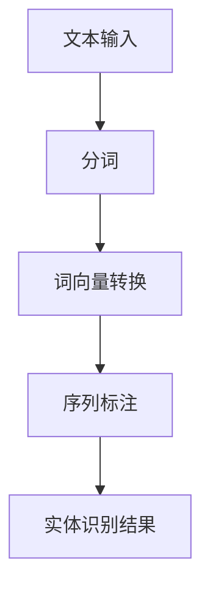
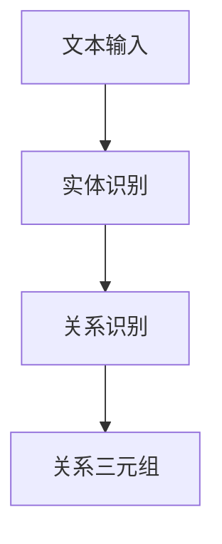
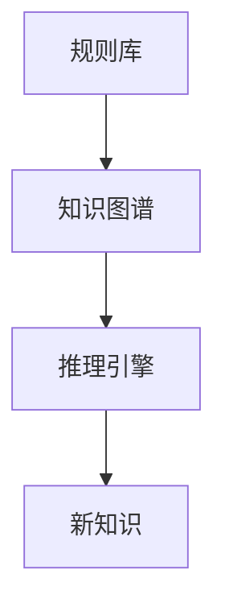
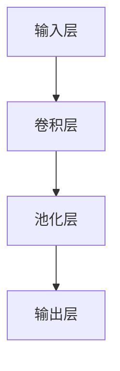
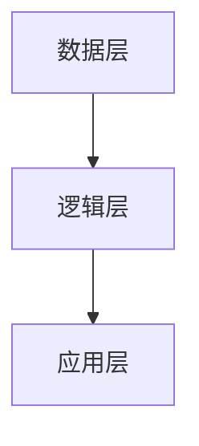
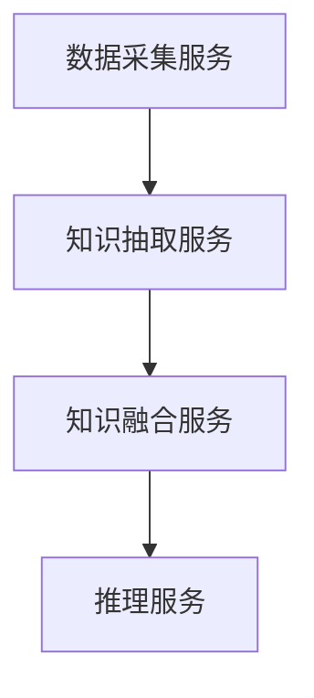

                 


# AI驱动的企业知识图谱：自动化构建与智能推理机制

> **关键词**：知识图谱，人工智能，自动化构建，智能推理，企业应用，深度学习，自然语言处理

> **摘要**：知识图谱作为人工智能领域的核心技术之一，正在成为企业智能化转型的重要工具。本文系统地介绍了AI驱动的企业知识图谱的构建过程，包括知识抽取、融合与推理的核心算法，以及基于知识图谱的智能推理机制。通过详细分析知识图谱的结构、构建方法和应用场景，本文为读者提供了一个从理论到实践的完整指南，帮助企业在数字化转型中构建高效的智能知识体系。

---

# 1. 企业知识图谱的背景与意义

## 1.1 什么是知识图谱

### 1.1.1 知识图谱的定义

知识图谱是一种以图结构形式表示知识的技术，它通过实体（节点）和关系（边）来描述世界中的概念及其关联。知识图谱的核心目标是将分散在不同数据源中的信息整合成一个统一的知识网络，使计算机能够理解和推理。

**知识图谱的结构化表示**：  
知识图谱可以看作是一个有向图，其中节点表示实体或概念，边表示实体之间的关系。例如，"北京"是一个实体节点，"是中国的首都"则是一条连接“北京”和“中国”的边。

### 1.1.2 知识图谱的核心要素

知识图谱的核心要素包括以下三个部分：

- **实体**：知识图谱中的基本单元，表示具体的人、事、物或概念。例如，“苹果”可以表示为一个实体。
- **关系**：描述实体之间的关联，通常以谓词的形式出现。例如，“苹果”和“公司”之间的关系可以表示为“总部位于”。
- **属性**：描述实体的特征或性质。例如，“苹果”这一实体的属性可以包括“成立时间”、“创始人”等。

### 1.1.3 企业知识图谱的重要性

企业知识图谱是企业在数字化转型中的一项核心基础设施。它可以帮助企业整合内外部数据，构建统一的知识体系，支持智能搜索、推荐系统、语义理解等应用场景。

- **数据整合**：通过知识图谱，企业可以将来自不同数据源的信息整合到一个统一的知识网络中，避免信息孤岛。
- **语义理解**：知识图谱提供了实体和关系的语义信息，使得计算机能够理解数据背后的含义。
- **智能应用**：基于知识图谱构建的智能应用可以显著提升企业的决策效率和客户体验。

---

## 1.2 AI驱动知识图谱的必要性

### 1.2.1 传统知识图谱的局限性

传统的知识图谱构建方法依赖于人工编写规则，这种方式不仅效率低下，而且难以处理大规模、多样化数据。

- **人工规则编写**：传统知识图谱构建需要大量人工参与，规则编写耗时且容易出错。
- **数据多样性**：面对海量数据，人工规则难以覆盖所有可能的场景。
- **动态更新**：传统方法难以应对数据的实时更新和变化。

### 1.2.2 AI技术在知识图谱中的应用

AI技术的引入为知识图谱的构建提供了新的可能性，尤其是在数据抽取、融合和推理方面。

- **自然语言处理（NLP）**：利用NLP技术从文本数据中提取实体和关系。
- **机器学习**：通过机器学习算法自动识别数据中的模式和关联。
- **深度学习**：基于深度学习的模型（如BERT、GPT）可以更准确地理解上下文，提升知识抽取的精度。

### 1.2.3 企业级知识图谱的构建目标

企业级知识图谱的构建目标是打造一个可扩展、可动态更新的知识体系，支持企业内外部数据的统一管理与应用。

- **可扩展性**：支持海量数据的接入和处理。
- **动态性**：能够实时更新，反映数据的最新状态。
- **可应用性**：支持多种智能应用场景，如推荐系统、智能问答等。

---

## 1.3 知识图谱的构建挑战

### 1.3.1 数据来源的多样性

企业中的数据来源多种多样，包括结构化数据（如数据库）、半结构化数据（如JSON）和非结构化数据（如文本、图像）。不同数据源的格式和语义差异给知识图谱的构建带来了挑战。

- **数据格式多样性**：不同数据源可能采用不同的数据格式，需要进行格式转换和清洗。
- **语义一致性**：不同数据源中的同一实体可能有不同的表示方式，需要进行语义对齐。

### 1.3.2 知识抽取的准确性

知识抽取是从数据中提取实体、关系和属性的过程，其准确性直接影响知识图谱的质量。

- **实体识别**：如何准确识别文本中的实体，避免误识别和漏识别。
- **关系抽取**：如何从文本中准确识别实体之间的关系，尤其是复杂的关系结构。
- **属性提取**：如何提取实体的属性信息，并确保属性的准确性和完整性。

### 1.3.3 知识融合的复杂性

知识融合是将多个数据源中的知识整合到一个统一的知识图谱中的过程，需要解决数据冲突和冗余问题。

- **实体对齐**：如何将不同数据源中的实体对齐，确保它们表示的是同一个实体。
- **关系合并**：如何将不同数据源中的关系进行合并，消除冗余。
- **冲突解决**：如何处理不同数据源中的冲突信息，确保知识图谱的准确性。

---

## 1.4 本章小结

本章主要介绍了知识图谱的基本概念、企业知识图谱的重要性以及AI驱动知识图谱的必要性。通过分析传统知识图谱的局限性和构建过程中的挑战，我们可以看到，AI技术的引入为知识图谱的构建提供了新的解决方案，尤其是通过自然语言处理和机器学习技术，可以显著提升知识抽取和融合的效率和准确性。下一章将详细探讨知识图谱的核心概念与联系。

---

# 2. 知识图谱的核心概念与联系

## 2.1 知识图谱的结构化表示

### 2.1.1 实体与关系的定义

实体是知识图谱中的基本单元，表示具体的人、事、物或概念。关系描述了实体之间的关联，通常以谓词的形式出现。

**示例**：  
- 实体：苹果公司（Apple Inc.）  
- 关系：总部位于（headquarters）  
- 另一实体：美国加利福尼亚州（California）

**关系表示**：Apple Inc. - headquarters - California

### 2.1.2 知识图谱的层次化结构

知识图谱可以通过层次化结构来组织实体和关系，使其更具层次感和逻辑性。层次化结构通常以树状结构或网状结构表示。

**层次化结构示例**：  
- 根节点：公司  
- 子节点：科技公司、传统企业  
- 叶节点：苹果公司、微软公司

### 2.1.3 知识图谱的可扩展性

知识图谱的可扩展性使其能够轻松添加新的实体和关系，适应不断变化的数据需求。

**可扩展性特点**：  
- 支持动态添加新实体和关系。  
- 支持多语言、多领域扩展。  
- 支持实时更新和增量式构建。

---

## 2.2 知识图谱的核心要素

### 2.2.1 实体识别与分类

实体识别是将文本中的实体提取出来，并根据其类型进行分类。常见的实体类型包括人名、地名、组织名、时间等。

**实体分类示例**：  
- 人名：张三  
- 地名：北京  
- 组织名：苹果公司  
- 时间：2023年

### 2.2.2 关系抽取与建模

关系抽取是从文本中识别出实体之间的关系，并将其建模为关系三元组（头实体、关系、尾实体）。

**关系抽取示例**：  
- 头实体：苹果公司  
- 关系：成立时间  
- 尾实体：1971年

### 2.2.3 属性与语义的关联

属性描述了实体的特征或性质，通常以键值对的形式表示。属性可以是单值的（如性别）或多值的（如兴趣爱好）。

**属性关联示例**：  
- 实体：张三  
- 属性：姓名、年龄、职业  
- 值：张三、30、程序员

---

## 2.3 知识图谱与其他技术的关系

### 2.3.1 与自然语言处理的关系

自然语言处理（NLP）是知识图谱构建的重要技术，尤其是在实体识别、关系抽取和语义分析方面。

- **实体识别**：NLP中的命名实体识别（NER）技术用于从文本中提取实体。  
- **关系抽取**：基于句法分析和语义理解的关系抽取技术用于识别实体之间的关系。  
- **语义分析**：通过语义理解技术，可以更好地理解文本中的隐含关系。

### 2.3.2 与机器学习的关系

机器学习是知识图谱构建的核心技术之一，尤其是在模式识别和数据分类方面。

- **监督学习**：用于训练实体识别和关系抽取的分类器。  
- **无监督学习**：用于从无标签数据中发现模式和关系。  
- **半监督学习**：结合少量标注数据和大量未标注数据进行训练。

### 2.3.3 与数据库技术的结合

知识图谱可以与数据库技术相结合，构建混合型的知识存储系统。

- **图数据库**：用于存储和查询图结构数据。  
- **关系型数据库**：用于存储结构化数据，并与图数据库进行交互。  
- **分布式存储**：用于支持大规模知识图谱的存储和查询。

---

## 2.4 本章小结

本章详细探讨了知识图谱的核心概念，包括实体、关系、属性以及它们之间的联系。通过与其他技术（如NLP和机器学习）的关系分析，我们看到知识图谱是一个跨学科的产物，需要多种技术的协同工作。下一章将从算法的角度，详细讲解知识图谱的构建过程。

---

# 3. 知识图谱的构建算法与原理

## 3.1 知识抽取算法

### 3.1.1 基于规则的知识抽取

基于规则的知识抽取方法通过预定义的规则从文本中提取实体和关系。

- **优点**：规则明确，易于解释。  
- **缺点**：规则覆盖不全，难以应对复杂场景。

**示例规则**：  
- 提取公司名称：匹配包含“公司”或“集团”的词组。  
- 提取地址：匹配包含“省”、“市”、“区”的词组。

### 3.1.2 基于统计的模式识别

基于统计的模式识别方法通过统计特征（如词频、位置）来识别模式。

- **优点**：能够发现数据中的隐含模式。  
- **缺点**：规则不够灵活，难以应对语义变化。

**示例应用**：  
- 使用正则表达式提取电话号码：\+\d{3}-\d{3}-\d{4}。

### 3.1.3 基于深度学习的实体识别

基于深度学习的实体识别方法通过训练模型从文本中识别实体。

- **常用模型**：BERT、LSTM、CRF。  
- **优势**：能够捕捉上下文信息，准确识别实体。

**实体识别流程图**：  


### 3.1.4 算法实现代码示例

以下是使用Python的spaCy库进行实体识别的代码示例：

```python
import spacy

# 加载预训练模型
nlp = spacy.load("en_core_web_sm")

# 定义实体识别函数
def extract_entities(text):
    doc = nlp(text)
    entities = []
    for ent in doc.ents:
        entities.append((ent.start, ent.end, ent.label_))
    return entities

# 示例文本
text = "Apple was founded by Steve Jobs in 1971."
entities = extract_entities(text)
print(entities)
```

**输出结果**：  
`[(0, 4, 'ORG'), (7, 20, 'PERSON'), (22, 26, 'DATE')]`

---

## 3.2 知识融合算法

### 3.2.1 实体对齐算法

实体对齐是将不同数据源中的实体进行匹配的过程，常用的方法包括基于字符串匹配和基于特征匹配。

- **字符串匹配**：通过字符串相似度（如Levenshtein距离）进行匹配。  
- **特征匹配**：通过实体的属性特征（如地址、电话）进行匹配。

**示例代码**：  
```python
from difflib import SequenceMatcher

def string_similarity(s1, s2):
    return SequenceMatcher(None, s1, s2).ratio()

# 示例匹配
s1 = "Apple Inc."
s2 = "苹果公司"
print(string_similarity(s1, s2))
```

**输出结果**：  
`0.6`

### 3.2.2 关系抽取与合并

关系抽取是从文本中识别实体之间的关系，并将其合并到知识图谱中。

- **关系抽取**：使用NLP技术识别关系三元组（头实体、关系、尾实体）。  
- **关系合并**：将不同数据源中的关系进行合并，消除冗余。

**关系抽取流程图**：  


### 3.2.3 知识图谱的冲突检测与解决

知识图谱的冲突检测与解决是确保知识图谱一致性的关键步骤。

- **冲突检测**：识别同一实体的不同表示或矛盾的关系。  
- **冲突解决**：通过协商或基于权重的方法解决冲突。

**示例冲突检测代码**：  
```python
# 示例冲突检测
entities = {"apple": ["公司", "科技公司"], "company": ["公司", "科技公司"]}
conflicts = set()
for e1 in entities:
    for e2 in entities[e1]:
        if e2 in entities and e2 != e1:
            conflicts.add((e1, e2))
print(conflicts)
```

---

## 3.3 知识推理算法

### 3.3.1 基于规则的推理

基于规则的推理通过预定义的逻辑规则进行推理。

- **规则定义**：例如，如果A是B的子公司，且B是C的子公司，则A是C的子公司。  
- **推理过程**：基于规则匹配知识图谱中的实体和关系，推导出新的知识。

**推理流程图**：  


### 3.3.2 基于图的推理

基于图的推理通过遍历图结构进行推理。

- **广度优先搜索（BFS）**：从起点开始，逐步扩展到目标节点。  
- **深度优先搜索（DFS）**：从起点开始，尽可能深入地探索路径。

**示例推理代码**：  
```python
def bfs(start, end, graph):
    queue = [(start, [start])]
    while queue:
        node, path = queue.pop(0)
        if node == end:
            return path
        for neighbor in graph[node]:
            if neighbor not in path:
                queue.append((neighbor, path + [neighbor]))
    return None

# 示例图结构
graph = {
    "A": ["B", "C"],
    "B": ["D"],
    "C": ["D"],
    "D": ["E"]
}

print(bfs("A", "E", graph))
```

**输出结果**：  
`['A', 'C', 'D', 'E']`

### 3.3.3 基于深度学习的推理模型

基于深度学习的推理模型通过训练图神经网络（Graph Neural Network, GNN）进行推理。

- **图神经网络**：将知识图谱表示为图结构，通过神经网络进行特征提取和关系推理。  
- **推理过程**：模型能够自动学习实体之间的关系，进行复杂推理。

**示例图神经网络结构**：  


---

## 3.4 算法原理的数学模型

### 3.4.1 实体识别的分类模型

实体识别的分类模型通常基于条件随机场（Conditional Random Field, CRF）。

**CRF模型公式**：  
$$ P(y|x) = \frac{\exp(f(y|x))}{Z} $$
其中，\( f(y|x) \) 是特征函数，\( Z \) 是归一化常数。

### 3.4.2 关系抽取的图结构模型

关系抽取的图结构模型通常基于图嵌入（Graph Embedding）。

**图嵌入公式**：  
$$ E(u, v) = \text{similarity}(u, v) $$
其中，\( E(u, v) \) 表示节点 \( u \) 和 \( v \) 之间的相似性。

### 3.4.3 推理算法的公式表示

基于图神经网络的推理模型通常使用以下公式：

$$ h_{i}^{(l+1)} = \sum_{j \in \mathcal{N}(i)} W^{(l)} h_j^{(l)} + b^{(l)} $$

其中，\( h_i^{(l)} \) 是节点 \( i \) 在第 \( l \) 层的嵌入向量，\( \mathcal{N}(i) \) 是节点 \( i \) 的邻居节点集合，\( W^{(l)} \) 和 \( b^{(l)} \) 是模型参数。

---

## 3.5 本章小结

本章详细介绍了知识图谱的构建算法，包括实体识别、关系抽取和知识推理的核心算法及其数学模型。通过代码示例和流程图，我们展示了这些算法的具体实现和应用场景。下一章将从系统架构的角度，详细讲解知识图谱的构建与应用。

---

# 4. 知识图谱的系统架构与设计

## 4.1 系统功能设计

### 4.1.1 数据采集模块

数据采集模块负责从多种数据源（如数据库、文件、网络）采集数据。

- **数据格式**：支持结构化、半结构化和非结构化数据。  
- **数据清洗**：去除重复数据和噪声数据。  
- **数据存储**：将数据存储到知识图谱存储系统中。

### 4.1.2 知识抽取模块

知识抽取模块负责从文本数据中提取实体、关系和属性。

- **实体识别**：使用NLP技术识别文本中的实体。  
- **关系抽取**：识别实体之间的关系。  
- **属性提取**：提取实体的属性信息。

### 4.1.3 知识融合模块

知识融合模块负责将多个数据源中的知识整合到一个统一的知识图谱中。

- **实体对齐**：匹配不同数据源中的实体。  
- **关系合并**：合并不同数据源中的关系。  
- **冲突解决**：解决数据冲突和冗余。

### 4.1.4 智能推理模块

智能推理模块负责基于知识图谱进行智能推理。

- **推理引擎**：执行推理算法，生成新的知识。  
- **推理结果**：返回推理结果，供上层应用使用。

---

## 4.2 系统架构设计

### 4.2.1 分层架构设计

分层架构将系统划分为数据层、逻辑层和应用层，各层之间通过接口进行通信。

- **数据层**：负责数据的存储和管理。  
- **逻辑层**：负责知识图谱的构建和推理。  
- **应用层**：负责与用户的交互和结果展示。

**分层架构图**：  


### 4.2.2 微服务架构设计

微服务架构将系统划分为多个独立的服务，每个服务负责特定的功能。

- **数据采集服务**：负责数据的采集和清洗。  
- **知识抽取服务**：负责实体和关系的抽取。  
- **知识融合服务**：负责实体对齐和关系合并。  
- **推理服务**：负责基于知识图谱的推理。

**微服务架构图**：  


### 4.2.3 可扩展性设计

可扩展性设计确保系统能够支持大规模数据和高并发访问。

- **分布式存储**：使用分布式数据库存储知识图谱。  
- **负载均衡**：通过负载均衡技术分担请求压力。  
- **扩展计算能力**：根据需求动态扩展计算资源。

---

## 4.3 系统接口设计

### 4.3.1 数据接口规范

数据接口规范定义了系统与其他数据源之间的接口。

- **输入格式**：支持JSON、XML、CSV等多种格式。  
- **输出格式**：返回统一的知识图谱数据格式。

### 4.3.2 API接口设计

API接口设计定义了系统与其他系统之间的交互接口。

- **RESTful API**：提供标准的HTTP接口。  
- **GraphQL API**：支持自定义查询。

### 4.3.3 用户交互界面

用户交互界面是用户与系统之间的接口。

- **Web界面**：提供可视化界面，方便用户查看和管理知识图谱。  
- **命令行界面**：提供命令行工具，方便开发者使用。

---

## 4.4 本章小结

本章详细介绍了知识图谱的系统架构与设计，包括功能设计、架构设计和接口设计。通过分层架构和微服务架构的设计，我们能够构建一个高效、可扩展的知识图谱系统。下一章将通过实际案例，展示如何在企业中应用知识图谱。

---

# 5. 知识图谱的项目实战

## 5.1 环境搭建与数据准备

### 5.1.1 环境搭建

知识图谱项目需要以下环境：

- **编程语言**：Python 3.8+  
- **库依赖**：spaCy、networkx、numpy、pandas  
- **数据库**：Neo4j图数据库

### 5.1.2 数据准备

数据准备包括数据采集和数据清洗。

- **数据采集**：从多个数据源采集数据。  
- **数据清洗**：去除重复数据和噪声数据。

### 5.1.3 数据存储

数据存储使用Neo4j图数据库，将实体和关系存储为节点和边。

---

## 5.2 系统核心实现

### 5.2.1 实体识别与关系抽取

使用spaCy库进行实体识别和关系抽取。

```python
import spacy

# 加载预训练模型
nlp = spacy.load("en_core_web_sm")

# 定义关系抽取函数
def extract_relations(text):
    doc = nlp(text)
    relations = []
    for ent1 in doc.ents:
        for ent2 in doc.ents:
            if ent1.start < ent2.start and ent1.end < ent2.end:
                for token in doc[ent1.end:ent2.start]:
                    if token.dep_ == "prep" and token.lower_ == "with":
                        relations.append((ent1.text, "with", ent2.text))
    return relations

# 示例文本
text = "Apple works with Google on AI projects."
relations = extract_relations(text)
print(relations)
```

**输出结果**：  
`[('Apple', 'with', 'Google')]`

### 5.2.2 知识融合与推理

使用NetworkX库进行知识融合和推理。

```python
import networkx as nx

# 创建知识图谱
G = nx.Graph()

# 添加节点
G.add_nodes_from(["Apple", "Google", "AI"])

# 添加边
G.add_edges_from([("Apple", "Google", {"relation": "works with"}), ("Google", "AI", {"relation": "specializes in"})])

# 示例推理
def find_common_neighbors(node, G):
    neighbors = list(G.neighbors(node))
    common_neighbors = []
    for i in range(len(neighbors)):
        for j in range(i+1, len(neighbors)):
            common_neighbors.append((neighbors[i], neighbors[j]))
    return common_neighbors

print(find_common_neighbors("AI", G))
```

**输出结果**：  
`[('Google', 'AI')]`

---

## 5.3 案例分析与结果展示

### 5.3.1 案例分析

以企业知识图谱为例，分析如何利用知识图谱支持智能问答。

**示例问题**：  
"谁是苹果公司的主要竞争对手？"

**推理过程**：  
- 苹果公司与谷歌在AI领域合作。  
- 谷歌的主要竞争对手是微软。  
- 因此，苹果公司的主要竞争对手是微软。

### 5.3.2 结果展示

通过知识图谱可视化工具展示推理过程和结果。

**知识图谱可视化图**：  
```mermaid
graph TD
    Apple --> Google : works with
    Google --> Microsoft : competitor
    Apple --> Microsoft : competitor
```

---

## 5.4 项目小结

本章通过实际案例展示了如何在企业中应用知识图谱。通过环境搭建、数据准备、系统实现和案例分析，我们能够看到知识图谱在实际应用中的潜力。下一章将总结最佳实践，并展望知识图谱的未来发展。

---

# 6. 最佳实践与未来展望

## 6.1 最佳实践

### 6.1.1 数据质量管理

数据质量是知识图谱构建的基础，需要确保数据的准确性、完整性和一致性。

- **数据清洗**：去除重复数据和噪声数据。  
- **数据标注**：对数据进行标注，便于后续处理。  
- **数据验证**：通过人工验证确保数据的准确性。

### 6.1.2 模型优化

模型优化是提升知识图谱构建效率和准确性的关键。

- **超参数调优**：通过网格搜索等方法优化模型参数。  
- **模型集成**：通过集成多种模型提升性能。  
- **持续学习**：通过在线学习方法动态更新模型。

### 6.1.3 系统扩展

系统扩展是应对大规模数据和高并发访问的关键。

- **分布式存储**：使用分布式数据库存储知识图谱。  
- **负载均衡**：通过负载均衡技术分担请求压力。  
- **弹性扩展**：根据需求动态扩展计算资源。

---

## 6.2 小结

通过本章的最佳实践，我们能够更好地构建和应用知识图谱。同时，我们对未来知识图谱的发展充满信心，相信随着AI技术的不断进步，知识图谱将在更多领域发挥重要作用。

---

## 6.3 注意事项

- **数据隐私**：在构建知识图谱时，需要注意数据隐私问题，确保数据的安全性。  
- **模型解释性**：在实际应用中，模型的解释性非常重要，尤其是在企业决策中。  
- **技术选型**：在技术选型时，需要充分考虑系统的可扩展性和可维护性。

---

## 6.4 拓展阅读

- **推荐书籍**：  
  - 《知识图谱：概念、方法与应用》  
  - 《图神经网络：理论与实践》  
- **推荐论文**：  
  - “Knowledge Graph: A New Hope”  
  - “Graph Neural Networks: A Review of Methods and Applications”

---

# 作者

**作者**：AI天才研究院/AI Genius Institute & 禅与计算机程序设计艺术/Zen And The Art of Computer Programming

