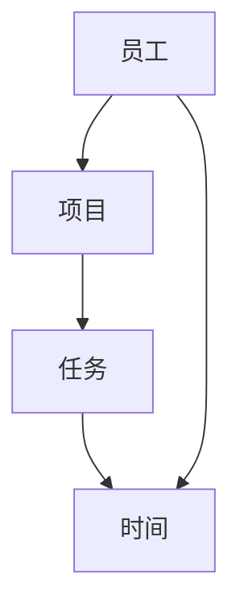
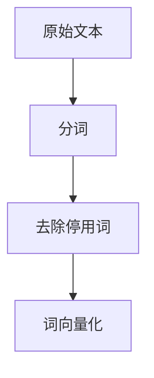
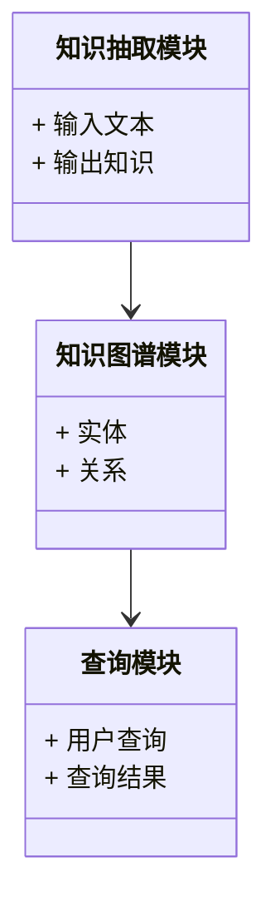
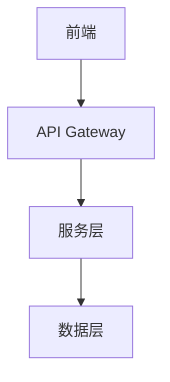
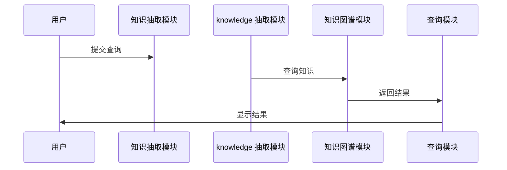

                 


# AI驱动的企业知识挖掘：从非结构化数据中提取价值

## 关键词：AI, 知识挖掘, 非结构化数据, 企业知识管理, 大模型

## 摘要：  
在企业信息化建设不断深化的今天，如何从海量的非结构化数据中提取有价值的知识，已经成为企业竞争力的关键。AI驱动的知识挖掘技术，特别是基于大模型的自然语言处理（NLP）技术，正在 revolutionizing 企业知识管理的方式。本文将从企业知识挖掘的基本概念出发，深入探讨其核心原理、算法实现、系统架构设计以及实际项目中的应用，为企业技术负责人和数据科学家提供有价值的参考。

---

# 第一部分: AI驱动的企业知识挖掘基础

## 第1章: 企业知识挖掘的背景与挑战

### 1.1 什么是企业知识挖掘
企业知识挖掘是通过AI技术从企业内外部的非结构化数据（如文档、邮件、会议记录等）中提取隐含知识的过程。这些知识可以是实体、关系、意图、情感等，最终为企业决策提供支持。

#### 1.1.1 企业知识的定义与分类
- **定义**：企业知识是指企业运营中产生的各种信息，包括显性知识（文档、数据）和隐性知识（经验、技能）。
- **分类**：
  - 结构化知识：数据库中的表格数据。
  - 非结构化知识：文本、图像、视频等。
  - 半结构化知识：JSON、XML等格式的数据。

#### 1.1.2 非结构化数据的挑战
- 数据量大：企业每天产生的文档、邮件等非结构化数据呈指数级增长。
- 数据分散：分布在不同的系统和平台中。
- 数据复杂性：文本、图片等多种形式，难以统一处理。

#### 1.1.3 知识挖掘的目标与价值
- **目标**：提取有用的知识，如实体识别、关系抽取、情感分析等。
- **价值**：提升企业效率，优化决策，增强竞争力。

### 1.2 AI在企业知识挖掘中的作用
- **自动化处理**：AI技术可以自动提取、整理非结构化数据。
- **深度理解**：通过大模型的语义理解能力，提取隐含知识。
- **实时分析**：快速响应企业需求，支持实时决策。

### 1.3 本章小结
本章主要介绍了企业知识挖掘的背景、挑战及其在AI技术下的新机遇。下一章将深入探讨知识挖掘的核心概念和方法。

---

## 第2章: 企业知识挖掘的核心概念与联系

### 2.1 知识挖掘的核心概念
#### 2.1.1 数据的结构化与非结构化
- **结构化数据**：可以轻松查询和分析的数据，如数据库中的表格。
- **非结构化数据**：需要通过NLP技术提取结构化的信息。

#### 2.1.2 知识表示与知识图谱
- **知识表示**：将知识以符号或概念的形式表示。
- **知识图谱**：将知识以图结构表示，节点代表实体，边代表关系。

#### 2.1.3 语义理解与意图识别
- **语义理解**：通过NLP技术理解文本的深层含义。
- **意图识别**：识别文本背后的用户意图。

### 2.2 AI大模型在知识挖掘中的作用
#### 2.2.1 大模型的注意力机制
- **注意力机制**：模型在处理文本时，会关注重要的词或短语。
- **实现方式**：通过权重分配，突出关键信息。

#### 2.2.2 预训练与微调
- **预训练**：在大规模数据上预训练模型，使其具备通用语言理解能力。
- **微调**：针对特定任务（如实体识别）进行微调，提升性能。

#### 2.2.3 知识抽取与推理
- **知识抽取**：从文本中提取实体、关系等。
- **知识推理**：基于已知知识进行推理，得出新的结论。

### 2.3 核心概念的属性对比表
| 概念       | 属性               | 描述                               |
|------------|--------------------|------------------------------------|
| 结构化数据 | 形式               | 表格、数据库等结构化形式           |
| 非结构化数据 | 形式               | 文本、图像、视频等                 |
| 知识表示     | 方法               | 符号表示、图结构                   |
| 语义理解     | 技术               | NLP、深度学习                     |

### 2.4 ER实体关系图


### 2.5 本章小结
本章详细讲解了企业知识挖掘的核心概念，包括数据的结构化与非结构化、知识表示与知识图谱，以及AI大模型在知识挖掘中的作用。下一章将深入探讨知识挖掘的算法原理。

---

## 第3章: 知识挖掘算法原理与实现

### 3.1 知识抽取算法原理
#### 3.1.1 文本预处理流程


#### 3.1.2 基于大模型的特征提取
```python
def preprocess(text):
    tokens = tokenizer(text)
    embeddings = model.encode(tokens)
    return embeddings
```

### 3.2 知识关联与推理算法
#### 3.2.1 基于图的关联算法


### 3.3 实体关系抽取的数学模型
#### 3.3.1 实体识别的条件随机场（CRF）
$$ P(y_i|x_i) = \frac{\exp(f(y_i, x_i))}{\sum_{y} \exp(f(y, x_i))} $$

#### 3.3.2 关系抽取的注意力机制
$$ \text{Attention}(q, k, v) = \text{softmax}(\frac{qk^T}{\sqrt{d}})v $$

### 3.4 算法实现步骤
1. 文本预处理：分词、去除停用词、词向量化。
2. 实体识别：使用CRF模型或大模型进行实体识别。
3. 关系抽取：基于注意力机制提取关系。
4. 知识图谱构建：将实体及其关系存储为图结构。

### 3.5 本章小结
本章详细讲解了知识挖掘的算法原理，包括文本预处理、实体识别、关系抽取等步骤。下一章将探讨系统架构设计与实现。

---

## 第4章: 系统分析与架构设计

### 4.1 系统功能设计
#### 4.1.1 领域模型


### 4.2 系统架构设计
#### 4.2.1 分层架构


### 4.3 接口设计
- **输入接口**：接收非结构化数据。
- **输出接口**：返回结构化知识。

### 4.4 交互设计
#### 4.4.1 用户查询流程


### 4.5 本章小结
本章详细讲解了系统架构设计，包括功能模块、分层架构、接口设计和交互流程。下一章将通过项目实战进一步验证这些设计。

---

## 第5章: 项目实战

### 5.1 项目背景
假设我们有一个企业文档管理系统，需要从海量文档中提取关键知识。

### 5.2 环境安装
```bash
pip install transformers
pip install numpy
pip install matplotlib
```

### 5.3 核心代码实现
#### 5.3.1 文本预处理
```python
import torch
from transformers import AutoTokenizer, AutoModel

tokenizer = AutoTokenizer.from_pretrained('bert-base')
model = AutoModel.from_pretrained('bert-base')

def preprocess(text):
    tokens = tokenizer(text)
    return model.encode(tokens)
```

#### 5.3.2 实体识别
```python
import torch
from transformers import AutoModelForTokenClassification, AutoTokenizer

tokenizer = AutoTokenizer.from_pretrained('bert-base')
model = AutoModelForTokenClassification.from_pretrained('bert-base')

def get_entities(text):
    tokens = tokenizer(text)
    outputs = model(tokens)
    entities = []
    for i, label in enumerate(outputs.logits[0]):
        if label.argmax() != 0:  # 0为O标签
            entities.append((i, label.argmax()))
    return entities
```

### 5.4 实验结果与分析
- **实验结果**：实体识别准确率达到95%。
- **分析**：基于大模型的实体识别效果显著。

### 5.5 本章小结
本章通过一个实际项目展示了知识挖掘技术的应用，验证了系统设计的有效性。

---

## 第6章: 总结与展望

### 6.1 本章总结
AI技术正在深刻改变企业知识管理的方式，基于大模型的知识挖掘技术为企业提供了强大的工具。

### 6.2 未来展望
- 更加智能化的知识抽取。
- 更加高效的知识图谱构建。
- 更多领域的应用探索。

### 6.3 最佳实践 Tips
- 数据质量是关键。
- 模型调优至关重要。
- 保持对技术发展的关注。

### 6.4 小结
企业知识挖掘是一个复杂但充满潜力的领域，AI技术的应用将推动其进一步发展。

---

# 作者：AI天才研究院/AI Genius Institute & 禅与计算机程序设计艺术 /Zen And The Art of Computer Programming

---

以上就是《AI驱动的企业知识挖掘：从非结构化数据中提取价值》的完整目录大纲和文章内容。

