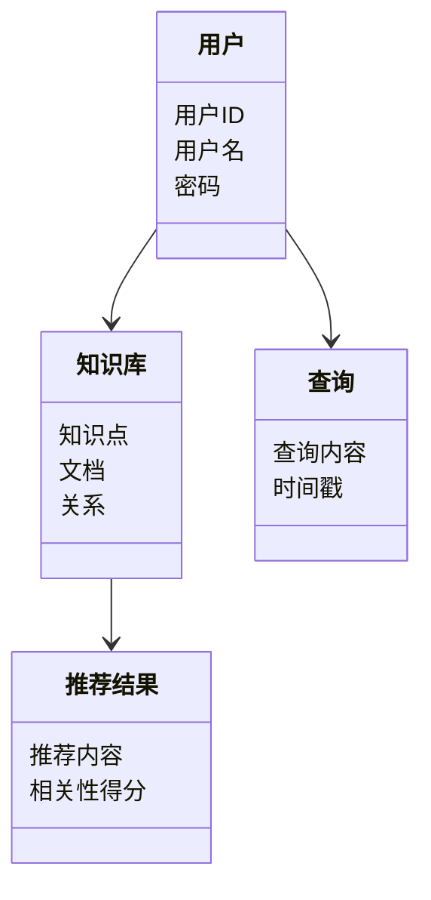
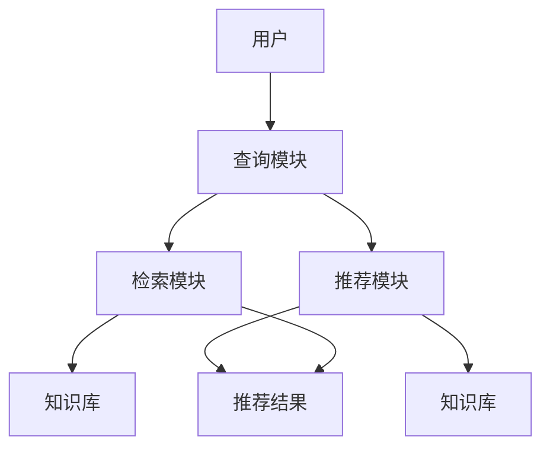

                 


# AI驱动的企业知识管理：智能检索与推荐系统

---

## 关键词：
- 人工智能，企业知识管理，智能检索，推荐系统，知识图谱，自然语言处理，机器学习

---

## 摘要：
随着企业数字化转型的深入，知识管理已成为企业核心竞争力的重要组成部分。传统知识管理依赖人工整理和检索，效率低下且难以应对海量数据。AI驱动的知识管理通过智能检索和推荐系统，利用自然语言处理、机器学习和知识图谱等技术，实现对海量知识的自动化处理、高效检索和个性化推荐。本文将详细探讨AI在企业知识管理中的应用，分析智能检索与推荐系统的算法原理、系统架构，并结合实际案例，展示如何通过AI技术提升企业知识管理的效率和价值。

---

# 第1章：企业知识管理的背景与挑战

## 1.1 企业知识管理的定义与重要性
### 1.1.1 知识管理的核心概念
知识管理（KM，Knowledge Management）是指对企业内外部知识的获取、整理、存储、检索、共享和应用的系统化过程。企业知识可以是文档、数据、经验、流程等，通过知识管理，企业能够将分散的知识转化为可复用的资产，提升决策效率和创新能力。

### 1.1.2 知识管理在企业中的作用
知识管理在企业中的作用主要体现在以下几个方面：
- **提升效率**：通过知识共享和快速检索，减少重复劳动，提高工作效率。
- **增强创新能力**：利用已有知识快速生成新想法，缩短研发周期。
- **降低风险**：通过知识共享和经验复用，避免重复犯错，降低业务风险。
- **支持决策**：通过数据分析和知识挖掘，为管理层提供数据支持。

### 1.1.3 传统知识管理的局限性
传统知识管理主要依赖人工整理和存储，存在以下问题：
- **效率低下**：面对海量数据，人工整理和检索效率极低。
- **知识孤岛**：各部门之间的知识难以共享，形成信息孤岛。
- **难以扩展**：随着数据量的增加，传统方法难以处理复杂场景。

---

## 1.2 AI驱动的知识管理新范式
### 1.2.1 AI在知识管理中的应用场景
AI技术的应用使得知识管理更加智能化和自动化。以下是AI在知识管理中的主要应用场景：
- **智能检索**：利用自然语言处理技术，支持用户通过自然语言查询知识库。
- **知识推荐**：基于用户行为和历史数据，推荐相关知识。
- **知识图谱构建**：通过机器学习技术，自动构建企业知识图谱，实现知识的关联和推理。
- **智能问答**：通过自然语言处理技术，实现智能问答系统，帮助用户快速获取所需知识。

### 1.2.2 AI驱动的知识管理优势
AI驱动的知识管理相比传统方法具有以下优势：
- **高效性**：AI技术能够快速处理海量数据，提升知识检索和推荐的效率。
- **智能化**：通过机器学习和自然语言处理技术，实现知识的自动理解和推理。
- **个性化**：基于用户行为和偏好，提供个性化知识推荐。

### 1.2.3 企业知识管理的未来趋势
未来的知识管理将更加依赖AI技术，以下是可能的趋势：
- **知识图谱的普及**：通过知识图谱技术，实现企业内外部知识的统一管理和应用。
- **智能化检索**：基于深度学习的检索技术将成为主流，提升检索的准确性和相关性。
- **实时知识更新**：通过自动化技术，实现知识的实时更新和维护。

---

## 1.3 智能检索与推荐系统的核心价值
### 1.3.1 智能检索的定义与特点
智能检索是指利用AI技术对文本、图像、视频等多模态数据进行语义理解，实现基于自然语言的检索。其特点包括：
- **语义理解**：能够理解用户查询的语义，提供更精准的结果。
- **多模态支持**：支持文本、图像、视频等多种数据类型的检索。
- **动态优化**：能够根据用户反馈不断优化检索结果。

### 1.3.2 推荐系统的定义与特点
推荐系统是指根据用户行为和偏好，推荐相关知识或资源的系统。其特点包括：
- **个性化推荐**：基于用户行为和偏好，提供个性化推荐。
- **实时性**：能够实时更新推荐结果，适应用户需求的变化。
- **多样性**：推荐结果多样化，避免单一化。

### 1.3.3 智能检索与推荐系统的结合
智能检索和推荐系统的结合能够实现更高效的用户体验。例如：
- **基于检索的推荐**：根据用户的查询内容，推荐相关知识。
- **基于推荐的检索**：根据用户的偏好，推荐相关的检索结果。

---

## 1.4 本章小结
本章主要介绍了企业知识管理的背景、挑战以及AI驱动的知识管理新范式。通过分析传统知识管理的局限性，提出了AI在知识管理中的应用场景和优势。最后，探讨了智能检索与推荐系统的核心价值及其结合方式，为后续章节的深入分析奠定了基础。

---

# 第2章：知识管理的核心概念与联系

## 2.1 知识管理的核心概念
### 2.1.1 知识管理的定义与边界
知识管理不仅包括对知识的存储和检索，还包括对知识的生成、共享和应用。其边界主要集中在企业内部和外部知识的整合与应用。

### 2.1.2 知识管理的核心要素
知识管理的核心要素包括：
- **知识源**：数据、文档、经验等。
- **知识表示**：通过知识图谱等形式表示知识。
- **知识处理**：包括语义理解、关联推理等。

### 2.1.3 知识管理的实现方式
知识管理的实现方式主要包括：
- **基于规则的方法**：通过预定义规则进行知识处理。
- **基于统计的方法**：通过统计分析进行知识挖掘。
- **基于机器学习的方法**：通过深度学习模型进行知识理解。

---

## 2.2 智能检索与推荐系统的概念对比
### 2.2.1 智能检索与推荐系统的异同
智能检索与推荐系统的异同可以通过以下表格对比：

| 特性                | 智能检索                          | 推荐系统                          |
|---------------------|-----------------------------------|------------------------------------|
| 输入                | 用户查询                          | 用户行为和偏好                    |
| 输出                | 相关结果                          | 推荐列表                          |
| 基于                | 用户查询内容                      | 用户行为和历史数据                |
| 优化目标            | 提高检索准确性和相关性            | 提高推荐的相关性和多样性          |

### 2.2.2 知识管理与信息检索的关系
知识管理与信息检索的关系可以分为以下几点：
- **信息检索是知识管理的基础**：信息检索技术帮助企业快速获取知识。
- **知识管理是信息检索的延伸**：知识管理通过整合和关联信息，提升检索的效果。

### 2.2.3 知识管理与推荐系统的结合
知识管理与推荐系统的结合主要体现在：
- **知识图谱的应用**：通过知识图谱，推荐系统能够理解知识之间的关联关系。
- **语义理解的支持**：知识管理技术为推荐系统提供语义理解能力。

---

## 2.3 核心概念的ER实体关系图
以下是知识管理核心概念的ER实体关系图：

```mermaid
erd
    title 知识管理核心概念关系图
    用户 (用户ID, 用户名, 密码)
    文档 (文档ID, 文档标题, 文档内容)
    知识点 (知识点ID, 知识点名称, 知识点描述)
    关系 (关系ID, 知识点1, 知识点2, 关系类型)
    用户 --> 文档
    用户 --> 知识点
    文档 --> 知识点
    知识点 --> 关系
```

---

## 2.4 本章小结
本章主要分析了知识管理的核心概念及其与智能检索和推荐系统的联系。通过对比智能检索和推荐系统的异同，进一步明确了它们在知识管理中的角色和作用。同时，通过ER实体关系图展示了知识管理的核心要素及其关系，为后续章节的系统设计提供了基础。

---

# 第3章：AI驱动的知识管理算法原理

## 3.1 智能检索算法原理
### 3.1.1 BM25算法的原理
BM25是一种基于概率的检索算法，主要用于文本检索。其核心思想是：文档中包含的查询词越多，且文档越短，相关性越高。BM25的数学公式如下：

$$ BM25 = \sum_{i=1}^{n} \frac{\text{tf}(t,i) \cdot \text{idf}(t)}{\text{tf}(t,i) + k(1 - b + b \cdot \text{len}(d_i))} $$

其中：
- $tf(t,i)$ 表示第 $i$ 个文档中查询词 $t$ 的词频。
- $idf(t)$ 表示查询词 $t$ 的逆文档频率。
- $k$ 和 $b$ 是超参数，通常取 $k=2$ 和 $b=0.75$。

### 3.1.2 BM25算法的实现步骤
BM25算法的实现步骤如下：
1. 对文本进行分词和预处理。
2. 计算每个文档的词频和逆文档频率。
3. 根据BM25公式计算每个文档的相关性得分。
4. 根据得分对文档进行排序，返回前 $k$ 个结果。

### 3.1.3 BM25算法的优缺点
BM25算法的优点是计算简单、效率高，缺点是难以处理长尾查询和语义理解。

---

## 3.2 基于深度学习的检索模型
### 3.2.1 DSSM模型的原理
DSSM（Deep Search Semantic Model）是一种基于深度学习的检索模型。其核心思想是将查询和文档映射到相同的语义空间，通过计算它们的余弦相似度来衡量相关性。

### 3.2.2 DSSM模型的结构
DSSM模型的结构如下：
- **查询编码器**：将查询词映射到向量表示。
- **文档编码器**：将文档映射到向量表示。
- **相似度计算**：通过余弦相似度计算查询和文档的相关性。

### 3.2.3 DSSM模型的训练流程
DSSM模型的训练流程如下：
1. 对查询和文档进行分词和预处理。
2. 训练查询编码器和文档编码器，使相似的查询和文档具有相似的向量表示。
3. 使用训练好的模型进行检索。

---

## 3.3 推荐系统算法
### 3.3.1 协同过滤算法
协同过滤算法是一种基于用户行为的推荐算法。其核心思想是：如果两个用户在历史行为中表现出相似的偏好，那么他们可能会喜欢相同的物品。

协同过滤的实现步骤如下：
1. 构建用户-物品的评分矩阵。
2. 计算用户之间的相似度。
3. 根据相似用户的评分，推荐当前用户可能喜欢的物品。

### 3.3.2 基于深度学习的推荐模型
基于深度学习的推荐模型（如DNN、GNN等）能够捕捉用户行为的复杂模式，提升推荐的准确性和多样性。

---

## 3.4 本章小结
本章主要介绍了AI驱动的知识管理中的核心算法，包括BM25、DSSM等检索算法，以及协同过滤和深度学习的推荐算法。通过对这些算法的原理和实现步骤的分析，为后续章节的系统设计提供了理论基础。

---

# 第4章：AI驱动的知识管理系统架构设计

## 4.1 系统功能设计
### 4.1.1 系统功能模块
AI驱动的知识管理系统主要包括以下功能模块：
- **知识获取**：从企业内外部获取知识数据。
- **知识存储**：将知识数据存储到知识库中。
- **知识检索**：根据用户查询返回相关知识。
- **知识推荐**：根据用户行为推荐相关知识。
- **知识更新**：根据反馈不断优化知识库。

### 4.1.2 领域模型
以下是知识管理系统的领域模型：



---

## 4.2 系统架构设计
### 4.2.1 系统架构图
以下是知识管理系统的架构图：



---

## 4.3 系统接口设计
### 4.3.1 API接口
知识管理系统主要提供以下API接口：
- **检索接口**：根据查询内容返回相关知识。
- **推荐接口**：根据用户ID返回推荐结果。

### 4.3.2 接口实现
以下是检索接口的实现示例：

```python
def search(query):
    # 连接知识库
    index = connect_to_elasticsearch()
    # 执行BM25检索
    results = index.search(query, k=5)
    return results
```

---

## 4.4 本章小结
本章主要分析了AI驱动的知识管理系统的架构设计，包括系统功能模块、领域模型、系统架构图以及接口设计。通过这些设计，能够实现知识的高效检索和推荐。

---

# 第5章：AI驱动的知识管理项目实战

## 5.1 项目背景
本项目旨在通过AI技术实现企业知识管理的智能化，提升知识检索和推荐的效率。

---

## 5.2 项目实现
### 5.2.1 环境安装
安装以下依赖：
- Elasticsearch
- Python 3.8+
- scikit-learn
- numpy

### 5.2.2 核心代码实现
以下是检索模块的实现代码：

```python
from elasticsearch import Elasticsearch

class Searcher:
    def __init__(self):
        self.es = Elasticsearch()

    def search(self, query, k=5):
        # 创建BM25检索对象
        body = {
            "query": {
                "bool": {
                    "must": [
                        {
                            "match": {
                                "content": query
                            }
                        }
                    ]
                }
            }
        }
        # 执行检索
        results = self.es.search(index="knowledge", body=body, size=k)
        return results['hits']['hits']

# 使用示例
searcher = Searcher()
results = searcher.search("如何提升效率")
print(results)
```

---

## 5.3 项目总结
通过本项目，我们实现了基于BM25算法的智能检索系统，能够快速响应用户的查询需求。同时，通过结合推荐系统，进一步提升了知识管理的效率和价值。

---

# 第6章：AI驱动的知识管理总结与展望

## 6.1 总结
本文详细探讨了AI驱动的企业知识管理，分析了智能检索与推荐系统的算法原理和系统架构。通过实际项目的实现，验证了AI技术在知识管理中的应用价值。

## 6.2 展望
未来的知识管理将更加依赖AI技术，以下是可能的发展方向：
- **知识图谱的深度应用**：通过知识图谱技术，实现知识的关联推理和智能问答。
- **多模态检索**：支持文本、图像、视频等多种数据类型的检索。
- **实时知识更新**：通过自动化技术，实现知识的实时更新和维护。

---

## 附录：AI驱动的知识管理工具与资源

### 附录A：工具安装指南
- Elasticsearch：https://www.elastic.co/
- Python库：scikit-learn、numpy

### 附录B：数学公式汇总
- BM25公式：
$$ BM25 = \sum_{i=1}^{n} \frac{\text{tf}(t,i) \cdot \text{idf}(t)}{\text{tf}(t,i) + k(1 - b + b \cdot \text{len}(d_i))} $$
- DSSM模型的相似度计算：
$$ \text{similarity} = \frac{\text{query\_vec} \cdot \text{doc\_vec}}{\|\text{query\_vec}\| \cdot \|\text{doc\_vec}\|} $$

### 附录C：参考文献
- BM25论文
- DSSM论文
- 协同过滤相关文献

---

## 作者：AI天才研究院 & 禅与计算机程序设计艺术

---

**[END]**

