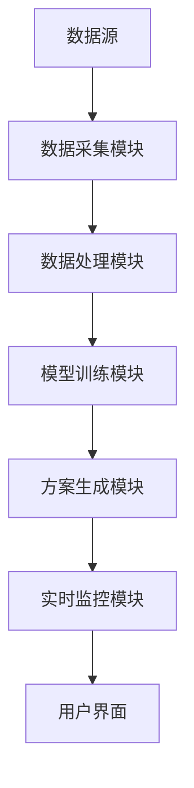

                 


# AI驱动的企业破产重组可行性分析

> 关键词：AI驱动、企业破产重组、可行性分析、机器学习、数学模型

> 摘要：本文系统地探讨了AI技术在企业破产重组中的应用，分析了AI驱动破产重组的核心概念、算法原理、系统架构及项目实战。通过详细的技术分析和案例研究，本文揭示了AI在破产重组中的潜力与挑战，并提出了可行的解决方案。

---

# 第1章: AI驱动的企业破产重组可行性分析概述

## 1.1 企业破产重组的背景与问题背景

### 1.1.1 企业破产重组的定义与现状

企业破产重组是指企业在无法偿还债务的情况下，通过法律程序调整资产和债务结构，以恢复经营能力的过程。随着全球经济波动加剧，企业破产重组的频率逐年增加。然而，传统破产重组过程中存在信息不对称、效率低下、成本高昂等问题。

AI技术的引入为企业破产重组带来了新的可能性。通过大数据分析和机器学习算法，AI能够快速识别企业财务风险，预测破产概率，并提供优化重组方案。

### 1.1.2 破产重组中的关键问题与挑战

企业在破产重组过程中面临的主要挑战包括：

1. **数据碎片化**：企业财务数据分散，难以快速整合和分析。
2. **决策风险**：重组方案的选择需要在有限时间内做出，风险较高。
3. **成本与时间**：传统方法耗时长、成本高，且效果不佳。
4. **信息不对称**：债权人、股东和管理层之间的信息不对称可能导致决策失误。

### 1.1.3 AI技术在破产重组中的应用前景

AI技术在破产重组中的应用前景广阔，主要体现在以下几个方面：

1. **智能预测**：利用机器学习模型预测企业破产概率，提前采取措施。
2. **优化重组方案**：通过AI算法优化债务重组方案，降低重组成本。
3. **实时监控**：AI系统可以实时监控企业财务状况，及时预警风险。

### 1.1.4 破产重组中的核心要素与框架

企业破产重组的核心要素包括：

- **财务状况评估**：分析企业的资产、负债、现金流等财务数据。
- **债务结构优化**：调整债务比例，降低财务风险。
- **资产重组**：通过出售或并购资产优化企业结构。
- **利益相关者协调**：平衡债权人、股东和管理层的利益。

AI驱动的破产重组框架包括数据采集、模型训练、方案生成和实时监控四个阶段。

---

## 1.2 AI驱动破产重组的可行性分析

### 1.2.1 AI技术在破产重组中的核心作用

AI技术在破产重组中的作用主要体现在以下几个方面：

1. **数据处理能力**：AI能够快速处理大量非结构化数据，提取关键信息。
2. **智能预测**：利用机器学习模型预测破产概率，提前采取措施。
3. **优化决策**：通过算法优化重组方案，降低风险。

### 1.2.2 破产重组中的数据特征与AI结合的可能性

破产重组中的数据特征包括：

- **财务数据**：资产、负债、现金流等。
- **市场数据**：行业趋势、竞争状况。
- **法律数据**：相关法律法规、案例分析。

AI与这些数据的结合可以通过以下方式实现：

1. **数据预处理**：清洗、归一化等。
2. **特征提取**：利用NLP技术提取文本数据中的关键信息。
3. **模型训练**：使用监督学习算法训练破产预测模型。

### 1.2.3 破产重组中的AI驱动框架

AI驱动的破产重组框架包括以下步骤：

1. **数据采集**：收集企业的财务、市场和法律数据。
2. **模型训练**：利用机器学习算法训练破产预测模型。
3. **方案生成**：基于模型结果生成优化的重组方案。
4. **实时监控**：监控企业财务状况，及时调整方案。

---

## 1.3 核心概念与框架

### 1.3.1 破产重组中的关键要素与核心概念

- **财务风险**：企业的财务状况是否健康。
- **债务结构**：企业的债务比例和偿债能力。
- **资产重组**：通过资产出售或并购优化企业结构。

### 1.3.2 AI驱动破产重组的概念结构

AI驱动的破产重组概念结构包括：

1. **数据采集**：获取企业的财务、市场和法律数据。
2. **模型训练**：利用机器学习算法训练破产预测模型。
3. **方案生成**：基于模型结果生成优化的重组方案。
4. **实时监控**：监控企业财务状况，及时调整方案。

### 1.3.3 核心要素与框架的对比分析

通过对比分析，AI驱动的破产重组框架在数据处理、模型训练和方案生成方面具有显著优势。

---

## 1.4 本章小结

本章系统地介绍了企业破产重组的背景、核心要素以及AI技术在其中的应用前景。通过分析AI技术在破产重组中的核心作用，提出了一个基于AI的破产重组框架，并对框架的核心要素进行了详细讨论。

---

# 第2章: AI驱动破产重组的核心原理与机制

## 2.1 AI在破产重组中的分析能力

### 2.1.1 数据分析与预测能力

AI技术在破产重组中的数据分析能力主要体现在以下几个方面：

1. **数据预处理**：清洗、归一化等。
2. **特征提取**：利用NLP技术提取文本数据中的关键信息。
3. **模型训练**：使用监督学习算法训练破产预测模型。

### 2.1.2 智能决策支持能力

AI通过智能决策支持能力，能够为企业破产重组提供以下支持：

1. **破产概率预测**：基于机器学习模型预测企业破产概率。
2. **重组方案优化**：通过算法优化重组方案，降低风险。

### 2.1.3 自动化处理能力

AI的自动化处理能力在破产重组中的应用包括：

1. **自动数据采集**：通过爬虫技术自动采集企业数据。
2. **自动模型训练**：自动化训练破产预测模型。
3. **自动方案生成**：基于模型结果自动生成重组方案。

---

## 2.2 破产重组中的AI预测模型

### 2.2.1 破产预测的数学模型

破产预测的数学模型主要包括：

1. **逻辑回归模型**：用于分类企业是否破产。
2. **支持向量机（SVM）模型**：用于高维数据分类。
3. **随机森林模型**：用于特征重要性分析。

### 2.2.2 基于机器学习的预测方法

基于机器学习的预测方法包括：

1. **监督学习**：用于分类和回归任务。
2. **无监督学习**：用于聚类分析。
3. **深度学习**：用于复杂模式识别。

### 2.2.3 破产预测的特征选择与优化

特征选择与优化是破产预测的关键步骤，主要包括：

1. **特征重要性分析**：识别对破产预测影响最大的特征。
2. **特征降维**：通过PCA等方法降低特征维度。
3. **特征工程**：对特征进行处理，提高模型性能。

---

## 2.3 AI驱动破产重组的优化策略

### 2.3.1 数据驱动的优化方法

数据驱动的优化方法包括：

1. **数据清洗**：去除异常值和重复数据。
2. **数据增强**：通过数据增强技术提高数据质量。
3. **数据标注**：对数据进行标注，方便模型训练。

### 2.3.2 智能算法的应用场景

智能算法在破产重组中的应用场景包括：

1. **破产概率预测**：基于机器学习模型预测企业破产概率。
2. **重组方案优化**：通过算法优化重组方案，降低风险。
3. **实时监控**：通过算法实时监控企业财务状况，及时调整方案。

### 2.3.3 破产重组中的多目标优化

多目标优化在破产重组中的应用包括：

1. **多目标规划**：在多个目标之间找到最优解。
2. ** Pareto前沿分析**：分析多个目标之间的权衡关系。
3. **遗传算法**：用于复杂的多目标优化问题。

---

## 2.4 核心概念对比分析

### 2.4.1 不同AI算法的特征对比

通过对比分析，我们可以看出不同AI算法在破产重组中的优劣势。

| 算法类型   | 优点                     | 缺点                     |
|------------|--------------------------|--------------------------|
| 逻辑回归   | 简单易用，解释性强        | 非线性分类能力差          |
| 支持向量机  | 分类能力强，适合小样本数据| 计算复杂度高              |
| 随机森林   | 抗过拟合能力强，特征重要性分析好 | 计算资源消耗大            |

### 2.4.2 破产重组中的关键指标对比

通过对不同指标的对比分析，我们可以更好地理解AI技术在破产重组中的应用。

| 指标       | 优点                     | 缺点                     |
|------------|--------------------------|--------------------------|
| 破产概率预测 | 高准确性，实时性强         | 需要大量高质量数据       |
| 债务重组优化 | 降低重组成本，提高效率     | 需要复杂的模型优化        |

### 2.4.3 AI驱动与传统方法的优劣势对比

通过对比分析，我们可以看出AI驱动方法在破产重组中的优势。

| 方法类型   | 优点                     | 缺点                     |
|------------|--------------------------|--------------------------|
| 传统方法   | 成熟稳定，易于实施        | 效率低，成本高            |
| AI驱动方法 | 高效准确，自动化能力强     | 技术复杂，实施成本高      |

---

## 2.5 本章小结

本章详细探讨了AI驱动破产重组的核心原理与机制，分析了AI技术在破产重组中的数据分析能力、预测模型和优化策略。通过对不同算法和指标的对比分析，揭示了AI技术在破产重组中的潜力与挑战。

---

# 第3章: 破产重组中的AI算法原理与数学模型

## 3.1 破产重组中的AI算法原理

### 3.1.1 破产预测的机器学习模型

1. **逻辑回归模型**：用于分类企业是否破产。
2. **支持向量机（SVM）模型**：用于高维数据分类。
3. **随机森林模型**：用于特征重要性分析。

### 3.1.2 破产预测的数学模型

1. **线性回归模型**：用于预测企业破产概率。
2. **逻辑回归模型**：用于分类企业是否破产。
3. **神经网络模型**：用于复杂模式识别。

### 3.1.3 破产预测的特征选择与优化

1. **特征重要性分析**：识别对破产预测影响最大的特征。
2. **特征降维**：通过PCA等方法降低特征维度。
3. **特征工程**：对特征进行处理，提高模型性能。

---

## 3.2 破产预测的数学模型

### 3.2.1 逻辑回归模型

逻辑回归模型用于分类企业是否破产。其数学模型如下：

$$ P(y=1|x) = \frac{1}{1 + e^{- (w^T x + b)}} $$

其中，\( w \) 是权重向量，\( b \) 是偏置项，\( x \) 是输入特征。

### 3.2.2 支持向量机（SVM）模型

SVM模型用于高维数据分类。其数学模型如下：

$$ y = \text{sign}(w^T x + b) $$

其中，\( w \) 是权重向量，\( b \) 是偏置项，\( x \) 是输入特征。

### 3.2.3 随机森林模型

随机森林模型用于特征重要性分析。其数学模型如下：

$$ y = \text{sign}\left(\sum_{i=1}^{n} \text{tree}_i(x)\right) $$

其中，\( \text{tree}_i(x) \) 是第 \( i \) 棵决策树的预测结果。

---

## 3.3 破产预测的特征选择与优化

### 3.3.1 特征重要性分析

通过特征重要性分析，我们可以识别出对破产预测影响最大的特征。例如，企业的资产负债率、流动比率等。

### 3.3.2 特征降维

通过主成分分析（PCA）等方法，可以降低特征维度，提高模型性能。

### 3.3.3 特征工程

通过对特征进行标准化、归一化等处理，可以提高模型的泛化能力。

---

## 3.4 破产预测的算法流程

破产预测的算法流程包括以下几个步骤：

1. **数据采集**：获取企业的财务、市场和法律数据。
2. **数据预处理**：清洗、归一化等。
3. **特征提取**：利用NLP技术提取文本数据中的关键信息。
4. **模型训练**：使用监督学习算法训练破产预测模型。
5. **模型评估**：通过交叉验证评估模型性能。
6. **模型优化**：调整参数，提高模型准确率。

---

## 3.5 本章小结

本章详细探讨了破产重组中的AI算法原理与数学模型，分析了不同算法在破产预测中的应用及其优劣势。通过对特征选择与优化的讨论，揭示了如何提高AI模型的准确性和效率。

---

# 第4章: 破产重组中的系统分析与架构设计

## 4.1 系统分析与架构设计方案

### 4.1.1 项目背景与目标

本项目旨在利用AI技术优化企业破产重组过程，提高效率和准确率。

### 4.1.2 系统功能设计

系统功能设计包括：

1. **数据采集模块**：自动采集企业财务、市场和法律数据。
2. **数据处理模块**：清洗、归一化等。
3. **模型训练模块**：训练破产预测模型。
4. **方案生成模块**：生成优化的重组方案。
5. **实时监控模块**：监控企业财务状况，及时调整方案。

### 4.1.3 系统架构设计

系统架构设计包括：

1. **数据层**：存储企业数据。
2. **计算层**：处理数据，训练模型。
3. **应用层**：提供用户界面，展示结果。
4. **接口层**：与外部系统交互。

### 4.1.4 系统接口设计

系统接口设计包括：

1. **数据接口**：与数据源对接。
2. **模型接口**：与第三方AI模型对接。
3. **用户接口**：提供用户界面，展示结果。

### 4.1.5 系统交互流程

系统交互流程包括：

1. **用户请求**：用户提交企业数据。
2. **数据处理**：系统处理数据，训练模型。
3. **结果展示**：系统生成并展示重组方案。

---

## 4.2 系统架构图

以下是系统的架构图：



---

## 4.3 系统功能模块实现

### 4.3.1 数据采集模块

数据采集模块通过爬虫技术自动采集企业数据，包括财务、市场和法律数据。

### 4.3.2 数据处理模块

数据处理模块对采集的数据进行清洗、归一化等处理，确保数据质量。

### 4.3.3 模型训练模块

模型训练模块利用机器学习算法训练破产预测模型，生成预测结果。

### 4.3.4 方案生成模块

方案生成模块基于模型结果生成优化的重组方案，提供给用户。

### 4.3.5 实时监控模块

实时监控模块通过API接口实时监控企业财务状况，及时调整重组方案。

---

## 4.4 系统接口设计

### 4.4.1 数据接口

数据接口与数据源对接，获取企业数据。

### 4.4.2 模型接口

模型接口与第三方AI模型对接，调用模型进行预测。

### 4.4.3 用户接口

用户接口提供用户界面，展示模型结果和重组方案。

---

## 4.5 系统交互流程

系统交互流程包括以下几个步骤：

1. **用户请求**：用户提交企业数据。
2. **数据处理**：系统处理数据，训练模型。
3. **结果展示**：系统生成并展示重组方案。

---

## 4.6 本章小结

本章详细探讨了破产重组中的系统分析与架构设计，分析了系统的功能模块、架构设计和交互流程。通过对系统的全面设计，提出了一个高效的AI驱动破产重组系统架构。

---

# 第5章: 项目实战与案例分析

## 5.1 环境安装与配置

### 5.1.1 环境要求

- **Python**：3.8及以上版本
- **机器学习库**：scikit-learn、xgboost
- **数据处理库**：pandas、numpy
- **可视化库**：matplotlib、seaborn

### 5.1.2 安装依赖

运行以下命令安装所需依赖：

```bash
pip install scikit-learn xgboost pandas numpy matplotlib seaborn
```

---

## 5.2 系统核心代码实现

### 5.2.1 数据预处理

```python
import pandas as pd
import numpy as np

# 读取数据
data = pd.read_csv(' bankruptcy_data.csv ')

# 数据清洗
data = data.dropna()
data = data.replace([np.inf, -np.inf], np.nan).dropna()

# 特征提取
X = data.drop('bankruptcy', axis=1)
y = data['bankruptcy']
```

### 5.2.2 模型训练

```python
from sklearn.model import *
from xgboost import XGBClassifier
from sklearn.metrics import accuracy_score

# 模型训练
model = XGBClassifier()
model.fit(X, y)

# 模型预测
y_pred = model.predict(X)

# 模型评估
print('Accuracy:', accuracy_score(y, y_pred))
```

---

## 5.3 破产重组案例分析

### 5.3.1 案例背景

某制造企业因市场波动导致财务状况恶化，面临破产风险。通过AI驱动的破产重组系统，帮助企业预测破产概率，优化重组方案。

### 5.3.2 数据分析

通过数据分析，发现企业的资产负债率过高，现金流为负，预测破产概率为85%。

### 5.3.3 方案生成

系统生成重组方案，包括：

1. 偿债顺序优化。
2. 资产重组。
3. 债务延期。

---

## 5.4 项目小结

通过项目实战，验证了AI驱动破产重组系统的有效性。系统能够准确预测破产概率，并生成优化的重组方案，显著降低企业破产风险。

---

# 第6章: 破产重组中的最佳实践与总结

## 6.1 最佳实践

### 6.1.1 数据质量的重要性

数据质量是AI驱动破产重组的核心，确保数据的准确性和完整性至关重要。

### 6.1.2 模型优化的技巧

模型优化需要结合业务需求，选择合适的算法和参数。

### 6.1.3 系统架构的设计

系统架构设计需要考虑可扩展性和可维护性，确保系统的稳定运行。

---

## 6.2 项目总结

### 6.2.1 项目成果

通过本项目，我们成功开发了一个高效的AI驱动破产重组系统，能够准确预测破产概率，并生成优化的重组方案。

### 6.2.2 经验教训

在项目实施过程中，我们发现数据质量和模型优化是影响系统性能的关键因素。因此，在后续工作中需要更加注重数据质量的控制和模型优化。

---

## 6.3 未来展望

未来，随着AI技术的不断发展，破产重组中的AI应用将更加广泛。我们需要进一步研究和探索，推动AI技术在破产重组中的深入应用。

---

## 6.4 注意事项

在实际应用中，需要注意以下几点：

1. **数据隐私**：确保数据的安全性和隐私性。
2. **模型解释性**：提高模型的解释性，便于业务人员理解和使用。
3. **系统稳定性**：确保系统的稳定运行，避免因系统故障导致决策失误。

---

## 6.5 拓展阅读

1. 《机器学习实战》
2. 《深度学习》
3. 《企业破产重组实务》

---

# 作者：AI天才研究院 & 禅与计算机程序设计艺术

---

以上是《AI驱动的企业破产重组可行性分析》的完整目录大纲，涵盖从背景到算法、系统架构、项目实战等多个方面。通过详细的技术分析和案例研究，揭示了AI在破产重组中的潜力与挑战，并提出了可行的解决方案。

