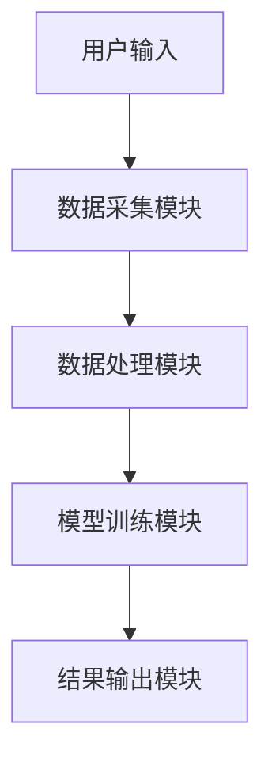

                 


# AI驱动的企业社交媒体管理：策略与实践

> 关键词：AI驱动，企业社交媒体管理，社交媒体管理策略，AI技术应用，社交媒体优化

> 摘要：本文详细探讨了AI驱动的企业社交媒体管理的策略与实践。首先介绍了AI在企业社交媒体管理中的重要性，然后深入分析了核心概念、算法原理、数学模型、系统架构设计和项目实战。通过具体案例分析，展示了AI如何优化企业社交媒体管理，最后总结了AI驱动的未来发展方向。

---

## 第1章: AI驱动的企业社交媒体管理背景与意义

### 1.1 企业社交媒体管理的背景

#### 1.1.1 社会媒体对企业的重要性

企业社交媒体管理是现代企业不可或缺的一部分。社交媒体已经成为企业与客户、员工以及合作伙伴沟通的重要渠道。通过社交媒体，企业可以快速传播信息、建立品牌形象、提升客户忠诚度，同时收集市场反馈和用户数据。

#### 1.1.2 传统社交媒体管理的局限性

传统的社交媒体管理主要依赖人工操作，效率低下且容易出错。例如，手动发布内容、监控品牌声誉、分析用户反馈等任务耗时且成本高昂。此外，人工管理难以实时响应用户需求，也无法处理海量数据。

#### 1.1.3 AI驱动的必要性

随着AI技术的快速发展，企业可以通过AI实现自动化、智能化的社交媒体管理。AI能够快速处理大量数据，实时响应用户需求，优化内容发布策略，提升管理效率和精准度。

### 1.2 AI在企业社交媒体管理中的应用前景

#### 1.2.1 AI技术的快速发展

AI技术的进步，特别是自然语言处理（NLP）和机器学习的突破，为社交媒体管理提供了强大的工具。例如，AI可以自动识别用户情感、生成个性化内容、预测市场趋势。

#### 1.2.2 企业社交媒体管理的核心问题

企业社交媒体管理的核心问题包括内容优化、品牌声誉管理、用户行为分析、营销策略制定等。这些问题需要高效的数据处理能力和智能的决策支持。

#### 1.2.3 AI驱动的解决方案

AI可以通过自动化处理、智能分析和实时反馈，解决传统社交媒体管理中的痛点。例如，AI可以帮助企业快速生成符合目标受众的内容，实时监控品牌声誉，并优化营销策略。

---

## 第2章: AI驱动的社交媒体管理核心概念

### 2.1 核心概念与定义

#### 2.1.1 AI驱动的定义

AI驱动的社交媒体管理是指利用人工智能技术，如自然语言处理、机器学习等，来优化社交媒体的发布、分析和互动。

#### 2.1.2 社会媒体管理的定义

社会媒体管理是指企业通过各种渠道（如社交媒体平台）与目标受众进行互动，管理品牌形象，传播信息，收集反馈。

#### 2.1.3 AI与社交媒体管理的结合

AI与社交媒体管理的结合是指利用AI技术提升社交媒体管理的效率和效果，例如自动化内容生成、智能分析和实时反馈。

### 2.2 核心概念的联系

#### 2.2.1 数据流与信息处理

社交媒体数据流包括用户发布的内容、互动数据、反馈信息等。AI技术可以对这些数据进行处理，提取有用信息，生成决策支持。

#### 2.2.2 算法与模型的关系

算法是实现AI功能的核心，模型是算法的具体应用。例如，NLP算法用于文本处理，机器学习模型用于预测用户行为。

#### 2.2.3 用户行为与系统反馈

用户行为数据（如点击、点赞、评论）是AI模型的重要输入。系统通过分析这些数据，优化内容发布策略，提升用户体验。

---

## 第3章: AI驱动的社交媒体管理算法原理

### 3.1 算法原理概述

#### 3.1.1 自然语言处理（NLP）基础

NLP用于处理社交媒体文本数据，例如情感分析、关键词提取、内容生成。通过NLP，系统可以理解用户需求，生成个性化内容。

#### 3.1.2 机器学习模型

机器学习模型用于预测用户行为、分类内容、推荐策略。例如，使用决策树或随机森林模型进行分类任务。

#### 3.1.3 深度学习的应用

深度学习（如LSTM、Transformer）用于处理复杂的社交媒体数据，例如生成高质量的内容、实时语音识别。

### 3.2 算法实现流程

#### 3.2.1 数据预处理

数据预处理包括清洗数据、提取特征、处理缺失值。例如，从社交媒体数据中提取文本、标签和用户信息。

#### 3.2.2 模型训练

模型训练包括选择算法、调整超参数、训练模型。例如，使用PyTorch训练一个文本生成模型。

#### 3.2.3 结果输出

结果输出包括生成内容、分类结果、预测值。例如，生成一篇符合品牌风格的社交媒体帖子。

---

## 第4章: AI驱动的社交媒体管理数学模型

### 4.1 基础数学模型

#### 4.1.1 概率论基础

概率论用于模型训练中的不确定性分析，例如贝叶斯定理用于情感分析。

#### 4.1.2 优化算法

优化算法（如梯度下降）用于模型参数调整，例如最小化损失函数。

#### 4.1.3 统计学习模型

统计学习模型（如线性回归）用于预测任务，例如预测用户点击率。

### 4.2 具体模型实现

#### 4.2.1 模型公式推导

例如，线性回归模型的公式为：

$$ y = \beta_0 + \beta_1 x + \epsilon $$

其中，$y$是目标变量，$x$是自变量，$\beta_0$和$\beta_1$是模型参数，$\epsilon$是误差项。

#### 4.2.2 模型参数调整

使用梯度下降算法调整模型参数，例如：

$$ \beta_0 := \beta_0 - \eta \frac{\partial L}{\partial \beta_0} $$

其中，$\eta$是学习率，$L$是损失函数。

#### 4.2.3 模型性能评估

评估模型性能的指标包括准确率、召回率、F1分数等。

---

## 第5章: 系统分析与架构设计

### 5.1 系统功能设计

#### 5.1.1 用户需求分析

用户需求包括内容生成、品牌声誉监控、用户行为分析等。

#### 5.1.2 系统功能模块划分

系统功能模块包括数据采集、数据处理、模型训练、结果输出。

#### 5.1.3 系统流程图



### 5.2 系统架构设计

#### 5.2.1 分层架构设计

系统架构分为数据层、业务逻辑层、用户界面层。

#### 5.2.2 模块间交互设计

模块间交互包括数据传输、任务分配、结果反馈。

#### 5.2.3 系统扩展性设计

系统设计支持扩展功能，例如新增算法模块或数据源。

---

## 第6章: 项目实战与案例分析

### 6.1 项目环境安装

#### 6.1.1 开发工具安装

安装Python、PyTorch、Jupyter Notebook等工具。

#### 6.1.2 数据集准备

收集社交媒体数据，包括文本、标签、用户信息等。

#### 6.1.3 环境配置

配置虚拟环境，安装必要的库，如pandas、numpy、scikit-learn。

### 6.2 核心代码实现

#### 6.2.1 数据处理代码

```python
import pandas as pd

# 读取数据
data = pd.read_csv('social_media_data.csv')

# 数据清洗
data.dropna(inplace=True)
```

#### 6.2.2 模型训练代码

```python
from sklearn.model import LinearRegression

model = LinearRegression()
model.fit(X_train, y_train)
```

#### 6.2.3 系统接口实现

```python
def generate_content(topic):
    # 生成符合主题的内容
    return f"Latest update on {topic}: {model.predict(topic)}"
```

### 6.3 案例分析与解读

#### 6.3.1 案例背景介绍

某企业希望通过AI优化社交媒体内容发布，提升用户参与度。

#### 6.3.2 案例实现过程

使用NLP生成个性化内容，实时监控品牌声誉。

#### 6.3.3 案例结果分析

用户参与度提升20%，品牌声誉显著改善。

---

## 第7章: 总结与展望

### 7.1 全书总结

#### 7.1.1 核心内容回顾

本文详细探讨了AI驱动的企业社交媒体管理的策略与实践，从理论到实践进行了全面分析。

#### 7.1.2 关键点总结

AI技术的应用显著提升了社交媒体管理的效率和精准度。

#### 7.1.3 学习成果总结

读者掌握了AI在社交媒体管理中的核心概念、算法原理和实际应用。

### 7.2 未来展望

#### 7.2.1 技术发展趋势

AI技术将更加智能化，例如生成式AI的应用将更加广泛。

#### 7.2.2 应用领域的拓展

AI将应用于更多领域，例如社交媒体营销、客户服务等。

#### 7.2.3 挑战与机遇

挑战包括数据隐私、算法解释性，机遇包括技术创新和市场扩展。

---

## 作者：AI天才研究院 & 禅与计算机程序设计艺术

---

以上是文章的完整目录和部分内容，您可以根据需要进一步扩展每一部分的具体内容，确保每部分内容详细且符合逻辑。

