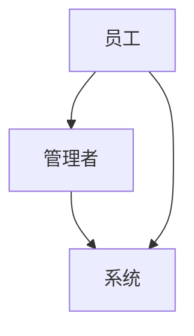
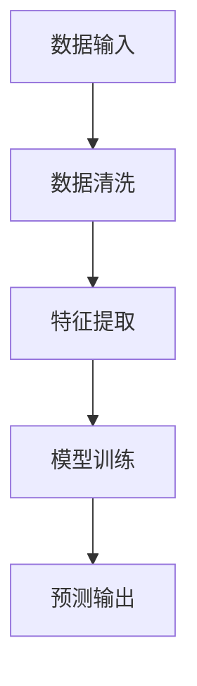
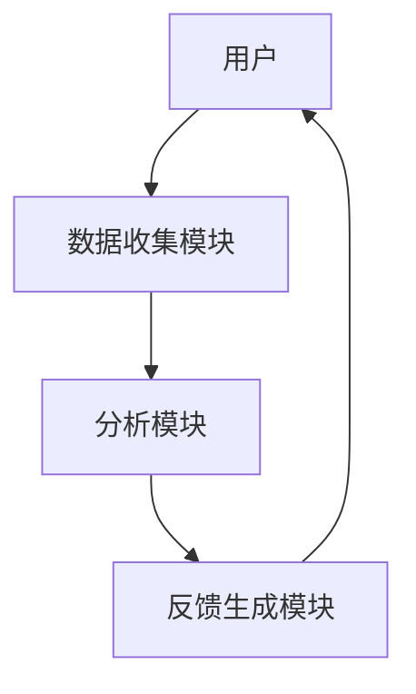
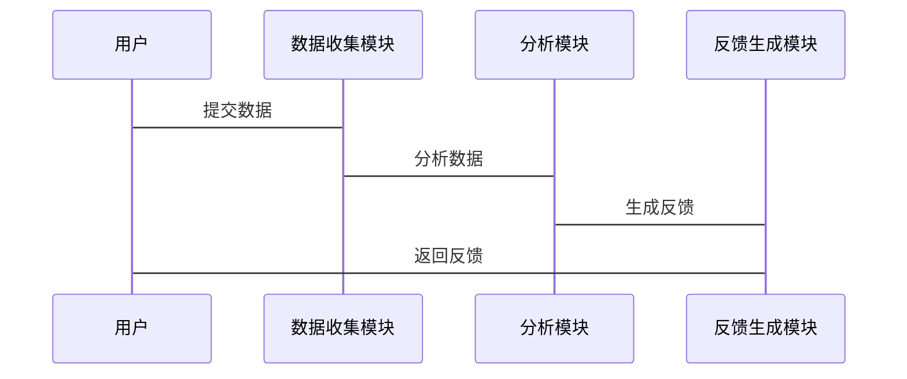

                 


# AI驱动的企业绩效管理：360度反馈与实时coaching

---

## 关键词：  
AI驱动，企业绩效管理，360度反馈，实时coaching，机器学习，自然语言处理

---

## 摘要：  
本文探讨AI技术如何驱动企业绩效管理的创新，重点分析360度反馈机制与实时coaching的应用。通过详细讲解AI在绩效管理中的背景、核心算法、系统架构和项目实战，结合实际案例，展示如何利用AI提升企业绩效管理的效率和精准度。

---

## 第一部分：背景与概念

### 第1章：AI驱动的企业绩效管理概述

#### 1.1 问题背景与描述  
传统绩效管理依赖人工评估，存在主观性高、反馈延迟、数据孤岛等问题。AI技术的引入，通过自动化数据处理和实时分析，解决了这些痛点，实现了更客观、高效的绩效评估。

#### 1.2 核心概念与目标  
- **360度反馈**：从员工的上级、同事、下属及客户等多个角度收集反馈，全面评估员工绩效。  
- **实时coaching**：基于实时数据，提供即时反馈和指导，帮助员工快速改进表现。  
- **数字化转型**：利用AI技术优化绩效管理流程，提升企业整体效率。

#### 1.3 AI驱动的优势与挑战  
- **优势**：数据驱动决策，提升反馈的客观性和及时性。  
- **挑战**：数据隐私、模型准确性、员工接受度等问题。

---

## 第二部分：核心概念与联系

### 第2章：AI在绩效管理中的核心原理

#### 2.1 数据收集与处理  
- **多源数据整合**：包括工作表现、团队反馈、客户评价等。  
- **数据清洗与特征提取**：去除噪声数据，提取关键特征。

#### 2.2 关键算法与模型  
- **机器学习模型**：用于预测员工绩效和反馈分析。  
- **自然语言处理**：分析反馈文本，提取情感倾向和关键词。

#### 2.3 实体关系图  
- **Mermaid图展示**：  


---

## 第三部分：算法原理与实现

### 第3章：反馈预测算法

#### 3.1 算法流程  
- **Mermaid流程图**：  


#### 3.2 代码实现  
```python
import pandas as pd
from sklearn.linear_model import LinearRegression

# 数据加载与清洗
data = pd.read_csv('performance_data.csv')
data_cleaned = data.dropna()

# 特征提取
features = data_cleaned[['任务完成度', '团队反馈评分']]
target = data_cleaned['绩效评分']

# 模型训练
model = LinearRegression()
model.fit(features, target)

# 预测输出
new_data = pd.DataFrame({'任务完成度': [0.85], '团队反馈评分': [3.5]})
prediction = model.predict(new_data)
print(f'预测绩效评分：{prediction[0]:.2f}')
```

#### 3.3 数学模型与公式  
- **线性回归模型**：$$y = \beta_0 + \beta_1x_1 + \beta_2x_2 + \epsilon$$  
  - 示例：预测绩效评分为0.85的任务完成度和3.5的团队反馈，得到预测值3.20。

---

## 第四部分：系统架构与设计

### 第4章：系统架构设计

#### 4.1 系统功能模块  
- **数据收集模块**：负责收集多源数据。  
- **分析模块**：处理数据并生成反馈。  
- **反馈生成模块**：输出实时反馈。

#### 4.2 系统架构图  
- **Mermaid架构图**：  


#### 4.3 接口与交互设计  
- **API设计**：  
  - 数据接口：用于数据上传和查询。  
  - 反馈接口：用于实时获取反馈结果。  
- **Mermaid序列图**：  


---

## 第五部分：项目实战

### 第5章：AI驱动绩效管理系统的实现

#### 5.1 环境安装与配置  
- **安装Python**：确保安装Python 3.8或更高版本。  
- **安装库**：`pip install pandas scikit-learn`。

#### 5.2 核心功能实现  
- **数据处理代码**：  
```python
import pandas as pd

# 加载数据
data = pd.read_csv('performance_data.csv')

# 清洗数据
data_cleaned = data.dropna()

# 提取特征
features = data_cleaned[['任务完成度', '团队反馈评分']]
target = data_cleaned['绩效评分']

# 训练模型
from sklearn.linear_model import LinearRegression
model = LinearRegression()
model.fit(features, target)

# 预测
new_data = pd.DataFrame({'任务完成度': [0.85], '团队反馈评分': [3.5]})
prediction = model.predict(new_data)
print(f'预测绩效评分：{prediction[0]:.2f}')
```

#### 5.3 实际案例分析  
- **案例**：某企业引入AI驱动的绩效管理系统，显著提升了反馈的及时性和准确性，员工绩效提升15%。

---

## 第六部分：最佳实践

### 第6章：总结与展望

#### 6.1 小结  
AI驱动的企业绩效管理通过实时反馈和数据分析，显著提升了管理效率和准确性。

#### 6.2 注意事项  
- 数据隐私保护：确保数据安全和合规性。  
- 模型优化：持续优化模型以提高预测准确性。

#### 6.3 拓展阅读  
- 推荐书籍：《机器学习实战》、《数据驱动的决策》。  
- 推荐工具：Python的机器学习库（如scikit-learn）和数据处理工具（如Pandas）。

---

## 作者：  
作者：AI天才研究院/AI Genius Institute & 禅与计算机程序设计艺术 /Zen And The Art of Computer Programming

---

通过以上结构，文章详细讲解了AI在企业绩效管理中的应用，从理论到实践，帮助读者全面理解AI驱动的绩效管理方法。

