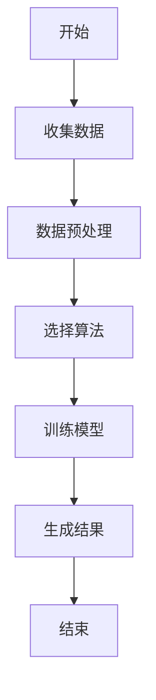
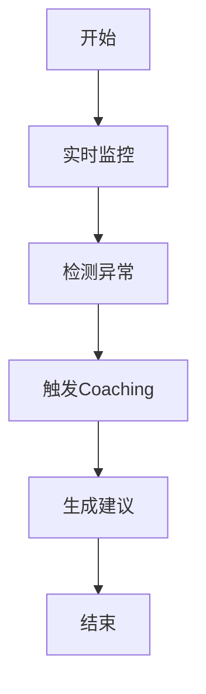
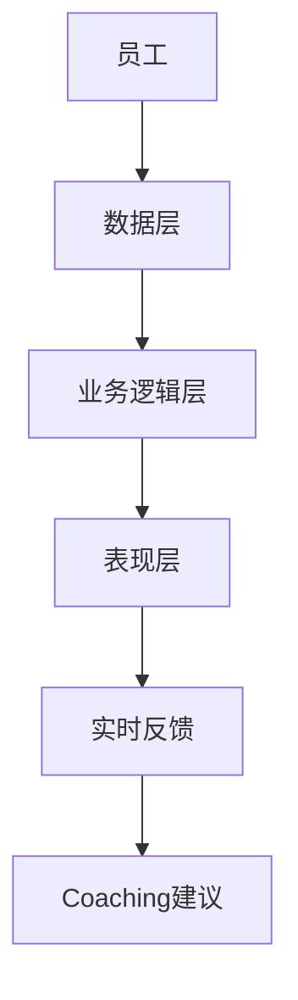

                 


# AI驱动的企业绩效管理：360度反馈与实时coaching的智能化

> 关键词：AI驱动，企业绩效管理，360度反馈，实时Coaching，智能化

> 摘要：随着人工智能技术的快速发展，企业绩效管理也在不断革新。本文深入探讨AI如何驱动企业绩效管理，特别是360度反馈与实时Coaching的智能化。通过分析AI技术在绩效管理中的应用，结合具体案例和算法原理，揭示智能化绩效管理的核心价值和实现路径。

---

## 第1章: AI驱动的企业绩效管理背景

### 1.1 企业绩效管理的数字化转型

#### 1.1.1 传统企业绩效管理的挑战

企业绩效管理（Performance Management，PM）是企业管理和战略执行的重要组成部分。传统绩效管理主要依赖人工收集数据、制定目标和评估结果，存在以下挑战：

- 数据收集效率低下：需要手动整理来自不同部门的反馈数据。
- 评估主观性：主观判断可能导致评估结果不准确。
- 反馈延迟：传统反馈流程耗时较长，难以实现实时指导。

#### 1.1.2 AI技术对企业绩效管理的推动作用

AI技术的引入，为绩效管理带来了革命性的变化：

- **自动化数据处理**：AI能够快速分析大量数据，生成客观的评估结果。
- **实时反馈**：通过AI算法，企业可以实时收集和分析员工表现数据，提供及时的反馈和建议。
- **个性化指导**：AI可以根据员工的绩效数据，提供个性化的Coaching方案。

#### 1.1.3 数字化转型中的绩效管理新趋势

数字化转型推动企业绩效管理向智能化方向发展，主要体现在：

- 数据驱动的决策：通过AI分析数据，帮助企业做出更精准的管理决策。
- 智能化反馈系统：利用AI技术实现360度反馈的自动化和智能化。
- 实时Coaching：AI实时监控员工表现，提供即时指导和建议。

### 1.2 360度反馈与实时Coaching的智能化

#### 1.2.1 360度反馈的定义与特点

360度反馈是一种多维度的绩效评估方法，通过收集来自员工本人、上级、下级、同事以及外部客户等多方面的反馈，全面评估员工的绩效。其特点包括：

- **全面性**：覆盖多个维度，提供更全面的评估结果。
- **客观性**：通过多来源反馈，减少主观偏见。
- **实时性**：通过AI技术实现反馈的实时收集和分析。

#### 1.2.2 实时Coaching的定义与优势

实时Coaching是指在员工工作过程中，系统根据实时数据提供即时的反馈和指导。其优势包括：

- **及时性**：员工在出现问题时可以立即得到指导，避免错误扩大。
- **针对性**：基于具体行为和数据，提供个性化的指导建议。
- **持续性**：通过持续监控和反馈，帮助员工不断提升绩效。

#### 1.2.3 智能化绩效管理的场景应用

智能化绩效管理的应用场景包括：

- **员工绩效评估**：通过AI分析数据，生成绩效评估报告。
- **目标设定**：基于历史数据和业务目标，智能设定绩效目标。
- **实时反馈与指导**：系统实时监控员工表现，提供即时反馈和Coaching建议。

### 1.3 AI驱动绩效管理的核心价值

#### 1.3.1 提高管理效率

AI技术可以自动化处理大量数据，减少人工干预，显著提高管理效率。

#### 1.3.2 增强员工体验

通过实时反馈和个性化指导，员工能够更快地发现问题并改进，提升员工满意度和忠诚度。

#### 1.3.3 数据驱动的决策支持

AI分析数据，为企业制定绩效目标和管理策略提供科学依据，帮助企业做出更明智的决策。

---

## 第2章: AI驱动绩效管理的核心概念与联系

### 2.1 AI驱动绩效管理模型

#### 2.1.1 模型的核心要素

AI驱动绩效管理模型的核心要素包括：

- **数据输入**：来自员工、上级、同事等多方面的反馈数据。
- **AI算法**：包括机器学习和自然语言处理等技术，用于分析和处理数据。
- **输出结果**：生成绩效评估报告、实时反馈和Coaching建议。

#### 2.1.2 各要素之间的关系

各要素之间的关系如下：

1. 数据输入是AI算法的输入，AI算法对数据进行分析和处理。
2. 处理后的数据生成绩效评估报告和实时反馈。
3. 反馈和建议用于指导员工改进绩效。

#### 2.1.3 模型的输入与输出

模型的输入包括：

- 员工绩效数据
- 多维度反馈数据

模型的输出包括：

- 绩效评估报告
- 实时反馈和Coaching建议

### 2.2 360度反馈与实时Coaching的关系

#### 2.2.1 360度反馈的数据来源

360度反馈的数据来源包括：

- 员工自评
- 上级评估
- 下级评估
- 同事评估
- 客户反馈

#### 2.2.2 实时Coaching的触发机制

实时Coaching的触发机制包括：

- 员工绩效数据低于设定阈值
- 系统检测到员工行为异常
- 员工主动请求指导

#### 2.2.3 两者结合的协同效应

两者结合可以实现：

- 全面的绩效评估
- 实时的反馈和指导
- 持续的员工绩效改进

### 2.3 AI技术在绩效管理中的应用边界

#### 2.3.1 数据隐私与安全

在使用AI技术进行绩效管理时，必须确保员工数据的隐私和安全。

#### 2.3.2 人机协作的平衡点

AI技术可以辅助人类进行绩效管理，但不能完全替代人类的判断。

#### 2.3.3 企业文化与员工接受度

企业文化和员工接受度是AI驱动绩效管理成功实施的重要因素。

---

## 第3章: AI驱动绩效管理的算法原理

### 3.1 360度反馈的机器学习算法

#### 3.1.1 协同过滤算法

协同过滤算法用于推荐系统，可以应用于绩效评估中的相似性分析。

#### 3.1.2 聚类分析

聚类分析用于将员工绩效数据进行分组，识别绩效表现相似的员工。

#### 3.1.3 深度学习模型

深度学习模型可以用于复杂的数据分析和预测，提供更精准的绩效评估。

### 3.2 实时Coaching的自然语言处理技术

#### 3.2.1 情感分析

情感分析用于分析员工反馈中的情感倾向，识别员工情绪状态。

#### 3.2.2 文本生成

文本生成技术用于自动生成反馈建议和Coaching内容。

#### 3.2.3 语义理解

语义理解用于理解员工反馈中的深层含义，提供更精准的指导建议。

### 3.3 算法流程图

以下是360度反馈的算法流程图：



以下是实时Coaching的算法流程图：



---

## 第4章: 系统分析与架构设计方案

### 4.1 问题场景介绍

本章将介绍AI驱动绩效管理系统的应用场景和功能需求。

### 4.2 系统功能设计

#### 4.2.1 领域模型

以下是领域模型的类图：

```mermaid
classDiagram
    class 员工 {
        ID: integer
        姓名: string
        绩效数据: array
    }
    class �反溃数据 {
        来源: string
        评语: string
        评分: integer
    }
    class 系统 {
        收集数据
        分析数据
        生成报告
    }
    员工 --> 反馈数据
    系统 --> 员工
    系统 --> 反馈数据
```

#### 4.2.2 系统架构设计

以下是系统架构设计图：



---

## 第5章: 项目实战

### 5.1 环境安装

安装Python和必要的库，如pandas、numpy、scikit-learn。

### 5.2 核心代码实现

以下是核心代码实现：

```python
import pandas as pd
from sklearn.metrics.pairwise import cosine_similarity

# 数据预处理
data = pd.read_csv('performance.csv')
processed_data = data.dropna()

# 计算相似度
similarity = cosine_similarity(processed_data)
```

### 5.3 案例分析

通过具体案例分析，展示AI驱动绩效管理的实际应用效果。

### 5.4 项目小结

总结项目实施的经验和教训，提出改进建议。

---

## 第6章: 最佳实践

### 6.1 总结与经验分享

总结AI驱动绩效管理的核心价值和成功经验。

### 6.2 注意事项与未来展望

提出实施AI驱动绩效管理的注意事项，并展望未来的发展方向。

---

## 附录

### 附录1: 数据集

介绍使用的数据集及其格式。

### 附录2: 工具推荐

推荐相关的工具和技术，帮助读者更好地实施AI驱动绩效管理。

---

作者：AI天才研究院/AI Genius Institute & 禅与计算机程序设计艺术 /Zen And The Art of Computer Programming

