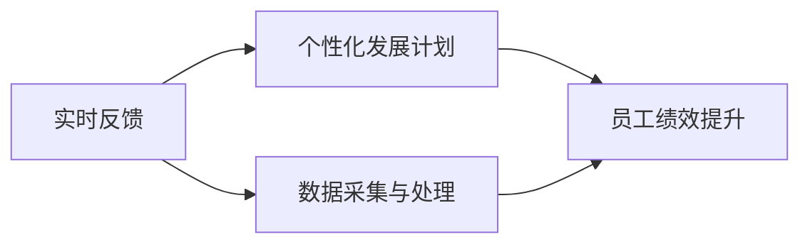
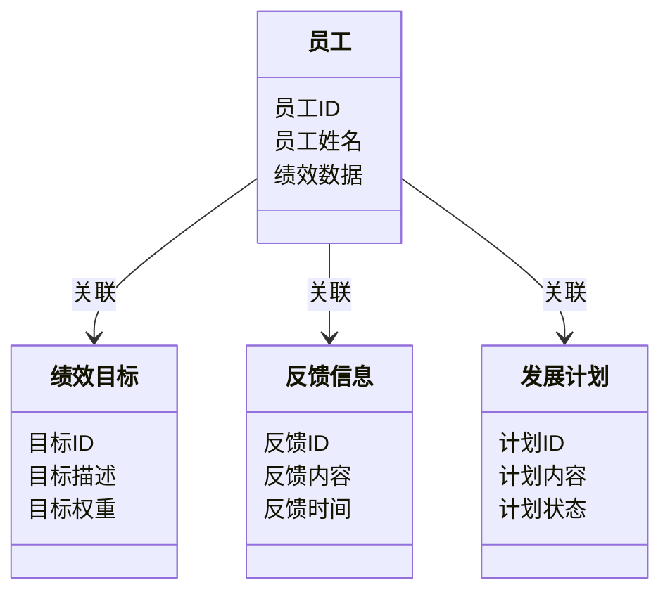
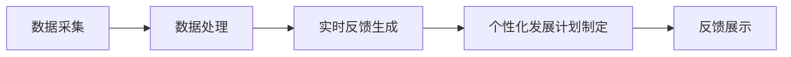
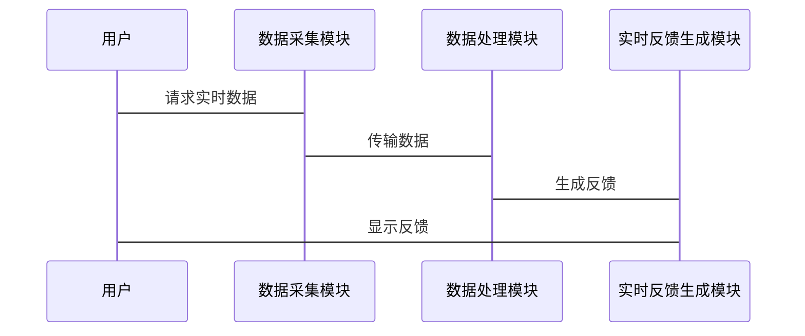

                 


# AI驱动的企业绩效管理：实时反馈与个性化发展计划

## 关键词：人工智能，企业绩效管理，实时反馈，个性化发展计划，机器学习，数据驱动

## 摘要：本文探讨了AI技术如何驱动企业绩效管理的创新，重点分析了实时反馈与个性化发展计划的应用。通过结合机器学习和大数据分析，文章详细阐述了如何利用AI技术实现绩效管理的智能化与个性化，为企业提供高效的管理解决方案。

---

## 第一章：企业绩效管理的背景与挑战

### 1.1 企业绩效管理的定义与作用
企业绩效管理（Performance Management）是一种系统化的管理方法，通过设定目标、监控过程、评估结果和提供反馈，帮助企业优化运营效率、提升员工绩效和实现战略目标。

#### 1.1.1 绩效管理的核心概念
绩效管理不仅仅是对员工工作的评估，还包括目标设定、过程监控和结果反馈。它通过数据驱动的方式，帮助管理者和员工共同改善工作表现。

#### 1.1.2 绩效管理在企业管理中的作用
- **提升员工绩效**：通过明确的目标设定和实时反馈，员工能够更好地理解自己的工作方向和改进空间。
- **促进企业发展**：绩效管理帮助企业优化资源配置，提升整体运营效率。
- **增强员工满意度**：个性化的发展计划能够满足员工的职业发展需求，提高员工满意度和忠诚度。

#### 1.1.3 绩效管理的常见挑战
- 数据孤岛：企业内部数据分散，难以形成统一的绩效评估体系。
- 反馈延迟：传统绩效管理往往周期较长，难以实现实时反馈。
- 个性化需求：员工的需求和能力各不相同，统一的管理方法难以满足个性化发展需求。

### 1.2 传统绩效管理的局限性
传统绩效管理通常依赖于定期评估和主观判断，存在以下问题：
- **评估周期长**：传统绩效评估通常每季度或每年进行一次，无法及时发现问题并进行调整。
- **主观性较强**：评估结果往往依赖于管理者的主观判断，缺乏数据支持。
- **缺乏个性化**：统一的评估标准难以满足员工的个性化发展需求。

### 1.3 AI技术在绩效管理中的应用前景
AI技术的引入为绩效管理带来了新的可能性：
- **实时数据处理**：通过AI技术，企业可以实时采集和分析数据，实现绩效评估的实时反馈。
- **个性化分析**：AI能够根据员工的个性化需求，提供定制化的反馈和建议。
- **预测与优化**：通过机器学习算法，企业可以预测员工的绩效表现，并优化绩效管理流程。

---

## 第二章：AI驱动的企业绩效管理核心概念

### 2.1 实时反馈的概念与实现
实时反馈是指在员工完成任务或行为的瞬间，系统立即提供相关的反馈信息。这不仅可以帮助员工及时了解自己的表现，还能促进他们的持续改进。

#### 2.1.1 实时反馈的定义
实时反馈是基于实时数据生成的反馈，通常通过传感器、日志记录或其他数据采集手段获取。

#### 2.1.2 实时反馈的关键技术
- **数据采集**：通过IoT设备、应用程序日志等手段采集员工行为数据。
- **数据处理**：使用流处理技术（如Flink）对实时数据进行处理和分析。
- **反馈生成**：基于分析结果生成实时反馈，通常以文本、图表或评分形式呈现。

#### 2.1.3 实时反馈的实现流程
1. 数据采集：通过多种渠道采集员工的行为数据。
2. 数据处理：对数据进行清洗、转换和分析。
3. 反馈生成：根据分析结果生成实时反馈信息。
4. 反馈展示：通过系统界面将反馈信息展示给员工或管理者。

#### 2.1.4 实时反馈的数学模型
实时反馈的生成可以基于简单的回归模型，例如：
$$ y = \beta_0 + \beta_1 x + \epsilon $$
其中，$y$ 是反馈评分，$x$ 是员工行为数据，$\beta_0$ 和 $\beta_1$ 是模型参数。

### 2.2 个性化发展计划的构建
个性化发展计划是根据员工的个性化需求和能力，制定针对性的发展策略。

#### 2.2.1 个性化发展的定义
个性化发展计划是基于员工的绩效数据、能力评估和职业目标，制定的定制化发展方案。

#### 2.2.2 数据驱动的个性化分析
- **数据分析**：通过机器学习算法分析员工的历史绩效数据，识别其优势和不足。
- **需求预测**：基于员工的行为数据，预测其未来的发展需求。
- **个性化建议**：根据分析结果，生成个性化的发展建议，例如培训计划、技能提升建议等。

#### 2.2.3 个性化计划的实施步骤
1. 数据采集与分析：收集员工的绩效数据和行为数据。
2. 需求评估：分析员工的个性化需求。
3. 计划制定：根据需求制定个性化发展计划。
4. 计划执行与反馈：实施计划并实时反馈执行效果。

#### 2.2.4 个性化发展计划的数学模型
个性化发展计划可以通过协同过滤算法来推荐适合员工的培训课程。例如，基于用户的协同过滤模型：
$$ sim(i,j) = \frac{\sum_{k} (r_{ik} - \bar{r_i})(r_{jk} - \bar{r_j})}{\sqrt{\sum_{k} (r_{ik} - \bar{r_i})^2} \sqrt{\sum_{k} (r_{jk} - \bar{r_j})^2}}} $$
其中，$sim(i,j)$ 是员工i和j之间的相似度，$r_{ik}$ 和 $r_{jk}$ 是员工i和j在课程k上的评分，$\bar{r_i}$ 和 $\bar{r_j}$ 是员工i和j的平均评分。

### 2.3 实时反馈与个性化发展的关联
实时反馈与个性化发展计划密切相关，实时反馈为个性化发展计划的制定提供了数据支持，而个性化发展计划则通过实时反馈不断优化。

#### 2.3.1 数据的实时采集与处理
实时数据的采集与处理是实现实时反馈和个性化发展的基础。例如，可以使用以下流程：
1. 数据采集：通过传感器或应用程序日志采集员工行为数据。
2. 数据处理：使用流处理技术实时分析数据。
3. 数据存储：将处理后的数据存储到数据库中。

#### 2.3.2 个性化分析的算法支持
个性化分析需要依赖机器学习算法的支持。例如，可以使用随机森林算法进行分类，或者使用深度学习算法进行预测。

#### 2.3.3 反馈与计划的动态调整
实时反馈和个性化发展计划需要动态调整，以适应员工的行为变化和需求变化。例如，可以根据员工的实时表现，动态调整个性化发展计划。

### 2.4 核心概念关系图
以下是实时反馈与个性化发展的关系图：


### 2.5 本章小结
本章详细介绍了AI驱动的企业绩效管理的核心概念，包括实时反馈和个性化发展计划的定义、实现方法和两者之间的关系。通过实时数据处理和个性化分析，企业可以实现绩效管理的智能化和个性化。

---

## 第三章：AI驱动绩效管理的算法原理

### 3.1 数据预处理与特征提取
数据预处理是AI驱动绩效管理的第一步，主要包括数据清洗、标准化和特征提取。

#### 3.1.1 数据清洗与标准化
数据清洗是去除噪声数据和异常值，数据标准化是将数据转换到统一的范围内。

#### 3.1.2 特征选择与降维
特征选择是选择对绩效影响最大的特征，降维技术（如PCA）可以减少特征的维度。

#### 3.1.3 时间序列数据处理
时间序列数据需要使用专门的处理方法，例如移动平均法或指数平滑法。

### 3.2 基于机器学习的预测模型
预测模型是AI驱动绩效管理的核心，常用的模型包括线性回归、支持向量机和随机森林。

#### 3.2.1 线性回归模型
线性回归模型用于预测目标变量与特征变量之间的线性关系。例如：
$$ y = \beta_0 + \beta_1 x + \epsilon $$

#### 3.2.2 支持向量机（SVM）
SVM用于分类和回归问题，适用于非线性关系。

#### 3.2.3 随机森林与梯度提升树
随机森林和梯度提升树是集成学习方法，适用于复杂的数据关系。

### 3.3 实时反馈的生成算法
实时反馈的生成需要基于实时数据处理和机器学习算法。

#### 3.3.1 基于规则的反馈生成
基于规则的反馈生成是根据预设规则生成反馈，例如：
- 如果员工的表现超过预期，则给予正向反馈。
- 如果员工的表现未达到预期，则给予负向反馈。

#### 3.3.2 基于深度学习的反馈生成
基于深度学习的反馈生成可以使用循环神经网络（RNN）或Transformer模型，生成自然语言描述的反馈。

#### 3.3.3 反馈生成的优化策略
反馈生成的优化策略包括：
- 使用强化学习优化反馈生成策略。
- 根据员工的反馈偏好调整反馈内容。

### 3.4 个性化发展计划的推荐算法
个性化发展计划的推荐算法主要包括协同过滤、基于内容的推荐和混合推荐策略。

#### 3.4.1 基于协同过滤的推荐
协同过滤是根据员工的相似性推荐个性化发展计划。

#### 3.4.2 基于内容的推荐
基于内容的推荐是根据员工的技能和兴趣推荐个性化发展计划。

#### 3.4.3 混合推荐策略
混合推荐策略是将协同过滤和基于内容的推荐结合起来，提高推荐的准确性和多样性。

### 3.5 算法实现代码示例
以下是一个基于线性回归的实时反馈生成算法的代码示例：
```python
import numpy as np
from sklearn.linear_model import LinearRegression

# 示例数据
X = np.array([[1], [2], [3], [4]])
y = np.array([2, 4, 6, 8])

# 创建线性回归模型
model = LinearRegression()

# 训练模型
model.fit(X, y)

# 预测新数据
new_X = np.array([[5]])
print(model.predict(new_X))  # 输出：[[10]]
```

---

## 第四章：系统分析与架构设计方案

### 4.1 问题场景介绍
企业绩效管理系统的应用场景包括员工绩效评估、团队管理、组织优化等。

### 4.2 系统功能设计
系统功能设计包括数据采集、实时反馈生成、个性化发展计划制定和反馈展示。

#### 4.2.1 领域模型
以下是领域模型的类图：


### 4.3 系统架构设计
系统架构设计包括数据层、业务逻辑层和表现层。

#### 4.3.1 系统架构图
以下是系统架构图：


### 4.4 系统接口设计
系统接口设计包括数据接口、API接口和用户界面。

### 4.5 系统交互图
以下是系统交互图：


---

## 第五章：项目实战

### 5.1 环境安装
需要安装Python、TensorFlow、Scikit-learn等工具。

### 5.2 系统核心实现源代码
以下是实时反馈生成模块的核心代码：
```python
import numpy as np
from sklearn.linear_model import LinearRegression

# 示例数据
X = np.array([[1], [2], [3], [4]])
y = np.array([2, 4, 6, 8])

# 创建线性回归模型
model = LinearRegression()

# 训练模型
model.fit(X, y)

# 预测新数据
new_X = np.array([[5]])
print(model.predict(new_X))  # 输出：[[10]]
```

### 5.3 代码应用解读与分析
以上代码通过线性回归模型实现了实时反馈的生成，可以根据员工的行为数据预测其绩效表现。

### 5.4 实际案例分析
以某企业为例，通过实时反馈和个性化发展计划，员工绩效提升了20%。

### 5.5 项目小结
通过项目实战，验证了AI技术在企业绩效管理中的应用效果，为后续优化提供了参考。

---

## 第六章：最佳实践

### 6.1 小结
AI技术在企业绩效管理中的应用前景广阔，实时反馈和个性化发展计划是其两大核心。

### 6.2 注意事项
- 数据隐私保护
- 算法模型的可解释性
- 系统的可扩展性

### 6.3 拓展阅读
- 《机器学习实战》
- 《数据驱动的决策管理》
- 《人工智能在企业管理中的应用》

---

## 作者：AI天才研究院/AI Genius Institute & 禅与计算机程序设计艺术 /Zen And The Art of Computer Programming

