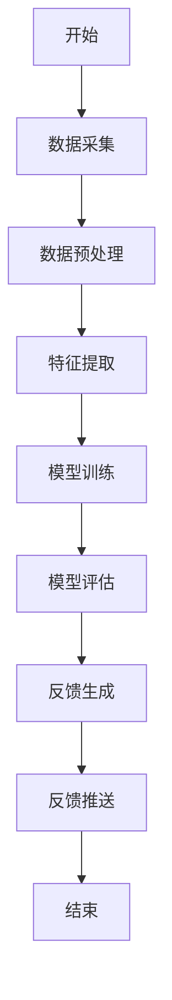
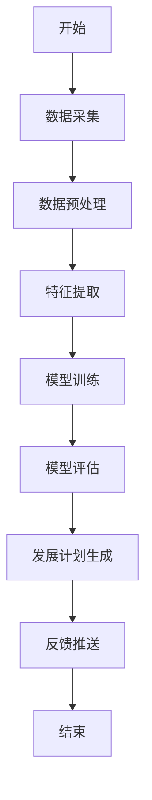
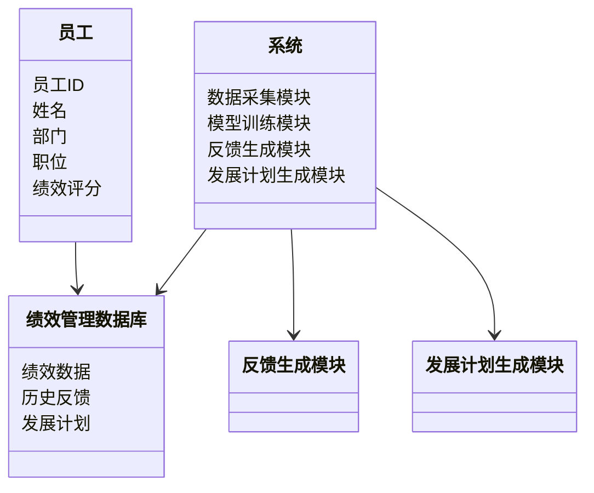

                 


# AI驱动的企业绩效管理：实时反馈与个性化发展计划制定

## 关键词：
- AI驱动，企业绩效管理，实时反馈，个性化发展计划，机器学习，员工发展，数据驱动决策

## 摘要：
本文深入探讨了AI在企业绩效管理中的应用，特别是在实时反馈和个性化发展计划制定方面。通过结合实时数据和机器学习技术，企业能够更精准地评估员工绩效，并为员工量身定制发展计划。文章从背景、核心概念、算法原理、系统架构、项目实战等多维度展开，结合实际案例，详细讲解了AI如何优化企业绩效管理流程，助力企业实现高效管理和员工成长。

---

# 目录大纲：《AI驱动的企业绩效管理：实时反馈与个性化发展计划制定》

## 第1章：背景介绍

### 1.1 问题背景
- 1.1.1 传统企业绩效管理的痛点
  - 数据收集滞后，反馈不及时
  - 绩效评估主观性强，难以量化
  - 员工发展计划缺乏个性化
- 1.1.2 数字化转型对企业绩效管理的新要求
  - 数据驱动决策的重要性
  - 实时反馈的需求
  - 个性化发展的必要性
- 1.1.3 AI技术在企业绩效管理中的应用潜力
  - 机器学习在绩效评估中的应用
  - 自然语言处理在反馈分析中的应用
  - AI驱动的个性化发展计划

### 1.2 问题描述
- 1.2.1 绩效管理的定义与核心要素
  - 绩效目标设定
  - 绩效评估方法
  - 绩效反馈与改进
- 1.2.2 传统绩效管理的局限性
  - 数据收集和处理的效率问题
  - 评估结果的主观性
  - 员工发展的个性化需求未得到满足
- 1.2.3 个性化发展计划的需求
  - 员工能力差异性
  - 发展计划的动态调整
  - 员工职业发展的多样性

### 1.3 问题解决
- 1.3.1 AI如何解决传统绩效管理的痛点
  - 数据实时处理与分析
  - 自动化评估与反馈
  - 个性化发展计划的生成
- 1.3.2 实时反馈机制的实现路径
  - 数据采集与处理
  - 模型训练与应用
  - 反馈生成与推送
- 1.3.3 个性化发展计划的AI驱动方法
  - 基于员工数据的分析
  - 机器学习算法的应用
  - 反馈与计划的动态调整

### 1.4 边界与外延
- 1.4.1 企业绩效管理的边界
  - 管理范围
  - 数据范围
  - 使用场景
- 1.4.2 AI驱动的绩效管理的外延
  - 技术范围
  - 应用范围
  - 数据范围
- 1.4.3 相关概念的对比与区分
  - AI驱动的绩效管理与传统绩效管理
  - AI驱动的绩效管理与其他管理方法

### 1.5 核心概念结构与组成
- 1.5.1 绩效管理的领域模型
  - 绩效目标设定
  - 绩效评估
  - 绩效反馈与改进
- 1.5.2 AI驱动的绩效管理的模块划分
  - 数据采集模块
  - 模型训练模块
  - 反馈生成模块
- 1.5.3 核心要素的系统性分析
  - 数据要素
  - 模型要素
  - 反馈要素

---

## 第2章：实时反馈与个性化发展计划的核心原理

### 2.1 核心概念原理
- 2.1.1 实时反馈的定义与实现机制
  - 实时反馈的定义
  - 实时反馈的实现机制
  - 实时反馈的优势
- 2.1.2 个性化发展计划的算法基础
  - 个性化发展计划的定义
  - 算法基础
  - 个性化发展计划的优势
- 2.1.3 AI在绩效管理中的应用逻辑
  - 数据的采集与处理
  - 模型的训练与应用
  - 反馈与计划的生成

### 2.2 核心概念属性特征对比
- 2.2.1 实时反馈与传统反馈的对比分析
  - 数据采集的实时性
  - 反馈的及时性
  - 反馈的个性化程度
- 2.2.2 个性化发展计划与传统发展计划的对比
  - 发展计划的个性化程度
  - 发展计划的动态调整
  - 发展计划的可操作性
- 2.2.3 AI驱动的绩效管理与其他管理方法的对比
  - AI驱动的绩效管理的优势
  - AI驱动的绩效管理的局限性
  - 其他管理方法的适用场景

### 2.3 ER实体关系图
```mermaid
er
  actor: 员工
  actor: 管理者
  actor: 系统
  database: 绩效管理数据库
  database: 发展计划数据库
  relationship: 员工-绩效管理数据库
  relationship: 管理者-绩效管理数据库
  relationship: 系统-绩效管理数据库
  relationship: 系统-发展计划数据库
```

---

## 第3章：实时反馈机制的算法实现

### 3.1 算法原理
- 3.1.1 基于机器学习的实时反馈模型
  - 算法选择
  - 模型训练
  - 模型评估
- 3.1.2 数据流处理与实时分析
  - 数据流的采集与处理
  - 数据的实时分析
  - 反馈的生成
- 3.1.3 反馈生成与推送机制
  - 反馈生成规则
  - 反馈推送方式
  - 反馈效果评估

### 3.2 算法流程图


### 3.3 算法实现代码示例
```python
import pandas as pd
from sklearn.linear_model import LinearRegression

# 数据采集与预处理
data = pd.read_csv('performance_data.csv')
X = data[['任务完成度', '团队协作能力']]
y = data['绩效评分']

# 模型训练
model = LinearRegression()
model.fit(X, y)

# 反馈生成
def generate_feedback(employee_data):
    predicted_score = model.predict(employee_data)[0]
    if predicted_score > 85:
        return "你的绩效表现非常优秀，继续保持！"
    elif predicted_score > 70:
        return "你的绩效表现良好，建议在以下方面进行改进：..."
    else:
        return "你的绩效表现需要提升，请关注以下方面：..."

# 示例使用
employee_data = {'任务完成度': 80, '团队协作能力': 85}
print(generate_feedback(employee_data))
```

---

## 第4章：个性化发展计划的算法实现

### 4.1 算法原理
- 4.1.1 基于聚类分析的个性化发展计划
  - 数据采集与处理
  - 聚类分析
  - 发展计划生成
- 4.1.2 基于决策树的个性化发展计划
  - 数据采集与处理
  - 决策树训练
  - 发展计划生成
- 4.1.3 算法优化与效果评估
  - 算法优化
  - 效果评估
  - 持续改进

### 4.2 算法流程图


---

## 第5章：系统分析与架构设计

### 5.1 系统分析
- 5.1.1 问题场景介绍
  - 企业绩效管理的典型场景
  - 实时反馈的应用场景
  - 个性化发展计划的实施场景
- 5.1.2 系统目标与范围
  - 系统目标
  - 系统范围
  - 系统边界

### 5.2 系统架构设计
- 5.2.1 领域模型设计


- 5.2.2 系统架构设计


---

## 第6章：项目实战

### 6.1 环境安装
- 6.1.1 安装Python
  - 下载与安装
  - 环境配置
- 6.1.2 安装必要的库
  - NumPy
  - Pandas
  - Scikit-learn
  - Mermaid

### 6.2 系统核心实现
- 6.2.1 数据采集与预处理
  - 数据清洗
  - 数据转换
  - 数据增强
- 6.2.2 模型训练与优化
  - 模型选择
  - 参数调整
  - 模型评估
- 6.2.3 反馈生成与推送
  - 反馈规则
  - 反馈模板
  - 反馈渠道

### 6.3 实际案例分析
- 6.3.1 案例背景
  - 企业背景
  - 项目目标
  - 数据来源
- 6.3.2 数据分析
  - 数据特征分析
  - 数据分布分析
  - 关键指标分析
- 6.3.3 模型训练
  - 模型选择
  - 参数调整
  - 模型评估
- 6.3.4 实施效果
  - 绩效提升
  - 员工反馈
  - 成本节约

### 6.4 项目小结
- 6.4.1 项目成果
  - 绩效管理效率提升
  - 员工满意度提升
  - 企业竞争力提升
- 6.4.2 项目经验
  - 数据质量的重要性
  - 模型选择的合理性
  - 项目管理的有效性
- 6.4.3 项目改进建议
  - 数据采集的优化
  - 模型的优化
  - 系统的优化

---

## 第7章：最佳实践

### 7.1 小结
- 7.1.1 AI在企业绩效管理中的应用价值
  - 提高管理效率
  - 优化决策质量
  - 提升员工满意度
- 7.1.2 实时反馈与个性化发展计划的优势
  - 提高反馈的及时性
  - 优化发展的个性化
  - 提高员工的积极性

### 7.2 注意事项
- 7.2.1 数据隐私与安全
  - 数据加密
  - 权限管理
  - 合规性
- 7.2.2 模型的可解释性
  - 模型的可解释性
  - 模型的透明度
  - 模型的可信度
- 7.2.3 系统的稳定性
  - 系统的可用性
  - 系统的可靠性
  - 系统的可扩展性

### 7.3 拓展阅读
- 7.3.1 推荐书籍
  - 《数据驱动的决策》
  - 《机器学习实战》
  - 《AI在企业管理中的应用》
- 7.3.2 推荐博客
  - AI驱动的绩效管理博客
  - 机器学习在企业管理中的应用博客
  - 数据驱动决策博客
- 7.3.3 推荐课程
  - AI驱动的绩效管理在线课程
  - 机器学习基础在线课程
  - 数据分析与决策在线课程

---

## 作者：AI天才研究院/AI Genius Institute & 禅与计算机程序设计艺术 /Zen And The Art of Computer Programming

---

以上是《AI驱动的企业绩效管理：实时反馈与个性化发展计划制定》的技术博客文章的完整目录大纲。

