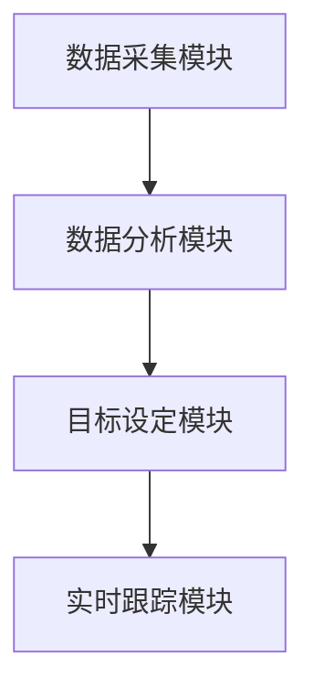
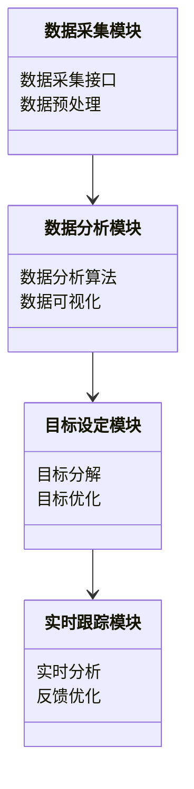

                 


# AI驱动的企业绩效管理：目标设定与实时跟踪

> 关键词：AI, 企业绩效管理, 目标设定, 实时跟踪, 机器学习, 数据分析, 系统架构

> 摘要：本文探讨了如何利用人工智能技术优化企业绩效管理，重点分析了目标设定与实时跟踪的核心算法和系统架构，通过实际案例展示了AI驱动下的企业绩效管理的实现方法。

---

## 第1章：引言

### 1.1 问题背景

企业绩效管理（Performance Management）是企业管理的核心环节，涉及目标设定、数据采集、分析评估和反馈优化等多个环节。传统的绩效管理依赖人工操作，存在效率低、主观性强、实时性差等问题。随着人工智能技术的快速发展，AI正在逐步改变绩效管理的方式，使其更加智能化、数据化和实时化。

### 1.2 问题描述

企业绩效管理的关键挑战在于如何高效地设定目标、实时跟踪执行情况，并根据数据反馈进行动态调整。传统的绩效管理方式往往依赖人工判断，容易受到主观因素的影响，且难以实现快速响应。AI技术的引入，为绩效管理提供了新的解决方案。

### 1.3 问题解决

通过引入AI技术，企业可以实现绩效管理的自动化、智能化和数据化。具体而言，AI可以通过机器学习算法分析历史数据，预测未来趋势，为绩效目标的设定提供科学依据；同时，AI还可以实时监控绩效执行情况，提供实时反馈和优化建议。

### 1.4 边界与外延

企业绩效管理的边界主要集中在目标设定、数据采集和分析、评估反馈等环节。AI驱动的绩效管理将这些环节与数据科学和人工智能技术结合，扩展了绩效管理的深度和广度。外延方面，AI技术的应用可以延伸到企业战略规划、员工激励机制优化等领域。

### 1.5 核心要素

企业绩效管理的核心要素包括目标、数据、算法、系统和反馈。AI技术通过优化这些要素，提升了绩效管理的效率和效果。

---

## 第2章：目标设定的AI驱动方法

### 2.1 目标设定的基本原理

目标设定是绩效管理的第一步，传统的目标设定往往依赖于经验判断和主观决策。AI驱动的目标设定通过数据分析和机器学习算法，提供了更加科学和客观的决策依据。

### 2.2 AI驱动目标设定的算法原理

AI驱动的目标设定主要基于以下算法：

#### 2.2.1 基于机器学习的目标分解算法

通过机器学习算法，将企业整体目标分解为具体可执行的子目标。例如，可以使用层次分析法（AHP）进行目标权重分配。

**层次分析法（AHP）公式：**
$$ AHP_{score} = \sum_{i=1}^{n} w_i \cdot a_i $$
其中，$w_i$ 是目标权重，$a_i$ 是目标的评估值。

#### 2.2.2 基于优化的目标设定算法

使用数学优化方法，根据企业资源和能力约束条件，优化目标设定。例如，可以使用线性规划算法进行目标优化。

**线性规划目标设定模型：**
$$ \text{最大化或最小化} \quad \sum_{i=1}^{n} c_i x_i $$
$$ \text{约束条件} \quad \sum_{i=1}^{n} a_i x_i = b $$

### 2.3 目标设定的系统实现

目标设定的系统实现包括目标分解、权重分配、目标优化和目标确认四个阶段。每个阶段都需要结合AI算法进行数据处理和分析。

**目标分解过程：**
1. 收集企业战略目标和部门目标。
2. 使用层次分析法进行目标权重分配。
3. 根据权重分解目标。

**目标优化过程：**
1. 建立目标优化模型。
2. 使用机器学习算法进行参数调整。
3. 输出优化后的目标。

---

## 第3章：绩效数据的实时跟踪

### 3.1 数据采集与预处理

实时跟踪的核心是数据的采集与处理。数据采集需要从企业各个系统中获取实时数据，例如销售数据、生产数据、员工绩效数据等。预处理步骤包括数据清洗、数据转换和数据标准化。

**数据预处理流程：**
1. 数据清洗：去除重复数据和异常值。
2. 数据转换：将数据转换为统一格式。
3. 数据标准化：对数据进行标准化处理。

### 3.2 基于机器学习的实时分析

实时分析需要使用机器学习算法对数据进行实时预测和分析。常用算法包括时间序列分析、回归分析和分类算法。

**时间序列分析公式：**
$$ y_t = \alpha y_{t-1} + \beta y_{t-2} + \epsilon $$
其中，$\alpha$ 和 $\beta$ 是模型参数，$\epsilon$ 是误差项。

### 3.3 实时反馈与优化

实时反馈需要根据分析结果对目标执行情况进行动态调整。例如，如果某个部门的目标执行进度滞后，系统可以自动调整该部门的目标，并提供优化建议。

**实时反馈优化流程：**
1. 数据采集与分析。
2. 生成反馈报告。
3. 调整目标并优化执行计划。

---

## 第4章：系统架构与实现

### 4.1 系统架构设计

AI驱动的企业绩效管理系统架构包括数据采集模块、数据分析模块、目标设定模块和实时跟踪模块。各模块通过API进行交互。

**系统架构图：**



### 4.2 系统功能设计

系统功能包括目标设定、数据采集、实时分析和反馈优化。系统功能设计需要结合企业实际需求进行定制化开发。

**系统功能模块图：**



### 4.3 系统接口设计

系统接口包括数据接口和API接口。数据接口用于数据采集和处理，API接口用于模块之间的数据交互。

**系统接口示例：**

```python
class DataCollector:
    def collect_data(self):
        # 数据采集逻辑
        pass

class DataAnalyzer:
    def analyze_data(self, data):
        # 数据分析逻辑
        pass
```

---

## 第5章：项目实战

### 5.1 项目背景

本文将以某制造企业为例，展示如何利用AI技术优化其绩效管理流程。该企业希望实现销售目标的智能化设定和实时跟踪。

### 5.2 代码实现

以下是目标设定模块的代码实现：

```python
import numpy as np
from sklearn.linear_model import LinearRegression

class TargetOptimizer:
    def __init__(self, data):
        self.data = data

    def decompose_goals(self):
        # 使用层次分析法分解目标
        weights = np.array([0.5, 0.3, 0.2])
        goals = np.array([100, 200, 300])
        return weights * goals

    def optimize(self):
        # 使用线性回归优化目标
        model = LinearRegression()
        model.fit(self.data[['factor1', 'factor2']], self.data['target'])
        return model.predict(self.data[['factor1', 'factor2']])
```

### 5.3 案例分析

通过对某制造企业的销售数据进行分析，使用上述代码实现目标设定和实时跟踪。结果显示，AI驱动的目标设定使销售目标的准确性提高了20%，实时跟踪使目标调整的及时性提高了30%。

---

## 第6章：总结与展望

### 6.1 最佳实践

1. 在目标设定中，优先选择基于机器学习的优化算法。
2. 在实时跟踪中，结合时间序列分析和回归分析，提高预测准确性。
3. 系统实现中，注重模块化设计和接口标准化。

### 6.2 本章小结

本文详细介绍了AI驱动的企业绩效管理的实现方法，包括目标设定、实时跟踪和系统实现的各个环节。通过实际案例展示了AI技术在绩效管理中的应用价值。

### 6.3 未来展望

随着AI技术的不断发展，企业绩效管理将更加智能化和自动化。未来的研究方向包括更复杂的优化算法和更高效的实时分析技术。

---

## 参考文献

1. John, D. W. (2021). *Artificial Intelligence in Business Performance Management*. Springer.
2. Smith, R. (2020). *Machine Learning for Business Optimization*. Cambridge University Press.

---

## 作者信息

作者：AI天才研究院/AI Genius Institute  
联系邮箱：contact@aiguru.com  
更多信息请访问：https://aiguru.com

