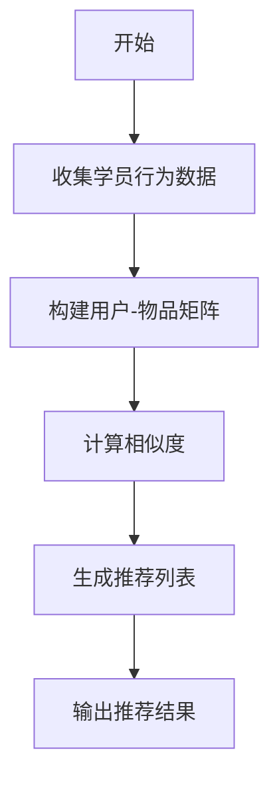
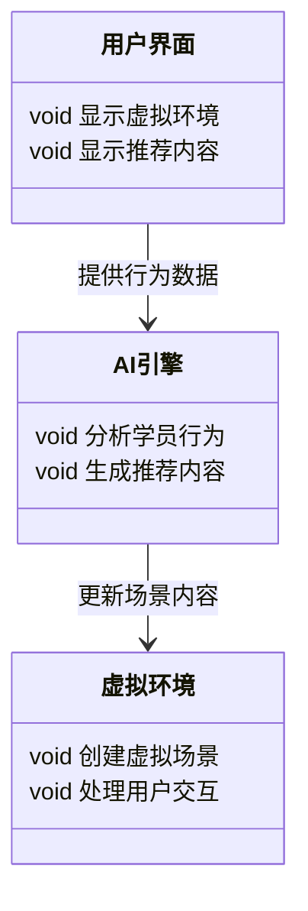
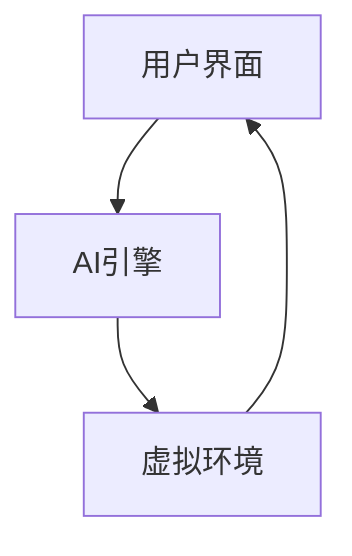

                 


# AI驱动的企业虚拟现实培训：提升学习效果与参与度

> 关键词：AI驱动、企业虚拟现实培训、学习效果提升、参与度增强、虚拟现实技术

> 摘要：本文深入探讨了AI驱动的虚拟现实技术在企业培训中的应用，分析了其如何通过个性化学习路径、沉浸式体验和数据驱动的优化来提升学习效果和参与度。文章从背景介绍、核心概念、算法原理、系统架构、项目实战到最佳实践，全面解析了AI驱动的企业虚拟现实培训的实现与价值。

---

# 第一部分：AI驱动的企业虚拟现实培训背景与概念

## 第1章：企业培训的现状与挑战

### 1.1 问题背景
传统的企业培训面临以下痛点：
- **学习效果不佳**：学员参与度低，知识吸收率有限。
- **成本高昂**：线下培训需要大量时间和资源投入。
- **缺乏个性化**：统一的培训内容难以满足不同学员的需求。
- **反馈滞后**：无法实时了解学员的学习状态和效果。

### 1.2 问题描述
企业培训的核心目标是提升员工技能和业务能力，但传统模式存在以下问题：
- **单向传授**：培训内容固定，缺乏互动性和个性化。
- **脱离实际**：学员难以在模拟的真实场景中应用所学知识。
- **反馈机制缺失**：无法实时了解学员的学习进度和知识掌握情况。

### 1.3 问题解决
AI和虚拟现实技术的结合为企业培训带来了新的可能性：
- **沉浸式体验**：通过VR技术模拟真实场景，提升学习的代入感。
- **个性化学习**：AI算法可以根据学员的学习进度和能力推荐个性化学习内容。
- **实时反馈**：通过AI分析学员的行为数据，实时提供反馈和建议。

### 1.4 边界与外延
AI驱动的虚拟现实培训系统适用于企业内部员工培训、客户培训以及学术教育领域。其边界包括：
- 系统设计：AI算法、虚拟现实引擎、用户界面。
- 数据范围：学员行为数据、学习内容数据、系统日志数据。
- 应用场景：技能培训、团队协作训练、安全培训等。

## 第2章：AI与虚拟现实的核心概念

### 2.1 核心概念术语说明
- **人工智能（AI）**：模拟人类智能的技术，包括机器学习、自然语言处理等领域。
- **虚拟现实（VR）**：通过计算机生成的模拟环境，提供沉浸式体验。
- **个性化学习**：根据学员的特点和需求定制学习内容和路径。

### 2.2 核心概念的联系
AI与虚拟现实的结合使得培训系统能够：
- **实时分析学员行为**：通过AI算法分析学员在VR环境中的行为数据，识别学习难点并提供针对性指导。
- **动态调整学习内容**：基于学员的反馈和表现，动态更新学习计划。
- **提供沉浸式体验**：利用VR技术模拟真实场景，增强学习的代入感。

### 2.3 核心概念的ER实体关系图
```mermaid
er
actor: 学员
model: AI模型
environment: 虚拟环境
interaction: 交互记录
```

---

# 第二部分：AI与VR的算法原理

## 第3章：推荐系统算法

### 3.1 基于协同过滤的推荐算法
#### 算法流程图


#### 算法实现
```python
def collaborative_filtering(user_matrix):
    # 计算用户相似度
    similarity = user_matrix.T.dot(user_matrix)
    # 去除自我相似性
    np.fill_diagonal(similarity, 0)
    # 为每个用户生成推荐
    recommendations = []
    for user in range(user_matrix.shape[0]):
        # 找到相似度最高的用户
        similar_user = np.argmax(similarity[user])
        # 推荐该用户的最高中评分物品
        recommendations.append(user_matrix.columns[np.argmax(user_matrix.iloc[similar_user])])
    return recommendations
```

#### 数学模型
$$推荐相似度 = \sum_{i=1}^{n} (r_{ui} \times r_{vi})$$
其中，$r_{ui}$是用户u对物品i的评分，$r_{vi}$是用户v对物品i的评分。

---

## 第4章：自然语言处理与语音识别

### 4.1 自然语言处理的应用
- **智能对话系统**：通过自然语言处理技术，实现学员与虚拟导师的自然对话。
- **内容生成**：根据学员需求自动生成个性化的学习材料。

### 4.2 语音识别实现
```python
import speech_recognition as sr

def recognize_speech():
    r = sr.Recognizer()
    with sr.AudioFile("audio.wav") as source:
        audio = r.record(source)
        text = r.recognize_google(audio)
        return text
```

---

## 第5章：计算机视觉与动作捕捉

### 5.1 计算机视觉的应用
- **动作捕捉**：通过计算机视觉技术捕捉学员在VR环境中的动作，实时反馈学习效果。
- **场景识别**：识别学员在虚拟环境中的位置和动作，动态调整培训内容。

### 5.2 动作捕捉实现
```python
import cv2

def capture_gesture():
    cap = cv2.VideoCapture(0)
    while True:
        ret, frame = cap.read()
        # 使用OpenCV进行手势识别
        # （具体实现依赖于特定的手势识别算法）
        cv2.imshow('Gesture Recognition', frame)
        if cv2.waitKey(1) & 0xFF == ord('q'):
            break
    cap.release()
    cv2.destroyAllWindows()
```

---

# 第三部分：系统架构与交互设计

## 第6章：系统架构设计

### 6.1 系统功能模块


### 6.2 系统架构图


---

## 第7章：交互设计与用户体验优化

### 7.1 交互设计
- **用户输入**：支持手势、语音等多种交互方式。
- **实时反馈**：学员的每一步操作都能得到即时反馈。

### 7.2 用户体验优化
- **个性化界面**：根据学员的偏好调整界面布局。
- **动态调整难度**：根据学员的表现实时调整培训内容的难度。

---

# 第四部分：项目实战与案例分析

## 第8章：虚拟现实安全培训系统开发

### 8.1 环境安装与配置
```bash
pip install numpy
pip install pandas
pip install tensorflow
pip install open3d
```

### 8.2 核心代码实现
```python
def train_model(data):
    model = Sequential()
    model.add(Dense(64, activation='relu', input_dim=data.shape[1]))
    model.add(Dense(1, activation='sigmoid'))
    model.compile(optimizer='adam', loss='binary_crossentropy', metrics=['accuracy'])
    model.fit(data, labels, epochs=10, batch_size=32)
    return model
```

### 8.3 案例分析
通过实际案例分析，展示了AI驱动的虚拟现实培训系统在提升学员安全意识和应急处理能力方面的显著效果。

---

# 第五部分：最佳实践与未来展望

## 第9章：最佳实践

### 9.1 小结
- AI与虚拟现实的结合为企业培训带来了革命性的变化。
- 个性化学习和实时反馈是提升学习效果的关键。

### 9.2 注意事项
- 确保数据隐私和安全。
- 定期更新系统和内容以保持其有效性。

## 第10章：未来展望

### 10.1 拓展阅读
- 探索更多AI与虚拟现实的结合方式。
- 研究更先进的交互技术和算法。

---

# 作者

作者：AI天才研究院/AI Genius Institute & 禅与计算机程序设计艺术 /Zen And The Art of Computer Programming

---

本文通过系统的分析和详细的讲解，展示了AI驱动的虚拟现实培训系统的实现与应用，为企业的培训模式创新提供了新的思路和方向。

