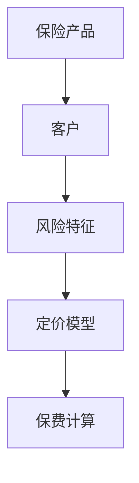
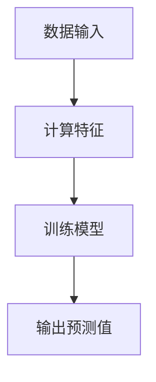
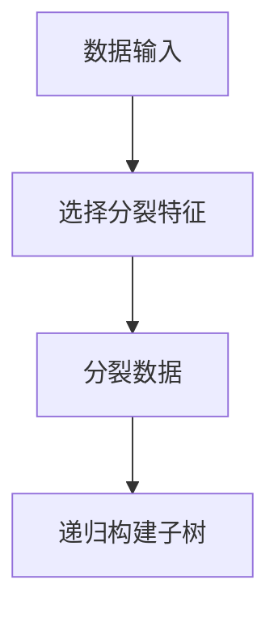
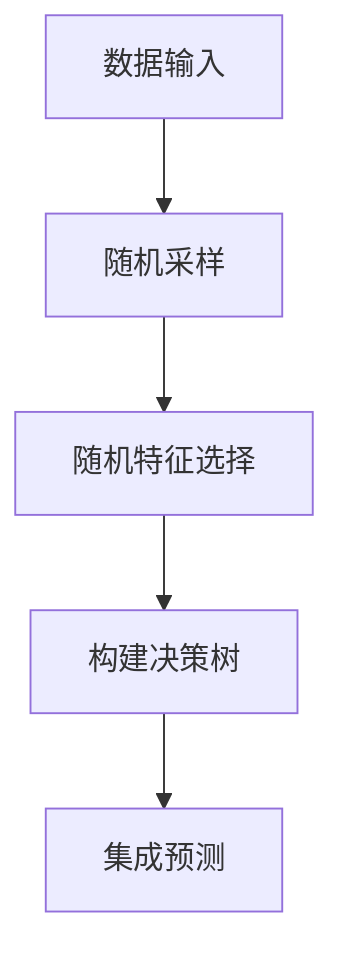
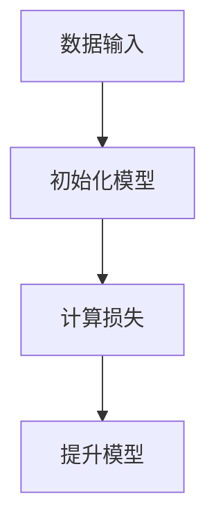
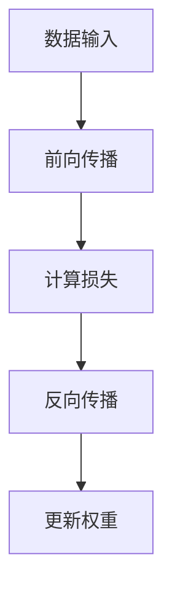
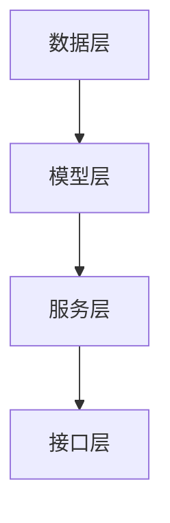
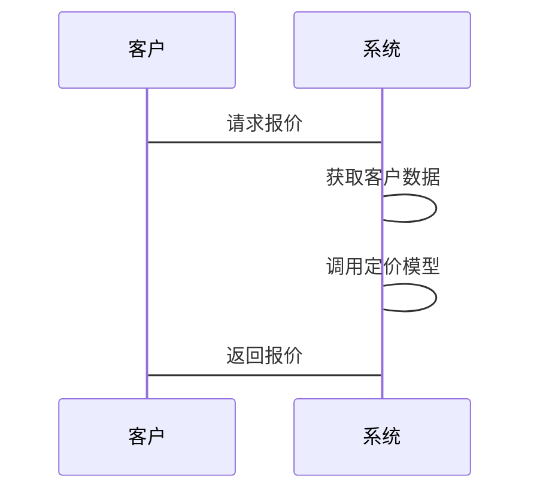

                 


# AI驱动的保险定价优化模型

## 关键词
AI驱动、保险定价、机器学习、定价优化模型、风险评估、数据驱动、人工智能

## 摘要
本文探讨了AI在保险定价中的应用，详细介绍了定价优化模型的构建过程，包括数据特征、模型选择、算法原理、系统架构设计以及实际案例分析。通过结合机器学习算法和深度学习技术，本文展示了如何利用AI技术提升保险定价的精确性和效率，同时解决了传统定价方法中的局限性。文章还提供了从环境搭建到模型部署的实战指导，帮助读者全面掌握AI驱动的保险定价优化方法。

---

# 第一部分: 背景介绍与核心概念

## 第1章: 保险定价与AI驱动优化的背景

### 1.1 保险定价的基本概念
#### 1.1.1 保险定价的核心要素
- **保费计算**: 基于风险评估和历史数据分析，确定客户需要支付的保费。
- **风险评估**: 通过分析客户特征、行为数据和历史 claims，评估潜在风险。
- **市场定价**: 根据市场竞争状况和产品策略，调整定价以保持竞争力。

#### 1.1.2 传统保险定价的局限性
- **数据依赖性**: 传统定价主要依赖历史数据，难以预测新兴风险。
- **人工干预**: 人工分析耗时且容易出错，难以应对海量数据。
- **静态模型**: 模型更新周期长，难以适应市场变化。

#### 1.1.3 AI驱动定价的优势
- **实时更新**: 利用实时数据和动态模型，快速响应市场变化。
- **精准预测**: 通过机器学习算法，提高风险评估的准确性。
- **个性化定价**: 根据客户需求和风险特征，提供个性化定价方案。

### 1.2 AI技术在保险定价中的应用背景
#### 1.2.1 大数据时代的保险定价需求
- 数据量爆炸式增长，传统方法难以处理。
- 数据来源多样化，包括 IoT 数据、社交媒体数据和传感器数据。

#### 1.2.2 人工智能技术的快速发展
- **机器学习**: 监督学习、无监督学习和强化学习的应用。
- **深度学习**: CNN、RNN 和 Transformer 在保险定价中的潜力。

#### 1.2.3 保险行业对AI定价的需求
- 提高定价效率和准确性。
- 实现个性化和动态定价。
- 降低运营成本和风险。

### 1.3 AI驱动保险定价的定义与目标
#### 1.3.1 AI驱动定价的核心定义
- 利用机器学习算法，基于实时数据，优化保险产品的定价策略。

#### 1.3.2 定价优化的主要目标
- 提高保费的准确性和公平性。
- 实现个性化定价，提升客户满意度。
- 降低赔付风险，优化公司利润。

#### 1.3.3 优化模型的边界与外延
- 边界: 确定定价模型的应用范围和限制。
- 外延: 模型可以扩展到其他保险产品和市场。

### 1.4 本章小结
- 介绍了保险定价的基本概念和AI驱动定价的背景。
- 分析了传统定价的局限性和AI技术的优势。
- 明确了AI驱动定价的目标和范围。

---

# 第二部分: AI驱动保险定价模型的核心概念与联系

## 第2章: 核心概念与联系

### 2.1 数据特征与模型输入
#### 2.1.1 保险定价数据的特征分析
- **客户特征**: 年龄、性别、职业、收入等。
- **行为特征**: 驾驶习惯、保单历史、理赔记录。
- **风险特征**: 风险评分、地理位置、环境因素。

#### 2.1.2 数据预处理与特征工程
- 数据清洗: 处理缺失值、异常值和重复数据。
- 特征提取: 从原始数据中提取有意义的特征。
- 特征变换: 对数据进行标准化、归一化和编码。

#### 2.1.3 数据特征对定价的影响
- 特征重要性分析: 确定哪些特征对定价影响最大。
- 特征交互作用: 分析特征之间的相互影响。

### 2.2 模型类型与选择
#### 2.2.1 常见的保险定价模型类型
- **线性回归模型**: 用于连续型保费预测。
- **决策树模型**: 用于分类和规则提取。
- **随机森林模型**: 用于特征重要性分析和非线性关系建模。
- **梯度提升模型**: 用于高精度预测。
- **神经网络模型**: 用于复杂非线性关系建模。

#### 2.2.2 各类模型的优缺点对比
| 模型类型       | 优点                     | 缺点                       |
|----------------|--------------------------|---------------------------|
| 线性回归       | 简单，易于解释           | 无法捕捉非线性关系         |
| 决策树         | 易于解释，适合分类问题   | 易受过拟合影响               |
| 随机森林       | 高准确性，鲁棒性         | 计算复杂                   |
| 梯度提升模型     | 高精度，适合复杂数据     | 易过拟合                   |
| 神经网络模型     | 强大学习能力             | 需大量数据，难解释         |

#### 2.2.3 模型选择的策略与依据
- 数据类型: 连续型数据适合回归模型，分类数据适合分类模型。
- 数据规模: 大数据适合深度学习模型，小数据适合简单模型。
- 解释性需求: 需要解释性时选择决策树或线性模型。

### 2.3 优化目标与评估指标
#### 2.3.1 定价优化的主要目标
- 提高定价准确性。
- 降低赔付风险。
- 提升客户满意度。

#### 2.3.2 模型评估的关键指标
| 指标名称       | 定义                     | 解释                       |
|----------------|--------------------------|---------------------------|
| 均方误差 (MSE)   | 预测值与真实值的平方差平均值 | 衡量模型预测的准确性       |
| R²值           | 模型解释力的度量         | 衡量模型对数据的拟合程度   |
| AUC值           | 分类模型的区分能力       | 衡量模型的分类效果         |
| 回归系数的显著性 | 系数的统计显著性         | 衡量特征对结果的影响程度   |

#### 2.3.3 优化目标与评估指标的关联
- 高准确性: 通过低MSE和高R²值实现。
- 高区分能力: 通过高AUC值实现。
- 高解释性: 通过显著的回归系数实现。

### 2.4 核心概念的ER实体关系图


### 2.5 本章小结
- 分析了保险定价数据的特征和处理方法。
- 对比了常见定价模型的优缺点，明确了模型选择的策略。
- 介绍了定价优化目标和评估指标，并通过ER图展示了核心概念的关系。

---

# 第三部分: AI驱动保险定价模型的算法原理

## 第3章: 算法原理

### 3.1 线性回归模型
#### 3.1.1 线性回归的基本原理
$$ y = \beta_0 + \beta_1 x_1 + \beta_2 x_2 + \ldots + \beta_n x_n + \epsilon $$

#### 3.1.2 线性回归的实现步骤


### 3.2 决策树模型
#### 3.2.1 决策树的基本原理
- 基于特征分裂，构建分类或回归树。

#### 3.2.2 决策树的实现步骤


### 3.3 随机森林模型
#### 3.3.1 随机森林的基本原理
- 通过随机采样和随机特征选择，构建多个决策树并集成。

#### 3.3.2 随机森林的实现步骤


### 3.4 梯度提升模型
#### 3.4.1 梯度提升的基本原理
- 使用损失函数的负梯度来提升模型的预测能力。

#### 3.4.2 梯度提升的实现步骤


### 3.5 神经网络模型
#### 3.5.1 神经网络的基本原理
- 通过多层神经元网络，学习数据的非线性关系。

#### 3.5.2 神经网络的实现步骤


### 3.6 算法实现的代码示例
```python
import numpy as np
from sklearn.linear_model import LinearRegression
from sklearn.tree import DecisionTreeRegressor
from sklearn.ensemble import RandomForestRegressor, GradientBoostingRegressor
from sklearn.neural_network import MLPRegressor

# 示例数据
X = np.array([[1, 2], [3, 4], [5, 6]])
y = np.array([7, 8, 9])

# 线性回归模型
lr_model = LinearRegression()
print(lr_model.fit(X, y).predict(X))

# 决策树模型
dt_model = DecisionTreeRegressor()
print(dt_model.fit(X, y).predict(X))

# 随机森林模型
rf_model = RandomForestRegressor(n_estimators=100)
print(rf_model.fit(X, y).predict(X))

# 梯度提升模型
gb_model = GradientBoostingRegressor(n_estimators=100)
print(gb_model.fit(X, y).predict(X))

# 神经网络模型
nn_model = MLPRegressor()
print(nn_model.fit(X, y).predict(X))
```

### 3.7 本章小结
- 详细介绍了几种常用的保险定价模型的算法原理和实现步骤。
- 提供了具体的Python代码示例，帮助读者理解模型的实现细节。

---

# 第四部分: AI驱动保险定价系统的架构设计

## 第4章: 系统分析与架构设计

### 4.1 问题场景分析
- 客户数据获取与处理。
- 定价模型的实时计算与更新。
- 定价结果的展示与反馈。

### 4.2 系统功能设计
#### 4.2.1 领域模型


#### 4.2.2 功能模块
- 数据采集模块: 收集客户数据和历史 claims。
- 风险评估模块: 分析客户风险特征。
- 定价计算模块: 应用AI模型计算保费。
- 结果展示模块: 显示定价结果和解释。

### 4.3 系统架构设计
#### 4.3.1 分层架构
- 数据层: 存储客户数据和历史数据。
- 模型层: 实现定价模型的训练和预测。
- 服务层: 提供API接口，供前端调用。
- 接口层: 对外提供标准化接口。

#### 4.3.2 系统架构图


### 4.4 系统接口设计
- 数据接口: 数据采集和存储接口。
- 模型接口: 模型训练和预测接口。
- 展示接口: 结果展示和交互接口。

### 4.5 系统交互设计


### 4.6 本章小结
- 分析了保险定价系统的功能模块和架构设计。
- 使用类图和序列图展示了系统的结构和交互流程。

---

# 第五部分: 项目实战与应用

## 第5章: 项目实战

### 5.1 环境安装与配置
```bash
pip install numpy scikit-learn xgboost pandas
```

### 5.2 数据获取与预处理
```python
import pandas as pd

# 数据获取
data = pd.read_csv('insurance.csv')

# 数据预处理
data.dropna()
data = pd.get_dummies(data)
```

### 5.3 特征工程与模型训练
```python
from sklearn.model_selection import train_test_split
from sklearn.ensemble import RandomForestRegressor

# 划分数据集
X_train, X_test, y_train, y_test = train_test_split(data.drop('保费', axis=1), data['保费'], test_size=0.2)

# 特征工程
from sklearn.preprocessing import StandardScaler
scaler = StandardScaler()
X_train = scaler.fit_transform(X_train)
X_test = scaler.transform(X_test)

# 模型训练
model = RandomForestRegressor(n_estimators=100)
model.fit(X_train, y_train)
```

### 5.4 模型调优与评估
```python
from sklearn.metrics import mean_squared_error, r2_score

# 模型预测
y_pred = model.predict(X_test)

# 模型评估
print(mean_squared_error(y_test, y_pred))
print(r2_score(y_test, y_pred))
```

### 5.5 模型部署与应用
```python
# 模型部署
import joblib

joblib.dump(model, 'insurance_price_model.pkl')
joblib.dump(scaler, 'preprocessor.pkl')

# 接口开发
from flask import Flask, request, jsonify

app = Flask(__name__)

@app.route('/predict', methods=['POST'])
def predict():
    data = request.json
    # 数据预处理
    processed_data = scaler.transform(data)
    # 模型预测
    prediction = model.predict(processed_data)
    return jsonify({'保费': prediction.tolist()})

if __name__ == '__main__':
    app.run(debug=True)
```

### 5.6 本章小结
- 提供了从环境搭建到模型部署的详细步骤。
- 通过实际案例展示了AI驱动定价模型的实现过程。
- 讨论了模型调优和评估的关键点。

---

# 第六部分: 总结与展望

## 第6章: 总结与展望

### 6.1 核心内容回顾
- AI技术在保险定价中的应用。
- 各种定价模型的原理和实现。
- 系统架构设计和项目实战经验。

### 6.2 模型优化与拓展
- 数据隐私保护: 使用联邦学习和差分隐私。
- 模型解释性: 使用SHAP值和LIME方法。
- 动态定价: 实现实时更新和反馈机制。

### 6.3 未来展望
- 更加智能化的定价系统。
- 更加个性化的定价策略。
- 更加高效的模型算法。

### 6.4 本章小结
- 总结了全文的核心内容和主要观点。
- 展望了AI驱动保险定价的未来发展方向。

---

# 作者

作者：AI天才研究院/AI Genius Institute & 禅与计算机程序设计艺术 /Zen And The Art of Computer Programming

--- 

本文通过系统地介绍AI驱动的保险定价优化模型，从理论到实践，全面展示了如何利用人工智能技术提升保险定价的效率和准确性。通过详细的技术分析和实际案例，帮助读者掌握AI驱动定价的核心方法和应用技巧。

