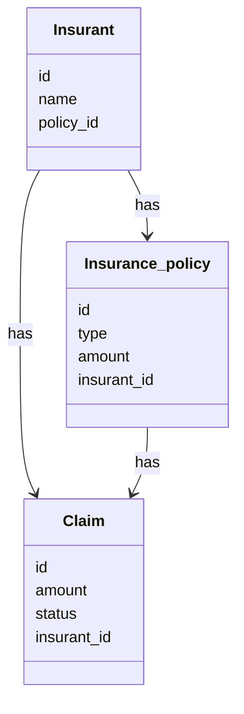
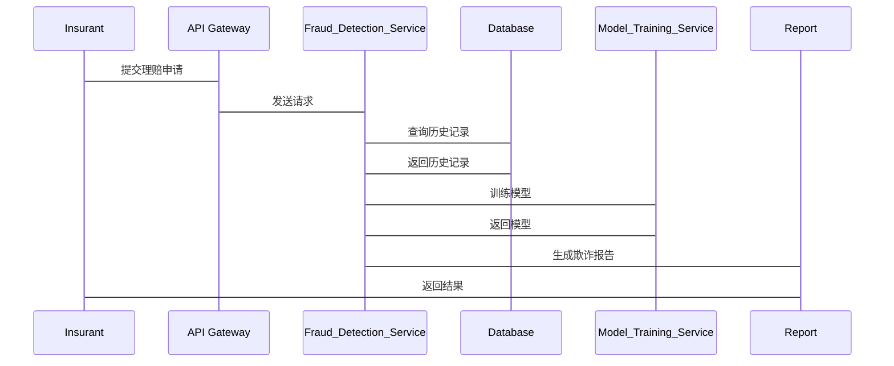

                 


# AI驱动的保险欺诈模式识别

> 关键词：保险欺诈，AI模式识别，机器学习，深度学习，数据挖掘

> 摘要：随着保险行业的快速发展，保险欺诈问题日益严重。传统方法在识别复杂欺诈模式方面存在局限性。本文通过分析AI技术在保险欺诈模式识别中的应用，详细探讨了模式识别的基本原理、算法实现、系统架构设计以及实际项目案例。通过结合聚类、分类和深度学习等算法，本文展示了如何利用AI技术有效识别和预测保险欺诈行为，从而为保险公司提供有力的决策支持。

---

## 第1章: 保险欺诈模式识别的背景与挑战

### 1.1 保险欺诈的现状与问题

#### 1.1.1 保险欺诈的定义与类型
保险欺诈是指通过虚构、夸大或隐瞒事实，骗取保险金的行为。常见的保险欺诈类型包括：

- **虚假理赔**：虚构保险事故或扩大损失程度。
- **重复索赔**：同一事故向多家保险公司重复索赔。
- **故意制造事故**：人为制造保险事故以骗取保险金。

#### 1.1.2 保险欺诈对企业的影响
保险欺诈不仅增加了保险公司的赔付成本，还可能导致保险公司财务亏损和声誉损害。此外，欺诈行为还会增加保险产品的价格，影响消费者的投保意愿。

#### 1.1.3 传统保险欺诈识别的局限性
传统方法主要依赖人工审核和简单的规则匹配，存在以下问题：
- **效率低下**：人工审核耗时长，难以应对海量数据。
- **漏判率高**：规则匹配难以覆盖所有复杂的欺诈模式。
- **成本高昂**：需要大量的人力和时间投入。

### 1.2 AI技术在保险欺诈识别中的作用

#### 1.2.1 AI技术的基本概念
人工智能（AI）是指模拟人类智能的计算机系统，包括学习、推理和自适应等能力。AI技术的核心是通过数据训练模型，从而实现自动化决策。

#### 1.2.2 AI在保险行业中的应用潜力
- **风险评估**：通过分析历史数据，预测潜在风险。
- **理赔自动化**：利用AI技术快速处理理赔申请，减少人工干预。
- **欺诈检测**：通过模式识别技术，识别异常行为。

#### 1.2.3 AI驱动模式识别的优势
- **高效性**：AI技术能够快速处理大量数据，提高欺诈识别效率。
- **准确性**：通过机器学习算法，AI能够识别复杂的欺诈模式，降低漏判率。
- **可扩展性**：AI系统能够轻松扩展，适应不同规模的保险业务。

### 1.3 保险欺诈模式识别的核心问题

#### 1.3.1 欺诈模式识别的定义
欺诈模式识别是指通过分析保险数据，识别出与欺诈行为相关的模式和特征。

#### 1.3.2 欺诈模式识别的关键挑战
- **数据质量**：保险数据可能存在缺失、噪声等问题，影响模型的准确性。
- **模型解释性**：复杂的深度学习模型往往缺乏可解释性，难以满足保险行业的监管要求。
- **数据隐私**：保险数据涉及用户隐私，如何在保护隐私的前提下进行欺诈识别是一个重要问题。

#### 1.3.3 模式识别的边界与外延
保险欺诈模式识别不仅包括对现有欺诈模式的识别，还涉及对未来欺诈行为的预测和预防。

---

## 第2章: 保险欺诈模式识别的核心概念与联系

### 2.1 模式识别的基本原理

#### 2.1.1 模式识别的定义与分类
模式识别是指通过对数据的分析和处理，识别出数据中的模式。根据数据类型，模式识别可以分为图像识别、语音识别和文本识别等。

#### 2.1.2 模式识别的核心要素
- **特征提取**：从数据中提取有用的特征，用于后续的模式分类。
- **分类器设计**：设计分类器，用于将数据分为不同的类别。
- **模型训练**：通过训练数据对模型进行优化，提高分类准确率。

#### 2.1.3 模式识别与保险欺诈的关系
保险欺诈模式识别是模式识别技术在保险行业中的具体应用，通过分析保险数据，识别欺诈行为。

### 2.2 欺诈检测的核心概念

#### 2.2.1 欺诈检测的定义与特点
欺诈检测是指通过技术手段，识别和预防欺诈行为。其特点是实时性、准确性和可扩展性。

#### 2.2.2 欺诈检测的特征分析
- **时间特征**：理赔时间是否异常。
- **金额特征**：理赔金额是否与历史数据相符。
- **行为特征**：客户的投保行为是否异常。

#### 2.2.3 欺诈检测与模式识别的联系
欺诈检测是模式识别的一种具体应用，模式识别技术为欺诈检测提供了理论基础和技术支持。

### 2.3 核心概念的ER实体关系图

```mermaid
erDiagram
    insurant{<--} insurance_policy
    insurance_policy{<--} fraud_detection
    fraud_detection{<--} claim
```

---

## 第3章: 保险欺诈模式识别的算法原理

### 3.1 常见的模式识别算法

#### 3.1.1 聚类算法

##### 3.1.1.1 K-means算法
K-means算法是一种无监督学习算法，用于将数据分成K个簇。其数学模型如下：

$$ \text{目标函数} = \sum_{i=1}^{k} \sum_{j=1}^{n} (x_j - c_i)^2 $$
其中，\( c_i \) 表示第i个聚类中心，\( x_j \) 表示第j个样本。

##### 3.1.1.2 层次聚类算法
层次聚类是一种将数据分成树状结构的聚类方法。其主要步骤如下：
1. 计算样本之间的距离。
2. 根据距离进行层次聚类。
3. 判断聚类结果。

##### 3.1.1.3 DBSCAN算法
DBSCAN是一种基于密度的聚类算法，适用于处理噪声数据。其主要步骤如下：
1. 寻找核心点。
2. 扩展核心点，形成簇。

#### 3.1.2 分类算法

##### 3.1.2.1 决策树算法
决策树是一种基于树状结构的分类算法。其主要步骤如下：
1. 选择特征进行分裂。
2. 建立决策树。
3. 剪枝优化。

##### 3.1.2.2 支持向量机(SVM)
SVM是一种监督学习算法，适用于小样本数据。其数学模型如下：
$$ \text{目标函数} = \sum_{i=1}^{n} \alpha_i y_i (w \cdot x_i + b) + \lambda \|w\|^2 $$
其中，\( \alpha_i \) 是拉格朗日乘子，\( y_i \) 是样本标签，\( w \) 是权重向量，\( b \) 是偏置项，\( \lambda \) 是正则化参数。

##### 3.1.2.3 随机森林算法
随机森林是一种基于决策树的集成算法。其主要步骤如下：
1. 随机选择特征和样本。
2. 建立决策树。
3. 集成预测结果。

#### 3.1.3 深度学习算法

##### 3.1.3.1 卷积神经网络(CNN)
CNN是一种适用于图像识别的深度学习算法。其主要结构包括卷积层、池化层和全连接层。

##### 3.1.3.2 循环神经网络(RNN)
RNN是一种适用于序列数据的深度学习算法，常用于自然语言处理。

##### 3.1.3.3 图神经网络(GNN)
GNN是一种适用于图结构数据的深度学习算法，常用于社交网络分析。

### 3.2 算法原理的数学模型

#### 3.2.1 K-means算法
$$ \text{目标函数} = \sum_{i=1}^{k} \sum_{j=1}^{n} (x_j - c_i)^2 $$

#### 3.2.2 决策树算法
$$ \text{信息增益} = \text{基尼指数} \times \text{分裂后的子节点数} $$

#### 3.2.3 SVM算法
$$ \text{目标函数} = \sum_{i=1}^{n} \alpha_i y_i (w \cdot x_i + b) + \lambda \|w\|^2 $$

---

## 第4章: 保险欺诈模式识别的系统架构设计

### 4.1 系统功能设计

#### 4.1.1 领域模型


#### 4.1.2 系统架构设计
```mermaid
archiDiagram
    client --> API Gateway : 请求
    API Gateway --> Fraud_Detection_Service : 转发请求
    Fraud_Detection_Service --> Database : 查询数据
    Database --> Fraud_Detection_Service : 返回数据
    Fraud_Detection_Service --> Model_Training_Service : 训练模型
    Model_Training_Service --> Database : 更新模型
    Fraud_Detection_Service --> Report : 生成报告
```

#### 4.1.3 系统交互设计


---

## 第5章: 保险欺诈模式识别的项目实战

### 5.1 项目介绍

#### 5.1.1 项目背景
某保险公司希望通过引入AI技术，提高欺诈检测的效率和准确性。

#### 5.1.2 项目目标
实现一个基于AI的保险欺诈检测系统，能够自动识别和预测欺诈行为。

### 5.2 系统核心实现

#### 5.2.1 环境配置
- **Python版本**：3.8+
- **框架选择**：TensorFlow或PyTorch
- **数据存储**：MySQL或MongoDB

#### 5.2.2 代码实现

##### 5.2.2.1 数据预处理
```python
import pandas as pd
import numpy as np

# 加载数据
data = pd.read_csv('claims.csv')

# 删除缺失值
data = data.dropna()

# 标准化处理
from sklearn.preprocessing import StandardScaler
scaler = StandardScaler()
data_scaled = scaler.fit_transform(data)
```

##### 5.2.2.2 模型训练
```python
from sklearn.model_selection import train_test_split
from sklearn.ensemble import RandomForestClassifier

# 划分训练集和测试集
X_train, X_test, y_train, y_test = train_test_split(data_scaled, data['is_fraud'], test_size=0.2)

# 训练模型
model = RandomForestClassifier()
model.fit(X_train, y_train)

# 评估模型
print(model.score(X_test, y_test))
```

##### 5.2.2.3 模型部署
```python
import joblib

# 保存模型
joblib.dump(model, 'fraud_detection_model.pkl')

# 加载模型
model = joblib.load('fraud_detection_model.pkl')
```

### 5.3 项目总结

#### 5.3.1 项目成果
通过AI技术，成功提高了欺诈检测的效率和准确性，降低了保险公司的赔付成本。

#### 5.3.2 经验总结
- 数据预处理是关键，数据质量直接影响模型效果。
- 模型选择需要结合实际业务需求，选择合适的算法。
- 模型部署需要考虑系统的可扩展性和可维护性。

---

## 第6章: 保险欺诈模式识别的未来展望

### 6.1 技术趋势

#### 6.1.1 深度学习的进一步应用
随着深度学习技术的发展，未来可能会有更多的深度学习算法应用于保险欺诈检测。

#### 6.1.2 大数据分析与挖掘
随着数据量的增加，数据分析与挖掘技术将变得更加重要。

#### 6.1.3 数据隐私保护
随着数据隐私保护法规的完善，如何在保护隐私的前提下进行欺诈检测将是一个重要的研究方向。

### 6.2 挑战与机遇

#### 6.2.1 挑战
- **数据隐私**：如何在保护隐私的前提下进行欺诈检测。
- **模型解释性**：如何提高模型的可解释性，满足监管要求。
- **计算资源**：如何在有限的计算资源下，提高模型的效率。

#### 6.2.2 机遇
- **技术创新**：AI技术的不断进步为欺诈检测提供了新的工具和方法。
- **行业需求**：保险行业的快速发展对欺诈检测技术提出了更高的要求。

### 6.3 未来发展方向

#### 6.3.1 技术创新
探索新的AI技术，如图神经网络、强化学习等，应用于保险欺诈检测。

#### 6.3.2 行业合作
加强与保险公司的合作，推动技术的落地应用。

#### 6.3.3 法律法规
关注数据隐私保护法规的变化，确保技术应用符合法律要求。

---

## 作者：AI天才研究院/AI Genius Institute & 禅与计算机程序设计艺术 /Zen And The Art of Computer Programming

---

这篇文章系统地介绍了AI驱动的保险欺诈模式识别的基本原理、算法实现、系统架构设计以及实际项目案例。通过结合聚类、分类和深度学习等算法，展示了如何利用AI技术有效识别和预测保险欺诈行为，为保险公司提供有力的决策支持。希望本文能够为保险行业的欺诈检测提供新的思路和方法。

