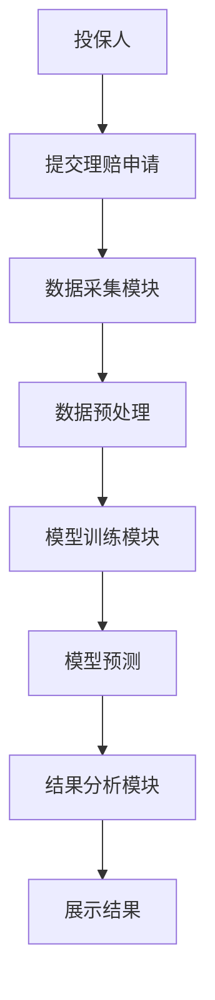

                 


# AI驱动的保险理赔欺诈检测

> 关键词：保险欺诈检测，人工智能，机器学习，深度学习，保险理赔，欺诈识别

> 摘要：本文探讨了人工智能在保险理赔欺诈检测中的应用，从背景、核心技术、算法原理、系统架构到项目实战，详细分析了如何利用AI技术提升保险欺诈检测的效率和准确性。文章通过理论与实践结合的方式，为读者提供了全面的技术视角和实际操作指南。

---

# 第一部分: AI驱动的保险理赔欺诈检测背景与现状

## 第1章: 保险欺诈检测概述

### 1.1 保险欺诈的定义与类型

#### 1.1.1 保险欺诈的定义
保险欺诈是指投保人、被保险人或受益人通过虚构事实、隐瞒真相等手段，骗取保险金的行为。这种行为不仅增加了保险公司的成本，还可能导致保险公司财务损失和声誉损害。

#### 1.1.2 常见的保险欺诈类型
- **虚构保险事故**：投保人故意制造保险事故，如人为纵火、制造交通事故等。
- **夸大损失**：在保险事故发生后，投保人夸大损失程度，以获得更多的保险赔偿。
- **隐瞒既往病史**：在健康保险中，投保人隐瞒自身健康问题，以获得更高的保险金额。
- **重复理赔**：在同一次事故中，通过不同渠道或保险公司重复申请理赔。
- **恶意骗保**：通过频繁投保和退保，利用保险产品的某些特性骗取保费。

#### 1.1.3 保险欺诈的特征与风险
- **隐蔽性**：欺诈行为往往经过精心策划，难以被发现。
- **复杂性**：涉及多个环节和参与者，增加了检测的难度。
- **高成本**：保险公司需要投入大量资源来识别和应对欺诈行为。

### 1.2 保险理赔流程与挑战

#### 1.2.1 保险理赔的基本流程
1. 投保人提交理赔申请。
2. 保险公司接收申请并进行初步审核。
3. 调查人员进行现场调查，核实事故的真实性。
4. 根据调查结果，决定是否赔付以及赔付金额。

#### 1.2.2 传统理赔中的欺诈问题
- **效率低下**：传统理赔流程依赖人工审核，耗时长且效率低。
- **漏判与误判**：人工审核容易受到主观因素影响，导致漏判或误判。
- **成本高昂**：需要投入大量人力和资源进行欺诈检测。

#### 1.2.3 AI在保险理赔中的应用潜力
- **自动化审核**：利用AI技术快速分析理赔申请，减少人工干预。
- **实时监控**：通过AI实时监控理赔数据，及时发现异常行为。
- **精准识别**：通过机器学习模型，提高欺诈检测的准确率。

### 1.3 AI驱动的保险欺诈检测的背景与意义

#### 1.3.1 人工智能在金融领域的应用现状
人工智能技术在金融领域的应用日益广泛，尤其是在风险控制、欺诈检测和客户画像等方面。

#### 1.3.2 保险欺诈检测中的痛点与需求
- **数据量大**：保险行业的数据量庞大，人工审核难以应对。
- **欺诈手段多样化**：欺诈行为不断演变，传统方法难以应对。
- **成本压力**：保险公司需要投入大量资源来应对欺诈问题。

#### 1.3.3 AI技术在保险欺诈检测中的优势
- **高效性**：AI技术能够快速处理大量数据，提高审核效率。
- **准确性**：通过机器学习模型，可以显著提高欺诈检测的准确率。
- **实时性**：AI技术能够实时监控理赔数据，及时发现异常行为。

### 1.4 本章小结
本章介绍了保险欺诈的定义、类型及其在保险理赔中的表现。同时，分析了传统理赔流程中的挑战，并探讨了AI技术在保险欺诈检测中的潜力和优势。

---

## 第2章: 保险欺诈检测的核心技术与方法

### 2.1 保险欺诈检测的关键技术

#### 2.1.1 数据分析与特征提取
数据分析是保险欺诈检测的基础，特征提取是关键。以下是常见的保险欺诈检测特征：

| 特征类型 | 特征描述 | 示例 |
|----------|----------|------|
| 基础信息 | 投保人的基本信息，如年龄、职业 | 被保险人年龄 |
| 投保行为 | 投保人的投保行为，如投保时间、保额 | 投保金额 |
| 理赔记录 | 投保人的理赔历史 | 历史理赔次数 |
| 事故信息 | 事故的时间、地点、类型 | 事故发生时间 |

#### 2.1.2 机器学习与深度学习算法
机器学习和深度学习算法在保险欺诈检测中发挥着重要作用，以下是几种常用的算法：

- **随机森林**：适用于特征较多的情况，能够有效处理非线性关系。
- **XGBoost**：在处理分类问题时表现优异，且易于调参。
- **神经网络**：适用于复杂的数据关系和模式识别。

#### 2.1.3 自然语言处理与知识图谱
自然语言处理（NLP）技术可以帮助分析理赔申请中的文本信息，识别潜在的欺诈意图。知识图谱技术可以用于构建保险领域的知识库，辅助欺诈检测。

### 2.2 基于机器学习的欺诈检测方法

#### 2.2.1 监督学习与无监督学习
- **监督学习**：需要标注的数据集进行训练，适合已知欺诈案例的检测。
- **无监督学习**：适用于未知欺诈模式的检测，能够发现新的欺诈行为。

#### 2.2.2 分流分类与回归分析
- **分流分类**：用于将理赔申请分为正常和欺诈两类。
- **回归分析**：用于预测理赔金额的合理性，识别异常赔付。

#### 2.2.3 集成学习与模型调优
集成学习通过组合多个模型的结果，能够提高检测的准确率。模型调优包括特征选择、参数优化等步骤，是提高模型性能的重要环节。

### 2.3 基于深度学习的欺诈检测方法

#### 2.3.1 神经网络在保险欺诈检测中的应用
神经网络能够处理复杂的非线性关系，适用于高维数据的特征提取和分类任务。

#### 2.3.2 循环神经网络与序列建模
循环神经网络（RNN）适用于处理时间序列数据，如理赔申请的时间顺序分析。

#### 2.3.3 图神经网络与关系网络
图神经网络能够处理图结构数据，适用于分析复杂的关联关系，如投保人之间的关联。

### 2.4 多模态数据融合与保险欺诈检测

#### 2.4.1 文本数据与保险欺诈检测
通过分析理赔申请中的文本信息，识别潜在的欺诈意图。

#### 2.4.2 结构化数据与非结构化数据的融合
将结构化数据（如理赔金额、事故时间）与非结构化数据（如文本描述）结合，提高检测的准确性。

#### 2.4.3 多模态数据融合的优势与挑战
优势：能够全面捕捉欺诈行为的特征。挑战：数据预处理和融合的复杂性较高。

### 2.5 本章小结
本章介绍了保险欺诈检测的核心技术与方法，包括数据分析与特征提取、机器学习与深度学习算法、自然语言处理与知识图谱的应用，以及多模态数据融合的优势与挑战。

---

## 第3章: 保险欺诈检测的算法原理与实现

### 3.1 基于随机森林的欺诈检测算法

#### 3.1.1 随机森林算法的基本原理
随机森林是一种集成学习算法，通过构建多个决策树并进行投票或平均，提高模型的准确性和稳定性。

#### 3.1.2 随机森林在保险欺诈检测中的应用
- **特征重要性分析**：随机森林能够自动评估特征的重要性，帮助识别关键的欺诈特征。
- **模型解释性**：随机森林的模型解释性较强，便于业务人员理解。

#### 3.1.3 算法实现与代码示例
以下是基于随机森林的欺诈检测算法的Python代码示例：

```python
from sklearn.ensemble import RandomForestClassifier
from sklearn.model_selection import train_test_split
from sklearn.metrics import accuracy_score

# 数据准备
X = df.drop('is_fraud', axis=1)
y = df['is_fraud']

# 划分训练集和测试集
X_train, X_test, y_train, y_test = train_test_split(X, y, test_size=0.2, random_state=42)

# 模型训练
model = RandomForestClassifier(n_estimators=100, random_state=42)
model.fit(X_train, y_train)

# 模型预测
y_pred = model.predict(X_test)

# 评估准确率
print("准确率:", accuracy_score(y_test, y_pred))
```

### 3.2 基于XGBoost的欺诈检测算法

#### 3.2.1 XGBoost算法的基本原理
XGBoost是一种基于梯度提升树的算法，能够在训练过程中自动处理缺失值和异常值。

#### 3.2.2 XGBoost在保险欺诈检测中的优势
- **高准确率**：XGBoost在分类任务中表现优异。
- **参数灵活**：可以通过调整参数优化模型性能。

#### 3.2.3 算法实现与代码示例
以下是基于XGBoost的欺诈检测算法的Python代码示例：

```python
import xgboost as xgb

# 数据准备
X = df.drop('is_fraud', axis=1)
y = df['is_fraud']

# 划分训练集和测试集
X_train, X_test, y_train, y_test = train_test_split(X, y, test_size=0.2, random_state=42)

# 模型训练
dtrain = xgb.DMatrix(X_train, label=y_train)
dtest = xgb.DMatrix(X_test, label=y_test)

# 参数设置
params = {
    'n_estimators': 100,
    'learning_rate': 0.1,
    'max_depth': 6,
    'random_state': 42
}

model = xgb.train(params, dtrain)

# 模型预测
y_pred = model.predict(dtest)

# 评估准确率
print("准确率:", accuracy_score(y_test, y_pred))
```

### 3.3 基于神经网络的保险欺诈检测算法

#### 3.3.1 神经网络的基本原理
神经网络是一种模仿人脑结构和功能的计算模型，能够处理复杂的非线性关系。

#### 3.3.2 神经网络在保险欺诈检测中的应用
- **深度学习模型**：如卷积神经网络（CNN）和循环神经网络（RNN）。
- **自动特征提取**：神经网络能够自动提取特征，减少人工特征工程的工作量。

#### 3.3.3 算法实现与代码示例
以下是基于神经网络的欺诈检测算法的Python代码示例：

```python
import numpy as np
from keras.models import Sequential
from keras.layers import Dense, Dropout

# 数据准备
X = df.drop('is_fraud', axis=1)
y = df['is_fraud']

# 划分训练集和测试集
X_train, X_test, y_train, y_test = train_test_split(X, y, test_size=0.2, random_state=42)

# 模型训练
model = Sequential()
model.add(Dense(64, activation='relu', input_dim=X_train.shape[1]))
model.add(Dropout(0.5))
model.add(Dense(1, activation='sigmoid'))

model.compile(loss='binary_crossentropy', optimizer='adam', metrics=['accuracy'])

model.fit(X_train, y_train, epochs=10, batch_size=32, validation_data=(X_test, y_test))

# 模型预测
y_pred = model.predict(X_test)
y_pred = [int(np.round(value)) for value in y_pred]

# 评估准确率
print("准确率:", accuracy_score(y_test, y_pred))
```

### 3.4 本章小结
本章详细介绍了几种常用的保险欺诈检测算法，包括随机森林、XGBoost和神经网络，并通过代码示例展示了它们的实现过程。

---

## 第4章: 保险欺诈检测的系统架构设计

### 4.1 系统功能设计

#### 4.1.1 数据采集与预处理
- **数据来源**：包括投保人信息、理赔记录、事故描述等。
- **数据清洗**：处理缺失值、异常值和重复数据。
- **特征工程**：提取关键特征，如投保金额、理赔次数等。

#### 4.1.2 模型训练与部署
- **模型训练**：基于训练数据，训练保险欺诈检测模型。
- **模型部署**：将模型部署到生产环境，用于实时检测。

#### 4.1.3 结果分析与可视化
- **结果分析**：分析模型的预测结果，评估模型的准确率、召回率等指标。
- **可视化展示**：通过图表展示模型性能和欺诈行为的分布情况。

### 4.2 系统架构设计

#### 4.2.1 系统模块划分
- **数据采集模块**：负责采集和预处理数据。
- **模型训练模块**：负责训练和优化模型。
- **结果分析模块**：负责分析和可视化结果。

#### 4.2.2 系统交互流程
1. 投保人提交理赔申请。
2. 数据采集模块接收并预处理数据。
3. 模型训练模块进行预测，识别欺诈行为。
4. 结果分析模块展示结果，评估模型性能。

#### 4.2.3 系统架构图（Mermaid）



### 4.3 系统接口设计

#### 4.3.1 数据接口
- **输入接口**：接收理赔申请数据。
- **输出接口**：返回欺诈检测结果。

#### 4.3.2 模型接口
- **输入接口**：接收预处理后的数据。
- **输出接口**：返回预测结果。

### 4.4 本章小结
本章详细描述了保险欺诈检测系统的功能设计和架构设计，展示了系统的模块划分和交互流程。

---

## 第5章: 保险欺诈检测的项目实战

### 5.1 项目背景与目标

#### 5.1.1 项目背景
某保险公司希望通过引入AI技术，提高保险欺诈检测的效率和准确性。

#### 5.1.2 项目目标
- 开发一个基于AI的保险欺诈检测系统，能够实时检测理赔申请中的欺诈行为。

### 5.2 项目实施步骤

#### 5.2.1 环境安装
- **安装Python**：版本要求：3.6及以上。
- **安装依赖库**：如scikit-learn、xgboost、keras等。

#### 5.2.2 数据准备
- **数据获取**：从数据库中获取理赔记录。
- **数据清洗**：处理缺失值、异常值和重复数据。
- **特征工程**：提取关键特征，如投保金额、理赔次数等。

#### 5.2.3 模型训练
- **选择算法**：基于随机森林、XGBoost或神经网络。
- **模型训练**：在训练数据上训练模型。
- **模型调优**：通过调整参数优化模型性能。

#### 5.2.4 模型部署
- **部署模型**：将模型部署到生产环境。
- **实时检测**：通过API接口实时检测理赔申请。

#### 5.2.5 模型评估
- **评估指标**：准确率、召回率、F1分数等。
- **结果分析**：分析模型的预测结果，优化模型性能。

### 5.3 项目小结
本章通过实际案例展示了保险欺诈检测项目的实施过程，包括环境安装、数据准备、模型训练和部署等步骤。

---

## 第6章: 总结与展望

### 6.1 总结
本文详细探讨了AI技术在保险欺诈检测中的应用，从背景、核心技术、算法原理到系统架构和项目实战，为读者提供了全面的技术视角和实际操作指南。

### 6.2 未来展望
- **技术进步**：随着AI技术的不断发展，保险欺诈检测将更加智能化和自动化。
- **数据共享**：通过数据共享和合作，提高欺诈检测的准确率。
- **法律法规**：需要制定更加完善的法律法规，规范AI技术的应用。

### 6.3 最佳实践 Tips
- **数据质量**：确保数据的完整性和准确性，是欺诈检测的基础。
- **模型优化**：通过不断优化模型参数和结构，提高检测的准确率。
- **实时监控**：通过实时监控和反馈，及时发现和应对新的欺诈行为。

---

## 作者：AI天才研究院 & 禅与计算机程序设计艺术

---

通过以上内容，您可以逐步完成《AI驱动的保险理赔欺诈检测》这篇文章的撰写。

