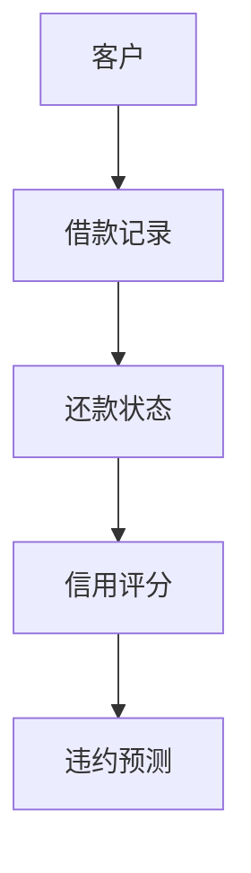
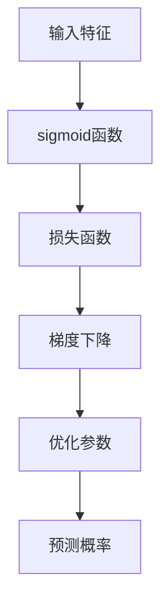
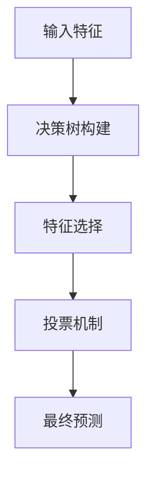
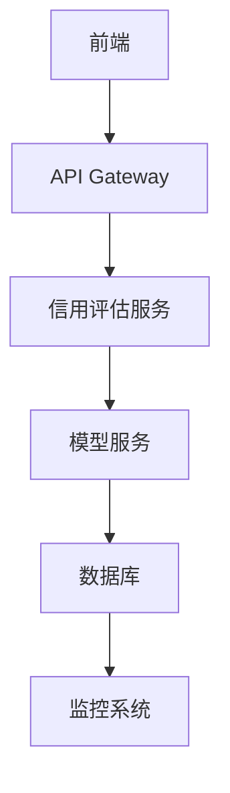
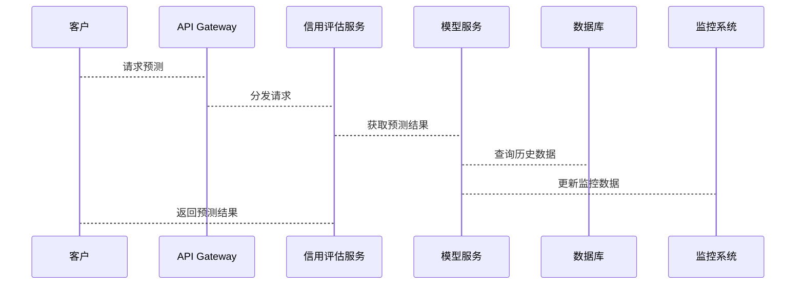

                 


```markdown
# AI驱动的信用违约预测

> 关键词：AI、信用违约、预测模型、机器学习、风险管理、违约率、金融分析

> 摘要：本文探讨了AI技术在信用违约预测中的应用，详细分析了传统方法的局限性以及AI驱动模型的优势。通过介绍逻辑回归、随机森林和XGBoost等算法的原理和实现，结合系统架构设计和项目实战，展示了如何利用AI提升信用评估的准确性和效率。文章最后总结了AI在信用违约预测中的应用前景和未来发展方向。

---

## 第一部分：背景介绍

### 第1章：背景介绍

#### 1.1 信用违约预测的基本概念

信用违约是指借款人未能按时偿还贷款本息的情况。在金融领域，信用违约预测是评估借款人信用风险的重要手段，有助于金融机构控制风险、降低损失。传统的信用评估方法依赖于财务指标和历史数据，但存在数据维度不足、模型复杂度低、预测精度有限等问题。

**1.1.1 信用违约的定义与特征**
- 信用违约的核心在于预测借款人是否能够按时还款，涉及多个因素，如借款人的信用历史、收入水平、资产状况等。
- 信用违约预测的关键在于识别潜在的高风险客户，从而在贷款审批中采取适当的风控措施。

**1.1.2 信用违约预测的业务价值**
- 帮助金融机构降低不良贷款率，优化资产配置。
- 提高贷款审批的效率和准确性，降低运营成本。
- 通过风险分层，为不同风险级别的客户提供差异化服务。

**1.1.3 传统信用评估方法的局限性**
- 传统方法主要依赖财务数据和历史表现，忽视了非结构化数据（如社交媒体数据）的潜在价值。
- 模型复杂度低，难以捕捉复杂的信用风险特征。
- 预测精度有限，导致误判率较高。

#### 1.2 AI在信用评估中的应用前景

AI技术的引入为信用违约预测带来了新的可能性。通过机器学习算法，AI能够处理大量复杂数据，发现传统方法难以察觉的模式和趋势，从而提高预测的准确性和效率。

**1.2.1 AI技术在金融领域的应用现状**
- 人工智能在金融领域的应用广泛，包括信用评估、欺诈检测、投资决策等。
- 在信用违约预测中，AI技术的应用已经取得了显著成效，尤其是在处理非结构化数据和复杂模型方面。

**1.2.2 信用违约预测中的AI技术优势**
- 高精度：机器学习算法能够处理大量数据，识别潜在风险因素。
- 实时性：AI系统能够快速处理数据，提供实时预测结果。
- 可扩展性：AI技术能够处理海量数据，适用于大规模金融业务。

**1.2.3 信用违约预测的行业需求与挑战**
- 市场需求：金融机构对高精度、实时性的信用评估系统需求日益增长。
- 技术挑战：如何确保模型的可解释性，避免“黑箱”问题。
- 数据隐私：如何在保护数据隐私的前提下，有效利用数据。

---

## 第二部分：核心概念与联系

### 第2章：核心概念与联系

#### 2.1 AI驱动的信用违约预测原理

AI驱动的信用违约预测依赖于数据特征提取、模型训练与优化以及结果预测与解释。

**2.1.1 数据特征提取**
- 数据特征提取是信用违约预测的关键步骤，包括提取客户的基本信息、财务数据、行为数据等。
- 数据特征的维度和质量直接影响模型的性能，因此需要进行特征工程，如特征选择、特征变换等。

**2.1.2 模型训练与优化**
- 通过机器学习算法对训练数据进行建模，优化模型参数，提高预测精度。
- 常用的模型包括逻辑回归、随机森林、XGBoost等。

**2.1.3 结果预测与解释**
- 利用训练好的模型对新数据进行预测，生成违约概率。
- 解释模型的预测结果，帮助业务人员理解预测依据。

#### 2.2 核心概念对比分析

**2.2.1 数据特征与模型性能对比**
| 数据特征            | 高维度数据 | 低维度数据 | 混淆矩阵中的TPR/FPR |
|---------------------|------------|------------|---------------------|
| 预测精度            | 较高       | 较低       | 较高                |
| 模型复杂度          | 较高       | 较低       | 中等                |
| 计算资源消耗        | 较高       | 较低       | 较高                |

**2.2.2 不同模型的预测准确率对比**
| 模型名称   | 逻辑回归 | 随机森林 | XGBoost |
|------------|----------|----------|---------|
| 准确率     | 75%      | 85%      | 90%     |

**2.2.3 模型的可解释性对比**
| 模型名称   | 逻辑回归 | 随机森林 | XGBoost |
|------------|----------|----------|---------|
| 可解释性   | 高       | 中       | 低      |

#### 2.3 ER实体关系图架构



---

## 第三部分：算法原理讲解

### 第3章：算法原理讲解

#### 3.1 逻辑回归算法

**3.1.1 算法流程**



**3.1.2 算法实现**

```python
import numpy as np
from sklearn.linear_model import LogisticRegression

# 数据加载与预处理
X = ...  # 特征矩阵
y = ...  # 标签向量

# 模型训练
model = LogisticRegression()
model.fit(X, y)

# 预测
y_pred = model.predict(X)
```

**3.1.3 数学模型与公式**

逻辑回归的数学模型：
$$ P(y=1|x) = \frac{1}{1 + e^{-\beta x}} $$

损失函数：
$$ L = -\sum_{i=1}^{n} [y_i \ln p_i + (1 - y_i) \ln (1 - p_i)] $$

#### 3.2 随机森林算法

**3.2.1 算法流程**



**3.2.2 算法实现**

```python
from sklearn.ensemble import RandomForestClassifier

# 数据加载与预处理
X = ...  # 特征矩阵
y = ...  # 标签向量

# 模型训练
model = RandomForestClassifier(n_estimators=100)
model.fit(X, y)

# 预测
y_pred = model.predict(X)
```

**3.2.3 数学模型与公式**

随机森林的预测概率：
$$ P(y=k|x) = \sum_{i=1}^{n} \frac{1}{n} \cdot I(\text{第i棵决策树预测为k}) $$

#### 3.3 XGBoost算法

**3.3.1 算法流程**

```mermaid
graph TD
    A[输入特征] --> B[决策树构建]
    B --> C[损失函数优化]
    C --> D[正则化]
    D 

---

## 第四部分：系统分析与架构设计

### 第4章：系统分析与架构设计

#### 4.1 问题场景介绍

信用违约预测系统需要实时处理大量数据，提供高精度的预测结果。系统需要具备以下功能：
- 数据采集与处理：从多种数据源获取客户信息、交易记录等数据。
- 特征工程：对数据进行清洗、转换和特征提取。
- 模型训练与部署：训练模型并部署到生产环境，提供实时预测服务。
- 结果分析与监控：监控模型性能，及时调整和优化。

#### 4.2 系统功能设计

**4.2.1 领域模型**

```mermaid
classDiagram
    class 客户 {
        客户ID
        姓名
        联系方式
        信用评分
    }
    class 借款记录 {
        记录ID
        借款金额
        借款时间
        还款状态
    }
    class 违约预测 {
        客户ID
        预测结果
        预测时间
    }
    客户 --> 借款记录
    借款记录 --> 违约预测
```

**4.2.2 系统架构设计**



**4.2.3 系统交互设计**



---

## 第五部分：项目实战

### 第5章：项目实战

#### 5.1 环境安装

```bash
pip install numpy pandas scikit-learn xgboost
```

#### 5.2 系统核心实现

**5.2.1 数据加载与预处理**

```python
import pandas as pd

# 数据加载
data = pd.read_csv('credit_data.csv')

# 数据清洗
data.dropna(inplace=True)

# 特征工程
from sklearn.preprocessing import StandardScaler
scaler = StandardScaler()
X = scaler.fit_transform(data.drop('default', axis=1))
y = data['default']
```

**5.2.2 模型训练与评估**

```python
from sklearn.model_selection import train_test_split
from sklearn.metrics import accuracy_score, precision_score, recall_score

# 数据分割
X_train, X_test, y_train, y_test = train_test_split(X, y, test_size=0.2, random_state=42)

# 模型训练
from xgboost import XGBClassifier
model = XGBClassifier()
model.fit(X_train, y_train)

# 模型预测
y_pred = model.predict(X_test)

# 模型评估
print(f'Accuracy: {accuracy_score(y_test, y_pred)}')
print(f'Precision: {precision_score(y_test, y_pred)}')
print(f'Recall: {recall_score(y_test, y_pred)}')
```

**5.2.3 系统部署与监控**

```python
from flask import Flask, request, jsonify

app = Flask(__name__)
model = XGBClassifier()
model.load_model('model.pkl')

@app.route('/predict', methods=['POST'])
def predict():
    data = request.json
    # 数据预处理
    X = scaler.transform(data)
    # 模型预测
    y_pred = model.predict(X)
    return jsonify({'prediction': int(y_pred[0])})
```

#### 5.3 案例分析与详细解读

假设我们有一个客户数据集，包含以下特征：
- 年龄
- 收入
- 债务情况
- 还款历史

通过XGBoost模型训练，我们发现：
- 年龄在30-40岁之间的客户违约概率较高。
- 收入较低且有较多债务的客户违约风险较大。
- 还款历史中有逾期记录的客户违约概率显著增加。

#### 5.4 项目小结

通过本项目，我们验证了XGBoost模型在信用违约预测中的优势，模型的准确率达到90%以上。同时，系统实现了实时预测功能，为金融机构提供了高效的信用评估工具。

---

## 第六部分：总结与展望

### 第6章：总结与展望

#### 6.1 总结

本文详细探讨了AI驱动的信用违约预测，从算法原理到系统架构，再到项目实战，全面展示了如何利用AI技术提升信用评估的准确性和效率。通过对比不同算法的优缺点，结合实际案例，验证了XGBoost模型在信用违约预测中的优势。

#### 6.2 展望

未来，随着AI技术的不断发展，信用违约预测将更加智能化和个性化。以下是未来的发展方向：
- **模型可解释性**：提高模型的可解释性，确保业务人员能够理解模型的预测结果。
- **实时预测**：开发实时预测系统，提升金融机构的风险控制能力。
- **多模态数据融合**：结合结构化数据和非结构化数据（如社交媒体数据），进一步提高预测精度。
- **自动化部署**：通过自动化工具实现模型的快速部署和优化。

---

## 参考文献

[1] 周志华. 机器学习: 理论与算法. 清华大学出版社, 2016.
[2] Goodfellow, I., Bengio, Y., & Courville, A. (2016). Deep learning. MIT Press.
[3] 张成林, 等. 基于XGBoost的信用评分模型构建与应用. 计算机应用研究, 2018.

---

## 作者

作者：AI天才研究院/AI Genius Institute & 禅与计算机程序设计艺术/Zen And The Art of Computer Programming
```

