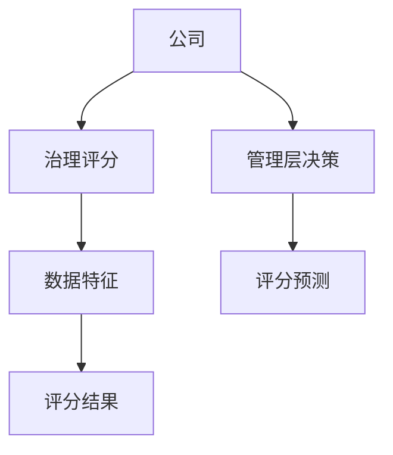
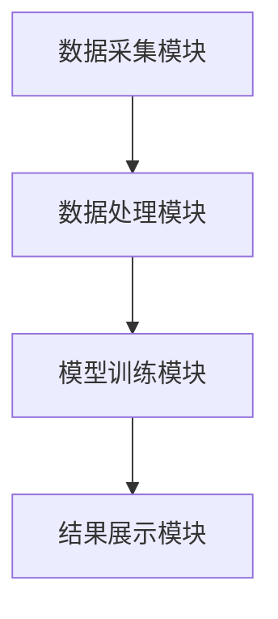
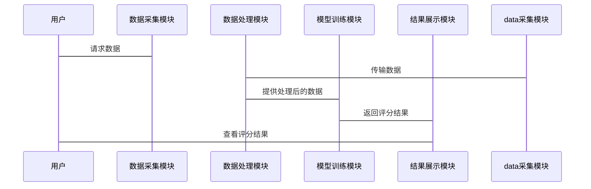

                 


# AI驱动的公司治理评分预测

## 关键词：公司治理，评分预测，人工智能，机器学习，数据分析

## 摘要：本文探讨了如何利用人工智能技术来预测公司治理评分。通过分析数据特征、选择合适的算法模型以及设计有效的系统架构，本文提供了一种基于AI的公司治理评分预测解决方案。文章从背景介绍、核心概念、算法原理、系统设计、项目实战到总结，详细阐述了AI在公司治理评分预测中的应用，为读者提供了从理论到实践的全面指导。

---

# 第1章: 公司治理评分预测的背景与意义

## 1.1 问题背景

### 1.1.1 公司治理的核心概念
公司治理是指公司内部和外部利益相关者之间的关系和结构，涉及决策制定、风险管理、透明度和合规性等方面。有效的公司治理是企业长期成功的关键因素。

### 1.1.2 传统公司治理评分的局限性
传统的公司治理评分方法通常依赖于主观判断和少量指标，这可能导致评分结果不准确或不全面。此外，传统方法难以处理大量复杂数据，也无法快速响应市场变化。

### 1.1.3 AI技术在公司治理评分中的应用潜力
人工智能技术能够处理海量数据，提取复杂特征，并通过机器学习模型进行预测。AI在公司治理评分中的应用可以显著提高评分的准确性和效率，同时帮助识别潜在风险。

## 1.2 问题描述

### 1.2.1 公司治理评分的定义与维度
公司治理评分是对企业在治理结构、透明度、风险管理等方面表现的综合评估。评分通常基于多个维度，如董事会结构、高管薪酬、股东权利等。

### 1.2.2 数据驱动的评分预测需求
随着企业数据的快速增长，利用数据驱动的方法进行评分预测成为必要。通过分析企业的财务数据、市场表现、新闻报道等，可以更全面地评估公司的治理情况。

### 1.2.3 AI驱动评分预测的目标与价值
AI驱动的评分预测旨在通过自动化分析和建模，提高评分的准确性和效率。其价值在于帮助投资者、监管机构和企业自身更好地了解公司治理状况，优化决策。

## 1.3 问题解决

### 1.3.1 AI技术如何赋能公司治理评分
AI技术可以通过自然语言处理（NLP）分析企业新闻、财报等文本数据，利用深度学习模型提取隐含信息。同时，AI还可以实时监控企业动态，提供动态评分。

### 1.3.2 数据采集与处理的关键步骤
- 数据清洗：处理缺失值、异常值和重复数据。
- 数据预处理：特征提取、标准化和数据增强。
- 数据标注：根据已有评分标准对数据进行标注。

### 1.3.3 模型训练与优化的实现路径
- 数据分割：将数据分为训练集、验证集和测试集。
- 模型选择：选择适合的算法，如随机森林、梯度提升树等。
- 模型训练：利用训练数据优化模型参数。
- 模型评估：使用验证集和测试集评估模型性能。

## 1.4 边界与外延

### 1.4.1 公司治理评分预测的适用范围
评分预测适用于上市公司、大型企业和跨国公司，尤其适用于数据丰富的行业。

### 1.4.2 相关领域的区别与联系
与企业风险管理、信用评级等领域密切相关，但评分预测更侧重于公司治理结构和透明度的评估。

### 1.4.3 评分预测的局限性与改进方向
- 数据不足：某些企业数据有限，影响模型性能。
- 数据质量：低质量数据可能导致错误评分。
- 模型解释性：复杂的模型可能难以解释评分结果。

## 1.5 概念结构与核心要素

### 1.5.1 公司治理评分的核心要素
- 董事会结构：独立董事比例、董事会多样性等。
- 透明度：信息披露的及时性和完整性。
- 风险管理：风险控制机制的有效性。
- 股东权利：股东权益保护程度。

### 1.5.2 AI驱动评分预测的系统架构
- 数据采集模块：收集企业数据。
- 数据处理模块：清洗和预处理数据。
- 模型训练模块：训练评分预测模型。
- 结果展示模块：输出评分结果并提供解释。

### 1.5.3 核心概念的层次化结构
- 上层：公司治理评分。
- 中层：治理结构、透明度、风险管理。
- 下层：董事会组成、信息披露、风险控制。

## 1.6 本章小结
本章介绍了公司治理评分预测的背景、核心概念和实现路径，为后续章节奠定了基础。

---

# 第2章: 公司治理评分预测的核心概念与联系

## 2.1 核心概念原理

### 2.1.1 数据驱动的评分预测方法
数据驱动的方法依赖于大量数据，通过统计分析和机器学习技术进行预测。

### 2.1.2 AI算法在评分预测中的应用
AI算法，如随机森林和神经网络，能够处理复杂数据并提供高精度预测。

### 2.1.3 公司治理评分预测的数学模型
数学模型将企业特征转化为评分，通常采用回归模型或分类模型。

## 2.2 核心概念属性特征对比

| 特征维度 | 传统方法 | AI驱动方法 |
|----------|----------|------------|
| 数据来源 | 有限数据 | 大量数据     |
| 分析深度 | 浅层分析 | 深度分析     |
| 处理速度 | 较慢     | 较快         |
| 准确性   | 较低     | 较高         |

### 2.2.1 不同评分预测方法的对比分析
- 传统方法：简单易懂，但准确性低。
- AI方法：复杂但准确性高，适合大数据场景。

### 2.2.2 数据特征与模型性能的关系
- 数据特征越多，模型性能越好。
- 特征相关性高，模型性能更优。

### 2.2.3 AI算法的优缺点分析
- 优点：高准确性、快速处理。
- 缺点：需要大量数据，解释性差。

## 2.3 ER实体关系图架构


## 2.4 本章小结
本章通过对比分析和ER图展示了公司治理评分预测的核心概念和实现逻辑。

---

# 第3章: 公司治理评分预测的算法原理

## 3.1 算法原理概述

### 3.1.1 线性回归模型
线性回归通过拟合直线预测目标变量，适用于线性关系的数据。

### 3.1.2 支持向量机模型
支持向量机通过构建超平面进行分类，适用于非线性数据。

### 3.1.3 随机森林与梯度提升树
随机森林通过集成学习提高准确性，梯度提升树通过逐步优化模型。

## 3.2 算法原理的数学模型

### 3.2.1 线性回归的数学公式
$$ y = \beta_0 + \beta_1x_1 + \beta_2x_2 + \dots + \beta_nx_n + \epsilon $$

### 3.2.2 随机森林的工作原理
随机森林通过构建多个决策树，并对结果进行投票或平均。

### 3.2.3 神经网络的数学模型
神经网络通过多层感知机进行非线性变换，通常采用反向传播算法进行训练。

## 3.3 算法选择与优化

### 3.3.1 算法选择的依据
- 数据特征类型
- 数据量大小
- 模型解释性要求

### 3.3.2 超参数优化方法
- 网格搜索
- 随机搜索
- 贝叶斯优化

### 3.3.3 模型评估指标
- 均方误差（MSE）
- 回归均方误差（RMSE）
- 决策系数（R²）

## 3.4 本章小结
本章详细介绍了几种常用的AI算法及其在公司治理评分预测中的应用。

---

# 第4章: 公司治理评分预测的系统架构设计

## 4.1 问题场景介绍
公司治理评分预测系统需要处理大量企业数据，实时更新评分，并提供可视化结果。

## 4.2 系统功能设计

### 4.2.1 数据采集模块
- 从数据库和API获取企业数据。
- 支持多种数据格式，如CSV和JSON。

### 4.2.2 数据处理模块
- 清洗数据：处理缺失值和异常值。
- 预处理数据：特征提取和标准化。

### 4.2.3 模型训练模块
- 选择合适的算法，如随机森林。
- 调整超参数，优化模型性能。

### 4.2.4 结果展示模块
- 可视化评分结果。
- 提供评分解释和改进建议。

## 4.3 系统架构设计

### 4.3.1 系统架构图


### 4.3.2 系统接口设计
- 数据接口：提供REST API供其他系统调用。
- 用户接口：网页或移动端界面供用户查询和分析。

## 4.4 系统交互流程

### 4.4.1 系统交互序列图


## 4.5 本章小结
本章通过系统架构设计展示了AI驱动的公司治理评分预测的实现过程。

---

# 第5章: 公司治理评分预测的项目实战

## 5.1 环境安装与配置

### 5.1.1 安装Python环境
- 安装Python 3.8或更高版本。
- 安装Jupyter Notebook用于数据分析和建模。

### 5.1.2 安装必要的库
```bash
pip install numpy pandas scikit-learn matplotlib tensorflow
```

## 5.2 核心代码实现

### 5.2.1 数据加载与预处理
```python
import pandas as pd
import numpy as np

# 加载数据
data = pd.read_csv('corporate_governance.csv')

# 数据清洗
data.dropna(inplace=True)
data = data[~data.duplicated()]

# 特征提取
features = data.drop('score', axis=1)
target = data['score']
```

### 5.2.2 模型训练与优化
```python
from sklearn.model import RandomForestRegressor
from sklearn.metrics import mean_squared_error

# 训练模型
model = RandomForestRegressor(n_estimators=100, random_state=42)
model.fit(features, target)

# 模型评估
y_pred = model.predict(features)
print('MSE:', mean_squared_error(target, y_pred))
```

### 5.2.3 结果展示
```python
import matplotlib.pyplot as plt

# 可视化结果
plt.scatter(target, y_pred)
plt.xlabel('Actual Score')
plt.ylabel('Predicted Score')
plt.show()
```

## 5.3 项目案例分析

### 5.3.1 数据来源与处理
以某上市公司为例，加载其治理数据并进行预处理。

### 5.3.2 模型训练与结果分析
使用随机森林模型进行训练，评估模型性能并分析关键特征。

### 5.3.3 结果解释与应用
解释评分结果，为企业提供治理改进建议，并优化模型。

## 5.4 本章小结
本章通过实际案例展示了AI驱动的公司治理评分预测的实现过程。

---

# 第6章: 总结与展望

## 6.1 核心内容回顾
AI技术在公司治理评分预测中的应用，从数据采集到模型训练，再到结果展示，提供了全面的解决方案。

## 6.2 挑战与改进方向
- 数据隐私问题：如何保护企业数据隐私。
- 模型解释性：如何提高模型的可解释性。
- 实时性：如何实现实时评分预测。

## 6.3 未来展望
随着AI技术的发展，公司治理评分预测将更加智能化和个性化，为企业治理提供更有力的支持。

## 6.4 最佳实践Tips
- 数据质量是关键，确保数据的完整性和准确性。
- 模型选择要根据实际情况，选择合适的算法。
- 结果展示要直观，便于用户理解和应用。

## 6.5 本章小结
本章总结了全文内容，并展望了未来的发展方向。

---

# 作者：AI天才研究院/AI Genius Institute & 禅与计算机程序设计艺术 /Zen And The Art of Computer Programming

