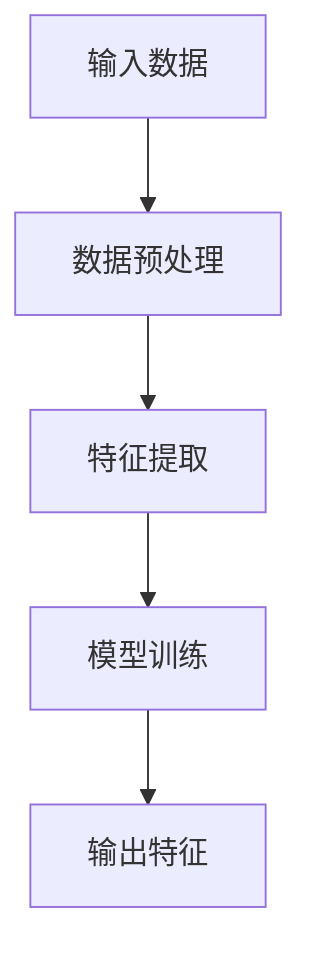
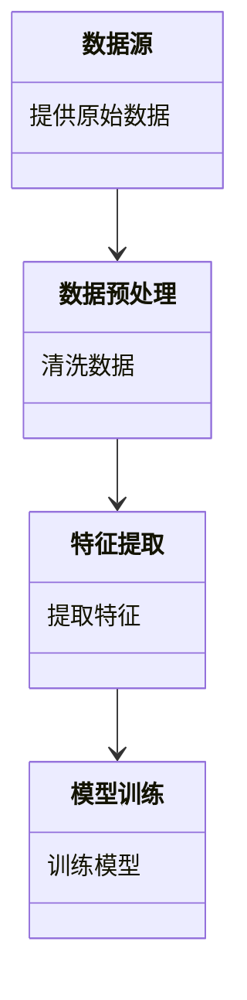

                 


# AI驱动的另类数据信号提取

> 关键词：AI驱动、另类数据、信号提取、特征工程、深度学习、系统架构

> 摘要：本文深入探讨了AI技术在另类数据信号提取中的应用，分析了传统方法的局限性，提出了基于AI的解决方案。通过详细讲解核心概念、算法原理、系统架构和项目实战，展示了AI如何有效提取复杂数据中的有用信号。文章结合理论与实践，为读者提供了全面的指导。

---

## 第一部分：背景介绍

### 第1章：问题背景与定义

#### 1.1 问题背景

- **传统数据信号提取的局限性**：传统方法在处理非结构化或半结构化数据时效率低下，难以捕捉隐含信息。
- **AI技术的作用**：利用深度学习等技术，AI能够高效提取复杂数据中的信号，提升准确性。

#### 1.2 问题描述

- **另类数据信号的定义**：非传统数据源（如社交媒体、传感器）中的有用信息。
- **关键挑战**：数据多样性、噪声干扰、实时性要求高。

#### 1.3 问题解决

- **AI驱动的解决方案**：通过机器学习模型自动提取特征，优化信号识别。

#### 1.4 概念结构与核心要素

- 核心要素包括数据源、特征、模型和结果，各要素间相互关联。

---

### 第2章：核心概念与联系

#### 2.1 数据信号的类型

- **结构化数据**：表格形式，易于处理。
- **非结构化数据**：文本、图像，需复杂处理。
- **半结构化数据**：日志、XML，介于两者之间。

#### 2.2 特征提取方法

- **基于统计**：频率分析。
- **基于模型**：聚类、分类。
- **基于深度学习**：神经网络提取特征。

#### 2.3 数据预处理

- **数据清洗**：去除噪声。
- **数据转换**：标准化、归一化。
- **数据增强**：增加多样性。

#### 2.4 模型关系

- **对比分析**：统计方法简单，模型方法准确，深度学习效果最佳。

---

## 第二部分：算法原理

### 第3章：基于深度学习的特征提取

#### 3.1 算法流程



#### 3.2 Python实现

```python
import tensorflow as tf
from tensorflow.keras import layers

model = tf.keras.Sequential([
    layers.Conv2D(32, (3,3), activation='relu', input_shape=(224, 224, 3)),
    layers.MaxPooling2D((2,2)),
    layers.Flatten(),
    layers.Dense(256, activation='relu'),
    layers.Dense(10, activation='softmax')
])
```

#### 3.3 数学模型

- **卷积层**：$$f(x) = \max(0, x)$$
- **池化层**：$$x_{new} = \frac{1}{n} \sum_{i} x_i$$

---

## 第三部分：系统架构

### 第4章：实时数据处理系统

#### 4.1 系统功能设计



#### 4.2 系统架构设计


---

## 第四部分：项目实战

### 第5章：社交媒体情感分析

#### 5.1 环境安装

```bash
pip install numpy pandas scikit-learn tensorflow
```

#### 5.2 核心代码

```python
import pandas as pd
from sklearn.feature_extraction.text import TfidfVectorizer
from sklearn.model_selection import train_test_split
from sklearn.linear_model import LogisticRegression

data = pd.read_csv('sentiment_data.csv')
X = data['text']
y = data['label']

X_train, X_test, y_train, y_test = train_test_split(X, y, test_size=0.2)

vectorizer = TfidfVectorizer()
X_train_vec = vectorizer.fit_transform(X_train)
X_test_vec = vectorizer.transform(X_test)

model = LogisticRegression()
model.fit(X_train_vec, y_train)
score = model.score(X_test_vec, y_test)
print(f'Accuracy: {score}')
```

#### 5.3 实际案例分析

- **数据收集**：从社交媒体获取文本数据。
- **特征提取**：使用TF-IDF提取关键词。
- **模型训练**：训练分类器识别情感倾向。

---

## 第五部分：扩展阅读

### 第6章：最佳实践与小结

#### 6.1 行业趋势

- AI技术持续进步，深度学习在信号提取中应用广泛。

#### 6.2 工具推荐

- **Python库**：scikit-learn、TensorFlow。
- **数据可视化**：Matplotlib、Seaborn。

#### 6.3 推荐书籍

- 《Deep Learning》（Ian Goodfellow）
- 《Feature Engineering for Machine Learning》（Max Halford）

---

作者：AI天才研究院 & 禅与计算机程序设计艺术

