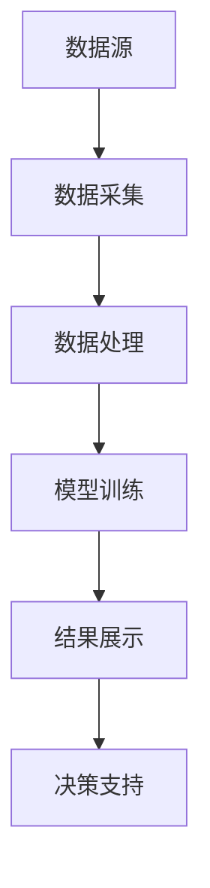
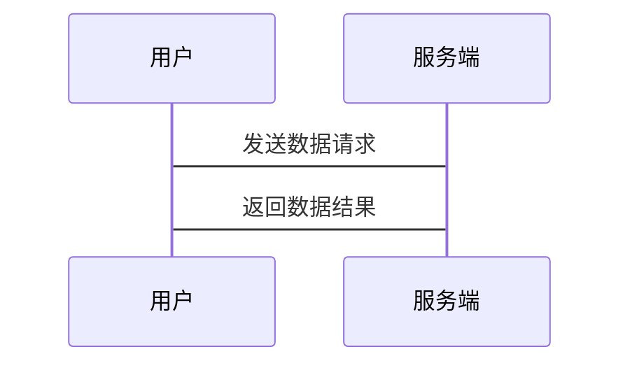

                 


# AI驱动的商业智能：从数据到决策的全流程优化

## 关键词：AI驱动、商业智能、数据预处理、机器学习模型、系统架构

## 摘要：  
本文将探讨如何利用人工智能技术优化商业智能的全流程，从数据收集、处理、分析到决策支持。通过详细分析数据预处理、特征工程、机器学习模型和系统架构等关键环节，结合实际案例，展示AI在商业智能中的强大能力。同时，我们将讨论系统架构设计、数据安全与隐私保护、模型优化与部署等重要议题，帮助读者全面理解AI驱动的商业智能。

---

## 第一部分: AI驱动的商业智能基础

### 第1章: 商业智能与AI的概述

#### 1.1 商业智能的基本概念

##### 1.1.1 商业智能的定义与范围  
商业智能（Business Intelligence, BI）是指通过收集、处理、分析和展示数据，帮助组织做出更明智的决策的过程。它涵盖了数据可视化、报表生成、数据分析和预测建模等多个方面。

##### 1.1.2 AI在商业智能中的作用  
人工智能（AI）通过自动化数据处理、模型训练和预测分析，大大提升了商业智能的效率和准确性。AI能够从海量数据中提取有价值的信息，帮助企业在市场预测、客户洞察、风险控制等方面做出更精准的决策。

##### 1.1.3 数据在商业智能中的核心地位  
数据是商业智能的基石。高质量的数据能够为决策提供可靠的支持，而数据的缺失或不准确可能导致错误的结论。

#### 1.2 AI驱动的商业智能特点

##### 1.2.1 数据驱动的决策优势  
AI驱动的商业智能依赖于数据，能够通过数据驱动的方式进行实时分析和预测，从而帮助企业在动态市场中快速调整策略。

##### 1.2.2 AI算法的核心作用  
AI算法（如机器学习、深度学习）能够从数据中发现隐藏的模式和趋势，为商业决策提供科学依据。

##### 1.2.3 商业智能与传统BI的区别  
传统BI主要依赖于报表和数据可视化，而AI驱动的BI引入了自动化分析和预测功能，能够进行更深层次的数据挖掘和分析。

#### 1.3 数据的重要性与挑战

##### 1.3.1 数据的来源与类型  
数据可以来自结构化数据（如数据库）和非结构化数据（如文本、图像）。不同来源的数据需要不同的处理方法。

##### 1.3.2 数据质量与清洗的重要性  
数据质量直接影响分析结果。清洗数据是确保数据准确性和完整性的必要步骤。

##### 1.3.3 数据隐私与安全问题  
随着数据量的增加，数据隐私和安全问题变得尤为重要。企业需要采取措施保护敏感数据，遵守相关法规。

---

### 第2章: 数据预处理与特征工程

#### 2.1 数据预处理方法

##### 2.1.1 数据清洗与去噪  
数据清洗是去除重复数据、处理缺失值和异常值的过程。例如，使用Python的pandas库进行数据清洗。

##### 2.1.2 数据标准化与归一化  
标准化（Z-score）和归一化（Min-Max）是常用的特征缩放方法，用于消除不同特征量纲的影响。

##### 2.1.3 数据缺失值的处理  
处理缺失值的方法包括删除、填补平均值或使用模型预测缺失值。

#### 2.2 特征工程的核心技术

##### 2.2.1 特征选择与降维  
特征选择通过过滤法、包装法和嵌入法选择重要特征。降维技术如主成分分析（PCA）可以减少特征数量。

##### 2.2.2 特征提取与表示  
特征提取包括从文本中提取关键词、从图像中提取特征等。特征表示如词袋模型和词嵌入（Word2Vec）常用于NLP任务。

##### 2.2.3 特征的评估与优化  
使用特征重要性评分（如决策树的特征重要性）和特征选择优化算法（如遗传算法）来优化特征集。

#### 2.3 数据预处理的案例分析

##### 2.3.1 某电商公司数据清洗案例  
案例背景：电商公司需要分析用户购买行为，但数据中存在大量缺失值和异常值。解决方案：使用pandas库清洗数据，填充缺失值并去除异常值。

##### 2.3.2 某金融公司特征工程案例  
案例背景：金融公司需要预测客户违约风险，但数据中有大量非数值型特征。解决方案：对文本型特征进行分词和向量化处理，使用PCA进行降维。

---

### 第3章: 机器学习模型与算法

#### 3.1 常见机器学习算法

##### 3.1.1 线性回归与逻辑回归

###### 3.1.1.1 线性回归的原理与应用  
线性回归用于预测连续型变量，例如预测房价。数学模型：$y = \beta_0 + \beta_1x + \epsilon$。

###### 3.1.1.2 逻辑回归的原理与应用  
逻辑回归用于分类问题，例如预测客户是否购买某产品。数学模型：$P(y=1|x) = \frac{1}{1 + e^{- (\beta_0 + \beta_1x)}}$。

##### 3.1.2 支持向量机（SVM）

###### 3.1.2.1 SVM的原理与应用  
SVM用于分类和回归问题，适用于高维数据。数学模型：最大化间隔的优化问题。

##### 3.1.3 随机森林与梯度提升树

###### 3.1.3.1 随机森林的原理与应用  
随机森林通过集成多个决策树提升模型的准确性和鲁棒性。

###### 3.1.3.2 梯度提升树的原理与应用  
梯度提升树通过迭代优化模型，常用于分类和回归问题。

#### 3.2 算法原理讲解

##### 3.2.1 线性回归的数学模型  
$$ y = \beta_0 + \beta_1x + \epsilon $$

##### 3.2.2 逻辑回归的损失函数  
$$ L(\theta) = -\frac{1}{m} \sum_{i=1}^m [y_i \ln h(x_i) + (1 - y_i) \ln (1 - h(x_i))] $$  
其中，$h(x_i) = \frac{1}{1 + e^{-\theta^T x_i}}$

#### 3.3 机器学习模型的实现

##### 3.3.1 使用Scikit-learn实现线性回归  
```python
from sklearn.linear_model import LinearRegression
model = LinearRegression()
model.fit(X_train, y_train)
```

##### 3.3.2 使用XGBoost实现梯度提升树  
```python
import xgboost as xgb
model = xgb.XGBRegressor(n_estimators=100, learning_rate=0.1)
model.fit(X_train, y_train)
```

---

## 第四部分: 系统架构与设计

### 第4章: 系统架构与设计

#### 4.1 系统架构设计

##### 4.1.1 系统功能设计  
系统功能包括数据采集、数据处理、模型训练、结果展示和决策支持。

##### 4.1.2 系统架构图  


#### 4.2 数据存储与管理

##### 4.2.1 数据库设计  
使用关系型数据库（如MySQL）存储结构化数据，使用NoSQL数据库（如MongoDB）存储非结构化数据。

##### 4.2.2 数据仓库设计  
数据仓库用于存储和管理海量数据，支持复杂查询和分析。

#### 4.3 系统接口设计

##### 4.3.1 API接口设计  
设计RESTful API，提供数据接口和模型接口。

##### 4.3.2 接口交互流程图  


---

## 第五部分: 项目实战与案例分析

### 第5章: 项目实战与案例分析

#### 5.1 项目背景与目标

##### 5.1.1 案例背景  
某零售企业希望通过AI驱动的商业智能优化库存管理和销售预测。

##### 5.1.2 项目目标  
1. 数据采集与预处理  
2. 特征工程与模型训练  
3. 模型部署与结果分析

#### 5.2 数据收集与处理

##### 5.2.1 数据源  
销售数据、库存数据、客户数据。

##### 5.2.2 数据处理流程  
1. 清洗数据：处理缺失值和异常值。  
2. 特征工程：提取时间特征、客户特征和产品特征。  
3. 数据分拆：将数据分为训练集、验证集和测试集。

#### 5.3 模型训练与优化

##### 5.3.1 模型选择  
选择时间序列模型（如ARIMA）和机器学习模型（如随机森林）进行对比。

##### 5.3.2 模型训练  
使用训练数据训练模型，并通过交叉验证优化模型参数。

##### 5.3.3 模型评估  
通过均方误差（MSE）、R²系数等指标评估模型性能。

#### 5.4 模型部署与结果分析

##### 5.4.1 模型部署  
将训练好的模型部署到生产环境，提供API接口供其他系统调用。

##### 5.4.2 结果分析  
分析模型预测结果，优化库存管理和销售策略。

#### 5.5 案例总结

##### 5.5.1 项目成果  
提高了库存周转率和销售预测的准确性。

##### 5.5.2 经验总结  
数据预处理和特征工程是项目成功的关键，模型选择和调优也非常重要。

---

## 第六部分: 高级主题与未来趋势

### 第6章: 高级主题与未来趋势

#### 6.1 前沿技术与创新

##### 6.1.1 解释性AI（XAI）  
通过可解释的模型（如SHAP值）帮助用户理解AI的决策过程。

##### 6.1.2 自动机器学习（AutoML）  
自动化的机器学习平台（如AutoKeras）能够降低AI技术的使用门槛。

#### 6.2 伦理与社会影响

##### 6.2.1 数据隐私与安全  
加强数据加密和访问控制，确保数据安全。

##### 6.2.2 AI的伦理问题  
避免算法偏见，确保AI决策的公平性。

#### 6.3 未来趋势与挑战

##### 6.3.1 多模态数据分析  
整合文本、图像、视频等多种数据类型，提升分析能力。

##### 6.3.2 边缘计算与实时分析  
通过边缘计算实现数据的实时处理和分析，提升响应速度。

##### 6.3.3 持续学习与自适应模型  
模型能够通过持续学习适应数据分布的变化，保持高准确性。

---

## 小结

AI驱动的商业智能正在改变企业决策的方式，通过数据预处理、特征工程、机器学习模型和系统架构优化，企业能够更高效地利用数据，做出更明智的决策。随着技术的发展，AI驱动的商业智能将更加智能化、自动化和个性化，为企业创造更大的价值。

---

## 作者：AI天才研究院/AI Genius Institute & 禅与计算机程序设计艺术 /Zen And The Art of Computer Programming

