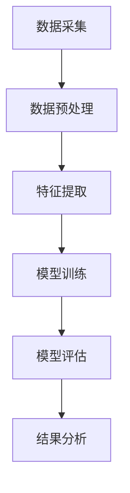
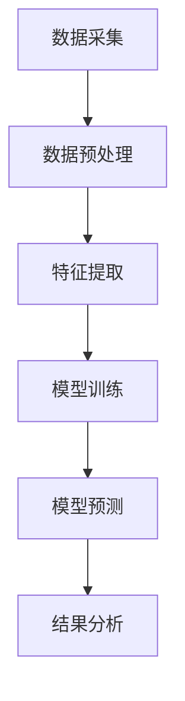
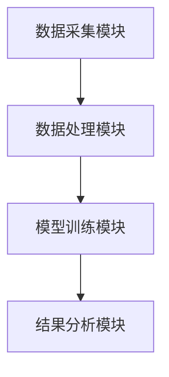

                 


# AI驱动的市场微观结构影响分析

> 关键词：AI驱动，市场微观结构，算法交易，订单簿分析，高频交易，交易机制

> 摘要：随着人工智能技术的快速发展，AI在金融市场的应用越来越广泛，尤其是在市场微观结构分析方面。本文将深入探讨AI如何影响市场微观结构，从核心概念、算法原理到系统架构设计，再到实际案例分析，全面解析AI驱动的市场微观结构影响分析的理论与实践。

---

## 第一部分: AI驱动的市场微观结构概述

### 第1章: AI驱动的市场微观结构概述

#### 1.1 市场微观结构的核心概念

##### 1.1.1 市场微观结构的定义
市场微观结构是指金融市场中交易过程中的具体机制和参与者之间的互动关系，包括订单簿、交易参与者、交易机制等核心要素。市场微观结构分析旨在理解这些机制如何影响市场价格、流动性和市场参与者的决策。

##### 1.1.2 AI在市场微观结构中的作用
AI技术可以通过对海量数据的分析，识别市场微观结构中的模式和规律，帮助交易者优化交易策略、提高交易效率，并预测市场动态。AI还可以通过实时数据分析，动态调整交易策略，从而在复杂多变的市场环境中获得竞争优势。

##### 1.1.3 市场微观结构与宏观市场的关系
市场微观结构是宏观市场运行的基础，宏观市场的波动和趋势往往是由微观层面的交易活动和参与者行为所驱动的。AI可以通过对微观结构的分析，预测宏观市场的变化，并为宏观政策制定提供数据支持。

#### 1.2 AI驱动的市场微观结构分析背景

##### 1.2.1 传统市场微观结构分析的局限性
传统市场微观结构分析主要依赖于统计方法和经验分析，其局限性在于难以处理海量数据、实时性不足，且难以捕捉复杂非线性关系。

##### 1.2.2 AI技术在金融领域的应用现状
AI技术在金融领域的应用日益广泛，尤其是在高频交易、风险管理和智能投顾等方面。AI技术的强大数据处理能力和深度学习算法为市场微观结构分析提供了新的可能性。

##### 1.2.3 市场微观结构分析的AI驱动趋势
随着AI技术的不断发展，市场微观结构分析将更加依赖于AI技术。AI可以通过对订单簿、交易参与者行为和市场流动性的深度分析，提供更精准的市场洞察和交易策略。

#### 1.3 本章小结
本章主要介绍了市场微观结构的核心概念、AI在市场微观结构中的作用，以及AI驱动的市场微观结构分析的背景和趋势。通过这些内容，读者可以理解AI如何在市场微观结构分析中发挥重要作用。

---

## 第二部分: AI驱动的市场微观结构核心概念与联系

### 第2章: AI驱动的市场微观结构核心概念

#### 2.1 市场微观结构的核心要素

##### 2.1.1 订单簿分析
订单簿是市场微观结构分析的核心要素之一。AI可以通过对订单簿的深度分析，识别市场参与者的行为模式和市场流动性变化。

##### 2.1.2 市场参与者分析
市场参与者包括机构投资者、散户、高频交易算法等。AI可以通过对市场参与者的交易行为分析，识别市场中的主导力量和潜在风险。

##### 2.1.3 交易机制分析
交易机制包括订单匹配规则、撮合机制和市场干预措施等。AI可以通过对交易机制的分析，优化交易策略并预测市场波动。

#### 2.2 AI驱动的市场微观结构分析原理

##### 2.2.1 数据采集与预处理
AI驱动的市场微观结构分析首先需要采集实时市场数据，并进行清洗和标准化处理，确保数据的准确性和可用性。

##### 2.2.2 特征提取与选择
通过对市场数据的特征提取和选择，AI可以识别出与市场微观结构相关的关键特征，例如订单簿深度、买卖价差、成交率等。

##### 2.2.3 模型训练与评估
基于提取的特征，AI可以通过监督学习、无监督学习或深度学习等方法训练模型，并对模型进行评估和优化，以提高预测准确性和鲁棒性。

#### 2.3 核心概念对比分析

##### 2.3.1 市场微观结构与宏观市场的对比
从微观到宏观的市场分析需要考虑多个层面的因素，AI可以通过多层模型构建，实现从微观结构到宏观市场的动态预测。

##### 2.3.2 AI驱动与传统统计方法的对比
AI方法在数据处理能力、非线性关系捕捉和实时性方面具有显著优势，但在某些场景下，传统统计方法仍然具有其独特价值。

##### 2.3.3 不同AI模型在市场微观结构中的应用对比
不同AI模型在市场微观结构分析中的表现差异显著，例如LSTM模型在时间序列预测方面表现优异，而随机森林则在特征选择方面具有优势。

#### 2.4 实体关系图与流程图

##### 2.4.1 市场微观结构的ER实体关系图
```mermaid
erDiagram
    participant 市场参与者 {
        <属性> 交易ID : integer
        <属性> 时间戳 : timestamp
        <属性> 买卖方向 : string
    }
    participant 订单簿 {
        <属性> 最新买入价 : decimal
        <属性> 最新卖出价 : decimal
        <属性> 按数量排序 : boolean
    }
    participant 交易机制 {
        <属性> 市场深度 : integer
        <属性> 成交量 : decimal
        <属性> 成交价 : decimal
    }
    市场参与者 --> 订单簿 : 提交订单
    市场参与者 --> 交易机制 : 执行交易
    订单簿 --> 交易机制 : 提供市场深度
```

##### 2.4.2 AI驱动的市场微观结构分析流程图


---

## 第三部分: AI驱动的市场微观结构算法原理

### 第3章: AI驱动的市场微观结构算法原理

#### 3.1 基于机器学习的市场微观结构分析

##### 3.1.1 监督学习模型
- 随机森林：适用于分类和回归任务，适合处理订单簿数据中的非线性关系。
- 支持向量机：适用于分类任务，可用于识别订单簿中的买方和卖方行为。

##### 3.1.2 无监督学习模型
- 聚类分析：用于识别市场参与者的交易行为模式。

##### 3.1.3 深度学习模型
- LSTM网络：适用于时间序列预测，可用于预测订单簿的深度变化和买卖价差。

#### 3.2 基于时间序列分析的市场微观结构建模

##### 3.2.1 时间序列分析的基本原理
时间序列分析是通过分析数据随时间的变化规律，预测未来的市场动态。

##### 3.2.2 基于ARIMA模型的市场微观结构分析
ARIMA模型是一种常用的时间序列预测模型，适用于订单簿深度和成交价的变化预测。

##### 3.2.3 基于LSTM模型的市场微观结构预测
LSTM网络通过长短期记忆单元，能够有效捕捉时间序列中的长期依赖关系，适用于复杂非线性市场的预测。

#### 3.3 算法实现与流程图

##### 3.3.1 算法实现流程图


##### 3.3.2 算法实现的Python代码示例
```python
import numpy as np
import pandas as pd
from sklearn.ensemble import RandomForestClassifier
from sklearn.metrics import accuracy_score

# 数据加载与预处理
data = pd.read_csv('market_data.csv')
X = data.drop('target', axis=1)
y = data['target']

# 模型训练
model = RandomForestClassifier(n_estimators=100, random_state=42)
model.fit(X, y)

# 模型预测
y_pred = model.predict(X)
print('Accuracy:', accuracy_score(y, y_pred))
```

##### 3.3.3 算法实现的数学模型与公式
时间序列预测的ARIMA模型：
$$ ARIMA(p, d, q) $$
其中，p为自回归阶数，d为差分阶数，q为移动平均阶数。

LSTM网络的数学公式：
$$
f_t = \text{tanh}(W_f \cdot [h_{t-1}, x_t] + b_f)
$$
$$
i_t = \text{sigmoid}(W_i \cdot [h_{t-1}, x_t] + b_i)
$$
$$
o_t = \text{sigmoid}(W_o \cdot [h_{t-1}, x_t] + b_o)
$$
$$
h_t = f_t \cdot c_{t-1} + i_t \cdot tanh(W_c \cdot [h_{t-1}, x_t] + b_c)
$$

---

## 第四部分: 市场微观结构分析的系统架构与设计

### 第4章: 系统架构与设计

#### 4.1 系统功能设计

##### 4.1.1 数据采集模块
负责从多个数据源（如交易所API、市场数据供应商）获取实时市场数据。

##### 4.1.2 数据处理模块
对获取的市场数据进行清洗、标准化和特征提取，为后续分析提供高质量的数据支持。

##### 4.1.3 模型训练模块
基于处理后的数据，训练和优化AI模型，实现市场微观结构的深度分析和预测。

##### 4.1.4 结果分析模块
对模型的预测结果进行解读和可视化，为交易决策提供支持。

#### 4.2 系统架构设计

##### 4.2.1 系统架构图


##### 4.2.2 系统模块之间的交互关系
数据采集模块将实时市场数据传递给数据处理模块，数据处理模块将预处理后的数据传递给模型训练模块，模型训练模块将训练结果传递给结果分析模块。

##### 4.2.3 系统接口设计
- 数据接口：与交易所API交互，获取实时市场数据。
- 模型接口：与AI模型交互，进行预测和分析。

#### 4.3 系统实现与测试

##### 4.3.1 系统实现
使用Python和深度学习框架（如TensorFlow、Keras）实现AI驱动的市场微观结构分析系统。

##### 4.3.2 系统测试
通过模拟数据和真实市场数据进行系统测试，验证模型的准确性和实时性。

---

## 第五部分: 项目实战与应用

### 第5章: 项目实战与应用

#### 5.1 高频交易系统的实现

##### 5.1.1 环境安装
安装必要的Python库，例如pandas、numpy、tensorflow、keras等。

##### 5.1.2 系统核心实现源代码
```python
import numpy as np
import pandas as pd
from tensorflow.keras.models import Sequential
from tensorflow.keras.layers import LSTM, Dense, Dropout

# 数据加载与预处理
data = pd.read_csv('market_data.csv')
X = data.drop('target', axis=1)
y = data['target']

# 数据分割
X_train = X.iloc[:800]
y_train = y.iloc[:800]
X_test = X.iloc[800:]
y_test = y.iloc[800:]

# 模型构建
model = Sequential()
model.add(LSTM(50, input_shape=(X_train.shape[1], 1)))
model.add(Dropout(0.2))
model.add(Dense(1, activation='sigmoid'))
model.compile(loss='binary_crossentropy', optimizer='adam', metrics=['accuracy'])

# 模型训练
model.fit(X_train.values.reshape((X_train.shape[0], X_train.shape[1], 1)), y_train, epochs=10, batch_size=32)

# 模型预测
y_pred = model.predict(X_test.values.reshape((X_test.shape[0], X_test.shape[1], 1)))
print('Accuracy:', accuracy_score(y_test, y_pred.round()))
```

##### 5.1.3 代码应用解读与分析
上述代码实现了一个基于LSTM的高频交易系统，能够对市场数据进行实时分析和预测，指导交易决策。

##### 5.1.4 实际案例分析
以某次市场波动为例，分析AI驱动的高频交易系统如何通过订单簿分析和市场参与者行为预测，优化交易策略并实现收益最大化。

---

## 第六部分: 总结与展望

### 第6章: 总结与展望

#### 6.1 本章小结
本文从市场微观结构的核心概念出发，详细探讨了AI在市场微观结构分析中的算法原理和系统架构设计，并通过实际案例展示了AI驱动的市场微观结构影响分析的应用价值。

#### 6.2 最佳实践 Tips
- 数据质量是AI驱动的市场微观结构分析的核心，确保数据的准确性和完整性。
- 在实际应用中，结合多种AI模型和分析方法，以提高预测的准确性和鲁棒性。
- 定期更新模型和优化算法，以适应市场环境的变化。

#### 6.3 注意事项
- 市场微观结构分析具有高度的复杂性和不确定性，需谨慎处理模型的局限性和潜在风险。
- 在实际交易中，AI模型的结果需结合市场专家的判断和决策。

#### 6.4 拓展阅读
- 《机器学习在金融中的应用》
- 《深度学习与时间序列预测》
- 《市场微观结构分析的理论与实践》

---

## 作者信息

作者：AI天才研究院/AI Genius Institute & 禅与计算机程序设计艺术 /Zen And The Art of Computer Programming

---

本文通过系统地分析AI在市场微观结构中的应用，从理论到实践，为读者提供了全面的视角和深入的见解。通过本文的学习，读者可以掌握AI驱动的市场微观结构影响分析的核心方法和实际应用技巧。

