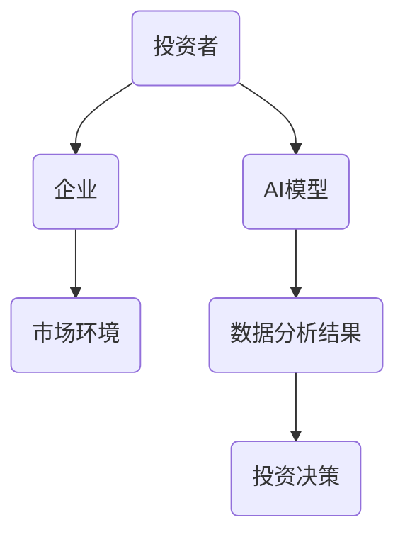
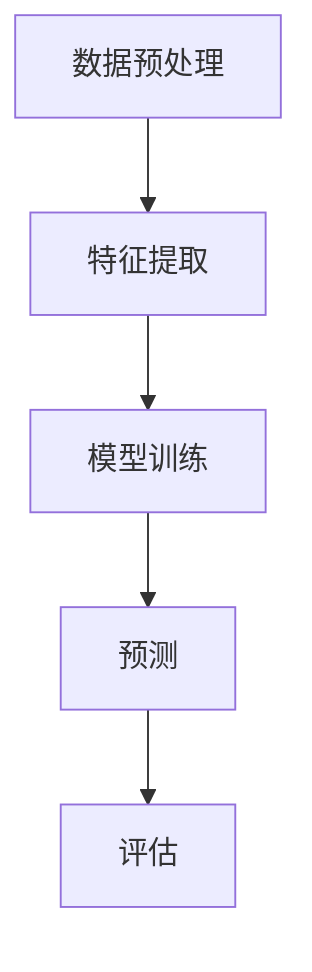
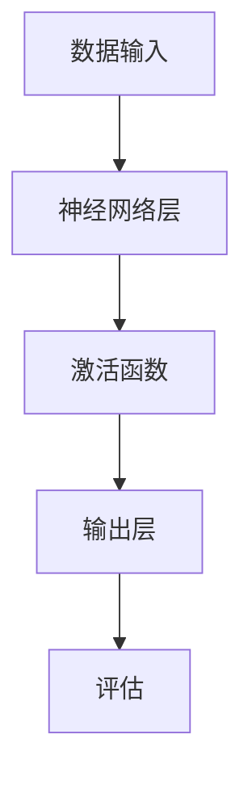

                 


# AI驱动的私募股权投资分析

## 关键词：私募股权投资，人工智能，机器学习，深度学习，自然语言处理

## 摘要：本文详细探讨了AI技术在私募股权投资中的应用，从背景、核心概念到算法原理、系统架构设计，再到项目实战，全面解析了AI如何驱动私募股权投资的分析与决策过程。文章结合具体案例，深入分析了AI在私募股权投资中的优势与挑战，为读者提供了全面的视角和深入的见解。

---

# 第一部分：AI驱动的私募股权投资分析基础

## 第1章：私募股权投资与AI驱动分析概述

### 1.1 私募股权投资的基本概念

私募股权投资是指通过投资于非公开交易的企业股权，以获取资本增值的投资方式。其核心在于对企业的深入分析和评估，包括财务状况、市场地位、管理团队等多个维度。传统私募股权投资依赖于人工分析和经验判断，存在效率低、主观性强、覆盖面有限等问题。

#### 1.1.1 私募股权投资的定义
私募股权投资（Private Equity Investment，PEI）是指投资者通过购买未上市公司的股权，以期通过企业的成长和增值实现投资收益。私募股权基金通常由专业机构管理，投资于具有高增长潜力的企业。

#### 1.1.2 私募股权投资的核心要素
- **目标企业**：通常是具有高增长潜力的中早期企业。
- **投资期限**：较长，通常为5-10年。
- **退出机制**：通过企业上市（IPO）或被收购退出。
- **风险管理**：通过尽职调查和投后管理降低风险。

#### 1.1.3 私募股权投资的流程与特点
私募股权投资的流程包括项目筛选、尽职调查、投资决策、投后管理和退出策略。其特点是高风险、高回报，且对管理能力要求较高。

### 1.2 AI在私募股权投资中的应用背景

随着大数据和人工智能技术的快速发展，AI在金融领域的应用日益广泛。私募股权投资作为金融的重要组成部分，也在逐步引入AI技术以提升效率和精准度。

#### 1.2.1 传统私募股权投资的局限性
- **数据依赖性**：传统方法主要依赖财务报表和管理团队的经验，信息来源单一。
- **效率低下**：人工分析耗时长，覆盖面有限。
- **主观性**：决策受主观因素影响较大，难以避免人为错误。

#### 1.2.2 AI技术如何解决私募股权投资问题
AI技术通过自动化数据处理、模式识别和预测分析，能够快速处理大量非结构化数据，发现潜在的投资机会，降低投资风险。

#### 1.2.3 AI驱动私募股权投资的优势与挑战
优势：
- **数据处理能力**：AI能够处理多源异构数据，包括文本、财务数据、市场数据等。
- **预测准确性**：通过机器学习模型，可以提高企业估值和投资回报预测的准确性。
- **效率提升**：自动化分析流程大幅提高投资决策效率。

挑战：
- **数据质量**：AI模型的准确性依赖于数据的完整性和质量。
- **模型解释性**：复杂的AI模型可能导致决策过程难以解释。
- **监管合规**：AI驱动的投资行为需要符合金融监管要求。

## 第2章：AI驱动私募股权投资的核心概念与联系

### 2.1 核心概念原理

#### 2.1.1 数据驱动的私募股权投资分析
AI驱动的私募股权投资分析依赖于多源数据，包括企业的财务数据、市场数据、新闻数据等。通过数据挖掘和分析，发现潜在的投资机会。

#### 2.1.2 AI算法在私募股权投资中的应用
常用的AI算法包括机器学习、深度学习和自然语言处理。这些算法能够从数据中提取特征，识别模式，并进行预测。

#### 2.1.3 私募股权投资与AI的结合模型
AI驱动的私募股权投资模型通常包括数据采集、特征提取、模型训练和预测、投资决策等步骤。

### 2.2 核心概念属性对比表

| 属性 | 传统私募股权投资 | AI驱动私募股权投资 |
|------|------------------|---------------------|
| 数据来源 | 主要依赖财务报表 | 结合财务、文本、市场等多源数据 |
| 分析方式 | 主观判断为主 | 数据分析与AI模型结合 |
| 决策效率 | 较低 | 显著提高 |
| 精准度 | �受人为因素影响较大 | 更高 |

### 2.3 ER实体关系图



### 2.4 本章小结

通过对比分析，AI驱动的私募股权投资在数据来源、分析方式、决策效率和精准度等方面具有显著优势。ER实体关系图展示了投资者、企业、市场环境和AI模型之间的关系，为后续的系统设计奠定了基础。

---

## 第3章：AI驱动私募股权投资的核心算法原理

### 3.1 算法原理概述

#### 3.1.1 机器学习在私募股权投资中的应用
机器学习通过训练模型，从历史数据中提取特征，预测企业的未来表现。

#### 3.1.2 深度学习在私募股权投资中的应用
深度学习通过多层神经网络，能够处理复杂的非结构化数据，如文本和图像。

#### 3.1.3 自然语言处理在私募股权投资中的应用
自然语言处理（NLP）用于分析企业新闻、财报等文本数据，提取情感和关键词。

### 3.2 算法实现细节

#### 3.2.1 机器学习算法实现



#### 3.2.2 深度学习算法实现



### 3.3 算法代码实现

#### 3.3.1 机器学习代码示例

```python
from sklearn.ensemble import RandomForestCl
```

