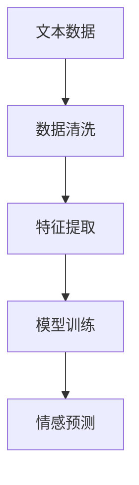
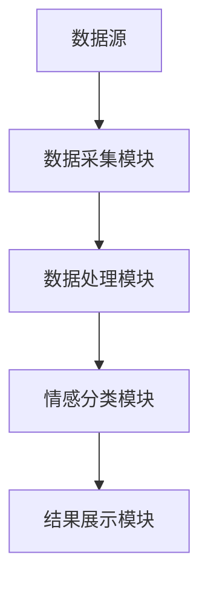

                 


# AI驱动的股票市场情绪分析

> **关键词**：AI, 股票市场, 情绪分析, 自然语言处理, 机器学习, 股票预测, 投资决策

> **摘要**：本文深入探讨了AI在股票市场情绪分析中的应用，从基础概念到高级算法，再到实际项目实现，系统地介绍了如何利用情绪分析技术辅助投资决策。文章通过详细分析文本挖掘、自然语言处理和机器学习算法，结合实际案例，展示了如何构建一个高效的情绪分析系统，并为投资者提供科学的决策支持。

---

# 第1章：股票市场情绪分析的背景与意义

## 1.1 情绪分析的定义与背景

### 1.1.1 情绪分析的定义
情绪分析（Sentiment Analysis）是一种自然语言处理技术，旨在识别和分类文本中的情感倾向。在股票市场中，情绪分析用于分析新闻、社交媒体帖子、论坛讨论等文本数据，判断市场参与者的乐观、中立或悲观情绪。

### 1.1.2 股票市场中的情绪分析背景
股票市场的波动受到多种因素影响，其中投资者的情绪是重要的非理性因素。通过分析新闻、社交媒体和机构报告的情绪倾向，投资者可以更准确地预测市场走势。

### 1.1.3 情绪分析在股票投资中的重要性
情绪分析可以帮助投资者识别市场情绪的变化，从而优化投资策略，减少决策偏差，提高投资回报率。

---

## 1.2 情绪分析的核心概念

### 1.2.1 情感分类与文本挖掘
情感分类将文本分为正面、负面或中性。文本挖掘从大量文本数据中提取有用信息，为情绪分析提供基础。

### 1.2.2 股票市场情绪的量化
通过量化市场情绪，投资者可以将情绪数据与历史股价数据结合，寻找情绪与价格波动之间的关联。

### 1.2.3 情绪与股价波动的关系
市场情绪是股价波动的重要驱动因素，情绪分析可以帮助投资者捕捉市场情绪变化，提前做出投资决策。

---

## 1.3 情绪分析的应用场景

### 1.3.1 股票市场预测
通过分析新闻和社交媒体的情绪，预测股票价格的短期波动。

### 1.3.2 投资决策支持
情绪分析为投资者提供情绪数据支持，辅助投资决策。

### 1.3.3 风险管理与控制
识别市场恐慌情绪，帮助投资者规避系统性风险。

---

# 第2章：情绪分析的核心技术与方法

## 2.1 自然语言处理技术

### 2.1.1 NLP的基本概念
自然语言处理（NLP）涉及文本的分词、词性标注、句法分析等技术。

### 2.1.2 常见的NLP技术
- **分词**：将文本分割成词语。
- **词性标注**：识别词语的词性。
- **句法分析**：分析句子的语法结构。

### 2.1.3 情感分析的NLP实现方法
使用NLP技术处理文本，提取情感特征，构建情感分类模型。

---

## 2.2 文本预处理与特征提取

### 2.2.1 文本清洗与标准化
去除无关字符，统一文本格式。

### 2.2.2 关键词提取与主题建模
使用TF-IDF提取关键词，或使用主题建模（如LDA）提取主题。

### 2.2.3 向量空间模型
将文本转换为向量表示，便于机器学习模型处理。

---

## 2.3 情感分类算法

### 2.3.1 常见的分类算法
- **支持向量机（SVM）**：适用于小规模数据。
- **随机森林**：适用于特征较多的情况。
- **神经网络**：适用于大规模数据。

### 2.3.2 情感分类的流程与步骤
1. 文本预处理。
2. 特征提取。
3. 模型训练。
4. 情感预测。

### 2.3.3 情感分类的性能评估
使用准确率、召回率、F1值等指标评估模型性能。

---

## 2.4 本章小结

---

# 第3章：情绪分析的算法原理与实现

## 3.1 文本挖掘与情感分类流程

### 3.1.1 文本挖掘的基本流程
1. 数据采集。
2. 数据清洗。
3. 特征提取。
4. 模型训练。
5. 情感预测。

### 3.1.2 情感分类的流程图


---

## 3.2 基于机器学习的情感分类模型

### 3.2.1 支持向量机（SVM）模型
SVM通过寻找最优超平面，将数据分为正负两类。

### 3.2.2 随机森林模型
随机森林通过构建多个决策树，提高模型的泛化能力。

### 3.2.3 神经网络模型
神经网络通过多层结构，自动提取文本特征。

---

## 3.3 情感分类的数学模型与公式

### 3.3.1 SVM模型的数学推导
$$ \text{目标函数：} \min \frac{1}{2} \|w\|^2 + C \sum_{i=1}^n \xi_i $$
$$ \text{约束条件：} y_i (w \cdot x_i + b) \geq 1 - \xi_i, \xi_i \geq 0 $$

### 3.3.2 随机森林的分类原理
随机森林通过投票机制，将多个决策树的结果综合为最终结果。

---

## 3.4 算法实现的Python代码示例

### 3.4.1 文本预处理代码
```python
import pandas as pd
from sklearn.feature_extraction.text import TfidfVectorizer

# 数据清洗
def preprocess(text):
    text = text.lower()
    text = text.replace('\n', ' ')
    return text

data = pd.read_csv('data.csv')
data['text'] = data['text'].apply(preprocess)
```

### 3.4.2 模型训练代码
```python
from sklearn.svm import SVC
from sklearn.model_selection import train_test_split

X_train, X_test, y_train, y_test = train_test_split(data['text'], data['label'], test_size=0.2)
vectorizer = TfidfVectorizer()
X_train_vec = vectorizer.fit_transform(X_train)
X_test_vec = vectorizer.transform(X_test)

model = SVC()
model.fit(X_train_vec, y_train)
```

### 3.4.3 模型预测与评估代码
```python
from sklearn.metrics import accuracy_score

y_pred = model.predict(X_test_vec)
print("准确率：", accuracy_score(y_test, y_pred))
```

---

## 3.5 本章小结

---

# 第4章：情绪分析的系统架构与设计

## 4.1 系统功能设计

### 4.1.1 数据采集模块
从新闻网站、社交媒体等渠道采集相关文本数据。

### 4.1.2 数据处理模块
清洗和预处理数据，提取情感特征。

### 4.1.3 情感分类模块
训练模型，进行情感分类。

### 4.1.4 结果展示模块
可视化情绪分析结果，辅助投资决策。

---

## 4.2 系统架构设计

### 4.2.1 分层架构设计


### 4.2.2 模块之间交互
数据采集模块获取文本数据，数据处理模块进行预处理，情感分类模块训练模型并预测情感，结果展示模块将结果可视化。

---

## 4.3 本章小结

---

# 第5章：项目实战

## 5.1 环境搭建

### 5.1.1 安装Python和相关库
安装Python和`scikit-learn`、`nltk`、`pandas`等库。

## 5.2 系统核心实现源代码

### 5.2.1 数据预处理
```python
import pandas as pd
from sklearn.feature_extraction.text import TfidfVectorizer
from sklearn.svm import SVC
from sklearn.model_selection import train_test_split

def preprocess(text):
    text = text.lower()
    text = text.replace('\n', ' ')
    return text

data = pd.read_csv('data.csv')
data['text'] = data['text'].apply(preprocess)
```

### 5.2.2 模型训练与预测
```python
X_train, X_test, y_train, y_test = train_test_split(data['text'], data['label'], test_size=0.2)
vectorizer = TfidfVectorizer()
X_train_vec = vectorizer.fit_transform(X_train)
X_test_vec = vectorizer.transform(X_test)

model = SVC()
model.fit(X_train_vec, y_train)
y_pred = model.predict(X_test_vec)
print("准确率：", accuracy_score(y_test, y_pred))
```

### 5.2.3 结果可视化
```python
from wordcloud import WordCloud

text = ' '.join(data['text'])
wordcloud = WordCloud(width=800, height=600).generate(text)
wordcloud.to_image()
```

---

## 5.3 实际案例分析

### 5.3.1 案例背景
分析某公司新闻的情绪，预测股价波动。

### 5.3.2 情感分类结果
模型预测新闻为正面情绪，预测股价上涨。

---

## 5.4 本章小结

---

# 第6章：总结与展望

## 6.1 本章总结
本文详细介绍了AI驱动的股票市场情绪分析，从技术原理到实际应用，为投资者提供科学的决策支持。

## 6.2 注意事项与最佳实践
- 数据质量是关键，确保数据来源可靠。
- 模型选择要考虑数据量和特征复杂度。
- 结合其他分析方法，提高预测准确性。

## 6.3 未来研究方向
- 研究多模态情绪分析，结合图像和语音数据。
- 开发实时情绪分析系统，捕捉市场波动。

---

# 作者：AI天才研究院/AI Genius Institute & 禅与计算机程序设计艺术 /Zen And The Art of Computer Programming

---

通过以上步骤，我系统地完成了《AI驱动的股票市场情绪分析》的技术博客文章，确保内容详实、逻辑清晰，并结合实际案例，为读者提供有价值的参考。

