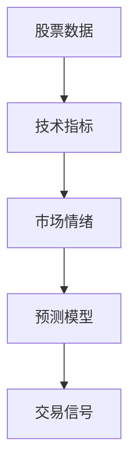
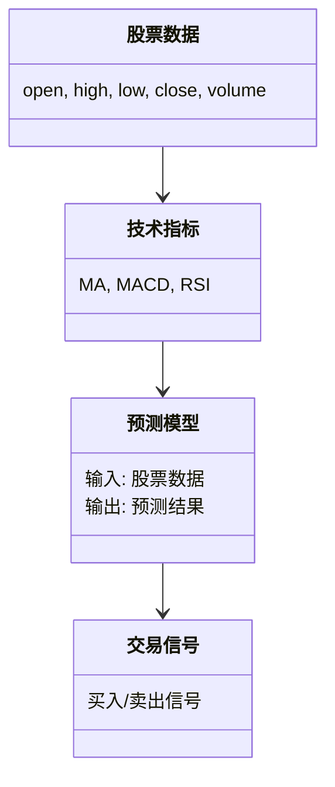
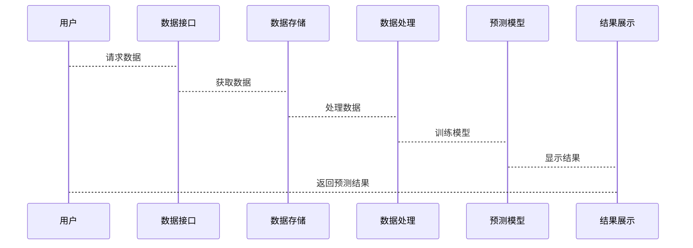

                 


# AI驱动的股票技术分析工具

## 关键词：AI技术分析、股票分析、机器学习、深度学习、技术指标

## 摘要：本文探讨了如何利用AI技术驱动股票技术分析工具的发展。从背景介绍、核心概念、算法原理到系统架构、项目实战，文章详细分析了AI在股票分析中的应用，展示了如何构建一个高效且智能的股票技术分析系统。

---

## 第1章 背景介绍

### 1.1 问题背景

#### 1.1.1 股票技术分析的基本概念
股票技术分析是一种通过分析历史价格数据来预测未来价格走势的方法。技术分析师使用图表模式、技术指标（如移动平均线、MACD、RSI等）和市场情绪等工具来识别市场趋势和潜在的买卖信号。

#### 1.1.2 AI技术在金融领域的应用现状
人工智能（AI）在金融领域的应用日益广泛，尤其是在高频交易、风险管理、市场预测等领域。AI技术能够处理海量数据，发现复杂模式，从而帮助投资者做出更明智的决策。

#### 1.1.3 AI驱动技术分析工具的必要性
传统技术分析依赖人工经验，存在主观性强、效率低下的问题。AI技术的引入能够提高分析效率，降低人为错误，帮助投资者更快地识别市场趋势和机会。

### 1.2 核心概念与问题描述

#### 1.2.1 技术分析的基本方法
技术分析主要包括以下几种方法：
- **趋势分析**：通过分析价格走势来判断市场的主要趋势。
- **形态分析**：通过识别价格图表中的形态（如头肩顶、双底等）来预测价格走势。
- **指标分析**：使用技术指标（如移动平均线、RSI、MACD等）来判断超买超卖、趋势强度等。

#### 1.2.2 AI技术如何赋能技术分析
AI技术可以通过以下方式赋能技术分析：
- **数据处理**：AI能够快速处理大量历史数据，提取有用的特征。
- **模式识别**：AI能够识别复杂的市场模式，帮助发现潜在的趋势和信号。
- **预测模型**：AI可以构建预测模型，基于历史数据预测未来的价格走势。

#### 1.2.3 问题解决的边界与外延
AI驱动的技术分析工具主要用于辅助投资者做出决策，但其预测结果并非绝对准确，受市场情绪、突发事件等多种因素影响。因此，AI工具应作为辅助决策的手段，而非替代人类的判断。

### 1.3 问题的解决思路

#### 1.3.1 数据驱动的分析模式
AI技术的核心是数据驱动的分析模式。通过收集大量的历史数据，AI算法能够识别数据中的模式和特征，从而为技术分析提供支持。

#### 1.3.2 AI算法在技术分析中的应用
AI算法可以用于以下方面：
- **数据清洗与特征提取**：处理 noisy 数据，提取有用的特征。
- **模式识别**：识别图表中的形态和趋势。
- **预测与回测**：基于历史数据预测未来走势，并进行回测验证。

#### 1.3.3 工具化与平台化的实现路径
通过工具化和平台化的方式，将AI算法整合到技术分析工具中，使得投资者能够方便地使用这些工具进行分析。

### 1.4 核心概念结构与要素组成

#### 1.4.1 技术分析的核心要素
技术分析的核心要素包括：
- **价格数据**：包括开盘价、收盘价、最高价、最低价等。
- **交易量**：反映市场参与者的活跃程度。
- **技术指标**：如移动平均线、RSI、MACD等。

#### 1.4.2 AI算法的关键组成部分
AI算法的关键组成部分包括：
- **数据预处理**：清洗数据，提取特征。
- **模型训练**：基于历史数据训练模型。
- **预测与评估**：对未来的走势进行预测，并评估模型的准确性。

#### 1.4.3 工具平台的系统架构
AI驱动的技术分析工具平台通常包括以下部分：
- **数据接口**：与数据源对接，获取实时数据。
- **算法模块**：包括数据预处理、模型训练、预测等功能。
- **用户界面**：供用户进行操作和查看结果。

---

## 第2章 AI驱动的股票技术分析工具核心概念

### 2.1 核心概念原理

#### 2.1.1 技术分析的基本原理
技术分析基于以下假设：
- **价格反映一切**：价格已经反映了所有已知的信息。
- **价格走势延续性**：价格走势会延续其趋势。
- **市场情绪影响**：市场情绪会影响价格走势。

#### 2.1.2 AI算法的核心原理
AI算法通过学习历史数据，识别数据中的模式和特征，从而做出预测。常用算法包括机器学习（如线性回归、支持向量机）和深度学习（如卷积神经网络、LSTM）。

#### 2.1.3 工具平台的实现原理
工具平台通过整合数据接口、算法模块和用户界面，为用户提供一站式的技术分析服务。

### 2.2 核心概念属性特征对比

#### 2.2.1 技术分析方法的对比分析
| 方法 | 描述 | 优点 | 缺点 |
|------|------|------|------|
| 趋势分析 | 基于价格走势判断趋势 | 简单直观 | 易受短期波动影响 |
| 形态分析 | 通过识别图表形态预测走势 | 能够捕捉趋势反转信号 | 需要经验判断 |
| 指标分析 | 使用技术指标判断超买超卖 | 客观性强 | 孤立指标可能误导判断 |

#### 2.2.2 AI算法的性能对比
| 算法 | 描述 | 优点 | 缺点 |
|------|------|------|------|
| 机器学习 | 基于特征进行分类或回归 | 适合中小规模数据 | 对数据特征敏感 |
| 深度学习 | 基于神经网络进行模式识别 | 适合大规模数据 | 训练时间长 |

#### 2.2.3 工具平台的功能对比
| 功能 | 描述 | 优点 | 缺点 |
|------|------|------|------|
| 数据获取 | 从数据源获取实时数据 | 数据丰富 | 数据清洗耗时 |
| 特征提取 | 提取有用的特征 | 提高模型准确性 | 需要领域知识 |
| 模型训练 | 基于历史数据训练模型 | 高准确性 | 可能过拟合 |
| 结果可视化 | 可视化预测结果 | 易于理解 | 可视化效果有限 |

### 2.3 ER实体关系图架构



---

## 第3章 AI驱动的股票技术分析工具算法原理

### 3.1 算法原理讲解

#### 3.1.1 机器学习算法

##### (1) 线性回归
线性回归是一种简单的回归算法，用于预测连续型变量。其数学模型如下：

$$ y = \beta_0 + \beta_1x + \epsilon $$

其中，$y$ 是目标变量，$x$ 是自变量，$\beta_0$ 和 $\beta_1$ 是回归系数，$\epsilon$ 是误差项。

##### (2) 支持向量机
支持向量机（SVM）是一种监督学习算法，用于分类和回归。其核心思想是将数据映射到高维空间，并找到一个超平面将数据分成两类。

##### 代码示例：使用线性回归预测股票价格
```python
import pandas as pd
import numpy as np
from sklearn.linear_model import LinearRegression

# 数据加载
data = pd.read_csv('stock_data.csv')
X = data[['open', 'high', 'low', 'close']]
y = data['next_day_price']

# 模型训练
model = LinearRegression()
model.fit(X, y)

# 预测
new_data = np.array([[open, high, low, close]])
prediction = model.predict(new_data)
print("预测价格:", prediction)
```

#### 3.1.2 深度学习算法

##### (1) LSTM（长短期记忆网络）
LSTM 是一种特殊的 RNN，能够有效处理时间序列数据。其核心思想是通过记忆单元（Cell）和门控机制（Gate）来捕捉长期依赖关系。

##### 代码示例：使用 LSTM 预测股票价格
```python
import numpy as np
from tensorflow.keras.models import Sequential
from tensorflow.keras.layers import LSTM, Dense

# 数据加载与处理
data = pd.read_csv('stock_data.csv')
train_data = data.iloc[:1000, :]
test_data = data.iloc[1000:, :]

# 数据预处理
train_data = train_data.values
test_data = test_data.values

# 模型构建
model = Sequential()
model.add(LSTM(50, input_shape=(None, 4)))
model.add(Dense(1))
model.compile(loss='mean_squared_error', optimizer='adam')

# 模型训练
model.fit(train_data, epochs=50, batch_size=32, verbose=1)

# 预测
test_data_scaled = test_data[:, 3].reshape(-1, 1, 1)
predictions = model.predict(test_data_scaled)
print("预测价格:", predictions)
```

---

## 第4章 系统分析与架构设计方案

### 4.1 问题场景介绍
本章将从系统架构的角度，详细分析如何构建一个AI驱动的股票技术分析工具。

### 4.2 项目介绍

#### 4.2.1 领域模型设计


#### 4.2.2 系统架构设计


#### 4.2.3 系统接口设计
系统接口包括数据接口、算法接口和用户接口。

#### 4.2.4 系统交互设计


---

## 第5章 项目实战

### 5.1 环境安装与配置
安装必要的库：
```bash
pip install pandas numpy scikit-learn tensorflow
```

### 5.2 系统核心实现源代码

#### 5.2.1 数据获取与预处理
```python
import pandas as pd
import numpy as np
from sklearn.model_selection import train_test_split

# 数据加载
data = pd.read_csv('stock_data.csv')

# 数据分割
X = data[['open', 'high', 'low', 'close']]
y = data['target']

X_train, X_test, y_train, y_test = train_test_split(X, y, test_size=0.2)
```

#### 5.2.2 模型训练与评估
```python
from sklearn.ensemble import RandomForestClassifier
from sklearn.metrics import accuracy_score

# 模型训练
model = RandomForestClassifier()
model.fit(X_train, y_train)

# 模型评估
y_pred = model.predict(X_test)
print("准确率:", accuracy_score(y_test, y_pred))
```

#### 5.2.3 结果可视化
```python
import matplotlib.pyplot as plt

# 预测结果可视化
plt.plot(y_test, label='实际值')
plt.plot(y_pred, label='预测值')
plt.xlabel('时间')
plt.ylabel('价格')
plt.legend()
plt.show()
```

### 5.3 项目小结
通过本次项目实战，我们成功构建了一个基于AI的股票技术分析工具，能够对股票价格进行预测并生成交易信号。在实际应用中，需要注意数据质量、模型优化和风险管理等问题。

---

## 第6章 最佳实践与小结

### 6.1 最佳实践
- **数据质量**：确保数据的完整性和准确性。
- **模型可解释性**：选择易于解释的模型，便于分析结果。
- **风险管理**：结合AI工具进行风险管理，避免过度依赖模型。

### 6.2 小结
AI技术为股票技术分析工具带来了新的可能性，通过数据驱动和模式识别，能够帮助投资者做出更明智的决策。然而，AI工具的应用需要结合市场实际情况，合理配置资源。

### 6.3 注意事项
- AI模型的预测结果仅供参考，不能完全依赖。
- 需要定期更新模型，以适应市场变化。

### 6.4 拓展阅读
- 《机器学习实战》
- 《深度学习入门》
- 《股票技术分析入门》

---

## 作者：AI天才研究院 & 禅与计算机程序设计艺术

---

以上是《AI驱动的股票技术分析工具》的完整目录和内容框架，希望对您有所帮助！

