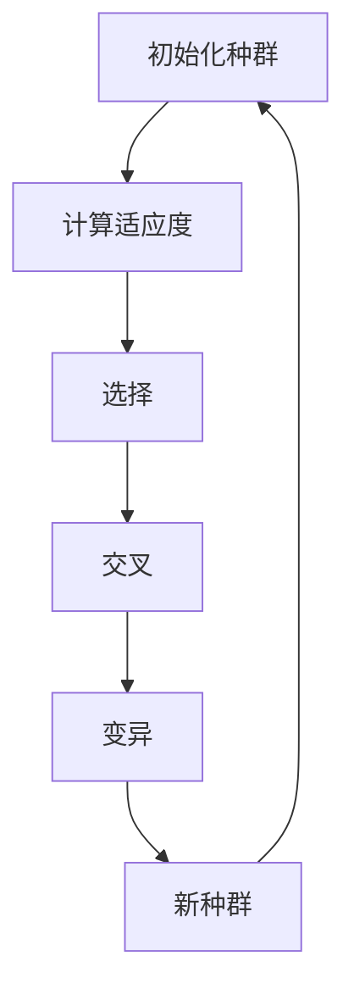
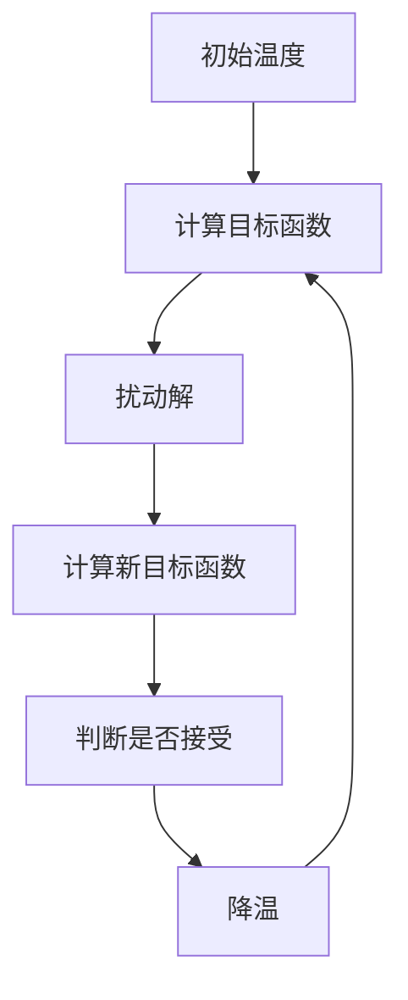
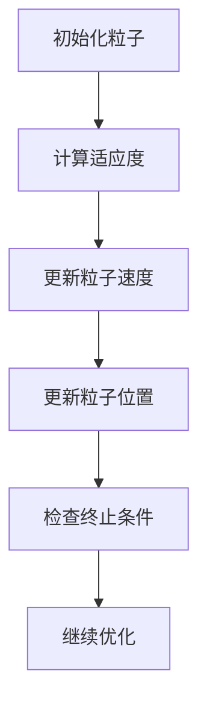
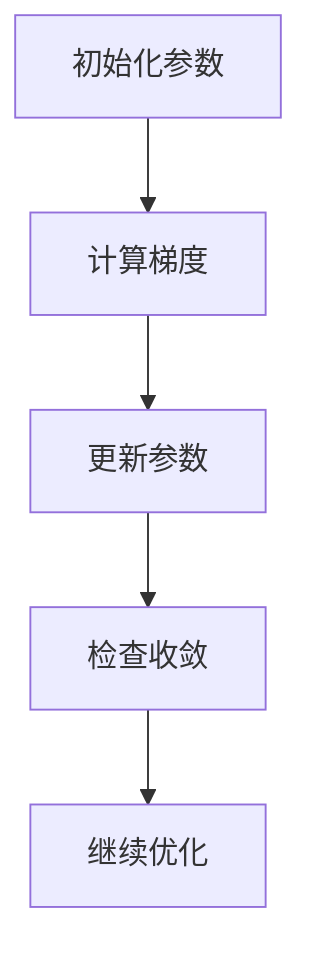
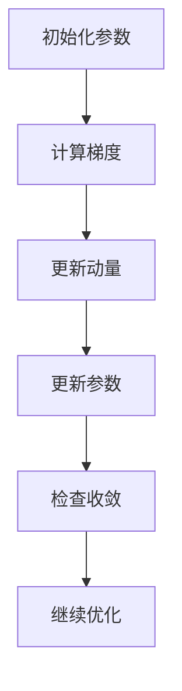
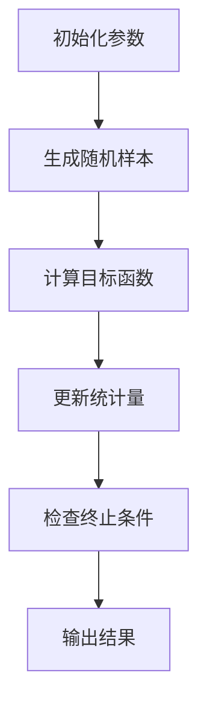
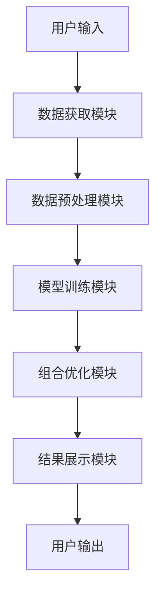
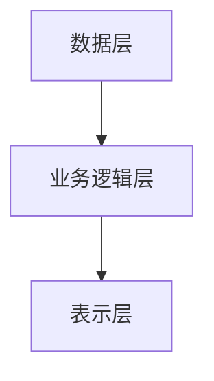
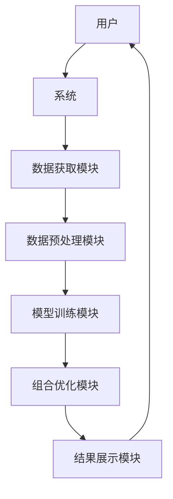

                 


## 第3章: 股票组合优化的数学模型与优化方法

### 3.1 现代投资组合理论
#### 3.1.1 均值-方差模型
##### 均值-方差模型的原理
均值-方差模型是现代投资组合理论的核心，由哈里·马科维茨在1952年提出。该模型旨在通过优化资产组合的期望收益和风险（方差）来找到最优投资组合。模型假设资产收益服从正态分布，并且投资者是风险厌恶的。

##### 均值-方差模型的公式
$$ \text{目标函数} = \min_w \left( \frac{1}{2}w^T \Sigma w \right) $$
$$ \text{约束条件} = \begin{cases} w^T \mu = r_{\text{target}} \\ w^T \mathbf{1} = 1 \end{cases} $$
其中，\( w \) 是权重向量，\( \Sigma \) 是协方差矩阵，\( \mu \) 是收益均值向量，\( r_{\text{target}} \) 是目标收益。

##### 均值-方差模型的应用
均值-方差模型可以用于确定最优投资组合，使得在给定收益下风险最小，或者在给定风险下收益最大。然而，该模型在实际应用中面临一些问题，如参数估计的困难和对正态分布的假设。

#### 3.1.2 马科维茨优化
##### 马科维茨优化的原理
马科维茨优化是均值-方差模型的扩展，允许投资者在多个资产之间分配资金，以优化风险和收益的组合。该方法假设投资者是风险厌恶的，并且可以通过调整资产权重来找到最优组合。

##### 马科维茨优化的公式
$$ \text{目标函数} = \min_w \left( w^T \Sigma w \right) $$
$$ \text{约束条件} = \begin{cases} w^T \mu = r_{\text{target}} \\ w^T \mathbf{1} = 1 \end{cases} $$

##### 马科维茨优化的应用
马科维茨优化在实践中被广泛应用于构建风险调整后的投资组合。然而，该方法在面对大量资产时计算复杂度较高，且对输入参数的敏感性较高。

### 3.2 股票组合优化的数学模型
#### 3.2.1 优化目标
股票组合优化的目标通常包括最大化收益、最小化风险或实现特定的风险-收益平衡。常见的优化目标函数包括：

- 最小化风险：$$ \text{目标函数} = \min_w \left( w^T \Sigma w \right) $$
- 最大化收益：$$ \text{目标函数} = \max_w \left( w^T \mu \right) $$
- 风险-收益平衡：$$ \text{目标函数} = \min_w \left( \frac{w^T \Sigma w}{(w^T \mu)^2} \right) $$

#### 3.2.2 约束条件
在股票组合优化中，通常需要满足以下约束条件：

- 投资比例约束：$$ \sum_{i=1}^n w_i = 1 $$
- 最低投资权重约束：$$ w_i \geq w_{\text{min}} $$
- 最高投资权重约束：$$ w_i \leq w_{\text{max}} $$
- 行业或资产类别约束：$$ \sum_{i \in \text{行业}} w_i \leq w_{\text{industry}} $$

### 3.3 股票组合优化的优化方法
#### 3.3.1 基于传统优化的方法
##### 遗传算法
遗传算法是一种模拟自然选择过程的优化方法，适用于解决复杂的组合优化问题。其步骤包括初始化种群、计算适应度、选择、交叉和变异。

遗传算法的步骤可以用流程图表示如下：



##### 模拟退火
模拟退火是一种全局优化算法，通过逐步降低温度来减少对局部最优的依赖。适用于解决高维优化问题。

模拟退火的流程图如下：



##### 粒子群优化
粒子群优化是一种基于群体智能的优化算法，通过粒子的移动来寻找最优解。

粒子群优化的流程图如下：



#### 3.3.2 基于梯度下降的方法
##### 梯度下降
梯度下降是一种常用的一阶优化算法，适用于连续优化问题。其步骤包括计算梯度、更新参数和检查收敛。

梯度下降的流程图如下：



##### 高速梯度下降
高速梯度下降是一种改进的梯度下降方法，通过动量项加速收敛。

高速梯度下降的流程图如下：



#### 3.3.3 基于蒙特卡洛模拟的方法
蒙特卡洛模拟是一种通过随机采样来估计概率分布的方法，适用于处理不确定性和风险。

蒙特卡洛模拟的流程图如下：



### 3.4 股票组合优化的数学模型实现
#### 3.4.1 优化方法选择
在选择优化方法时，需要考虑问题的规模、约束条件和计算复杂度。对于小规模问题，可以使用遗传算法或模拟退火；对于大规模问题，可以使用梯度下降或高速梯度下降。

#### 3.4.2 数学模型实现
以下是一个基于均值-方差模型的优化代码示例：

```python
import numpy as np
from scipy.optimize import minimize

def portfolio_optimization(returns, cov_matrix, target_return=0.05):
    n = len(returns)
    # 定义目标函数
    def objective(weights):
        return np.dot(weights.T, np.dot(cov_matrix, weights))
    
    # 约束条件
    constraints = [
        {'type': 'eq', 'fun': lambda w: np.sum(w) - 1},
        {'type': 'eq', 'fun': lambda w: np.dot(returns.T, w) - target_return}
    ]
    
    # 界面约束
    bounds = [(0, 1) for _ in range(n)]
    
    # 使用SLSQP求解器
    result = minimize(objective, np.ones(n)/n, method='SLSQP', bounds=bounds, constraints=constraints)
    
    return result.x

# 示例数据
n = 5
returns = np.random.rand(n, 1)
cov_matrix = np.cov(returns)
weights = portfolio_optimization(returns, cov_matrix)
```

### 3.5 本章小结
本章详细介绍了股票组合优化的数学模型和优化方法，包括均值-方差模型、马科维茨优化、遗传算法、模拟退火、粒子群优化、梯度下降和蒙特卡洛模拟。通过这些方法，投资者可以找到最优的投资组合，以实现特定的风险-收益目标。

---

## 第4章: 系统分析与架构设计

### 4.1 系统功能设计
#### 4.1.1 功能模块划分
股票组合优化系统主要包括以下几个功能模块：

1. **数据获取模块**：从数据源获取股票数据。
2. **数据预处理模块**：清洗和转换数据，计算收益和协方差矩阵。
3. **模型训练模块**：训练AI模型，实现股票组合优化。
4. **组合优化模块**：基于优化算法生成最优投资组合。
5. **结果展示模块**：可视化优化结果，提供决策支持。

#### 4.1.2 功能模块交互流程
以下是一个简要的交互流程图：



### 4.2 系统架构设计
#### 4.2.1 分层架构
系统采用分层架构，包括数据层、业务逻辑层和表示层。



#### 4.2.2 模块划分与职责
- **数据层**：负责数据的存储和管理。
- **业务逻辑层**：负责数据处理、模型训练和优化计算。
- **表示层**：负责用户界面和结果展示。

### 4.3 系统接口设计
#### 4.3.1 数据接口
```python
class DataService:
    def get_data(self, stock_list):
        pass
```

#### 4.3.2 模型接口
```python
class PortfolioOptimizer:
    def optimize(self, returns, cov_matrix, target_return):
        pass
```

#### 4.3.3 结果接口
```python
class ResultViewer:
    def display(self, weights, returns, cov_matrix):
        pass
```

### 4.4 系统交互设计
#### 4.4.1 用户与系统的交互流程
以下是一个用户与系统交互的序列图：



### 4.5 本章小结
本章从系统架构的角度，详细描述了股票组合优化系统的功能模块、架构设计和接口设计。通过分层架构和模块化设计，确保系统的可扩展性和可维护性。

---

## 第5章: 项目实战

### 5.1 环境搭建
#### 5.1.1 安装Python环境
使用Anaconda安装Python 3.8及以上版本。

#### 5.1.2 安装依赖库
安装必要的Python库：

```bash
pip install numpy scipy matplotlib pandas
```

### 5.2 系统核心实现
#### 5.2.1 数据获取模块
从Yahoo Finance获取股票数据：

```python
import pandas_datareader as pdr

def get_stock_data(tickers, start, end):
    data = pdr.get_data_yahoo(tickers, start, end)
    return data
```

#### 5.2.2 数据预处理模块
清洗和转换数据：

```python
def preprocess_data(data):
    returns = data.pct_change()
    returns = returns.dropna()
    return returns
```

#### 5.2.3 模型训练模块
训练AI模型：

```python
from sklearn.model_selection import train_test_split
import numpy as np

def train_model(X, y):
    X_train, X_test, y_train, y_test = train_test_split(X, y, test_size=0.2)
    # 使用线性回归模型
    from sklearn.linear_model import LinearRegression
    model = LinearRegression()
    model.fit(X_train, y_train)
    return model
```

#### 5.2.4 组合优化模块
实现组合优化：

```python
from scipy.optimize import minimize

def portfolio_optimization(returns, target_return=0.05):
    n = len(returns.columns)
    mu = returns.mean()
    Sigma = returns.cov()
    
    def objective(weights):
        return np.dot(weights.T, np.dot(Sigma, weights))
    
    constraints = [
        {'type': 'eq', 'fun': lambda w: np.sum(w) - 1},
        {'type': 'eq', 'fun': lambda w: np.dot(mu.T, w) - target_return}
    ]
    
    bounds = [(0, 1) for _ in range(n)]
    
    result = minimize(objective, np.ones(n)/n, method='SLSQP', bounds=bounds, constraints=constraints)
    return result.x
```

#### 5.2.5 结果展示模块
可视化优化结果：

```python
import matplotlib.pyplot as plt

def plot_portfolio(weights, returns, cov_matrix):
    plt.figure(figsize=(10, 6))
    plt.bar(weights.index, weights.values)
    plt.title('Optimal Portfolio Weights')
    plt.ylabel('Weight')
    plt.show()
```

### 5.3 案例分析
#### 5.3.1 数据获取
获取股票数据：

```python
tickers = ['AAPL', 'GOOGL', 'MSFT', 'AMZN', 'FB']
data = get_stock_data(tickers, start='2020-01-01', end='2023-01-01')
```

#### 5.3.2 数据预处理
清洗数据：

```python
returns = preprocess_data(data)
```

#### 5.3.3 组合优化
计算最优权重：

```python
weights = portfolio_optimization(returns)
```

#### 5.3.4 结果展示
可视化权重：

```python
plot_portfolio(weights, returns, data.cov())
```

### 5.4 本章小结
本章通过实际案例展示了如何使用AI驱动的股票组合优化工具进行投资组合优化。通过数据获取、预处理、模型训练和结果展示，读者可以掌握从理论到实践的整个过程。

---

## 第6章: 总结与展望

### 6.1 总结
本章总结了全文的主要内容，包括股票组合优化的基本概念、AI驱动的优化方法、系统架构设计和项目实战。通过这些内容，读者可以全面了解如何利用AI技术优化股票组合。

### 6.2 展望
未来，随着AI技术的不断发展，股票组合优化将更加智能化和个性化。可能的研究方向包括：

- 更复杂的优化算法，如深度强化学习。
- 多目标优化，考虑更多的风险和收益因素。
- 动态优化，适应市场变化。
- 可解释性增强，提高模型的透明度。

### 6.3 作者信息
作者：AI天才研究院/AI Genius Institute & 禅与计算机程序设计艺术/Zen And The Art of Computer Programming

---

### 附录: 最佳实践 Tips
1. **数据质量**：确保数据的完整性和准确性，避免因数据问题导致优化结果错误。
2. **模型选择**：根据问题规模和约束条件选择合适的优化方法，避免使用过于复杂的算法。
3. **风险管理**：在实际应用中，结合市场风险、流动性风险等多方面因素进行综合考虑。
4. **持续学习**：市场环境不断变化，需要持续更新模型和策略，以适应新的市场条件。
5. **代码优化**：优化代码性能，特别是在处理大规模数据和复杂算法时，确保系统的运行效率。

### 附录: 注意事项
- 在实际投资中，股票组合优化结果仅供参考，需结合市场实际情况进行调整。
- 模型的输入参数对优化结果影响较大，需谨慎处理。
- 遵守相关法律法规，确保投资行为的合规性。

### 附录: 拓展阅读
- 《投资学》（书籍）
- 《强化学习：理论与应用》（书籍）
- 《Python机器学习实战》（书籍）

--- 

以上是完整的《AI驱动的股票组合优化工具》的目录和正文内容。希望这篇技术博客能够为读者提供清晰、详细的指导，帮助他们理解并掌握AI驱动的股票组合优化工具的核心原理和实现方法。

