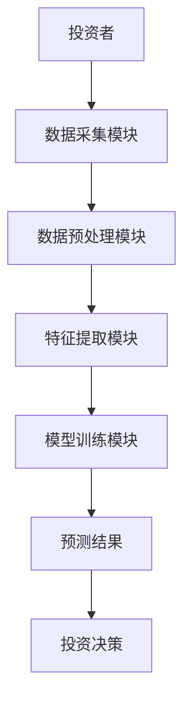
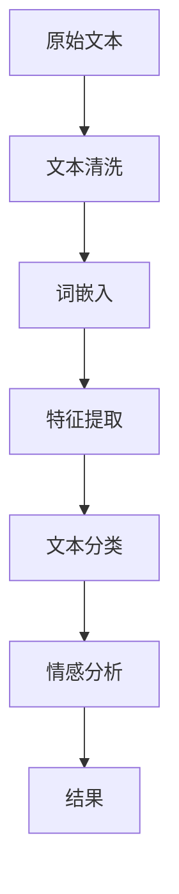
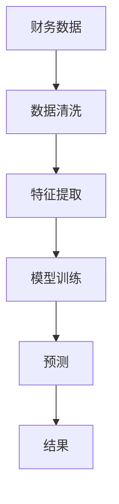
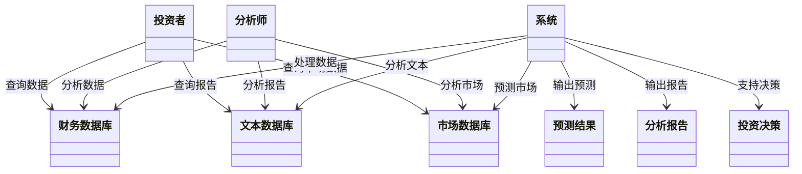

                 


# AI驱动的股票财报质量评估

> 关键词：AI, 股票财报, 质量评估, 自然语言处理, 机器学习, 深度学习, 财务数据

> 摘要：本文详细探讨了如何利用人工智能技术，特别是自然语言处理和机器学习，来评估股票财报的质量。文章从背景、核心概念、算法原理到系统架构，再到项目实战，全面解析了AI在股票财报分析中的应用。通过实际案例分析，展示了如何构建高效的AI驱动的股票财报质量评估系统，并提出了相关的最佳实践和未来研究方向。

---

# 第一部分: AI驱动的股票财报质量评估背景与基础

## 第1章: 股票财报质量评估的背景与问题

### 1.1 问题背景

#### 1.1.1 股票市场与财报的重要性
股票市场是现代金融体系的核心组成部分，而企业的财务报告（财报）是投资者评估企业财务状况、盈利能力和发展潜力的重要依据。然而，财报的复杂性和专业性使得普通投资者难以快速准确地理解和分析其内容。

#### 1.1.2 财报分析的难点与挑战
传统财报分析依赖于人工阅读和计算，存在以下问题：
- **信息量大**：财报通常包含大量的财务数据、图表和文本，人工分析效率低下。
- **主观性**：不同分析师对同一份财报的解读可能存在较大差异。
- **时间敏感性**：市场对财报的反应通常是实时的，需要快速准确的分析。

#### 1.1.3 AI技术在财报分析中的潜力
人工智能技术，特别是自然语言处理（NLP）和机器学习（ML），能够帮助自动化处理和分析大量的财务文本和数据，提供更高效、更准确的财报解读。

### 1.2 问题描述

#### 1.2.1 财报质量评估的核心目标
通过对财报内容的分析，评估企业的财务健康状况、盈利能力和发展潜力，帮助投资者做出更明智的投资决策。

#### 1.2.2 股票市场中的信息不对称问题
信息不对称是指市场参与者掌握的信息量不同，导致交易不公。AI技术可以通过自动化分析减少信息不对称，提升市场的透明度。

#### 1.2.3 现有财报分析方法的局限性
传统的财报分析方法主要依赖人工经验和统计分析，存在以下问题：
- **效率低**：人工分析耗时长，难以应对海量数据。
- **准确性差**：主观判断可能导致分析结果偏差。
- **可扩展性差**：难以同时处理大量的财报数据。

### 1.3 问题解决与边界

#### 1.3.1 AI驱动的解决方案概述
通过AI技术，特别是NLP和机器学习，实现对财报文本的自动化分析和预测，提高分析效率和准确性。

#### 1.3.2 解决方案的边界与适用范围
- **边界**：AI驱动的财报分析主要关注结构化数据和文本数据的分析，无法完全替代人类的财务分析能力。
- **适用范围**：适用于大规模数据处理、实时分析和预测性分析。

#### 1.3.3 相关概念的外延与限制
- **外延**：AI技术可以扩展到更多的金融领域，如风险管理、投资组合优化等。
- **限制**：AI模型的准确性依赖于数据质量和模型训练，可能存在过拟合和泛化能力不足的问题。

### 1.4 核心概念与结构

#### 1.4.1 财报质量评估的核心要素
- 财务数据：收入、利润、资产负债等。
- 财报文本：管理层讨论与分析（MD&A）、财务报表附注等。
- 市场反应：股票价格、成交量等市场数据。

#### 1.4.2 AI技术在财报分析中的应用架构
AI驱动的财报分析架构通常包括以下几个部分：
1. 数据采集：收集财务数据、文本数据和市场数据。
2. 数据预处理：清洗和结构化数据。
3. 特征提取：从文本和数据中提取有用的特征。
4. 模型训练：训练分类或回归模型。
5. 预测与解释：基于模型进行预测，并对结果进行解释。

#### 1.4.3 核心概念的实体关系图（ER图）

```mermaid
erDiagram
    actor 投资者
    actor 分析师
    actor 系统
    database 财务数据库
    database 文本数据库
    database 市场数据库
    entity 财务数据
    entity 文本数据
    entity 市场数据
    entity 预测结果
    entity 分析报告
    entity 投资决策
    投资者 --> 财务数据库 : 查询数据
    投资者 --> 文本数据库 : 查询报告
    投资者 --> 市场数据库 : 查询市场数据
    分析师 --> 财务数据库 : 分析数据
    分析师 --> 文本数据库 : 分析报告
    分析师 --> 市场数据库 : 分析市场
    系统 --> 财务数据库 : 处理数据
    系统 --> 文本数据库 : 分析文本
    系统 --> 市场数据库 : 预测市场
    系统 --> 预测结果 : 输出预测
    系统 --> 分析报告 : 输出报告
    系统 --> 投资决策 : 支持决策
```

---

# 第二部分: AI驱动的股票财报质量评估核心概念与联系

## 第2章: AI与股票财报分析的核心概念

### 2.1 AI技术在股票分析中的应用原理

#### 2.1.1 自然语言处理（NLP）在财报文本分析中的作用
NLP技术可以对财报文本进行情感分析、关键词提取和实体识别，帮助识别潜在的风险和机会。

#### 2.1.2 机器学习（ML）在财务数据预测中的应用
机器学习模型可以基于历史财务数据，预测未来的财务状况和股票价格走势。

#### 2.1.3 深度学习（DL）在多模态数据融合中的优势
深度学习模型可以同时处理文本、结构化数据和图像等多种数据类型，提供更全面的分析。

### 2.2 核心概念的属性对比

#### 2.2.1 NLP与传统文本分析的对比分析

| 特性         | 传统文本分析         | 基于NLP的文本分析 |
|--------------|----------------------|-------------------|
| 数据处理     | 依赖人工标记         | 自动提取特征       |
| 分析效率     | 低                   | 高                 |
| 可扩展性     | 有限                 | 强                 |

#### 2.2.2 机器学习与传统统计模型的对比

| 特性         | 传统统计模型         | 基于机器学习的模型 |
|--------------|----------------------|--------------------|
| 模型复杂性   | 简单                 | 复杂               |
| 预测精度     | 较低                 | 较高               |
| 可解释性     | 高                   | 低                 |

#### 2.2.3 深度学习模型的特征提取能力

| 特性         | 基于传统特征的模型    | 基于深度学习的模型  |
|--------------|----------------------|--------------------|
| 特征工程     | 需要人工设计          | 自动提取           |
| 表达能力     | 有限                 | 强大               |
| 精度         | 较低                 | 较高               |

### 2.3 实体关系图（ER图）与流程图

#### 2.3.1 财报分析系统的实体关系图

```mermaid
erDiagram
    entity 财务数据
    entity 文本数据
    entity 市场数据
    entity 预测结果
    entity 分析报告
    entity 投资决策
    财务数据 --> 文本数据 : 关联
    文本数据 --> 市场数据 : 关联
    财务数据 --> 预测结果 : 输入
    文本数据 --> 分析报告 : 输入
    预测结果 --> 投资决策 : 支持
    分析报告 --> 投资决策 : 支持
```

#### 2.3.2 数据流与信息处理流程图



---

# 第三部分: AI驱动的股票财报质量评估算法原理

## 第3章: 基于NLP的财报文本分析

### 3.1 算法原理

#### 3.1.1 文本预处理与特征提取
- 文本清洗：去除停用词、标点符号等。
- 词嵌入：使用Word2Vec或BERT生成词向量。
- 特征提取：提取关键词、情感倾向等。

#### 3.1.2 基于词嵌入的文本表示
- 使用预训练的词嵌入模型（如BERT）对文本进行编码，生成固定长度的向量表示。

#### 3.1.3 文本分类与情感分析
- 文本分类：将财报分为正面、负面或中性。
- 情感分析：识别文本中的情感倾向，如乐观或悲观。

### 3.2 算法流程图



## 第4章: 基于机器学习的财务数据预测

### 4.1 算法原理

#### 4.1.1 数据特征提取与选择
- 使用主成分分析（PCA）或特征选择方法，提取关键的财务指标。

#### 4.1.2 传统机器学习模型
- 随机森林：用于分类和回归任务。
- 支持向量机（SVM）：用于分类任务。

#### 4.1.3 神经网络模型
- 循环神经网络（RNN）：用于时间序列预测。
- 长短期记忆网络（LSTM）：用于时间序列预测。

### 4.2 算法流程图



---

# 第四部分: AI驱动的股票财报质量评估系统架构与设计

## 第5章: 系统分析与架构设计

### 5.1 系统功能

#### 5.1.1 数据采集模块
- 从财务数据库、文本数据库和市场数据库中采集数据。

#### 5.1.2 数据预处理模块
- 清洗和结构化数据，去除噪声。

#### 5.1.3 特征提取模块
- 提取文本和结构化数据的特征。

#### 5.1.4 模型训练模块
- 训练分类或回归模型。

#### 5.1.5 预测与解释模块
- 输出预测结果并进行解释。

### 5.2 系统架构设计

#### 5.2.1 领域模型（类图）



#### 5.2.2 系统架构图

```mermaid
archiecture
    System Boundary
    [投资者] --> [系统]: 请求数据
    [系统] --> [数据采集模块]: 获取数据
    [数据采集模块] --> [数据预处理模块]: 清洗数据
    [数据预处理模块] --> [特征提取模块]: 提取特征
    [特征提取模块] --> [模型训练模块]: 训练模型
    [模型训练模块] --> [预测与解释模块]: 输出结果
    [预测与解释模块] --> [投资者]: 提供决策支持
```

---

# 第五部分: 项目实战

## 第6章: 项目实战与分析

### 6.1 环境安装与配置

#### 6.1.1 安装Python环境
- 使用Anaconda安装Python 3.8及以上版本。

#### 6.1.2 安装必要的库
- `pip install numpy pandas scikit-learn transformers`

### 6.2 核心代码实现

#### 6.2.1 数据采集模块

```python
import pandas as pd

def load_financial_data():
    # 加载财务数据
    df = pd.read_csv('financial_data.csv')
    return df

def load_text_data():
    # 加载文本数据
    with open('text_data.txt', 'r') as f:
        text = f.read()
    return text

def load_market_data():
    # 加载市场数据
    df = pd.read_csv('market_data.csv')
    return df
```

#### 6.2.2 数据预处理模块

```python
import pandas as pd
from transformers import BertTokenizer

def preprocess_data(text):
    tokenizer = BertTokenizer.from_pretrained('bert-base-uncased')
    inputs = tokenizer.encode_plus(text, add_special_tokens=True, return_token_ids=True)
    return inputs
```

#### 6.2.3 模型训练模块

```python
from sklearn.ensemble import RandomForestClassifier
from sklearn.metrics import accuracy_score

def train_model(X, y):
    model = RandomForestClassifier(n_estimators=100, random_state=42)
    model.fit(X, y)
    return model

def evaluate_model(model, X_test, y_test):
    y_pred = model.predict(X_test)
    print("Accuracy:", accuracy_score(y_test, y_pred))
```

---

# 第六部分: 最佳实践与小结

## 第7章: 最佳实践与小结

### 7.1 最佳实践

#### 7.1.1 数据质量的重要性
确保数据的准确性和完整性是模型性能的关键。

#### 7.1.2 模型调优
通过交叉验证和网格搜索优化模型参数。

#### 7.1.3 结果解释
模型的可解释性对于投资决策至关重要。

### 7.2 小结

AI驱动的股票财报质量评估是一个复杂但极具潜力的领域。通过结合NLP和机器学习技术，可以显著提高财报分析的效率和准确性。然而，模型的准确性和可解释性仍然是需要进一步研究和优化的方向。

### 7.3 注意事项

- 数据隐私和安全问题需要高度重视。
- 模型的泛化能力需要通过大量数据进行验证。
- 结果的解释性和可操作性是投资决策的关键。

### 7.4 拓展阅读

- 《Python机器学习实战》
- 《深度学习与NLP自然语言处理》
- 《股票技术分析实战》

---

# 作者

作者：AI天才研究院/AI Genius Institute & 禅与计算机程序设计艺术 /Zen And The Art of Computer Programming

