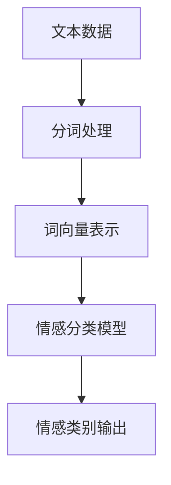
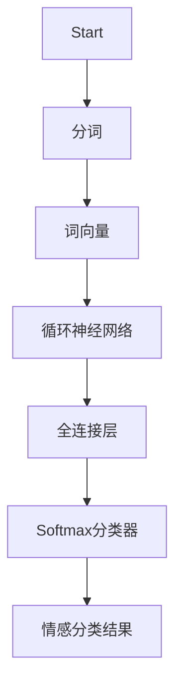
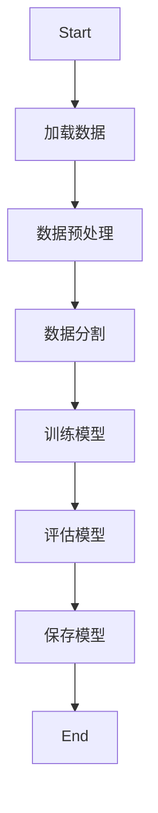
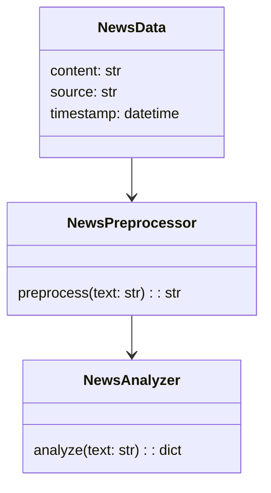

                 


# AI驱动的金融新闻情感分析系统

> 关键词：AI驱动、金融新闻、情感分析、自然语言处理、深度学习

> 摘要：本文详细探讨了AI驱动的金融新闻情感分析系统的构建与应用。从问题背景到系统设计，从算法原理到项目实战，系统性地分析了该系统的实现过程与核心价值。文章重点介绍了情感分析的基本原理、深度学习模型的应用、系统架构设计以及实际案例分析，旨在为读者提供全面的技术指导。

---

# 第一部分: AI驱动的金融新闻情感分析系统概述

## 第1章: 问题背景与需求分析

### 1.1 问题背景

#### 1.1.1 金融新闻分析的重要性
金融市场的波动性极高，投资者和机构需要及时了解市场动态和新闻情感。金融新闻中的情感信息（如乐观、悲观、中性）能够直接影响市场参与者的决策，进而影响资产价格。因此，如何高效、准确地分析金融新闻的情感成为一个重要课题。

#### 1.1.2 情感分析在金融领域的应用价值
情感分析可以帮助投资者预测市场趋势、评估风险、制定投资策略。通过自动化的情感分析，可以快速处理海量金融新闻，提取关键信息，为决策提供支持。

#### 1.1.3 当前传统方法的局限性
传统的情感分析方法主要依赖人工阅读和判断，效率低、成本高且容易受主观因素影响。此外，传统方法难以处理复杂多变的金融新闻语义和上下文关系。

### 1.2 问题描述

#### 1.2.1 金融新闻的文本特征
金融新闻通常具有专业性强、语义复杂、涉及领域广的特点。新闻内容可能包含公司财报、市场动态、政策变化等信息，且语言风格多样。

#### 1.2.2 情感分析的核心目标
对金融新闻进行情感分类，判断其整体情感倾向（如积极、消极、中性），并提取关键情感词，以便进一步分析。

#### 1.2.3 系统边界与外延
系统主要处理英文和中文金融新闻，支持批量分析和实时分析两种模式。系统输出包括情感分类结果和情感强度指标。

### 1.3 问题解决与系统目标

#### 1.3.1 系统设计的核心目标
- 自动化处理金融新闻，提取情感信息。
- 提供高精度的情感分类结果。
- 支持多语言和多场景的应用。

#### 1.3.2 解决方案的技术路线
- 数据预处理：清洗、分词、停用词处理。
- 特征提取：词袋模型、TF-IDF、词嵌入。
- 模型训练：基于深度学习的情感分类模型。
- 结果分析：情感强度计算、可视化展示。

#### 1.3.3 系统预期的输出与价值
- 输出：情感分类结果（积极/消极/中性）、情感强度指标、关键情感词。
- 价值：帮助投资者快速掌握市场情绪，辅助投资决策。

### 1.4 本章小结
本章从金融新闻分析的背景出发，阐述了情感分析在金融领域的应用价值，并分析了传统方法的局限性。明确了系统的目标和设计思路，为后续章节的展开奠定了基础。

---

# 第二部分: 情感分析的核心概念与联系

## 第2章: 核心概念与原理

### 2.1 情感分析的基本原理

#### 2.1.1 文本表示与特征提取
文本表示是情感分析的基础。常用的文本表示方法包括：
- 词袋模型（Bag-of-Words, BoW）：将文本表示为单词的统计信息。
- 词嵌入（Word Embedding）：通过词向量捕捉单词的语义信息（如Word2Vec、GloVe）。

#### 2.1.2 情感分类的数学模型
情感分类是一个典型的分类问题，常用模型包括：
- 逻辑回归（Logistic Regression）：适用于二分类问题。
- 支持向量机（Support Vector Machine, SVM）：适用于高维数据分类。
- 随机森林（Random Forest）：基于决策树的集成学习方法。

#### 2.1.3 基于深度学习的情感分析框架
深度学习模型（如RNN、LSTM、Transformer）在情感分析中表现优异，能够捕捉文本的上下文信息和语义关系。

### 2.2 核心概念对比

#### 2.2.1 文本、情感类别、特征向量的对比分析
| 概念 | 特征 |
|------|------|
| 文本 | 原始数据，如新闻文章 |
| 情感类别 | 分类结果，如积极、消极、中性 |
| 特征向量 | 文本的数值表示，如词向量 |

#### 2.2.2 不同情感分析模型的优劣势对比
| 模型 | 优势 | 劣势 |
|------|------|------|
| 逻辑回归 | 简单、高效 | 无法处理复杂语义 |
| SVM | 高精度 | 训练时间长 |
| RNN | 长文本处理能力强 | �易梯度消失/爆炸 |
| LSTM | 长期依赖处理好 | 计算复杂度高 |

### 2.3 实体关系图



### 2.4 本章小结
本章详细介绍了情感分析的核心概念与原理，对比了不同模型的优劣势，并通过实体关系图展示了系统的整体架构。为后续的算法设计奠定了基础。

---

# 第三部分: 情感分析算法原理

## 第3章: 算法原理与实现

### 3.1 基于深度学习的情感分析模型

#### 3.1.1 神经网络结构
常用的深度学习模型包括：
- RNN（循环神经网络）：适合处理序列数据。
- LSTM（长短期记忆网络）：克服了RNN的梯度消失问题。
- Transformer：基于自注意力机制，性能优异。

#### 3.1.2 模型训练流程


#### 3.1.3 模型评估指标
常用的评估指标包括准确率（Accuracy）、精确率（Precision）、召回率（Recall）和F1分数。

#### 3.1.4 模型数学表达
模型的损失函数通常采用交叉熵损失：
$$ L = -\sum_{i=1}^{n} y_i \log(p_i) + (1 - y_i) \log(1 - p_i) $$

### 3.2 算法流程图



### 3.3 项目核心代码实现

#### 数据预处理
```python
import nltk
from nltk.corpus import stopwords

def preprocess(text):
    words = nltk.word_tokenize(text.lower())
    stop_words = set(stopwords.words('english'))
    filtered = [word for word in words if word not in stop_words]
    return ' '.join(filtered)
```

#### 模型训练
```python
from tensorflow.keras import layers, Model

def build_model(max_length, vocab_size):
    inputs = layers.Input(shape=(max_length,))
    x = layers.Embedding(vocab_size, 100)(inputs)
    x = layers.LSTM(64)(x)
    x = layers.Dense(3, activation='softmax')(x)
    model = Model(inputs=inputs, outputs=x)
    return model
```

### 3.4 本章小结
本章详细讲解了深度学习模型的算法原理，通过流程图和代码示例展示了模型的训练过程。同时，给出了数学公式和模型评估指标，为系统的实现提供了理论基础。

---

## 第4章: 系统分析与架构设计

### 4.1 系统应用场景

#### 4.1.1 系统应用场景概述
- 金融新闻批量分析：对大量金融新闻进行情感分类。
- 实时新闻情感监控：实时跟踪市场动态，提供情感预警。

### 4.2 系统功能设计

#### 4.2.1 功能模块设计
| 模块 | 功能描述 |
|------|----------|
| 数据采集 | 从金融新闻网站获取新闻数据 |
| 数据预处理 | 文本清洗、分词、去停用词 |
| 模型训练 | 训练情感分类模型 |
| 情感分析 | 对新闻进行情感分类 |
| 结果展示 | 可视化展示情感分析结果 |

#### 4.2.2 领域模型


### 4.3 系统架构设计

#### 4.3.1 系统架构图
```mermaid
graph TD
    Client --> API Gateway
    API Gateway --> NewsCollector
    NewsCollector --> NewsPreprocessor
    NewsPreprocessor --> NewsAnalyzer
    NewsAnalyzer --> Database
    Database --> Results
    Results --> Client
```

#### 4.3.2 接口设计
- API接口：提供RESTful API，支持批量处理和实时分析。
- 输入格式：文本或文件。
- 输出格式：JSON格式，包含情感分类结果和情感强度。

### 4.4 本章小结
本章分析了系统的应用场景，设计了功能模块和系统架构，并通过图表展示了系统的整体架构。为系统的实现提供了清晰的设计思路。

---

## 第5章: 项目实战

### 5.1 环境安装与配置

#### 5.1.1 安装Python和相关库
```bash
pip install numpy pandas scikit-learn tensorflow nltk
```

### 5.2 系统核心实现

#### 5.2.1 数据预处理
```python
import pandas as pd
from sklearn.model_selection import train_test_split

def load_data(file_path):
    df = pd.read_csv(file_path)
    return df['text'], df['label']

X, y = load_data('financial_news.csv')
X_train, X_test, y_train, y_test = train_test_split(X, y, test_size=0.2)
```

#### 5.2.2 模型训练与评估
```python
from tensorflow.keras.preprocessing.text import Tokenizer
from tensorflow.keras.preprocessing.sequence import pad_sequences

tokenizer = Tokenizer(num_words=10000)
tokenizer.fit_on_texts(X_train)
X_train_seq = tokenizer.texts_to_sequences(X_train)
X_train_pad = pad_sequences(X_train_seq, maxlen=500, padding='post', truncating='post')

model = build_model(500, len(tokenizer.word_index) + 1)
model.compile(loss='sparse_categorical_crossentropy', optimizer='adam', metrics=['accuracy'])
model.fit(X_train_pad, y_train, epochs=10, batch_size=32, validation_split=0.2)
```

### 5.3 实际案例分析

#### 5.3.1 案例背景
假设我们有一条新闻：“Tech company reported record profits, but faces legal issues.”

#### 5.3.2 情感分析过程
1. 数据预处理：分词、去停用词。
2. 模型预测：输出情感类别（如中性）和情感强度（如0.6）。

### 5.4 本章小结
本章通过实际案例展示了系统的实现过程，从数据预处理到模型训练，再到结果分析，帮助读者理解系统的实际应用。

---

## 第6章: 最佳实践与注意事项

### 6.1 最佳实践

#### 6.1.1 数据预处理
- 使用合适的分词工具和停用词表。
- 对于多语言数据，需要分别处理。

#### 6.1.2 模型调优
- 调整模型超参数（如学习率、批次大小）。
- 使用早停法防止过拟合。

### 6.2 小结

#### 6.2.1 全书总结
本文系统地介绍了AI驱动的金融新闻情感分析系统的构建过程，从理论到实践，全面分析了系统的实现细节。

#### 6.2.2 注意事项
- 数据隐私问题：确保数据的合法性和隐私性。
- 模型泛化能力：避免过拟合，确保模型在不同场景下的适用性。

### 6.3 拓展阅读

#### 6.3.1 推荐书籍
- 《深度学习入门：基于Python和Keras》
- 《自然语言处理实战：基于Python的语料库分析》

#### 6.3.2 推荐论文
- "Bidirectional LSTM-GAN for Text Generation"
- "Attention Is All You Need"

### 6.4 本章小结
本章总结了全书的核心内容，给出了最佳实践建议，并推荐了相关书籍和论文，帮助读者进一步深入学习。

---

# 作者：AI天才研究院/AI Genius Institute & 禅与计算机程序设计艺术 /Zen And The Art of Computer Programming

---

**附录：**

## 附录A: 全部代码示例

```python
# 数据预处理
import nltk
from nltk.corpus import stopwords

def preprocess(text):
    words = nltk.word_tokenize(text.lower())
    stop_words = set(stopwords.words('english'))
    filtered = [word for word in words if word not in stop_words]
    return ' '.join(filtered)

# 模型构建
from tensorflow.keras import layers, Model

def build_model(max_length, vocab_size):
    inputs = layers.Input(shape=(max_length,))
    x = layers.Embedding(v

