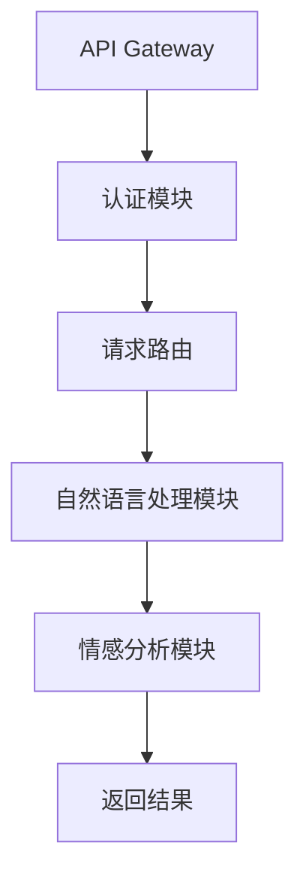
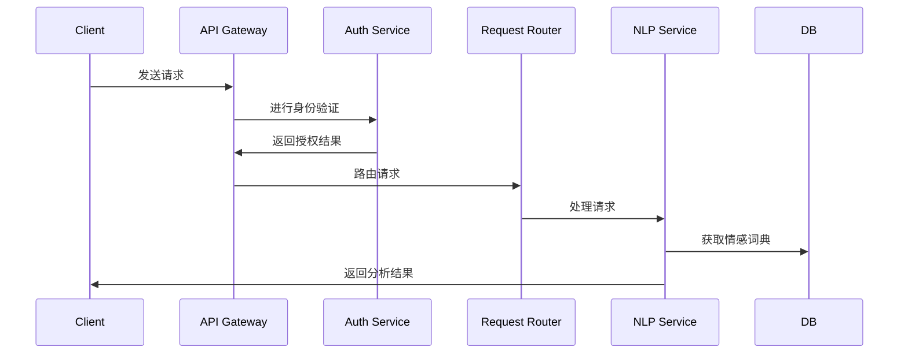

                 


# API设计：为AI Agent提供友好的接口

## 关键词：API设计、AI Agent、RESTful、安全性、可扩展性、性能优化

## 摘要：  
在现代软件开发中，API（应用程序编程接口）是连接不同系统和组件的关键桥梁。随着人工智能（AI）技术的快速发展，AI Agent（智能代理）逐渐成为实现自动化任务和智能化交互的核心。设计一个友好且高效的API，对于AI Agent的性能和用户体验至关重要。本文将从API设计的核心原则、安全性、性能优化、可扩展性等方面展开讨论，结合实际案例，深入剖析如何为AI Agent设计友好的API接口。

---

## 第一部分: API设计与AI Agent概述

### 第1章: API与AI Agent的基本概念

#### 1.1 API的基本概念  
API是一种定义良好、易于实现的接口，允许不同的系统或组件之间进行通信和交互。它通过定义数据的格式、传输方式和操作规范，使得开发者能够专注于功能实现，而不必关心底层实现细节。  

#### 1.2 AI Agent的定义与特点  
AI Agent是一种具备自主决策能力和智能化行为的软件实体。它能够感知环境、理解用户需求，并通过API与外部系统交互，完成复杂任务。  

#### 1.3 API在AI Agent中的作用  
API是AI Agent与外部系统交互的核心接口。通过设计友好的API，可以提升AI Agent的响应速度、准确性和用户体验。  

---

### 第2章: API设计的核心原则

#### 2.1 RESTful API设计原则  
REST（Representational State Transfer）是一种基于网络应用的软件架构风格，广泛应用于现代API设计中。以下是RESTful设计的核心原则：  
- **资源导向**：将系统功能抽象为具体的资源（如用户、订单、数据等）。  
- **统一接口**：使用HTTP方法（如GET、POST、PUT、DELETE）操作资源。  
- **状态无害性**：系统不应依赖客户端状态，每个请求应独立。  
- **缓存机制**：支持缓存功能，提升性能。  

#### 2.2 API版本控制  
API版本控制是确保系统兼容性和稳定性的关键。以下是常用版本控制方法：  
- **URL分隔**：通过URL路径区分版本（如/v1/api）。  
- **HTTP头部**：通过`Accept`或`API-Version`头部传递版本信息。  
- **自定义协议**：定义专属的版本控制协议。  

#### 2.3 API文档规范  
良好的API文档是开发者理解和使用API的基础。以下是文档编写最佳实践：  
- 使用OpenAPI（原Swagger）规范编写文档。  
- 提供详细的请求参数、响应格式和错误码说明。  
- 提供在线交互式文档，方便开发者测试和调试。  

---

### 第3章: API设计中的安全与权限管理

#### 3.1 API安全威胁分析  
API面临多种安全威胁，包括：  
- **未授权访问**：恶意用户通过未授权访问API接口。  
- **数据泄露**：敏感数据通过API被窃取。  
- **拒绝服务攻击（DoS）**：恶意请求导致系统崩溃。  

#### 3.2 基于OAuth 2.0的权限管理  
OAuth 2.0是一种开放标准的授权框架，广泛应用于API权限管理。以下是其授权流程：  
1. **授权码获取**：用户向授权服务器请求授权码。  
2. **令牌获取**：客户端使用授权码向令牌颁发服务器获取访问令牌。  
3. **资源访问**：客户端使用访问令牌访问受保护资源。  

#### 3.3 API签名与加密  
为了防止数据篡改和伪造请求，API签名与加密是必要的。以下是其实现方式：  
- **签名算法**：使用哈希算法（如SHA-256）对请求参数生成签名。  
- **加密传输**：通过SSL/TLS加密API通信，确保数据安全。  

---

### 第4章: API设计中的性能优化

#### 4.1 API性能瓶颈分析  
API性能瓶颈主要表现在：  
- **请求处理时间**：后端服务响应慢。  
- **网络传输效率**：数据传输延迟或带宽不足。  
- **并发处理能力**：高并发请求导致系统崩溃。  

#### 4.2 API分层设计  
分层架构是优化API性能的关键。以下是其设计原则：  
- **前端层**：处理用户请求和API调用。  
- **业务逻辑层**：处理业务逻辑和数据操作。  
- **数据访问层**：与数据库或其他存储系统交互。  

#### 4.3 API缓存策略  
缓存是提升API性能的有效手段。以下是常用缓存策略：  
- **基于时间的缓存**：设置缓存过期时间。  
- **基于条件的缓存**：根据请求参数判断是否命中缓存。  
- **分布式缓存**：使用Redis等分布式缓存系统。  

---

### 第5章: API设计的可扩展性与维护性

#### 5.1 API设计的可扩展性  
可扩展性是API设计的重要目标。以下是其实现方法：  
- **模块化设计**：将API功能模块化，便于扩展。  
- **插件机制**：通过插件实现功能扩展。  
- **版本升级**：通过版本控制实现平滑升级。  

#### 5.2 API的维护性  
维护性是API长期使用的保障。以下是维护建议：  
- **日志记录**：记录API调用日志，便于排查问题。  
- **监控与报警**：实时监控API运行状态，及时发现异常。  
- **自动化测试**：通过自动化测试确保API稳定性。  

---

## 第六章: 项目实战——设计一个AI Agent的API接口

### 6.1 项目背景与需求分析  
假设我们需要为一个AI Agent设计一个自然语言处理（NLP）API接口，用于实现文本分析和情感识别功能。  

### 6.2 系统功能设计  
以下是系统功能模块图（使用Mermaid绘制）：  



### 6.3 系统架构设计  
以下是系统架构图（使用Mermaid绘制）：  


### 6.4 系统接口设计  
以下是系统接口设计：  

- **GET /api/nlp/analyze**  
  - 请求参数：`text`（必填）  
  - 响应参数：`sentiment`（情感）和`keywords`（关键词）  

### 6.5 系统交互设计  
以下是系统交互图（使用Mermaid绘制）：  



### 6.6 代码实现与测试  
以下是核心代码实现（Python）：  

```python
from flask import Flask, request, jsonify
from textblob import TextBlob

app = Flask(__name__)

@app.route('/api/nlp/analyze', methods=['POST'])
def analyze_text():
    data = request.json
    text = data['text']
    blob = TextBlob(text)
    sentiment = blob.sentiment.polarity
    keywords = [word for word in blob.noun_phrases]
    return jsonify({
        'sentiment': sentiment,
        'keywords': keywords
    })

if __name__ == '__main__':
    app.run(debug=True)
```

---

## 第七章: 未来趋势与最佳实践

### 7.1 未来趋势  
随着AI技术的不断进步，API设计将更加注重智能化和自动化。未来的API将具备更强的自适应能力和自我修复能力。  

### 7.2 最佳实践  
- **保持简洁**：API设计应尽可能简洁，避免复杂性。  
- **文档优先**：优先编写和维护API文档。  
- **安全至上**：始终将安全性放在首位。  
- **持续优化**：定期监控和优化API性能。  

---

## 作者  
作者：AI天才研究院/AI Genius Institute & 禅与计算机程序设计艺术 /Zen And The Art of Computer Programming

