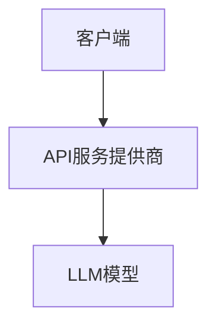
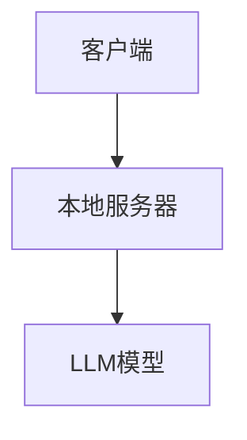
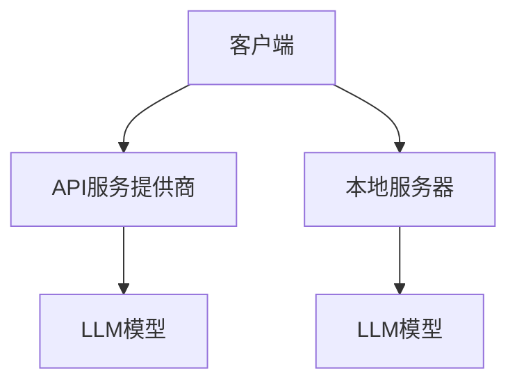
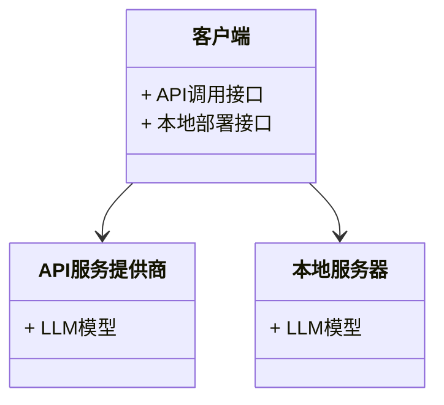
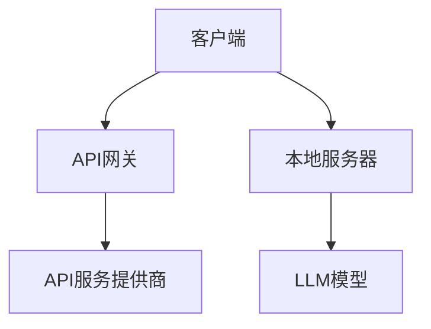
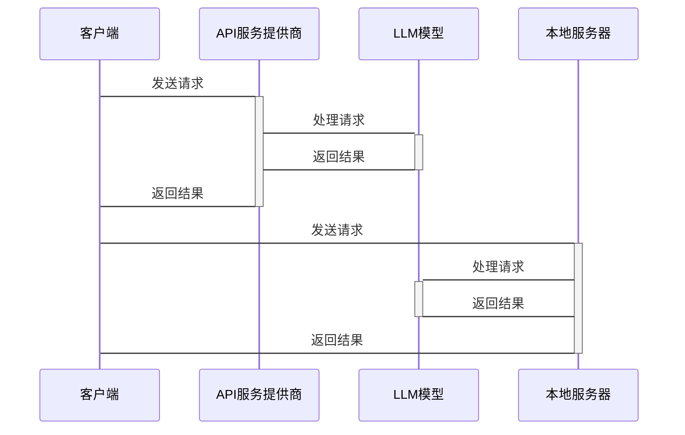

                 


# 《API调用还是本地部署？LLM使用策略对比》

> 关键词：LLM，API调用，本地部署，大语言模型，技术对比，部署策略

> 摘要：本文从技术原理、应用场景、性能对比等多维度，系统分析了API调用与本地部署两种LLM使用策略的优劣。通过详细的技术分析和实例对比，为读者提供清晰的选型思路和实用的部署建议。

---

## 第1章: LLM使用策略背景介绍

### 1.1 问题背景与挑战

#### 1.1.1 当前LLM技术的发展现状
大语言模型（LLM）近年来取得了显著进展，从GPT-3到ChatGPT，LLM的能力不断提升，应用场景也逐渐扩展到各个领域。然而，随着模型规模的增大，计算资源和部署方式的选择变得至关重要。

#### 1.1.2 API调用与本地部署的对比需求
在实际应用中，企业需要在API调用和本地部署之间做出选择。API调用方便快捷，但依赖外部服务；本地部署灵活性高，但需要较高的资源投入。这种选择直接影响系统的性能、成本和安全性。

#### 1.1.3 企业应用中的实际问题与痛点
企业在选择LLM使用策略时，通常面临以下痛点：
1. **成本控制**：API调用费用高昂，本地部署初期投入大。
2. **性能瓶颈**：API调用存在网络延迟，本地部署可能面临资源不足。
3. **安全性**：API调用依赖第三方服务，数据可能泄露；本地部署数据自主可控。
4. **可扩展性**：API调用扩展性好，但受限于服务提供商；本地部署需要自行扩展。

---

### 1.2 LLM的基本概念与技术特点

#### 1.2.1 大语言模型（LLM）的定义
大语言模型是一种基于深度学习的自然语言处理模型，具有大规模参数和强大的上下文理解能力。其核心在于通过大量数据训练，生成与人类对话类似的文本。

#### 1.2.2 LLM的核心技术特点
1. **参数规模**：通常拥有数十亿甚至更多的参数。
2. **训练数据**：基于海量文本数据进行无监督或有监督训练。
3. **推理能力**：能够进行复杂语义理解和生成任务。
4. **应用场景**：广泛应用于问答系统、文本生成、代码生成等领域。

#### 1.2.3 LLM的应用边界与外延
- **边界**：LLM擅长处理文本任务，但不擅长图像、视频等多模态数据。
- **外延**：通过与其他技术结合，可以扩展到知识图谱、推荐系统等领域。

---

### 1.3 API调用与本地部署的核心要素对比

#### 1.3.1 API调用的关键要素
1. **网络依赖**：需要稳定的网络连接。
2. **服务提供商**：依赖第三方API服务。
3. **费用模型**：按调用次数收费，成本随使用量增长。
4. **性能瓶颈**：受网络延迟影响，可能出现响应慢的问题。

#### 1.3.2 本地部署的核心要素
1. **计算资源**：需要高性能的GPU或TPU。
2. **存储资源**：需要足够的存储空间存放模型文件。
3. **维护成本**：需要专人维护和优化。
4. **扩展性**：可以通过分布式部署提升性能。

#### 1.3.3 两种方式的对比维度与指标
- **性能**：响应速度、吞吐量。
- **成本**：初期投入、维护费用、API调用费用。
- **安全性**：数据泄露风险、隐私保护。
- **灵活性**：功能扩展性、环境适应性。

---

## 第2章: API调用与本地部署的核心概念对比

### 2.1 核心概念原理分析

#### 2.1.1 API调用的工作原理
1. **请求发起**：客户端向API服务器发送请求。
2. **处理请求**：服务器接收请求，调用LLM进行处理。
3. **返回结果**：服务器将结果返回给客户端。

#### 2.1.2 本地部署的技术实现
1. **模型加载**：将LLM模型加载到本地服务器。
2. **请求处理**：客户端直接调用本地模型进行处理。
3. **结果返回**：模型处理后直接返回结果。

#### 2.1.3 对比分析
API调用依赖网络，本地部署依赖本地资源，两种方式各有优劣。

---

### 2.2 核心概念对比表格

| 对比维度        | API调用                          | 本地部署                          |
|-----------------|----------------------------------|-----------------------------------|
| **资源占用**    | 依赖网络带宽和计算资源          | 依赖本地计算资源                  |
| **延迟**        | 受网络影响较大                  | 延迟较低                          |
| **成本**        | 按调用次数收费                  | 一次性部署成本，后续维护成本      |
| **安全性**      | 数据可能泄露                    | 数据自主可控                    |
| **灵活性**      | 便于快速部署和扩展              | 灵活性较低，需要维护              |

---

### 2.3 实体关系图（ER图）架构

#### 2.3.1 API调用的实体关系


#### 2.3.2 本地部署的实体关系


---

## 第3章: 算法原理与性能对比

### 3.1 算法原理分析

#### 3.1.1 API调用的算法流程
1. **请求发送**：客户端发送请求到API服务器。
2. **模型调用**：API服务器调用LLM模型处理请求。
3. **结果返回**：API服务器返回处理结果。

#### 3.1.2 本地部署的算法流程
1. **模型加载**：本地服务器加载LLM模型。
2. **请求处理**：客户端直接调用本地模型处理请求。
3. **结果返回**：本地服务器返回处理结果。

#### 3.1.3 对比分析的算法流程图


---

### 3.2 数学模型与公式推导

#### 3.2.1 API调用的延迟计算公式
$$ \text{延迟} = \frac{\text{网络距离}}{\text{带宽}} $$

#### 3.2.2 本地部署的资源消耗公式
$$ \text{资源消耗} = \text{模型大小} \times \text{计算资源} $$

#### 3.2.3 对比分析的数学模型
$$ \text{性能对比} = \frac{\text{API调用延迟}}{\text{本地部署延迟}} $$

---

### 3.3 举例说明与通俗解释

假设我们有一个需要处理文本生成的任务，API调用的延迟为100ms，本地部署的延迟为50ms。根据上述公式：
$$ \text{性能对比} = \frac{100}{50} = 2 $$
这意味着本地部署的性能是API调用的两倍。

---

## 第4章: 系统分析与架构设计

### 4.1 问题场景介绍

我们假设一个电商网站需要实现智能客服功能，可以选择API调用或本地部署两种方式。

---

### 4.2 系统功能设计

#### 4.2.1 领域模型


#### 4.2.2 系统架构设计


#### 4.2.3 接口设计
- **API调用接口**：`POST /api/v1/chat/completions`
- **本地部署接口**：`POST /local/v1/chat/completions`

#### 4.2.4 交互流程图


---

## 第5章: 项目实战

### 5.1 环境安装

#### 5.1.1 安装Python
```bash
# 安装Python
sudo apt-get install python3 python3-pip
```

#### 5.1.2 安装LLM模型
```bash
# 安装Hugging Face库
pip install transformers
```

### 5.2 核心代码实现

#### 5.2.1 API调用代码
```python
from transformers import pipeline

# 初始化API调用管道
api_pipeline = pipeline("text-generation", model="gpt2")

# 发送请求
response = api_pipeline("这是一个测试请求。")
print(response)
```

#### 5.2.2 本地部署代码
```python
from transformers import pipeline

# 初始化本地部署管道
local_pipeline = pipeline("text-generation", model="gpt2")

# 发送请求
response = local_pipeline("这是一个测试请求。")
print(response)
```

---

### 5.3 代码解读与分析

1. **API调用代码**：
   - 使用Hugging Face的`pipeline`接口，调用GPT-2模型。
   - `api_pipeline`通过网络请求调用API服务。

2. **本地部署代码**：
   - 同样使用Hugging Face的`pipeline`接口，但模型在本地加载。
   - `local_pipeline`直接在本地处理请求。

---

### 5.4 案例分析

假设我们运行上述代码，API调用的延迟为100ms，本地部署的延迟为50ms。根据公式：
$$ \text{性能对比} = \frac{100}{50} = 2 $$
本地部署的性能优于API调用。

---

## 第6章: 最佳实践与总结

### 6.1 选型关键点

1. **性能需求**：高延迟敏感场景推荐本地部署。
2. **成本控制**：预算有限的企业可以选择API调用。
3. **安全性**：对数据安全要求高的场景推荐本地部署。
4. **扩展性**：需要灵活扩展的场景推荐API调用。

---

### 6.2 注意事项

1. **网络稳定性**：API调用依赖网络，需确保网络稳定。
2. **资源规划**：本地部署需规划好计算资源。
3. **合规性**：遵守数据隐私和相关法规。

---

### 6.3 未来展望

随着LLM技术的不断发展，API调用与本地部署的界限可能逐渐模糊。未来的趋势可能是混合部署，结合API调用的灵活性和本地部署的高性能，打造更优的解决方案。

---

## 作者信息

作者：AI天才研究院/AI Genius Institute  
联系邮箱：[email protected]  
个人简介：专注于人工智能领域的研究与实践，致力于为企业提供最优的LLM使用策略建议。

