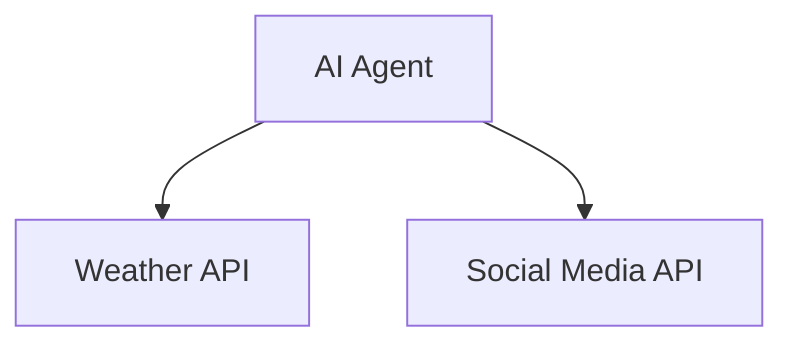
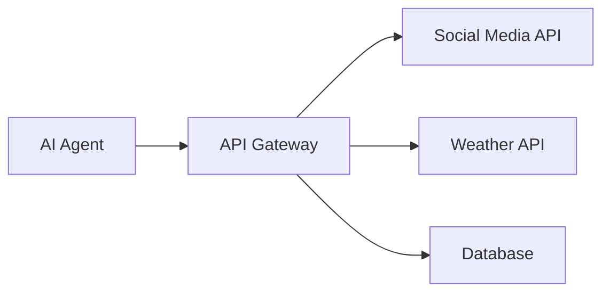

                 


# API集成：扩展AI Agent的功能与数据源

## 关键词：API集成、AI Agent、数据源扩展、功能扩展、系统架构设计

## 摘要：  
本文深入探讨了API集成在扩展AI Agent功能和数据源方面的重要作用。通过分析API集成的核心概念、系统架构设计、算法原理和项目实战，展示了如何利用API集成提升AI Agent的能力。文章内容丰富，涵盖从理论到实践的各个方面，帮助读者全面理解和掌握API集成的关键技术。

---

# 第一部分：API集成与AI Agent的背景介绍

## 第1章：API集成与AI Agent概述

### 1.1 API集成的基本概念

#### 1.1.1 什么是API  
API（Application Programming Interface）是应用程序之间的接口，用于定义不同组件之间如何交互。它允许不同系统通过标准化的接口进行通信，从而实现功能扩展。

#### 1.1.2 API的作用与特点  
API的作用包括：  
1. **功能扩展**：通过调用其他系统的API，快速获取所需功能。  
2. **数据共享**：API可以作为数据源，实现实时数据的共享与交换。  
3. **模块化设计**：API将功能模块化，便于管理和维护。  

API的特点包括：  
1. **标准化**：遵循统一的接口规范，确保不同系统之间的兼容性。  
2. **松耦合**：API定义了接口，但不关心实现细节，实现松耦合设计。  
3. **可扩展性**：通过增加新的API，系统可以轻松扩展功能。  

#### 1.1.3 API在现代系统中的重要性  
在现代系统中，API是连接不同服务和系统的桥梁。通过API，企业可以快速构建复杂的系统，实现功能的灵活扩展和数据的高效共享。

### 1.2 AI Agent的基本概念

#### 1.2.1 什么是AI Agent  
AI Agent（人工智能代理）是一种智能程序，能够感知环境、执行任务并做出决策。它通常通过传感器获取信息，利用算法处理信息，并通过执行器与环境交互。

#### 1.2.2 AI Agent的核心功能  
AI Agent的核心功能包括：  
1. **感知环境**：通过传感器或API获取外部数据。  
2. **决策制定**：基于获取的数据，利用算法做出决策。  
3. **执行操作**：通过执行器或API调用其他服务，执行具体操作。  

#### 1.2.3 AI Agent与传统程序的区别  
AI Agent与传统程序的主要区别在于其智能性和自主性。AI Agent能够自主决策、适应环境并学习，而传统程序通常只是按照预定义的规则执行任务。

### 1.3 API集成在AI Agent中的作用

#### 1.3.1 API如何扩展AI Agent的功能  
通过调用外部API，AI Agent可以获取更多功能和服务。例如，AI Agent可以通过调用天气API获取天气数据，从而实现智能决策。

#### 1.3.2 API如何增强AI Agent的数据源  
API可以作为数据源，为AI Agent提供实时、多样化的数据。例如，AI Agent可以通过调用社交媒体API获取用户行为数据，从而提升数据分析的准确性。

#### 1.3.3 API集成对AI Agent性能的影响  
API集成可以提升AI Agent的性能，但同时也需要考虑API的响应时间、可靠性等因素。合理的API设计和优化可以显著提升系统的性能。

### 1.4 API集成的挑战与解决方案

#### 1.4.1 API集成的主要挑战  
API集成的主要挑战包括：  
1. **兼容性问题**：不同系统的API可能不兼容，导致集成困难。  
2. **性能问题**：频繁的API调用可能会影响系统的性能。  
3. **安全性问题**：API调用可能带来安全风险，如数据泄露。  

#### 1.4.2 解决API集成问题的策略  
解决API集成问题的策略包括：  
1. **API网关**：通过API网关统一管理API，实现路由、鉴权和监控。  
2. **缓存机制**：通过缓存减少API调用次数，提升性能。  
3. **API版本管理**：通过版本管理确保API的兼容性和稳定性。  

#### 1.4.3 未来API集成的发展趋势  
未来，API集成将更加智能化和自动化。通过AI技术，API集成可以实现自动化的发现、管理和优化，进一步提升系统的效率和可靠性。

---

## 第2章：API集成的核心概念与联系

### 2.1 API与AI Agent的核心概念

#### 2.1.1 API的请求-响应模型  
API的请求-响应模型是API集成的基础。通过发送请求，系统可以获取API的响应结果。例如，AI Agent可以通过调用天气API获取天气数据。

#### 2.1.2 AI Agent的功能扩展  
AI Agent的功能扩展需要依赖API。通过调用外部API，AI Agent可以实现复杂的功能，如自然语言处理、图像识别等。

#### 2.1.3 API与AI Agent的交互关系  
API与AI Agent的交互关系可以用以下关系图表示：



---

## 第3章：AI Agent的功能扩展

### 3.1 API调用的基本流程

#### 3.1.1 API请求的构成  
API请求通常包含以下部分：  
1. **请求方法**：如GET、POST等。  
2. **请求头**：包含请求的元数据，如Content-Type、Authorization等。  
3. **请求体**：包含请求的具体参数。  

#### 3.1.2 API响应的处理  
API响应通常包含以下部分：  
1. **状态码**：如200表示成功，404表示未找到资源。  
2. **响应头**：包含响应的元数据。  
3. **响应体**：包含实际的响应数据。  

---

## 第4章：API集成中的系统架构设计

### 4.1 系统架构图



---

## 第5章：项目实战

### 5.1 环境安装

#### 5.1.1 安装Python环境  
建议使用Python 3.8或更高版本。  

#### 5.1.2 安装必要的库  
安装`requests`库用于发送HTTP请求：

```bash
pip install requests
```

---

### 5.2 系统核心实现源代码

#### 5.2.1 API调用代码

```python
import requests

def get_weather(city):
    api_key = "your_api_key"
    url = f"http://api.openweathermap.org/data/2.5/weather?q={city}&appid={api_key}"
    response = requests.get(url)
    return response.json()

weather = get_weather("London")
print(weather)
```

---

## 第6章：总结与注意事项

### 6.1 总结  
本文详细探讨了API集成在扩展AI Agent功能和数据源方面的重要作用。通过分析API集成的核心概念、系统架构设计、算法原理和项目实战，展示了如何利用API集成提升AI Agent的能力。

### 6.2 注意事项  
1. **安全性**：在API集成中，必须确保数据的安全性，防止数据泄露。  
2. **性能优化**：合理设计API调用的频率和方式，避免影响系统性能。  
3. **兼容性**：确保不同系统的API兼容，避免集成过程中的冲突。  

---

## 作者：AI天才研究院 & 禅与计算机程序设计艺术

---

以上是关于《API集成：扩展AI Agent的功能与数据源》的技术博客文章的完整目录和部分正文内容。

