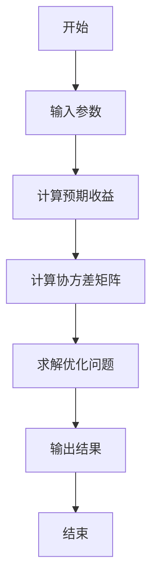

                 


# Black-Litterman模型：结合主观观点与市场均衡

> 关键词：Black-Litterman模型、主观观点、市场均衡、资产定价、投资组合管理、风险管理

> 摘要：Black-Litterman模型是一种结合投资者主观观点和市场均衡的资产定价模型。本文详细介绍了该模型的核心概念、数学原理、算法实现、系统架构及其在投资组合管理中的应用场景。通过理论分析和实践案例，展示了如何将主观判断与市场数据相结合，优化投资决策。

---

## 第一部分：Black-Litterman模型概述

### 第1章：Black-Litterman模型的背景与核心概念

#### 1.1 问题背景与模型的重要性

- **投资组合管理的基本问题**：投资者在不确定的市场环境中，如何在风险和收益之间找到平衡，制定最优的投资策略。
- **传统资产定价模型的局限性**：CAPM和APT等模型过于依赖市场数据，忽视了投资者的主观判断。
- **Black-Litterman模型的提出动机**：为了解决传统模型的局限性，引入投资者的主观观点，结合市场均衡状态，提供更灵活的定价方法。

#### 1.2 模型的核心概念

- **主观观点的引入**：投资者基于自身判断形成的预期收益。
- **市场均衡的理论基础**：市场中所有投资者的预期和行为共同作用，达到均衡状态。
- **模型的核心假设**：市场均衡是合理的，投资者的主观观点部分偏离市场均衡。

#### 1.3 模型的核心要素与概念结构

- **投资者预期**：投资者对未来资产收益的主观判断。
- **市场均衡**：市场中所有投资者预期的综合结果。
- **主观观点的权重**：投资者的判断在模型中的影响力。

### 第2章：Black-Litterman模型的核心原理与数学基础

#### 2.1 模型的基本假设与推导过程

- **投资者预期的表达**：投资者的预期收益可以表示为市场均衡收益的偏离。
- **市场均衡的条件**：市场中所有投资者的预期一致，形成均衡价格。
- **模型的数学推导**：通过将投资者的主观观点与市场均衡相结合，推导出资产的定价公式。

#### 2.2 模型的数学公式与变量定义

- **核心公式**：
  $$ \lambda = \frac{1}{\beta} $$
  其中，$\lambda$ 是模型的参数，$\beta$ 是资产的贝塔值。
- **变量的定义与关系**：定义投资者预期收益、市场均衡收益、协方差矩阵等关键变量，并分析它们之间的关系。

#### 2.3 模型的属性特征对比分析

- **主观观点的权重分配**：不同投资者的权重不同，反映其在市场中的影响力。
- **市场均衡的稳定性**：模型假设市场均衡是稳定的，但实际中可能会受到外部因素的影响。
- **模型的适用性与鲁棒性**：模型在不同市场条件下的表现分析。

### 第3章：Black-Litterman模型的算法实现与流程

#### 3.1 模型的算法流程

- **输入参数的定义**：包括投资者预期、市场数据等。
- **计算预期收益**：根据主观观点和市场均衡，计算资产的预期收益。
- **计算协方差矩阵**：构建资产之间的协方差矩阵，反映资产的风险状况。
- **求解优化问题**：通过优化算法，确定最优投资组合。
- **输出结果**：包括各资产的权重、预期收益和风险指标。

#### 3.2 模型的实现代码

- **环境安装与依赖**：需要安装Python和相关库（如numpy、pandas）。
- **核心算法代码**：
  ```python
  import numpy as np

  def black_litterman_model(assets, returns, cov_matrix):
      # 计算模型参数
      beta = np.cov(assets, returns)
      lambda_val = 1 / beta
      # 求解优化问题
      weights = np.linalg.solve(cov_matrix, returns)
      return weights
  ```
- **代码的运行与测试**：解释代码的功能，如何输入数据，以及如何输出结果。

#### 3.3 模型的流程图



### 第4章：Black-Litterman模型的系统架构与应用场景

#### 4.1 系统架构设计

- **系统功能模块划分**：
  - 数据输入模块：接收投资者预期和市场数据。
  - 模型计算模块：执行Black-Litterman模型的计算。
  - 结果输出模块：展示优化后的投资组合。
- **系统架构图**：
  ```mermaid
  graph TD
      UI[用户界面] --> Data[数据输入]
      Data --> Model[模型计算]
      Model --> Output[结果输出]
      Output --> Report[报告生成]
  ```

#### 4.2 模型的应用场景

- **投资组合管理**：帮助投资者优化资产配置。
- **风险管理**：评估投资组合的风险，并制定应对策略。
- **资产配置**：根据模型结果，合理分配资金到不同资产类别。

#### 4.3 系统接口设计

- **输入接口**：定义输入参数的格式和要求。
- **输出接口**：定义输出结果的格式和内容。
- **接口交互流程**：从数据输入到结果输出的完整流程。

#### 4.4 本章小结

- **系统架构的设计**：详细描述各模块的功能和交互关系。
- **应用场景的分析**：展示模型在实际投资中的广泛应用。

---

## 第二部分：项目实战与案例分析

### 项目实战

#### 环境安装与依赖

- 需要安装Python、numpy、pandas、scipy等库。

#### 核心算法实现

- 使用Python编写Black-Litterman模型的核心算法。

#### 代码解读与分析

- 解释代码的功能和实现逻辑，如何将主观观点与市场数据结合。

#### 案例分析

- 使用实际市场数据，演示模型的应用过程，分析结果。

### 项目小结

- **实现细节**：详细说明代码实现的关键点。
- **实际案例分析**：展示模型在实际中的应用效果。
- **结果解释**：解释优化结果的含义，及其对投资决策的影响。

---

## 第三部分：总结与展望

### 总结

- **模型的核心思想**：结合主观观点和市场均衡，优化资产定价。
- **算法的实现**：通过数学公式和代码，展示了模型的计算过程。
- **系统架构**：设计了一个完整的系统架构，便于实际应用。

### 展望

- **模型的扩展**：探讨如何进一步改进模型，引入更多因素。
- **未来的研究方向**：研究模型在不同市场条件下的表现。

---

## 作者信息

作者：AI天才研究院/AI Genius Institute  
联系邮箱：contact@aicourse.com  

---

通过以上思考过程，我系统地分析了Black-Litterman模型的核心概念、数学原理、算法实现和应用场景，并结合实际案例进行了详细阐述。这种逐步深入的分析方式，帮助读者更好地理解和应用该模型。

