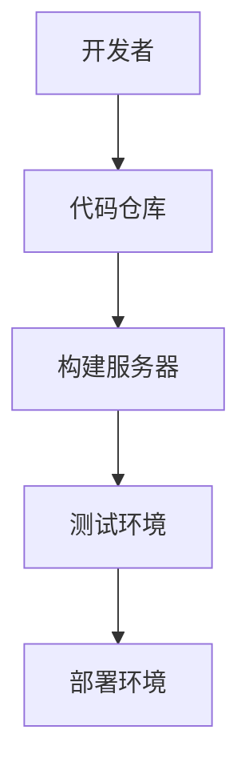

                 


# CI/CD流程：实现AI Agent的持续集成与部署

> 关键词：CI/CD, AI Agent, 持续集成, 持续部署, 软件开发, 自动化测试, 容器化

> 摘要：本文详细探讨了如何在AI Agent的开发中应用CI/CD流程，从基础概念到具体实现，结合实际案例，分析了CI/CD在提高开发效率、确保代码质量和快速迭代中的关键作用。

---

## 第一部分: CI/CD流程与AI Agent概述

### 第1章: CI/CD与AI Agent的基本概念

#### 1.1 持续集成与持续部署的背景
##### 1.1.1 软件开发中的CI/CD概念
持续集成（CI）和持续部署（CD）是现代软件开发中的重要实践。CI强调频繁地将代码合并到主分支，并自动进行构建和测试，以确保代码的稳定性。CD则是在CI的基础上，自动将代码部署到生产环境，减少手动操作，提高部署效率。

##### 1.1.2 AI Agent在现代开发中的角色
AI Agent是一种智能代理，能够根据环境和用户需求自动执行任务。它通常涉及复杂的算法和实时数据处理，对代码质量和快速迭代提出了更高的要求。

##### 1.1.3 CI/CD与AI Agent的结合意义
将CI/CD流程应用到AI Agent的开发中，可以显著提高开发效率，确保代码质量，快速响应需求变化。通过自动化构建、测试和部署，AI Agent可以在复杂的环境中保持高效和稳定。

#### 1.2 CI/CD流程的核心要素
##### 1.2.1 版本控制系统的原理
版本控制系统（如Git）是CI/CD的基础。它允许开发者协作开发，记录代码变更历史，并通过分支和合并管理不同功能的开发。

##### 1.2.2 自动化构建工具的作用
自动化构建工具（如Jenkins、GitHub Actions）可以自动编译代码、运行测试，并生成构建结果。这确保了代码在每次提交后都能及时验证。

##### 1.2.3 测试自动化的重要性
自动化测试可以覆盖单元测试、集成测试和端到端测试，确保代码在不同层面上的正确性。通过持续测试，可以在早期发现并修复问题，减少后期修复成本。

##### 1.2.4 部署自动化的目标
自动化部署通过容器化技术和CI/CD管道，将代码快速、安全地部署到目标环境。这减少了人为错误，提高了部署的可重复性和一致性。

#### 1.3 AI Agent的定义与特点
##### 1.3.1 AI Agent的基本定义
AI Agent是一种能够感知环境、执行任务并做出决策的智能系统。它通常基于机器学习算法，能够根据输入数据动态调整行为。

##### 1.3.2 AI Agent的核心功能
AI Agent的核心功能包括感知环境、理解需求、制定计划、执行任务和自适应调整。这些功能需要通过高效的代码实现，并通过CI/CD流程进行持续优化。

##### 1.3.3 AI Agent与传统软件的区别
AI Agent的特点在于其智能性和动态性。它需要处理大量数据，实时做出决策，并不断优化自身行为。这使得AI Agent的开发和部署比传统软件更为复杂。

##### 1.3.4 AI Agent在企业中的应用价值
AI Agent在企业中的应用广泛，如智能客服、自动化运维、数据分析等领域。通过CI/CD流程，企业可以更快地交付高质量的AI Agent，提高竞争力。

---

## 第二部分: CI/CD流程的核心概念与联系

### 第2章: CI/CD流程的核心概念与联系

#### 2.1 CI/CD流程的原理
##### 2.1.1 CI流程的步骤分解
1. 开发者提交代码到版本控制系统。
2. CI工具自动触发构建和测试。
3. 测试结果反馈给开发者，修复问题。
4. 重复上述过程，确保主分支代码的稳定性。

##### 2.1.2 CD流程的关键环节
1. 构建成功后，触发部署流程。
2. 通过容器化技术将应用打包。
3. 部署到测试环境，进行验证。
4. 验证通过后，自动部署到生产环境。

##### 2.1.3 CI与CD的协同关系
CI和CD相辅相成，CI确保每次提交的代码是稳定的，CD确保代码可以快速、安全地部署到生产环境。通过CI/CD的结合，实现了从代码提交到生产的全自动化流程。

#### 2.2 核心概念的属性对比
##### 2.2.1 版本控制系统的对比表格
| 版本控制系统 | Git | SVN |
|--------------|------|-----|
| 分支管理 | 支持多种分支 | 单分支 |
| 合并请求 | 支持 | 不支持 |
| 分布式 | 是 | 否 |

##### 2.2.2 构建工具的功能对比
| 工具 | Jenkins | GitHub Actions |
|------|---------|----------------|
| 部署方式 | 服务器端 | 云端 |
| 支持平台 | 多平台 | GitHub集成 |

##### 2.2.3 测试框架的优劣势分析
- 单元测试：粒度小，覆盖率高，但测试用例编写成本高。
- 集成测试：覆盖模块间接口，但测试用例数量多，运行时间长。
- 端到端测试：用户体验真实，但维护成本高。

#### 2.3 ER实体关系图


---

## 第三部分: AI Agent的持续集成流程

### 第3章: AI Agent的持续集成流程

#### 3.1 版本控制系统的实现
##### 3.1.1 Git的工作原理
Git通过仓库、分支和提交记录管理代码变更。开发者可以在本地创建分支，进行开发，然后通过合并请求将代码提交到主分支。

##### 3.1.2 分支管理策略
推荐采用GitHub Flow策略：每个功能开发使用独立分支，完成后合并到主分支，确保主分支始终是最新的稳定版本。

##### 3.1.3 合并请求的流程
1. 开发者在本地创建分支，提交代码。
2. 提交到远程仓库，创建合并请求。
3. 审核代码，进行评论和修改。
4. 审核通过后，合并到主分支。

#### 3.2 自动化构建的实现
##### 3.2.1 CI工具的选择与配置
选择Jenkins或GitHub Actions作为CI工具，配置构建脚本，设置触发条件。

##### 3.2.2 构建脚本的编写
使用Docker容器化构建环境，确保构建环境一致性。编写Dockerfile和Jenkinsfile，定义构建步骤和依赖。

##### 3.2.3 构建结果的处理
构建完成后，生成构建包和测试报告。通过Web界面查看构建状态和测试结果，便于开发者快速定位问题。

#### 3.3 测试自动化
##### 3.3.1 单元测试的编写
使用pytest编写单元测试，确保每个函数的行为符合预期。测试用例覆盖不同的输入场景，确保代码的正确性。

##### 3.3.2 集成测试的策略
编写集成测试用例，验证不同模块之间的协作。使用pytest-cov分析测试覆盖率，确保关键模块的覆盖率达标。

##### 3.3.3 测试覆盖率的分析
通过SonarQube等工具分析测试覆盖率，识别未覆盖的代码，进行针对性的测试优化。

---

## 第四部分: AI Agent的持续部署流程

### 第4章: AI Agent的持续部署流程

#### 4.1 容器化技术的应用
##### 4.1.1 Docker的基本概念
Docker是一种容器化技术，通过镜像管理和容器运行时，实现环境一致性。容器化部署确保了AI Agent在不同环境中表现一致。

##### 4.1.2 Dockerfile的编写
编写Dockerfile定义构建镜像的步骤，安装依赖包，设置环境变量，配置运行时参数。确保镜像轻量且功能完整。

##### 4.1.3 容器镜像的管理
使用Docker Hub或私有镜像仓库管理镜像，确保镜像的安全性和可追溯性。通过标签管理不同版本的镜像。

#### 4.2 持续部署的实现
##### 4.2.1 CD工具的选择与配置
选择Kubernetes或Rancher作为CD工具，配置部署流程，定义蓝绿部署策略，确保部署过程中的稳定性。

##### 4.2.2 部署管道的配置
编写Jenkins pipeline或GitHub Actions工作流，定义部署步骤，包括拉取镜像、配置环境、启动服务等。

##### 4.2.3 部署结果的监控
通过Prometheus和Grafana监控部署过程中的日志和性能指标，及时发现并解决问题。

#### 4.3 安全性和监控
##### 4.3.1 安全策略的制定
在部署过程中实施权限控制，确保只有授权用户可以进行部署操作。通过安全扫描工具检查镜像中的漏洞，确保镜像的安全性。

##### 4.3.2 监控策略的实施
部署完成后，设置日志收集和监控指标，实时跟踪AI Agent的运行状态。通过告警系统，及时通知开发人员潜在问题。

#### 4.4 最佳实践与注意事项
##### 4.4.1 最佳实践
- 定期进行代码审查，确保代码质量。
- 保持构建和部署脚本的简洁，避免复杂依赖。
- 定期更新测试用例，确保覆盖新的功能和边界条件。

##### 4.4.2 注意事项
- 在生产环境中进行部署前，确保测试环境的稳定性。
- 部署过程中，保持回滚策略，确保在出现问题时能够快速恢复。

---

## 第五部分: 项目实战

### 第5章: 项目实战

#### 5.1 环境安装
##### 5.1.1 操作系统
推荐使用Linux发行版（如Ubuntu）进行开发，确保命令行工具和开发环境的兼容性。

##### 5.1.2 工具安装
安装Git、Jenkins、Docker、Kubernetes等工具，并配置环境变量，确保工具能够正常使用。

#### 5.2 系统核心实现源代码
##### 5.2.1 AI Agent的核心代码
```python
def process_input(input_data):
    # AI Agent的核心逻辑
    pass

def main():
    import argparse
    parser = argparse.ArgumentParser(description='AI Agent')
    parser.add_argument('--input', type=str, required=True)
    args = parser.parse_args()
    print(process_input(args.input))

if __name__ == "__main__":
    main()
```

##### 5.2.2 CI/CD配置文件
```yaml
# Jenkins pipeline
pipeline {
    agent any
    stages {
        stage('Build') {
            steps {
                sh 'docker build -t ai-agent .'
            }
        }
        stage('Test') {
            steps {
                sh 'docker run ai-agent pytest tests/'
            }
        }
        stage('Deploy') {
            steps {
                sh 'docker tag ai-agent:latest'
                sh 'docker push ai-agent:latest'
            }
        }
    }
}
```

#### 5.3 代码应用解读与分析
##### 5.3.1 代码结构分析
AI Agent的代码分为核心逻辑、输入处理和主程序三部分。核心逻辑负责处理输入数据并生成输出，输入处理负责解析命令行参数，主程序负责调用核心逻辑并输出结果。

##### 5.3.2 CI/CD流程分析
CI/CD流程分为构建、测试和部署三个阶段。构建阶段使用Docker生成镜像，测试阶段运行单元测试和集成测试，部署阶段将镜像推送到仓库，并部署到目标环境。

#### 5.4 实际案例分析
##### 5.4.1 案例背景
假设我们开发了一个智能客服AI Agent，能够根据用户输入生成回复。为了确保回复的准确性，需要通过CI/CD流程快速迭代和优化。

##### 5.4.2 实施步骤
1. 开发者提交代码到Git仓库。
2. CI工具自动触发构建和测试。
3. 测试通过后，部署到测试环境，进行验证。
4. 验证通过后，部署到生产环境。

##### 5.4.3 问题与解决方案
- 问题：测试覆盖率不足，导致部分边界条件未被覆盖。
- 解决：定期更新测试用例，增加对更多场景的测试。

#### 5.5 项目小结
通过CI/CD流程，AI Agent的开发效率显著提高，代码质量得到保障。自动化测试和部署减少了人为错误，确保了AI Agent的稳定运行。

---

## 第六部分: 总结与展望

### 第6章: 总结与展望

#### 6.1 总结
本文详细探讨了如何在AI Agent的开发中应用CI/CD流程。通过持续集成和持续部署，可以实现代码的快速迭代和高质量交付。自动化构建、测试和部署不仅提高了开发效率，还确保了代码的稳定性和可维护性。

#### 6.2 未来展望
随着AI技术的不断发展，AI Agent的开发将更加复杂和动态。未来的CI/CD流程需要进一步优化，支持更多自动化功能，如自适应测试、智能部署策略等。同时，AI Agent的安全性和可扩展性也将成为研究的重点。

---

## 作者：AI天才研究院/AI Genius Institute & 禅与计算机程序设计艺术 /Zen And The Art of Computer Programming

---

以上是文章的完整目录和内容框架，涵盖了从基础概念到项目实战的各个方面。通过本文，读者可以全面了解如何在AI Agent的开发中应用CI/CD流程，并掌握相关工具和技术的使用方法。

