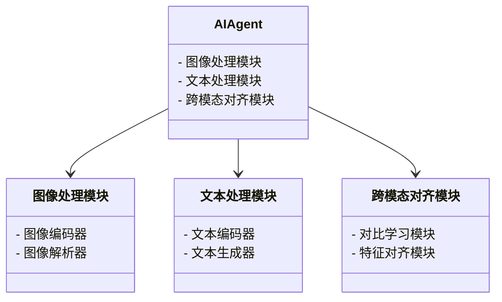
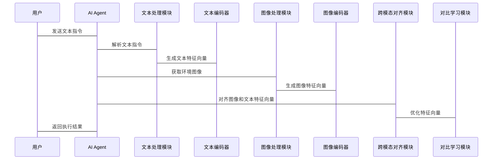

                 


# CLIP模型：实现AI Agent的跨模态理解

## 关键词：CLIP模型、跨模态理解、AI Agent、多模态学习、对比学习

## 摘要：  
本文详细探讨了CLIP（Contrastive Language–Image Pretraining）模型在实现AI Agent跨模态理解中的应用。通过分析CLIP模型的核心原理，包括多模态对比学习、特征提取与对齐机制，以及其在AI Agent中的实际应用，本文为读者提供了从理论到实践的全面解读。文章还结合具体案例，展示了如何利用CLIP模型构建跨模态理解系统，并提供了实用的开发建议与注意事项。

---

# 第1章: CLIP模型的背景与概念

## 1.1 多模态AI的发展背景

### 1.1.1 多模态AI的起源与演进  
多模态人工智能（Multi-modal AI）是近年来人工智能领域的重要研究方向。它致力于整合多种数据模态（如文本、图像、语音、视频等），以实现更全面的感知和理解能力。多模态AI的起源可以追溯到20世纪末，但真正的发展始于深度学习技术的兴起，尤其是卷积神经网络（CNN）和循环神经网络（RNN）的应用。  

早期的AI系统往往专注于单一模态的数据处理，例如图像识别或自然语言处理。然而，现实世界中的信息是多维度的，单一模态的处理能力远远不足以应对复杂的任务。因此，如何将不同模态的数据进行有效融合，成为AI研究的重要课题。  

CLIP模型正是在这一背景下提出的，它通过对比学习的方式，将文本和图像两种模态的数据进行联合建模，实现了跨模态的理解与关联。

### 1.1.2 CLIP模型的提出与技术优势  
CLIP模型由OpenAI于2021年提出，其核心思想是通过对比学习，将图像和文本的特征向量对齐，从而实现跨模态的理解。与传统的多模态模型相比，CLIP具有以下技术优势：  

1. **零样本学习能力**：CLIP通过对比学习预训练，能够在没有特定任务数据的情况下，直接对齐图像和文本的特征，适用于多种下游任务。  
2. **高效的特征对齐**：通过对比损失函数，CLIP能够自动学习图像和文本之间的语义对齐，无需额外的标注数据。  
3. **通用性与灵活性**：CLIP的架构可以轻松扩展到其他模态（如语音、视频等），具有较强的灵活性。  

### 1.1.3 AI Agent对跨模态理解的需求  
AI Agent（人工智能代理）是一种能够感知环境、自主决策并执行任务的智能系统。在现实场景中，AI Agent需要处理多种模态的信息，例如：  
- 视觉信息（图像、视频）  
- 文本信息（自然语言指令、文档）  
- 听觉信息（语音、音乐）  

跨模态理解能力是AI Agent的核心能力之一，它使得AI Agent能够更好地理解用户意图、环境状态，并做出更智能的决策。CLIP模型的出现，为AI Agent提供了强大的跨模态理解能力，使其能够同时处理图像和文本信息，并在两者之间建立语义关联。

---

## 1.2 CLIP模型的核心概念

### 1.2.1 多模态对比学习的定义  
多模态对比学习是一种通过对比不同模态数据之间的相似性，来学习共享特征表示的技术。其核心思想是：对于同一事物，不同模态的数据在语义上是相关的，可以通过对比学习将它们的特征向量对齐。  

例如，对于一张图片“猫”和一段文本“猫”，CLIP模型会通过对比学习，使得图片和文本的特征向量在语义上尽可能接近。

### 1.2.2 CLIP模型的特征提取机制  
CLIP模型的核心组件包括两个编码器：  
1. **图像编码器**：用于将图像转换为特征向量。通常采用基于Transformer的架构，例如ViT（Vision Transformer）。  
2. **文本编码器**：用于将文本转换为特征向量。通常采用预训练的文本编码器，例如BERT或GPT。  

通过对比学习，CLIP模型将图像和文本的特征向量对齐，使得具有相同语义的图像和文本具有相似的特征向量。

### 1.2.3 跨模态对齐的核心思想  
跨模态对齐是指将不同模态的数据（如图像和文本）在语义空间中对齐。CLIP模型通过对比学习实现跨模态对齐，具体步骤如下：  
1. 对于给定的图像和文本对，计算它们的特征向量。  
2. 计算图像特征和文本特征之间的相似度。  
3. 通过对比损失函数，优化特征向量的分布，使得相似的图像和文本对具有较高的相似度，不相似的对具有较低的相似度。  

---

## 1.3 CLIP模型的应用场景

### 1.3.1 图像与文本的联合理解  
CLIP模型可以在图像和文本之间建立直接的关联，从而实现联合理解。例如，给定一张图片和一段文本，CLIP可以判断文本是否与图片相关，或者根据文本生成与之相关的图像。

### 1.3.2 AI Agent中的跨模态交互  
AI Agent需要通过多种模态与用户交互，例如：  
- 用户通过文本指令控制AI Agent执行任务，AI Agent通过图像理解环境。  
- 用户通过语音指令与AI Agent交互，AI Agent通过图像或文本反馈执行结果。  

CLIP模型为AI Agent提供了强大的跨模态理解能力，使其能够同时处理图像和文本信息，并在两者之间建立语义关联。

### 1.3.3 实际应用中的典型案例  
CLIP模型已经在许多实际应用中得到广泛应用，例如：  
- **图像搜索**：根据文本描述搜索相关图像。  
- **文本到图像生成**：根据文本生成相关图像。  
- **图像描述生成**：根据图像生成文本描述。  

---

## 1.4 本章小结  
本章从多模态AI的发展背景出发，介绍了CLIP模型的核心概念与技术优势，并探讨了其在AI Agent中的应用需求。通过本章的学习，读者可以理解CLIP模型的基本原理及其在跨模态理解中的重要性。

---

# 第2章: 多模态对比学习原理

## 2.1 对比学习的基本原理

### 2.1.1 对比学习的定义与作用  
对比学习是一种通过比较不同样本之间的相似性来学习特征表示的技术。其核心思想是：通过最大化正样本对的相似度，同时最小化负样本对的相似度，来学习具有区分力的特征表示。

对比学习在多模态数据处理中具有重要作用，因为它可以将不同模态的数据在语义空间中对齐。

### 2.1.2 对比损失函数的数学表达  
对比损失函数的通用形式如下：  
$$ L = -\frac{1}{N}\sum_{i=1}^{N} \log \frac{e^{s_i}}{e^{s_i} + \sum_{j \neq i} e^{s_j}}} $$  
其中，$s_i$表示第$i$个样本对的相似度，$N$是正样本对的数量。  

通过最小化对比损失函数，可以使得正样本对的相似度尽可能高，负样本对的相似度尽可能低。

### 2.1.3 温度参数的作用与调整  
温度参数（Temperature）是对比学习中的一个重要超参数，用于调整相似度的分布。通过调整温度参数，可以控制相似度的分布范围，从而影响对比损失函数的优化效果。

---

## 2.2 CLIP模型的特征提取机制

### 2.2.1 图像编码器的工作原理  
CLIP模型的图像编码器通常采用Vision Transformer（ViT）架构，将图像划分为多个patches（块），并提取每个patch的特征向量。通过Transformer层的自注意力机制，ViT可以全局地感知图像的结构，并提取图像的高层次特征。

### 2.2.2 文本编码器的实现方式  
CLIP模型的文本编码器通常采用预训练的文本编码器，例如BERT或GPT。文本编码器将输入的文本序列转换为特征向量，每个特征向量对应一个词的语义表示。

### 2.2.3 对比学习中的特征对齐  
通过对比学习，CLIP模型将图像和文本的特征向量对齐。具体来说，对于给定的图像和文本对，计算它们的特征向量之间的相似度，并通过对比损失函数优化特征向量的分布。

---

## 2.3 跨模态对齐的实现方法

### 2.3.1 跨模态对齐的定义  
跨模态对齐是指将不同模态的数据（如图像和文本）在语义空间中对齐。通过跨模态对齐，可以使得不同模态的数据在语义上具有相同的表示。

### 2.3.2 CLIP模型中的对齐机制  
CLIP模型通过对比学习实现跨模态对齐。具体来说，CLIP模型将图像和文本的特征向量进行对比，使得具有相同语义的图像和文本对具有较高的相似度，不具有相同语义的图像和文本对具有较低的相似度。

### 2.3.3 对齐过程中的挑战与解决方案  
在跨模态对齐过程中，主要的挑战包括：  
1. **模态间信息量的差异**：不同模态的数据具有不同的信息量，例如图像的信息量通常大于文本的信息量。  
2. **模态间的语义差异**：不同模态的数据在语义上可能存在差异，例如图像中的“猫”和文本中的“狗”。  

为了解决这些问题，CLIP模型采用了对比学习的方法，通过优化特征向量的分布，使得不同模态的数据在语义上具有相同的表示。

---

## 2.4 本章小结  
本章详细介绍了多模态对比学习的基本原理，包括对比学习的定义与作用、对比损失函数的数学表达、温度参数的作用与调整，以及CLIP模型的特征提取机制和跨模态对齐的实现方法。通过本章的学习，读者可以理解CLIP模型如何通过对比学习实现跨模态对齐。

---

# 第3章: CLIP模型的算法实现

## 3.1 CLIP模型的训练流程

### 3.1.1 数据预处理与配对  
在训练CLIP模型之前，需要对图像和文本数据进行预处理，并将它们配对。例如，对于一张图片“猫”，可以配对一段文本“猫”。

### 3.1.2 对比损失的计算  
对于给定的图像和文本对，计算它们的特征向量之间的相似度，并通过对比损失函数优化特征向量的分布。

### 3.1.3 模型的优化与训练  
通过优化器（如Adam）对模型进行训练，使得对比损失函数达到最小。

---

## 3.2 CLIP模型的编码器实现

### 3.2.1 图像编码器的网络结构  
CLIP模型的图像编码器通常采用Vision Transformer（ViT）架构，将图像划分为多个patches，并通过Transformer层提取图像的高层次特征。

### 3.2.2 文本编码器的网络结构  
CLIP模型的文本编码器通常采用预训练的文本编码器，例如BERT或GPT。文本编码器将输入的文本序列转换为特征向量。

---

## 3.3 CLIP模型的对齐机制实现

### 3.3.1 对齐函数的定义  
对齐函数用于计算图像和文本特征向量之间的相似度。通常采用余弦相似度作为对齐函数。

### 3.3.2 对齐过程中的参数调整  
通过优化器对模型参数进行调整，使得图像和文本的特征向量在语义上具有相同的表示。

### 3.3.3 对齐效果的评估方法  
对齐效果可以通过计算图像和文本特征向量之间的相似度来评估。相似度越高，表示图像和文本之间的语义关联越强。

---

## 3.4 本章小结  
本章详细介绍了CLIP模型的算法实现，包括训练流程、编码器的网络结构以及对齐机制的实现方法。通过本章的学习，读者可以理解CLIP模型如何通过对比学习实现跨模态对齐。

---

# 第4章: CLIP模型的系统分析与架构设计

## 4.1 问题场景介绍  
本章以构建一个简单的AI Agent为例，介绍CLIP模型的系统架构设计。AI Agent需要通过图像和文本两种模态与用户交互，并根据用户指令执行任务。

## 4.2 项目介绍  
本项目旨在构建一个基于CLIP模型的AI Agent，使其能够通过图像和文本两种模态与用户交互，并根据用户指令执行任务。

---

## 4.3 系统功能设计

### 4.3.1 领域模型（领域模型Mermaid类图）  


### 4.3.2 系统架构设计（Mermaid架构图）  


### 4.3.3 系统接口设计  
系统接口包括：  
1. 图像处理模块与文本处理模块之间的接口。  
2. AI Agent与用户的交互接口。  

### 4.3.4 系统交互设计（Mermaid序列图）  


---

## 4.4 本章小结  
本章通过构建一个简单的AI Agent系统，介绍了CLIP模型的系统架构设计。通过本章的学习，读者可以理解CLIP模型如何在实际系统中实现跨模态对齐。

---

# 第5章: 项目实战

## 5.1 环境安装

### 5.1.1 安装Python与依赖库  
安装Python和必要的依赖库，例如：  
- `numpy`  
- `torch`  
- `transformers`  
- `mermaid`  

### 5.1.2 安装CLIP模型  
安装CLIP模型，例如使用Hugging Face提供的预训练模型。

---

## 5.2 系统核心实现源代码

### 5.2.1 图像编码器实现  
```python
import torch
from transformers import ViTFeatureExtractor

class ImageEncoder:
    def __init__(self, model_name="google/vit-base-patch16-224"):
        self.feature_extractor = ViTFeatureExtractor.from_pretrained(model_name)
        self.model = torch.nn.Sequential(*list(ViTFeatureExtractor.from_pretrained(model_name).model.children())[:-1])

    def encode(self, images):
        inputs = self.feature_extractor(images, return_tensors="pt")
        with torch.no_grad():
            outputs = self.model(**inputs)
        return outputs.last_hidden_state[:, 0, :]
```

### 5.2.2 文本编码器实现  
```python
from transformers import AutoTokenizer, AutoModelForMaskedLM

class TextEncoder:
    def __init__(self, model_name="bert-base-uncased"):
        self.tokenizer = AutoTokenizer.from_pretrained(model_name)
        self.model = AutoModelForMaskedLM.from_pretrained(model_name)

    def encode(self, text):
        inputs = self.tokenizer(text, return_tensors="pt", padding=True, truncation=True)
        with torch.no_grad():
            outputs = self.model(**inputs)
        return outputs.last_hidden_state[:, 0, :]
```

### 5.2.3 对比学习模块实现  
```python
import torch.nn as nn
import torch.nn.functional as F

class ContrastiveLoss(nn.Module):
    def __init__(self, temperature=0.1):
        super(ContrastiveLoss, self).__init__()
        self.temperature = temperature

    def forward(self, image_features, text_features):
        logits = (image_features @ text_features.T) / self.temperature
        labels = torch.arange(len(image_features), device=image_features.device)
        loss = F.cross_entropy(logits, labels)
        return loss
```

---

## 5.3 代码应用解读与分析  
通过上述代码，可以实现CLIP模型的核心功能，包括图像编码器、文本编码器以及对比学习模块。图像编码器将图像转换为特征向量，文本编码器将文本转换为特征向量，对比学习模块通过对比损失函数优化特征向量的分布。

---

## 5.4 实际案例分析  
以图像搜索为例，用户输入文本查询，AI Agent通过文本编码器将文本转换为特征向量，然后通过对比学习模块匹配与文本特征向量相似的图像，从而实现图像搜索。

---

## 5.5 项目小结  
通过本章的项目实战，读者可以掌握CLIP模型的核心实现方法，并能够将其应用到实际项目中。

---

# 第6章: 最佳实践、小结与注意事项

## 6.1 最佳实践  
1. **数据预处理**：确保图像和文本数据的配对准确，避免数据偏差。  
2. **模型调优**：通过调整温度参数和优化策略，提高对比学习的效果。  
3. **系统扩展**：将CLIP模型扩展到其他模态（如语音、视频等），实现多模态的跨模态理解。

## 6.2 小结  
通过本文的介绍，读者可以全面了解CLIP模型的核心原理、算法实现以及系统架构设计。CLIP模型为AI Agent提供了强大的跨模态理解能力，使其能够同时处理图像和文本信息，并在两者之间建立语义关联。

## 6.3 注意事项  
1. **数据隐私**：在处理图像和文本数据时，需要注意数据隐私和安全问题。  
2. **模型性能**：CLIP模型的性能依赖于训练数据的质量和数量，需要进行充分的训练和调优。  
3. **系统兼容性**：在实际应用中，需要考虑系统的兼容性和扩展性，确保系统的稳定性和可靠性。

---

## 6.4 拓展阅读  
1. **CLIP模型论文**：OpenAI的官方论文详细介绍了CLIP模型的实现方法和应用场景。  
2. **多模态AI研究**：了解多模态AI领域的最新研究进展，探索CLIP模型的更多应用。  
3. **AI Agent开发**：学习AI Agent的开发方法，掌握跨模态理解的核心技术。

---

## 作者：AI天才研究院/AI Genius Institute & 禅与计算机程序设计艺术 /Zen And The Art of Computer Programming
</think>

# CLIP模型：实现AI Agent的跨模态理解

## 关键词：CLIP模型、跨模态理解、AI Agent、多模态学习、对比学习

## 摘要：  
本文详细探讨了CLIP（Contrastive Language–Image Pretraining）模型在实现AI Agent跨模态理解中的应用。通过分析CLIP模型的核心原理，包括多模态对比学习、特征提取与对齐机制，以及其在AI Agent中的实际应用，本文为读者提供了从理论到实践的全面解读。文章还结合具体案例，展示了如何利用CLIP模型构建跨模态理解系统，并提供了实用的开发建议与注意事项。

---

# 第1章: CLIP模型的背景与概念

## 1.1 多模态AI的发展背景

### 1.1.1 多模态AI的起源与演进  
多模态人工智能（Multi-modal AI）是近年来人工智能领域的重要研究方向。它致力于整合多种数据模态（如文本、图像、语音、视频等），以实现更全面的感知和理解能力。多模态AI的起源可以追溯到20世纪末，但真正的发展始于深度学习技术的兴起，尤其是卷积神经网络（CNN）和循环神经网络（RNN）的应用。  

早期的AI系统往往专注于单一模态的数据处理，例如图像识别或自然语言处理。然而，现实世界中的信息是多维度的，单一模态的处理能力远远不足以应对复杂的任务。因此，如何将不同模态的数据进行有效融合，成为AI研究的重要课题。  

CLIP模型正是在这一背景下提出的，它通过对比学习的方式，将图像和文本两种模态的数据进行联合建模，实现了跨模态的理解与关联。

### 1.1.2 CLIP模型的提出与技术优势  
CLIP模型由OpenAI于2021年提出，其核心思想是通过对比学习，将图像和文本的特征向量对齐，从而实现跨模态的理解。与传统的多模态模型相比，CLIP具有以下技术优势：  

1. **零样本学习能力**：CLIP通过对比学习预训练，能够在没有特定任务数据的情况下，直接对齐图像和文本的特征，适用于多种下游任务。  
2. **高效的特征对齐**：通过对比损失函数，CLIP能够自动学习图像和文本之间的语义对齐，无需额外的标注数据。  
3. **通用性与灵活性**：CLIP的架构可以轻松扩展到其他模态（如语音、视频等），具有较强的灵活性。  

### 1.1.3 AI Agent对跨模态理解的需求  
AI Agent（人工智能代理）是一种能够感知环境、自主决策并执行任务的智能系统。在现实场景中，AI Agent需要处理多种模态的信息，例如：  
- 视觉信息（图像、视频）  
- 文本信息（自然语言指令、文档）  
- 听觉信息（语音、音乐）  

跨模态理解能力是AI Agent的核心能力之一，它使得AI Agent能够更好地理解用户意图、环境状态，并做出更智能的决策。CLIP模型的出现，为AI Agent提供了强大的跨模态理解能力，使其能够同时处理图像和文本信息，并在两者之间建立语义关联。

---

## 1.2 CLIP模型的核心概念

### 1.2.1 多模态对比学习的定义  
多模态对比学习是一种通过对比不同模态数据之间的相似性，来学习共享特征表示的技术。其核心思想是：对于同一事物，不同模态的数据在语义上是相关的，可以通过对比学习将它们的特征向量对齐。  

例如，对于一张图片“猫”和一段文本“猫”，CLIP模型会通过对比学习，使得图片和文本的特征向量在语义上尽可能接近。

### 1.2.2 CLIP模型的特征提取机制  
CLIP模型的核心组件包括两个编码器：  
1. **图像编码器**：用于将图像转换为特征向量。通常采用基于Transformer的架构，例如ViT（Vision Transformer）。  
2. **文本编码器**：用于将文本转换为特征向量。通常采用预训练的文本编码器，例如BERT或GPT。  

通过对比学习，CLIP模型将图像和文本的特征向量对齐，使得具有相同语义的图像和文本具有相似的特征向量。

### 1.2.3 跨模态对齐的核心思想  
跨模态对齐是指将不同模态的数据（如图像和文本）在语义空间中对齐。CLIP模型通过对比学习实现跨模态对齐，具体步骤如下：  
1. 对于给定的图像和文本对，计算它们的特征向量。  
2. 计算图像特征和文本特征之间的相似度。  
3. 通过对比损失函数，优化特征向量的分布，使得相似的图像和文本对具有较高的相似度，不相似的对具有较低的相似度。  

---

## 1.3 CLIP模型的应用场景

### 1.3.1 图像与文本的联合理解  
CLIP模型可以在图像和文本之间建立直接的关联，从而实现联合理解。例如，给定一张图片和一段文本，CLIP可以判断文本是否与图片相关，或者根据文本生成与之相关的图像。

### 1.3.2 AI Agent中的跨模态交互  
AI Agent需要通过多种模态与用户交互，例如：  
- 用户通过文本指令控制AI Agent执行任务，AI Agent通过图像理解环境。  
- 用户通过语音指令与AI Agent交互，AI Agent通过图像或文本反馈执行结果。  

CLIP模型为AI Agent提供了强大的跨模态理解能力，使其能够同时处理图像和文本信息，并在两者之间建立语义关联。

### 1.3.3 实际应用中的典型案例  
CLIP模型已经在许多实际应用中得到广泛应用，例如：  
- **图像搜索**：根据文本描述搜索相关图像。  
- **文本到图像生成**：根据文本生成相关图像。  
- **图像描述生成**：根据图像生成文本描述。  

---

## 1.4 本章小结  
本章从多模态AI的发展背景出发，介绍了CLIP模型的核心概念与技术优势，并探讨了其在AI Agent中的应用需求。通过本章的学习，读者可以理解CLIP模型的基本原理及其在跨模态理解中的重要性。

---

# 第2章: 多模态对比学习原理

## 2.1 对比学习的基本原理

### 2.1.1 对比学习的定义与作用  
对比学习是一种通过比较不同样本之间的相似性来学习特征表示的技术。其核心思想是：通过最大化正样本对的相似度，同时最小化负样本对的相似度，来学习具有区分力的特征表示。

对比学习在多模态数据处理中具有重要作用，因为它可以将不同模态的数据在语义空间中对齐。

### 2.1.2 对比损失函数的数学表达  
对比损失函数的通用形式如下：  
$$ L = -\frac{1}{N}\sum_{i=1}^{N} \log \frac{e^{s_i}}{e^{s_i} + \sum_{j \neq i} e^{s_j}}} $$  
其中，$s_i$表示第$i$个样本对的相似度，$N$是正样本对的数量。  

通过最小化对比损失函数，可以使得正样本对的相似度尽可能高，负样本对的相似度尽可能低。

### 2.1.3 温度参数的作用与调整  
温度参数（Temperature）是对比学习中的一个重要超参数，用于调整相似度的分布。通过调整温度参数，可以控制相似度的分布范围，从而影响对比损失函数的优化效果。

---

## 2.2 CLIP模型的特征提取机制

### 2.2.1 图像编码器的工作原理  
CLIP模型的图像编码器通常采用Vision Transformer（ViT）架构，将图像划分为多个patches（块），并提取每个patch的特征向量。通过Transformer层的自注意力机制，ViT可以全局地感知图像的结构，并提取图像的高层次特征。

### 2.2.2 文本编码器的实现方式  
CLIP模型的文本编码器通常采用预训练的文本编码器，例如BERT或GPT。文本编码器将输入的文本序列转换为特征向量，每个特征向量对应一个词的语义表示。

### 2.2.3 对比学习中的特征对齐  
通过对比学习，CLIP模型将图像和文本的特征向量对齐。具体来说，对于给定的图像和文本对，计算它们的特征向量之间的相似度，并通过对比损失函数优化特征向量的分布。

---

## 2.3 跨模态对齐的实现方法

### 2.3.1 跨模态对齐的定义  
跨模态对齐是指将不同模态的数据（如图像和文本）在语义空间中对齐。通过跨模态对齐，可以使得不同模态的数据在语义上具有相同的表示。

### 2.3.2 CLIP模型中的对齐机制  
CLIP模型通过对比学习实现跨模态对齐。具体来说，CLIP模型将图像和文本的特征向量进行对比，使得具有相同语义的图像和文本对具有较高的相似度，不具有相同语义的图像和文本对具有较低的相似度。

### 2.3.3 对齐过程中的挑战与解决方案  
在跨模态对齐过程中，主要的挑战包括：  
1. **模态间信息量的差异**：不同模态的数据具有不同的信息量，例如图像的信息量通常大于文本的信息量。  
2. **模态间的语义差异**：不同模态的数据在语义上可能存在差异，例如图像中的“猫”和文本中的“狗”。  

为了解决这些问题，CLIP模型采用了对比学习的方法，通过优化特征向量的分布，使得不同模态的数据在语义上具有相同的表示。

---

## 2.4 本章小结  
本章详细介绍了多模态对比学习的基本原理，包括对比学习的定义与作用、对比损失函数的数学表达、温度参数的作用与调整，以及CLIP模型的特征提取机制和跨模态对齐的实现方法。通过本章的学习，读者可以理解CLIP模型如何通过对比学习实现跨模态对齐。

---

# 第3章: CLIP模型的算法实现

## 3.1 CLIP模型的训练流程

### 3.1.1 数据预处理与配对  
在训练CLIP模型之前，需要对图像和文本数据进行预处理，并将它们配对。例如，对于一张图片“猫”，可以配对一段文本“猫”。

### 3.1.2 对比损失的计算  
对于给定的图像和文本对，计算它们的特征向量之间的相似度，并通过对比损失函数优化特征向量的分布。

### 3.1.3 模型的优化与训练  
通过优化器（如Adam）对模型进行训练，使得对比损失函数达到最小。

---

## 3.2 CLIP模型的编码器实现

### 3.2.1 图像编码器的网络结构  
CLIP模型的图像编码器通常采用Vision Transformer（ViT）架构，将图像划分为多个patches，并通过Transformer层提取图像的高层次特征。

### 3.2.2 文本编码器的网络结构  
CLIP模型的文本编码器通常采用预训练的文本编码器，例如BERT或GPT。文本编码器将输入的文本序列转换为特征向量。

---

## 3.3 CLIP模型的对齐机制实现

### 3.3.1 对齐函数的定义  
对齐函数用于计算图像和文本特征向量之间的相似度。通常采用余弦相似度作为对齐函数。

### 3.3.2 对齐过程中的参数调整  
通过优化器对模型参数进行调整，使得图像和文本的特征向量在语义上具有相同的表示。

### 3.3.3 对齐效果的评估方法  
对齐效果可以通过计算图像和文本特征向量之间的相似度来评估。相似度越高，表示图像和文本之间的语义关联越强。

---

## 3.4 本章小结  
本章详细介绍了CLIP模型的算法实现，包括训练流程、编码器的网络结构以及对齐机制的实现方法。通过本章的学习，读者可以理解CLIP模型如何通过对比学习实现跨模态对齐。

---

# 第4章: CLIP模型的系统分析与架构设计

## 4.1 问题场景介绍  
本章以构建一个简单的AI Agent为例，介绍CLIP模型的系统架构设计。AI Agent需要通过图像和文本两种模态与用户交互，并根据用户指令执行任务。

## 4.2 项目介绍  
本项目旨在构建一个基于CLIP模型的AI Agent，使其能够通过图像和文本两种模态与用户交互，并根据用户指令执行任务。

---

## 4.3 系统功能设计

### 4.3.1 领域模型（领域模型Mermaid类图）  


### 4.3.2 系统架构设计（Mermaid架构图）  


### 4.3.3 系统接口设计  
系统接口包括：  
1. 图像处理模块与文本处理模块之间的接口。  
2. AI Agent与用户的交互接口。  

### 4.3.4 系统交互设计（Mermaid序列图）  


---

## 4.4 本章小结  
本章通过构建一个简单的AI Agent系统，介绍了CLIP模型的系统架构设计。通过本章的学习，读者可以理解CLIP模型如何在实际系统中实现跨模态对齐。

---

# 第5章: 项目实战

## 5.1 环境安装

### 5.1.1 安装Python与依赖库  
安装Python和必要的依赖库，例如：  
- `numpy`  
- `torch`  
- `transformers`  
- `mermaid`  

### 5.1.2 安装CLIP模型  
安装CLIP模型，例如使用Hugging Face提供的预训练模型。

---

## 5.2 系统核心实现源代码

### 5.2.1 图像编码器实现  
```python
import torch
from transformers import ViTFeatureExtractor

class ImageEncoder:
    def __init__(self, model_name="google/vit-base-patch16-224"):
        self.feature_extractor = ViTFeatureExtractor.from_pretrained(model_name)
        self.model = torch.nn.Sequential(*list(ViTFeatureExtractor.from_pretrained(model_name).model.children())[:-1])

    def encode(self, images):
        inputs = self.feature_extractor(images, return_tensors="pt")
        with torch.no_grad():
            outputs = self.model(**inputs)
        return outputs.last_hidden_state[:, 0, :]
```

### 5.2.2 文本编码器实现  
```python
from transformers import AutoTokenizer, AutoModelForMaskedLM

class TextEncoder:
    def __init__(self, model_name="bert-base-uncased"):
        self.tokenizer = AutoTokenizer.from_pretrained(model_name)
        self.model = AutoModelForMaskedLM.from_pretrained(model_name)

    def encode(self, text):
        inputs = self.tokenizer(text, return_tensors="pt", padding=True, truncation=True)
        with torch.no_grad():
            outputs = self.model(**inputs)
        return outputs.last_hidden_state[:, 0, :]
```

### 5.2.3 对比学习模块实现  
```python
import torch.nn as nn
import torch.nn.functional as F

class ContrastiveLoss(nn.Module):
    def __init__(self, temperature=0.1):
        super(ContrastiveLoss, self).__init__()
        self.temperature = temperature

    def forward(self, image_features, text_features):
        logits = (image_features @ text_features.T) / self.temperature
        labels = torch.arange(len(image_features), device=image_features.device)
        loss = F.cross_entropy(logits, labels)
        return loss
```

---

## 5.3 代码应用解读与分析  
通过上述代码，可以实现CLIP模型的核心功能，包括图像编码器、文本编码器以及对比学习模块。图像编码器将图像转换为特征向量，文本编码器将文本转换为特征向量，对比学习模块通过对比损失函数优化特征向量的分布。

---

## 5.4 实际案例分析  
以图像搜索为例，用户输入文本查询，AI Agent通过文本编码器将文本转换为特征向量，然后通过对比学习模块匹配与文本特征向量相似的图像，从而实现图像搜索。

---

## 5.5 项目小结  
通过本章的项目实战，读者可以掌握CLIP模型的核心实现方法，并能够将其应用到实际项目中。

---

# 第6章: 最佳实践、小结与注意事项

## 6.1 最佳实践  
1. **数据预处理**：确保图像和文本数据的配对准确，避免数据偏差。  
2. **模型调优**：通过调整温度参数和优化策略，提高对比学习的效果。  
3. **系统扩展**：将CLIP模型扩展到其他模态（如语音、视频等），实现多模态的跨模态理解。

## 6.2 小结  
通过本文的介绍，读者可以全面了解CLIP模型的核心原理、算法实现以及系统架构设计。CLIP模型为AI Agent提供了强大的跨模态理解能力，使其能够同时处理图像和文本信息，并在两者之间建立语义关联。

## 6.3 注意事项  
1. **数据隐私**：在处理图像和文本数据时，需要注意数据隐私和安全问题。  
2. **模型性能**：CLIP模型的性能依赖于训练数据的质量和数量，需要进行充分的训练和调优。  
3. **系统兼容性**：在实际应用中，需要考虑系统的兼容性和扩展性，确保系统的稳定性和可靠性。

---

## 6.4 拓展阅读  
1. **CLIP模型论文**：OpenAI的官方论文详细介绍了CLIP模型的实现方法和应用场景。  
2. **多模态AI研究**：了解多模态AI领域的最新研究进展，探索CLIP模型的更多应用。  
3. **AI Agent开发**：学习AI Agent的开发方法，掌握跨模态理解的核心技术。

---

## 作者：AI天才研究院/AI Genius Institute & 禅与计算机程序设计艺术 /Zen And The Art of Computer Programming

