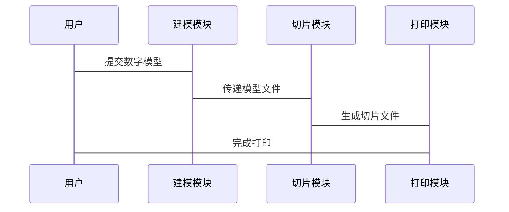
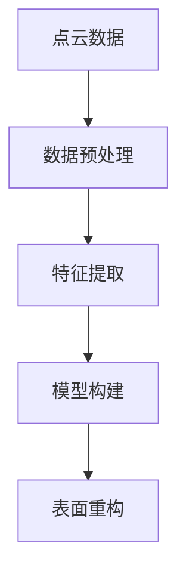
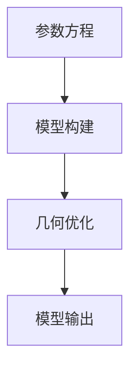
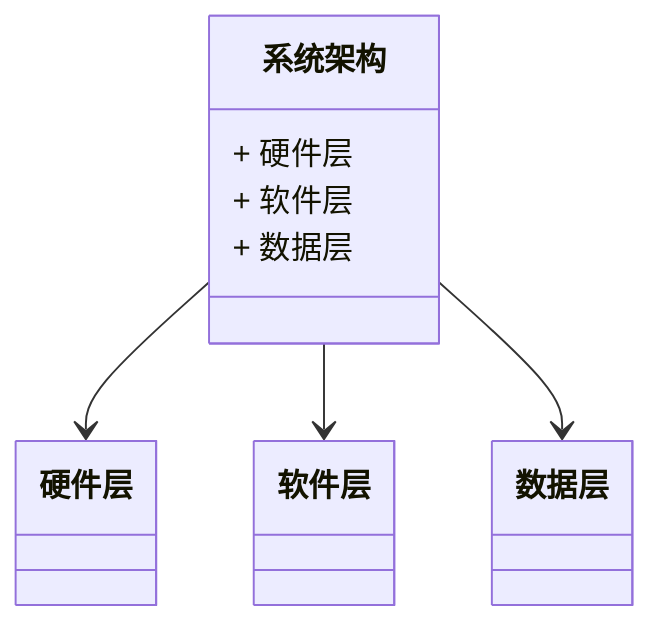

                 


# 《3D打印技术对制造业的革新与投资机会》

---

## 关键词：
3D打印技术, 制造业革新, 投资机会, 增材制造, 数字化制造, 创新设计

---

## 摘要：
3D打印技术（增材制造）正在改变全球制造业的面貌。它通过数字化设计与制造的结合，实现了复杂结构的快速原型制作、小批量高效生产以及个性化定制。本文将从技术原理、行业应用、投资价值等角度，系统分析3D打印技术对传统制造业的革新，并揭示其背后的投资机遇。通过案例分析、系统设计与数学建模，本文将深入探讨这一技术的核心优势与未来发展方向。

---

# 第一部分: 3D打印技术的背景与基础

## 第1章: 3D打印技术的概述

### 1.1 3D打印技术的基本概念

#### 1.1.1 3D打印的定义与特点
3D打印技术是一种基于数字模型的制造技术，通过逐层叠加材料（如塑料、金属、陶瓷等）来构建三维物体。其特点包括：
- **快速原型制作**：快速从数字模型生成实物原型。
- **复杂结构制造**：能够制造传统工艺难以实现的复杂几何形状。
- **按需生产**：支持小批量、个性化定制生产。
- **资源节约**：材料利用率高，减少浪费。

#### 1.1.2 3D打印与传统制造技术的区别
| 特性 | 传统制造 | 3D打印 |
|------|-----------|---------|
| 生产方式 | 减材制造 | 增材制造 |
| 成本优势 | 批量生产成本低 | 小批量生产成本低 |
| 零件复杂度 | 有限 | 高度复杂 |

#### 1.1.3 3D打印技术的分类
3D打印技术主要分为以下几类：
- **FDM（熔融沉积成型）**：最常用的桌面级3D打印技术。
- **SLA（光固化成型）**：使用紫外光固化树脂。
- **SLS（选择性激光烧结）**：适用于金属和高分子材料。
- **DMLS（直接金属激光烧结）**：用于高性能金属零件。

### 1.2 3D打印技术的核心原理

#### 1.2.1 层制造的基本原理
3D打印的核心是逐层构建物体。每层的形状由数字模型决定，材料在特定位置沉积或固化。

#### 1.2.2 3D打印技术的数学模型
3D打印的数学模型是基于点云数据的表面重构。常见的数学模型包括：
- **点云数据处理**：通过算法将散乱的点数据转化为连续的表面。
- **参数化建模**：通过参数方程定义物体的形状。

#### 1.2.3 3D打印技术的流程
3D打印的流程可以分为以下几个步骤：
1. **数字建模**：使用CAD软件设计三维模型。
2. **切片处理**：将模型分成薄层（通常为0.1mm）。
3. **材料沉积或固化**：按照切片文件逐层构建物体。
4. **后处理**：打磨、抛光等处理。

---

## 第2章: 3D打印技术的关键技术

### 2.1 3D打印的材料科学

#### 2.1.1 常见3D打印材料的种类与特性
| 材料类型 | 性能特点 | 应用场景 |
|----------|----------|----------|
| 塑料（如PLA、ABS） | 易加工、成本低 | 模具原型、消费品 |
| 金属（如Al、 stainless steel） | 高强度、耐高温 | 汽车、航空航天 |
| 陶瓷 | 高温稳定性 | 电子设备、医疗器件 |

#### 2.1.2 材料选择对打印效果的影响
材料的熔点、粘弹性、导电性等因素直接影响打印质量和效率。

#### 2.1.3 材料制备技术的进展
- **纳米材料**：用于制造更高性能的3D打印材料。
- **复合材料**：将不同材料混合，提升性能。

### 2.2 3D打印设备与软件工具

#### 2.2.1 3D打印设备的分类与工作原理
| 设备类型 | 工作原理 |
|----------|----------|
| FDM | 熔化塑料丝，逐层沉积 |
| SLA | 使用紫外光固化树脂 |

#### 2.2.2 3D打印软件工具的功能与应用
- **建模工具**：如AutoCAD、SolidWorks。
- **切片软件**：如Cura、Simplify3D。

#### 2.2.3 设备选型与成本分析
设备成本主要取决于性能和材料支持。桌面级设备适合小批量生产，工业级设备适合大规模制造。

### 2.3 3D打印技术的数学模型与算法流程

#### 2.3.1 3D打印的数学模型
- **点云数据处理**：使用算法将散乱的点数据转化为连续的表面。
- **参数化建模**：通过参数方程定义物体的形状。

#### 2.3.2 3D打印的算法流程
3D打印的算法流程如下：
1. **数字建模**：使用CAD软件设计三维模型。
2. **切片处理**：将模型分成薄层（通常为0.1mm）。
3. **材料沉积或固化**：按照切片文件逐层构建物体。
4. **后处理**：打磨、抛光等处理。

---

## 第3章: 3D打印技术的系统分析与架构设计

### 3.1 3D打印系统的功能设计

#### 3.1.1 系统功能模块划分
- **模型输入模块**：接收数字模型文件。
- **切片处理模块**：将模型分割成薄层。
- **打印控制模块**：控制打印设备的运动和材料沉积。
- **后处理模块**：对打印完成的物体进行表面处理。

#### 3.1.2 系统功能实现的数学模型
- **点云数据处理**：使用算法将散乱的点数据转化为连续的表面。
- **参数化建模**：通过参数方程定义物体的形状。

#### 3.1.3 系统功能的实现流程
3D打印的实现流程如下：
1. **数字建模**：使用CAD软件设计三维模型。
2. **切片处理**：将模型分成薄层（通常为0.1mm）。
3. **材料沉积或固化**：按照切片文件逐层构建物体。
4. **后处理**：打磨、抛光等处理。

### 3.2 3D打印系统的架构设计

#### 3.2.1 系统架构的层次划分
- **硬件层**：包括打印机、传感器等。
- **软件层**：包括建模、切片、控制软件。
- **数据层**：包括数字模型、切片文件等。

#### 3.2.2 系统架构的模块化设计
- **模块化设计**：将系统划分为多个模块，每个模块负责特定功能。
- **模块化实现**：通过模块化设计实现系统的灵活性和可扩展性。

### 3.3 3D打印系统的接口设计与交互流程

#### 3.3.1 系统接口设计
- **API接口**：用于与其他系统（如CAD软件）的交互。
- **用户界面**：包括建模、切片、打印控制等界面。

#### 3.3.2 系统交互的序列图


---

## 第4章: 3D打印技术的项目实战

### 4.1 3D打印项目的环境搭建

#### 4.1.1 硬件环境
- **打印机**：FDM或SLA打印机。
- **计算机**：安装3D打印软件。

#### 4.1.2 软件环境
- **建模工具**：AutoCAD、SolidWorks。
- **切片软件**：Cura、Simplify3D。

### 4.2 3D打印技术的数学模型与算法流程

#### 4.2.1 点云数据处理


#### 4.2.2 参数化建模


### 4.3 3D打印技术的系统架构设计

#### 4.3.1 系统架构的层次划分


#### 4.3.2 系统架构的模块化设计


### 4.4 3D打印技术的环境搭建与核心代码实现

#### 4.4.1 环境安装
- **操作系统**：Windows、Linux、macOS。
- **软件安装**：AutoCAD、SolidWorks、Cura。

#### 4.4.2 核心代码实现
```python
# 3D打印的数学模型示例代码
import numpy as np

def create_point_cloud(n_points):
    # 生成随机点云数据
    points = np.random.rand(n_points, 3)
    return points

def preprocess_points(points):
    # 数据预处理
    processed_points = points * 2
    return processed_points

# 使用示例
n_points = 1000
points = create_point_cloud(n_points)
processed_points = preprocess_points(points)
```

#### 4.4.3 案例分析与代码解读
- **代码功能**：生成随机点云数据并进行预处理。
- **应用场景**：用于3D打印模型的表面重构。

### 4.5 项目实战小结

#### 4.5.1 项目小结
- 通过本项目，读者可以了解3D打印技术的基本流程。
- 学习如何使用Python进行点云数据处理。

#### 4.5.2 注意事项
- 数据预处理是关键步骤。
- 确保硬件设备与软件兼容。

---

## 第5章: 3D打印技术的投资机会与未来展望

### 5.1 3D打印技术的投资价值分析

#### 5.1.1 市场现状
- 市场规模：快速增长，年复合增长率超过20%。
- 主要驱动力：个性化定制、复杂结构制造。

#### 5.1.2 投资策略
- **技术创新**：投资于新材料、新工艺研发。
- **行业应用**：关注航空航天、医疗、汽车等高附加值领域。

### 5.2 3D打印技术的未来趋势

#### 5.2.1 技术创新
- **新材料**：开发更高性能的3D打印材料。
- **新工艺**：探索更高效的制造方法。

#### 5.2.2 商业模式
- **按需制造**：基于云的3D打印服务。
- **共享制造**：分布式制造网络。

---

## 总结

3D打印技术正在 revolutionize 制造业，通过数字化设计与制造的结合，实现了复杂结构的快速原型制作、小批量高效生产以及个性化定制。本文从技术原理、行业应用、投资价值等角度，系统分析了3D打印技术对传统制造业的革新，并揭示了其背后的投资机遇。通过案例分析、系统设计与数学建模，本文深入探讨了这一技术的核心优势与未来发展方向。

---

**作者：AI天才研究院 & 禅与计算机程序设计艺术**

