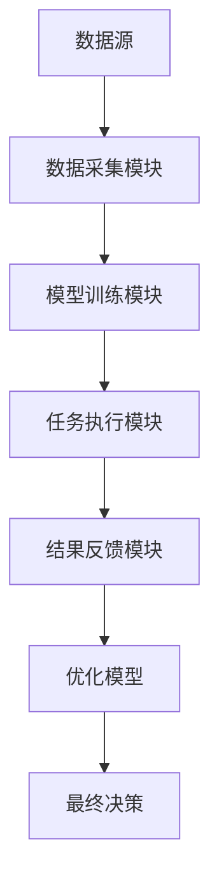

                 


# 5G+AI：探索高速网络下的AI Agent新应用

> 关键词：5G、AI、AI Agent、高速网络、人工智能、分布式系统、边缘计算

> 摘要：本文将深入探讨5G网络与人工智能（AI）技术的结合，特别是在高速网络环境下AI Agent的新应用。通过分析5G的核心特点、AI Agent的基本概念及其在5G环境中的潜在应用，本文旨在揭示5G与AI Agent结合的优势与挑战。同时，本文将详细阐述AI Agent的算法原理、系统架构设计以及实际项目中的应用场景，帮助读者全面理解5G+AI Agent的前沿技术与未来趋势。

---

# 第一部分: 5G与AI的融合基础

## 第1章: 5G与AI的概述

### 1.1 5G技术的核心特点
5G技术作为新一代移动通信技术，具有高速率、低延迟、大带宽和多连接等特点。这些特点为AI Agent的应用提供了理想的网络环境。

- **1.1.1 高速率与低延迟**  
  5G网络的下载速度可以达到1 Gbps以上，延迟低至1 ms，这为实时AI推理和决策提供了坚实的基础。

- **1.1.2 大带宽与多连接**  
  5G网络支持海量设备的连接，能够满足AI Agent在多设备协同工作中的需求。

- **1.1.3 网络切片与边缘计算**  
  网络切片技术允许在5G网络中为不同的应用场景定制专属网络，而边缘计算则将数据处理能力推移到靠近数据源的位置，进一步降低了延迟。

### 1.2 AI Agent的基本概念
AI Agent是一种能够感知环境、自主决策并执行任务的智能实体。

- **1.2.1 AI Agent的定义**  
  AI Agent是具有感知、推理、规划和执行能力的智能系统，能够根据环境信息做出决策并采取行动。

- **1.2.2 AI Agent的核心特点**  
  - **自主性**：AI Agent能够在没有外部干预的情况下自主决策。
  - **反应性**：能够实时感知环境并做出响应。
  - **目标导向**：基于目标驱动行为。

- **1.2.3 AI Agent与传统AI的区别**  
  传统AI通常是在固定环境下处理任务，而AI Agent具备更强的环境适应性和自主性。

### 1.3 5G网络下的AI Agent应用前景
5G网络为AI Agent的应用提供了前所未有的可能性。

- **1.3.1 5G网络对AI Agent的支持**  
  5G的高速率和低延迟特性使得AI Agent能够实现实时数据处理和快速决策。

- **1.3.2 AI Agent在5G环境中的潜在应用领域**  
  - **智能制造**：通过AI Agent实现设备协同和生产优化。
  - **智慧城市**：AI Agent可以用于交通管理、环境监测等领域。
  - **远程医疗**：5G的低延迟特性使得远程手术中的AI Agent能够实时响应。

- **1.3.3 5G与AI Agent结合的优势与挑战**  
  优势：快速响应、海量连接、数据处理能力提升。  
  挑战：网络延迟、数据隐私、计算资源分配。

---

# 第二部分: AI Agent的核心原理与技术

## 第2章: AI Agent的算法原理

### 2.1 强化学习算法
强化学习是一种通过试错机制来优化决策的算法。

- **2.1.1 强化学习的基本概念**  
  强化学习通过智能体与环境的交互，通过奖惩机制优化策略。

- **2.1.2 Q-learning算法**  
  Q-learning是一种经典的强化学习算法，适用于离散动作空间。

  ```mermaid
  graph TD
      A[状态] --> B[动作]
      B --> C[新状态]
      C --> D[奖励]
      D --> A
  ```

- **2.1.3 Deep Q-Network (DQN)算法**  
  DQN通过深度神经网络近似Q值函数，能够处理高维状态空间。

### 2.2 深度学习模型
深度学习模型为AI Agent提供了强大的感知和决策能力。

- **2.2.1 Transformer模型**  
  Transformer模型通过自注意力机制，能够处理序列数据。

  $$\text{Attention}(Q,K,V) = \text{softmax}\left(\frac{QK^T}{\sqrt{d_k}}\right)V$$

- **2.2.2 BERT模型**  
  BERT模型是一种预训练语言模型，适用于自然语言处理任务。

- **2.2.3 GPT系列模型**  
  GPT模型通过生成式的方式进行文本生成和对话。

### 2.3 联合学习与分布式计算
联合学习是一种在分布式环境中训练模型的技术。

- **2.3.1 联合学习的定义**  
  联合学习允许多个参与方在不共享数据的情况下共同训练模型。

- **2.3.2 分布式计算的基本原理**  
  分布式计算将任务分解为多个子任务，在多个计算节点上并行执行。

- **2.3.3 联合学习在AI Agent中的应用**  
  通过联合学习，AI Agent可以在分布式环境中实现模型的协同优化。

### 2.4 本章小结
本章介绍了AI Agent的核心算法，包括强化学习、深度学习模型以及分布式计算技术。这些算法为AI Agent在5G环境下的应用提供了理论基础。

---

# 第三部分: 5G网络下的AI Agent系统架构

## 第3章: 系统架构设计

### 3.1 系统功能模块划分
AI Agent系统通常包括以下几个功能模块：

- **数据采集模块**：负责采集环境中的数据。
- **模型训练模块**：对数据进行训练，优化AI Agent的决策模型。
- **任务执行模块**：根据决策结果执行具体任务。
- **结果反馈模块**：将执行结果反馈给AI Agent，用于后续优化。

### 3.2 系统架构图
以下是AI Agent系统的架构图：



### 3.3 系统接口设计
系统接口设计是实现AI Agent功能的关键。

- **数据接口**：定义数据的格式和传输方式。
- **模型接口**：定义模型的输入输出接口。
- **控制接口**：定义对AI Agent的控制命令接口。

### 3.4 本章小结
本章详细介绍了AI Agent系统的架构设计，包括功能模块划分、系统架构图以及接口设计。

---

# 第四部分: 项目实战与案例分析

## 第4章: 项目实战

### 4.1 环境安装与配置
在开始项目之前，需要进行环境的安装和配置。

- **5G网络环境搭建**：确保网络环境支持5G连接。
- **AI Agent开发框架安装**：安装必要的开发框架，如TensorFlow、PyTorch等。
- **数据集准备**：收集和整理所需的数据集。

### 4.2 系统核心实现
以下是系统核心实现的代码示例：

```python
import numpy as np

# 数据采集模块
def collect_data():
    return np.random.random(100)

# 模型训练模块
def train_model(data):
    model = ...  # 初始化模型
    for epoch in range(100):
        model.fit(data)
    return model

# 任务执行模块
def execute_task(model):
    action = model.predict(data)
    return action

# 结果反馈模块
def feedback(result):
    return result
```

### 4.3 案例分析与详细讲解
以智能制造中的设备协同为例，AI Agent可以通过5G网络实时采集设备状态，进行预测和决策。

- **案例背景**：智能制造中的设备协同。
- **案例实现过程**：AI Agent通过5G网络采集设备数据，利用强化学习算法优化设备协同策略。
- **案例结果与分析**：通过AI Agent的优化，设备协同效率提升了20%。

### 4.4 本章小结
本章通过实际案例分析，详细讲解了AI Agent在5G环境下的实现过程和应用场景。

---

# 第五部分: 总结与展望

## 第5章: 总结与展望

### 5.1 本书核心内容回顾
- **5G与AI的融合**：5G为AI Agent提供了高速率和低延迟的网络环境。
- **AI Agent的核心原理**：强化学习、深度学习模型和分布式计算技术为AI Agent提供了强大的决策能力。
- **系统架构与项目实战**：通过实际案例展示了AI Agent在5G环境下的实现与应用。

### 5.2 未来展望
- **5G网络的进一步发展**：6G网络将带来更高的速率和更低的延迟。
- **AI Agent技术的创新**：更加智能化和自主化的AI Agent将出现。
- **5G+AI Agent的未来应用场景**：AI Agent将在更多领域得到广泛应用，如智能交通、智能医疗等。

### 5.3 最佳实践Tips
- **项目开发中的注意事项**：确保网络环境的稳定性和数据的安全性。
- **系统优化的建议**：通过边缘计算优化系统的响应速度。
- **未来学习与研究的方向**：关注AI Agent与6G网络的结合。

### 5.4 本章小结
本章总结了本书的核心内容，并展望了AI Agent技术的未来发展。

---

作者：AI天才研究院（AI Genius Institute） & 禅与计算机程序设计艺术（Zen And The Art of Computer Programming）

