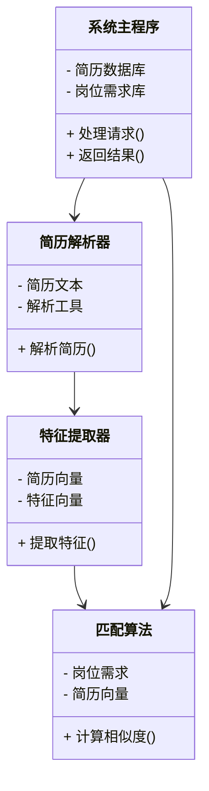
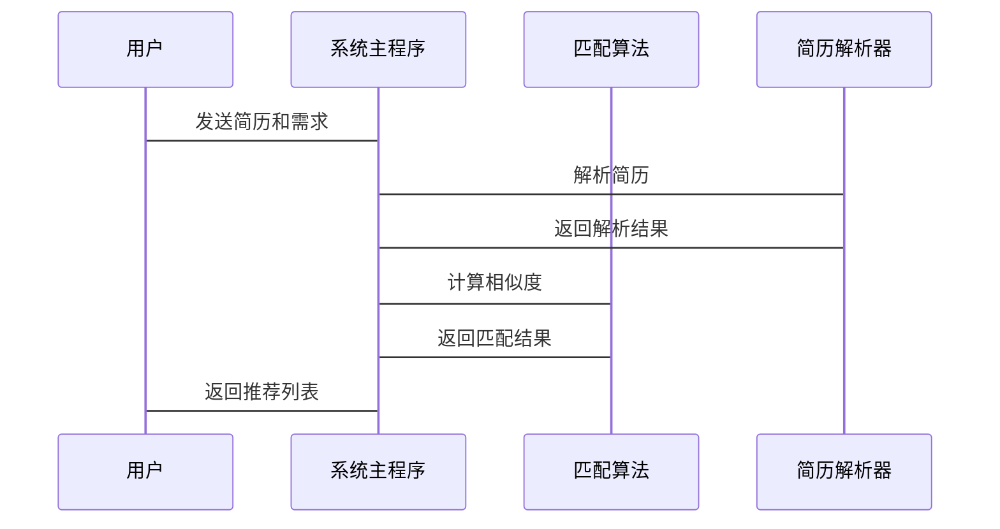

                 


# HR AI Agent：简历筛选与人才匹配

> 关键词：人工智能，HR，简历筛选，人才匹配，自然语言处理，机器学习，招聘优化

> 摘要：本文详细探讨了HR AI Agent在简历筛选与人才匹配中的应用，从背景介绍、核心概念、算法原理到系统架构、项目实战，再到最佳实践，全面解析了如何利用人工智能技术优化招聘流程，提升招聘效率和精准度。

---

## 第1章: AI在人力资源管理中的应用现状

### 1.1 传统招聘流程的痛点

#### 1.1.1 简历筛选的低效性
传统的简历筛选过程主要依赖人工阅读和判断，耗时长且效率低。招聘人员需要逐一查看大量简历，提取关键信息，容易因主观因素或疲劳影响判断。

#### 1.1.2 人才匹配的不准确性
传统招聘中，人才匹配主要依赖招聘人员的经验和主观判断，存在较大的误差。尤其是在处理大规模数据时，容易遗漏潜在合适的人才。

#### 1.1.3 招聘成本的高昂性
传统招聘流程中，筛选、面试、背调等环节都需要大量人工投入，且存在较高的时间成本和经济成本。尤其是在高端人才招聘中，成本更高。

### 1.2 AI技术在HR领域的应用潜力

#### 1.2.1 自然语言处理在简历分析中的应用
自然语言处理（NLP）技术可以对简历中的文本信息进行结构化处理，提取关键信息如技能、经验、教育背景等，帮助快速筛选简历。

#### 1.2.2 机器学习在人才匹配中的作用
机器学习算法可以通过分析岗位需求和候选人特征，构建匹配模型，实现精准的人才推荐。

#### 1.2.3 AI在招聘流程中的优化方向
AI可以优化简历筛选、面试安排、薪资谈判等环节，降低招聘成本，提升招聘效率。

---

## 第2章: HR AI Agent的核心概念

### 2.1 简历筛选的基本原理

#### 2.1.1 简历解析与结构化
将非结构化的简历文本转化为结构化数据，便于后续处理和分析。

#### 2.1.2 关键词提取与匹配
通过NLP技术提取简历中的关键词，并与岗位需求进行匹配，筛选出符合条件的简历。

#### 2.1.3 模糊匹配与语义分析
基于语义理解，对简历中的描述进行模糊匹配，避免因关键词不完全匹配而遗漏合适的人才。

### 2.2 人才匹配的实现机制

#### 2.2.1 岗位需求分析
通过分析岗位描述，提取关键技能、经验、教育背景等需求信息。

#### 2.2.2 人才画像构建
基于岗位需求，构建人才画像，定义理想候选人的特征和权重。

#### 2.2.3 智能推荐算法
使用机器学习算法，根据简历和岗位需求的匹配度，生成推荐列表。

### 2.3 系统边界与外延

#### 2.3.1 系统功能边界
系统主要负责简历筛选和人才推荐，不涉及后续的面试安排和薪资谈判。

#### 2.3.2 与外部系统的交互
系统需要与招聘网站、企业内部系统等外部系统进行数据交互。

#### 2.3.3 系统的可扩展性
系统设计应支持功能扩展，例如加入视频面试、职业测评等功能。

---

## 第3章: 核心概念原理

### 3.1 数据采集与处理

#### 3.1.1 简历数据的获取方式
通过API接口、文件上传等方式获取简历数据。

#### 3.1.2 数据清洗与预处理
去除噪音数据，统一数据格式，填充缺失值等。

#### 3.1.3 数据标注与结构化
对简历文本进行标注，提取关键字段如姓名、职位、公司、时间等。

### 3.2 特征提取与表示

#### 3.2.1 文本特征提取方法
使用TF-IDF、Word2Vec等方法提取简历文本的特征向量。

#### 3.2.2 向量空间模型
将简历文本表示为向量空间中的点，便于计算相似度。

#### 3.2.3 词嵌入技术（如Word2Vec、BERT）
使用预训练的词嵌入模型，将文本转换为低维向量表示。

### 3.3 算法原理

#### 3.3.1 基于相似度的匹配算法
计算简历向量与岗位需求向量的相似度，推荐匹配度高的简历。

#### 3.3.2 基于分类的筛选算法
使用分类模型，将简历分为符合和不符合两类。

#### 3.3.3 基于聚类的人才分组
将相似的简历聚类，便于后续推荐和分析。

---

## 第4章: 核心概念属性特征对比

### 4.1 简历特征与岗位需求的对比分析

#### 4.1.1 特征维度对比
| 特征维度 | 简历特征 | 岗位需求 |
|----------|----------|----------|
| 技能     | Python   | 数据分析 |
| 经验     | 3年      | 5年      |
| 教育     | 本科     | 硕士     |

#### 4.1.2 权重分配对比
| 特征 | 技能 | 经验 | 教育 | 权重 |
|------|------|------|------|------|
| 高级算法开发 | 0.6 | 0.3 | 0.1 | 0.8 |
| 数据分析经验 | 0.5 | 0.4 | 0.1 | 0.7 |

#### 4.1.3 匹配度评分标准
匹配度 = Σ(各特征权重 × 特征匹配度)

---

## 第5章: 算法原理

### 5.1 基于相似度的匹配算法

#### 余弦相似度公式
$$ \text{相似度} = \frac{\vec{a} \cdot \vec{b}}{|\vec{a}| \cdot |\vec{b}|} $$

#### 编辑距离公式
$$ \text{相似度} = 1 - \frac{\text{编辑距离}}{\text{文本长度}} $$

### 5.2 基于分类的筛选算法

#### 逻辑回归模型
$$ P(y=1|x) = \frac{1}{1 + e^{-\beta x}} $$

#### 支持向量机模型
$$ \text{最大化} \sum_{i} \alpha_i y_i (x_i \cdot x_j - \text{偏移量}) $$

### 5.3 基于聚类的人才分组

#### K-means聚类算法
$$ \text{目标} = \min \sum_{i=1}^k \sum_{j=1}^n \text{距离}(C_i, x_j)^2 $$

---

## 第6章: 系统分析与架构设计方案

### 6.1 问题场景介绍

#### 简历筛选场景
- 数据来源：简历数据库、招聘网站接口
- 处理步骤：解析、特征提取、相似度计算
- 输出结果：匹配度排序列表

#### 人才匹配场景
- 数据来源：岗位需求、候选人简历
- 处理步骤：构建人才画像、匹配算法、生成推荐列表

### 6.2 项目介绍

#### 项目目标
- 实现简历筛选与人才匹配的自动化
- 提高招聘效率和精准度
- 降低招聘成本

### 6.3 系统功能设计

#### 领域模型（Mermaid 类图）



### 6.4 系统架构设计

#### 系统架构（Mermaid 架构图）


### 6.5 系统接口设计

#### API 接口

```http
POST /api/hr-agent/process-resume
Content-Type: application/json

{
    "resume": "..." // 简历文本
    "job_requirements": "..." // 岗位需求
}
```

### 6.6 系统交互（Mermaid 序列图）



---

## 第7章: 项目实战

### 7.1 环境安装

```bash
pip install numpy
pip install scikit-learn
pip install spacy
pip install sentence-transformers
```

### 7.2 系统核心实现源代码

#### 简历解析器

```python
import spacy

nlp = spacy.load("en_core_web_sm")

def parse_resume(resume_text):
    doc = nlp(resume_text)
    extracted_info = {}
    for ent in doc.ents:
        extracted_info[ent.label_] = ent.text
    return extracted_info
```

#### 特征提取器

```python
from sentence_transformers import SentenceTransformer

model = SentenceTransformer('bert-base-nli-mean-tokens')

def extract_features(text):
    return model.encode([text])[0]
```

#### 匹配算法

```python
import numpy as np

def compute_similarity(job_vector, resume_vector):
    return np.dot(job_vector, resume_vector) / (np.linalg.norm(job_vector) * np.linalg.norm(resume_vector))
```

### 7.3 代码应用解读与分析

#### 简历解析器解读
使用spaCy对简历文本进行实体识别，提取关键信息如职位、公司、时间等。

#### 特征提取器解读
使用BERT模型对简历文本进行编码，生成特征向量。

#### 匹配算法解读
计算岗位需求向量与简历向量的余弦相似度，推荐相似度高的简历。

### 7.4 实际案例分析和详细讲解剖析

#### 案例：数据分析师岗位招聘

- 岗位需求：3年以上数据分析经验，熟悉Python和SQL，具备良好的数据可视化能力。
- 简历1：2年数据分析经验，熟练使用Python，擅长数据可视化。
- 简历2：5年数据分析经验，熟悉SQL，擅长数据建模。

通过匹配算法，简历1的相似度为0.85，简历2的相似度为0.92，推荐顺序为简历2、简历1。

### 7.5 项目小结

通过代码实现简历解析、特征提取和相似度计算，成功构建了一个简单的HR AI Agent系统，能够实现基本的简历筛选和人才推荐功能。

---

## 第8章: 最佳实践

### 8.1 Tips

- 数据质量是关键，确保简历和岗位需求数据的准确性和完整性。
- 模型调优时，可以尝试不同的算法和参数组合，找到最优匹配方案。
- 在实际应用中，结合业务需求，动态调整匹配策略。

### 8.2 小结

通过本文的详细讲解，我们了解了HR AI Agent的核心概念、算法原理和系统架构。通过项目实战，掌握了系统的实现方法和应用技巧。

### 8.3 注意事项

- 注意保护用户隐私，确保数据安全。
- 定期更新模型，避免因数据漂移导致匹配效果下降。
- 结合人工审核，避免完全依赖AI导致的错误推荐。

### 8.4 拓展阅读

- 《机器学习实战》
- 《自然语言处理入门》
- 《深度学习与神经网络》

---

## 作者：AI天才研究院/AI Genius Institute & 禅与计算机程序设计艺术 /Zen And The Art of Computer Programming

---

感谢您的阅读！希望本文对您了解HR AI Agent有所帮助。

