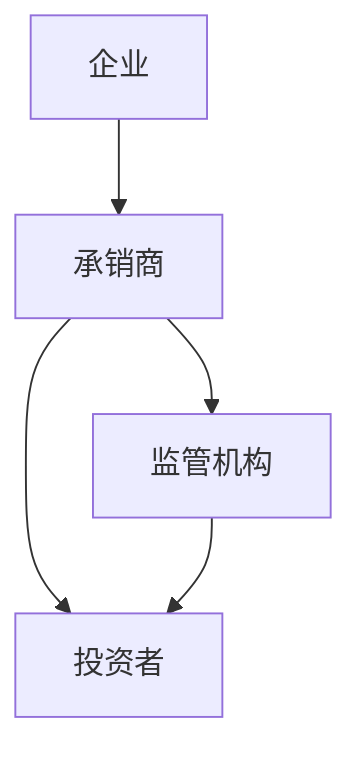
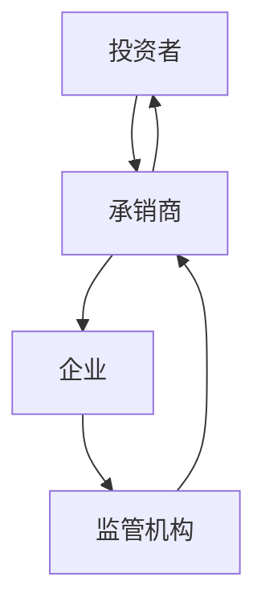

                 


# IPO投资策略：如何评估新上市公司

> 关键词：IPO投资策略、新上市公司评估、IPO定价模型、风险管理、投资组合优化

> 摘要：本文旨在为投资者提供一套系统化的IPO投资策略，帮助他们在评估新上市公司时做出明智的决策。通过分析IPO市场的核心概念、定价模型、风险管理策略和投资组合优化方法，本文将深入探讨如何在复杂的金融环境中识别高潜力投资机会，同时避免常见的风险陷阱。文章结合数学模型和实际案例，为投资者提供实用的工具和策略，以在IPO市场中实现长期稳定的收益。

---

# 第一部分: IPO投资策略背景与核心概念

# 第1章: IPO投资策略概述

## 1.1 IPO的基本概念

### 1.1.1 IPO的定义与特点
IPO（Initial Public Offering）是指一家公司首次向公众发行股票，从私人公司转变为上市公司。IPO的三个核心特点：
1. **公开发行**：公司通过证券交易所向公众出售股票，募集资金。
2. **透明化**：公司需公开财务报表、业务模式和风险因素，便于投资者评估。
3. **流动性**：股票上市后，投资者可以方便地买卖股票，提高资产流动性。

### 1.1.2 IPO市场的基本结构
IPO市场的核心结构包括发行人（企业）、投资者、承销商和监管机构。其关系如下：


### 1.1.3 IPO投资的参与者与角色
- **投资者**：包括个人投资者和机构投资者。
- **承销商**：负责股票发行、定价和销售。
- **监管机构**：如证监会，确保市场合规。

## 1.2 IPO投资的重要性

### 1.2.1 IPO市场在经济发展中的作用
IPO市场是企业融资的重要渠道，推动经济发展和创新。

### 1.2.2 投资者参与IPO的意义
- **早期投资机会**：投资者可以早期介入高增长企业。
- **分散风险**：通过投资不同行业和规模的公司，降低风险。

### 1.2.3 IPO投资的潜在收益与风险
- **收益**：股价上涨带来的资本增值。
- **风险**：市场波动、公司基本面变化等。

## 1.3 IPO投资策略的核心要素

### 1.3.1 投资目标的设定
明确投资目标，如短期套利或长期价值投资。

### 1.3.2 投资策略的分类
1. **基本面策略**：通过分析公司财务状况、行业地位等选择投资标的。
2. **技术分析策略**：通过股价走势预测市场波动。

### 1.3.3 投资策略的实施步骤
1. **选择行业**：关注高增长行业，如科技、医疗。
2. **筛选公司**：分析财务指标，如ROE、毛利率。
3. **评估定价**：比较发行价与合理估值。

## 1.4 本章小结
IPO投资需要明确目标和策略，结合基本面和技术分析，选择优质标的。

---

# 第2章: IPO市场现状与趋势分析

## 2.1 全球IPO市场的现状

### 2.1.1 全球IPO市场的规模与分布
- **规模**：近年来，全球IPO融资额屡创新高，2023年达到历史高位。
- **分布**：美国和中国是主要市场，占全球IPO的70%。

### 2.1.2 不同地区IPO市场的特点
- **美国市场**：科技公司占主导，纳斯达克是主要交易所。
- **中国市场**：以制造业和科技公司为主，上交所和深交所是主要交易所。

### 2.1.3 主要行业的IPO趋势
- **科技行业**：人工智能、云计算等技术驱动的公司备受关注。
- **医疗行业**：生物技术、制药公司增长迅速。

## 2.2 中国IPO市场的特点

### 2.2.1 中国IPO市场的规模与增长
- 中国已成为全球第二大IPO市场，科创板和创业板是主要增长点。

### 2.2.2 中国IPO市场的行业分布
- **科技行业**：占比最高，其次是消费和医疗。

### 2.2.3 中国IPO市场的政策环境
- **政策支持**：政府鼓励科技创新和资本市场发展。
- **监管趋严**：加强信息披露和退市制度。

## 2.3 IPO市场的未来趋势

### 2.3.1 新兴行业对IPO市场的推动
- **人工智能**：AI公司将成为IPO市场的热点。
- **绿色经济**：环保科技和新能源公司受政策支持。

### 2.3.2 数字经济与IPO市场的结合
- **数字化转型**：企业通过IPO加速数字化进程。
- **数据驱动**：数据技术公司获得更多投资机会。

### 2.3.3 可持续发展与绿色金融的影响
- **ESG投资**：投资者更关注环境、社会和治理因素。
- **绿色债券**：与IPO结合，推动可持续发展。

## 2.4 本章小结
全球IPO市场持续增长，科技和医疗行业是主要驱动力，绿色金融和ESG投资将成为未来趋势。

---

# 第3章: IPO投资策略的核心概念与联系

## 3.1 IPO发行机制的原理

### 3.1.1 IPO发行的主要流程
1. **招股说明书**：公司公开财务信息和业务计划。
2. **定价与发行**：通过询价机制确定发行价。
3. **上市交易**：股票在交易所上市，投资者开始交易。

### 3.1.2 IPO定价的方法与模型
- **相对估值法**：基于可比公司PE、PB等指标。
- **绝对估值法**：使用DCF模型评估公司价值。

### 3.1.3 IPO承销商的角色与作用
- **承销商**：负责股票发行、定价和销售。
- **保荐人**：协助公司完成上市流程。

## 3.2 IPO市场的参与者分析

### 3.2.1 发行人（企业）的角色
- **融资需求**：公司通过IPO融资扩展业务。
- **信息披露**：公司需公开财务和业务信息。

### 3.2.2 投资者（个人与机构）的角色
- **个人投资者**：参与新股申购，分享收益。
- **机构投资者**：通过大量投资影响市场。

### 3.2.3 中介机构（券商、会计师事务所等）的角色
- **券商**：负责发行和承销。
- **会计师事务所**：审计财务报表，确保合规。

## 3.3 IPO市场的核心要素对比

### 3.3.1 不同市场IPO规则的对比
| 市场 | 发行制度 | 监管机构 |
|------|----------|----------|
| 美国 | 注册制   | SEC      |
| 中国 | 核准制   | 证监会   |

### 3.3.2 不同行业IPO要求的对比
| 行业 | 关键指标       | 监管重点     |
|------|---------------|-------------|
| 科技 | 技术壁垒、研发 | 专利数量     |
| 医疗 | 产品管线、合规 | 临床试验数据 |

### 3.3.3 不同投资者IPO参与方式的对比
| 投资者类型 | 参与方式         | 投资限制       |
|------------|------------------|---------------|
| 个人       | 新股申购         | 额度有限       |
| 机构       | 配售、战略投资   | � � � 额较大     |

## 3.4 IPO市场实体关系图


## 3.5 本章小结
IPO市场涉及多方角色，发行人、投资者和中介机构各有其职责和作用。

---

# 第4章: IPO投资策略的数学模型与算法原理

## 4.1 IPO市场预测的数学模型

### 4.1.1 IPO市场指数预测模型
- **模型**：使用ARIMA模型预测IPO市场指数。
- **公式**：$$ ARIMA(p, d, q) $$
  其中，p为自回归阶数，d为差分阶数，q为移动平均阶数。

### 4.1.2 IPO公司估值模型
- **模型**：使用DCF模型评估公司价值。
- **公式**：$$ V = \frac{CF}{r - g} $$
  其中，CF为自由现金流，r为折现率，g为增长率。

### 4.1.3 IPO市场风险评估模型
- **模型**：使用VaR模型评估市场风险。
- **公式**：$$ VaR = \alpha \times \sigma $$
  其中，$\alpha$为分位数，$\sigma$为标准差。

## 4.2 IPO投资的算法原理

### 4.2.1 IPO投资的多因子分析模型
- **因子**：包括市盈率、市净率、ROE等。
- **公式**：$$ F = \sum_{i=1}^{n} w_i \times Factor_i $$
  其中，$w_i$为因子权重，$Factor_i$为因子值。

### 4.2.2 IPO投资的决策树模型
- **步骤**：
  1. 判断行业前景。
  2. 分析公司财务状况。
  3. 评估发行价与合理估值差距。

### 4.2.3 IPO投资的时间序列分析模型
- **方法**：使用K线图分析股价走势。
- **工具**：技术指标如MACD、RSI等。

## 4.3 

---

# 第五章: 系统分析与架构设计方案

## 5.1 问题场景介绍
IPO市场复杂，投资者需要系统化的工具和方法。

## 5.2 项目介绍
构建一个IPO投资分析系统，帮助投资者做出决策。

## 5.3 系统功能设计
- **领域模型**：
  ```mermaid
  classDiagram
      class 投资者 {
          帐户
          资产配置
      }
      class 公司 {
          财务数据
          业务模式
      }
      class 市场 {
          指数数据
          行业趋势
      }
      投资者 --> 公司 : 投资
      公司 --> 市场 : 受影响
  ```

- **系统架构设计**：
  ```mermaid
  architecture
      Client
      Server
      Database
      API Gateway
  ```

## 5.4 系统接口设计
- **API接口**：
  - `/ipo/company-info`：获取公司信息。
  - `/ipo/valuation`：计算公司估值。

## 5.5 系统交互设计
- **序列图**：
  ```mermaid
  sequenceDiagram
      投资者 -> API Gateway: 获取公司数据
      API Gateway -> Database: 查询数据
      Database --> API Gateway: 返回数据
      API Gateway -> 投资者: 返回公司数据
  ```

---

# 第六章: 案例分析与实际应用

## 6.1 案例分析

### 6.1.1 案例一：科技公司IPO
- **公司**：某人工智能公司。
- **分析**：高成长性，但研发投入高，风险较大。
- **结果**：股价在首日上涨30%，但后期受政策影响下跌。

### 6.1.2 案例二：医疗公司IPO
- **公司**：某生物技术公司。
- **分析**：产品管线丰富，但竞争激烈。
- **结果**：股价稳定增长，符合预期。

## 6.2 实际应用

### 6.2.1 IPO定价模型的应用
- **公式**：$$ P = \alpha \times PE + \beta \times PB $$
  其中，$PE$为市盈率，$PB$为市净率，$\alpha$和$\beta$为系数。

### 6.2.2 投资组合优化的应用
- **步骤**：
  1. 确定投资目标。
  2. 选择行业和公司。
  3. 分配资金比例。
  4. 定期调整组合。

---

# 第七章: 总结与展望

## 7.1 本章小结
IPO投资需要系统化的策略和工具，结合基本面分析和技术分析。

## 7.2 未来研究方向
- **AI在IPO分析中的应用**：利用机器学习预测市场趋势。
- **绿色金融与IPO结合**：研究可持续发展对投资的影响。

## 7.3 最佳实践 tips
- **分散投资**：避免过度集中。
- **长期视角**：关注公司长期价值。
- **风险管理**：定期评估和调整投资组合。

## 7.4 注意事项
- **避免过度乐观**：理性评估市场风险。
- **关注政策变化**：及时调整投资策略。

## 7.5 拓展阅读
- **书籍推荐**：《投资学》、《股票作手回忆录》。
- **在线资源**：证监会官网、金融数据分析平台。

---

# 作者：AI天才研究院/AI Genius Institute & 禅与计算机程序设计艺术 /Zen And The Art of Computer Programming

---

以上是文章的详细大纲和部分内容，每章内容需要进一步扩展和详细描述，确保逻辑清晰、结构紧凑、语言专业且易于理解。

