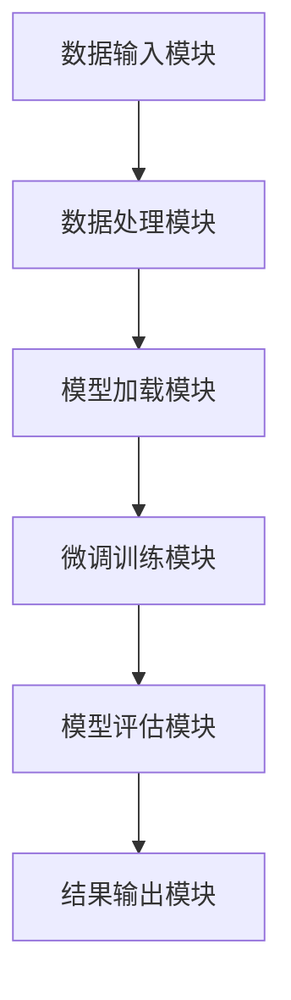
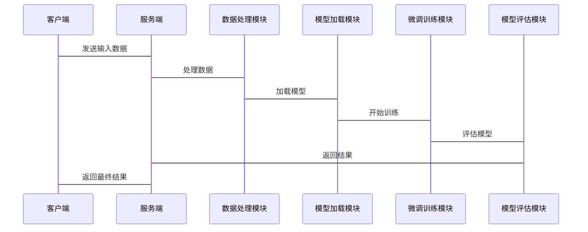

                 


# LLM Fine-tuning技术：定制化AI Agent的关键

> 关键词：LLM微调，定制化AI，大语言模型，深度学习，自然语言处理，模型优化，AI代理

> 摘要：本文详细探讨了大语言模型（LLM）微调技术在定制化AI代理中的关键作用。通过从背景介绍、核心原理、系统架构到项目实战的层层递进，本文为读者提供了全面的技术解析。文章深入分析了微调的核心概念、算法原理、系统设计以及实际应用，并通过具体代码实现和案例分析，帮助读者掌握LLM微调技术的关键点。同时，本文还总结了微调技术的最佳实践和优化方法，为读者在实际项目中提供了宝贵的指导。

---

# 第一章: LLM微调技术的背景与核心概念

## 1.1 什么是LLM微调
### 1.1.1 大语言模型（LLM）的定义与特点
- **定义**：大语言模型（LLM）是指经过大规模数据训练的深度学习模型，具有强大的自然语言处理能力。
- **特点**：
  - 基于Transformer架构
  - 参数量巨大（如GPT-3有175B参数）
  - 能够理解上下文、生成文本、回答问题
- **与传统NLP模型的区别**：参数量更大，通用性更强，适合多种任务。

### 1.1.2 微调（Fine-tuning）的定义与目的
- **定义**：微调是指在预训练好的模型基础上，针对特定任务进行进一步的训练，以优化模型在该任务上的表现。
- **目的**：
  - 提高模型在特定领域的性能
  - 适应不同的数据分布和任务需求
  - 实现定制化AI代理

### 1.1.3 微调与从头训练（Pre-training）的区别
| 方面 | 微调 | 从头训练 |
|------|------|----------|
| 数据量 | 少 | 大 |
| 训练目标 | 特定任务优化 | 通用能力提升 |
| 计算资源 | 较少 | 较多 |
| 适用场景 | 需要快速定制化 | 需要从零开始构建模型 |

---

## 1.2 LLM微调的背景与意义
### 1.2.1 企业级AI应用的需求
- **定制化需求**：不同企业有不同的业务场景和数据，需要个性化的AI解决方案。
- **高效性要求**：快速部署和优化AI代理，降低试错成本。

### 1.2.2 微调技术在定制化AI代理中的作用
- **提升任务相关性**：通过微调，模型能够更好地理解特定任务的需求。
- **降低计算成本**：相比于从头训练，微调需要的数据量和计算资源更少。
- **快速迭代**：可以根据反馈快速优化模型。

### 1.2.3 微调技术的行业应用现状
- **自然语言处理**：文本分类、问答系统、机器翻译等。
- **智能客服**：定制化的对话系统。
- **企业知识库**：基于内部文档的问答系统。

---

## 1.3 LLM微调的核心概念
### 1.3.1 微调的基本原理
- **参数调整**：仅调整模型顶层参数，保持底层参数不变。
- **任务适配**：通过特定任务的数据优化模型输出。

### 1.3.2 微调的关键技术点
| 技术点 | 描述 |
|------|------|
| 参数更新 | 仅更新部分参数（如最后一层） |
| 任务适配 | 根据任务定义损失函数 |
| 数据增强 | 使用特定任务的数据增强方法 |

### 1.3.3 微调的实现方式与流程
1. 加载预训练模型。
2. 数据预处理：将数据转换为模型输入格式。
3. 定义微调任务和损失函数。
4. 优化模型参数。
5. 评估模型性能。

---

## 1.4 本章小结
本章介绍了LLM微调的基本概念、背景和核心原理，为后续章节的深入分析奠定了基础。通过对比微调和从头训练的区别，明确了微调在定制化AI代理中的重要性。

---

# 第二章: LLM微调的数学模型与算法原理

## 2.1 微调的数学模型
### 2.1.1 基于转换器的微调模型
- **转换器架构**：模型由编码器和解码器组成，编码器负责理解输入，解码器负责生成输出。
- **微调过程**：仅调整解码器部分参数，保持编码器不变。

### 2.1.2 微调的损失函数
- **交叉熵损失函数**：
  $$ L = -\sum_{i=1}^{n} \sum_{j=1}^{m} y_{i,j} \log p(y_{i,j}|x_i) $$
  其中，$y_{i,j}$是标签，$p(y_{i,j}|x_i)$是模型预测的概率。

### 2.1.3 微调的优化目标
- **优化目标**：最小化损失函数，提升模型在特定任务上的准确率。

---

## 2.2 微调算法的流程与步骤
### 2.2.1 数据预处理与准备
1. 数据清洗：去除噪音数据。
2. 数据转换：将数据转换为模型输入格式（如token化）。

### 2.2.2 模型加载与初始化
1. 加载预训练模型。
2. 初始化微调层参数。

### 2.2.3 微调训练过程
1. 定义损失函数和优化器。
2. 进行前向传播和反向传播。
3. 更新模型参数。

### 2.2.4 模型评估与调优
1. 使用验证集评估模型性能。
2. 根据评估结果调整超参数。

---

## 2.3 微调算法的实现细节
### 2.3.1 参数更新策略
- **学习率调整**：使用学习率衰减策略（如Adam优化器）。

### 2.3.2 学习率调整方法
- **分步法**：每隔一定步数调整学习率。
- **衰减法**：每一步都按比例衰减学习率。

### 2.3.3 模型收敛性分析
- **收敛条件**：损失函数不再显著下降，或达到预设的迭代次数。

---

## 2.4 本章小结
本章从数学模型和算法原理的角度，详细分析了LLM微调的实现细节，包括损失函数、优化目标和训练流程。通过具体的数学公式和算法流程图，帮助读者理解微调技术的核心原理。

---

# 第三章: LLM微调系统的架构设计

## 3.1 微调系统的功能需求
### 3.1.1 数据输入与处理模块
- **功能**：接收输入数据，进行清洗和预处理。
- **输入格式**：支持多种数据格式（如文本、JSON）。

### 3.1.2 模型加载与微调模块
- **功能**：加载预训练模型，进行微调训练。
- **支持的模型**：支持主流的LLM模型（如GPT、BERT）。

### 3.1.3 模型评估与优化模块
- **功能**：评估模型性能，调整超参数。
- **评估指标**：准确率、F1值、困惑度等。

---

## 3.2 微调系统的架构设计
### 3.2.1 系统整体架构图



### 3.2.2 数据流与模块交互关系
- 数据输入模块接收输入数据，传递给数据处理模块。
- 数据处理模块清洗数据后，传递给模型加载模块。
- 模型加载模块加载预训练模型，传递给微调训练模块。
- 微调训练模块训练完成后，传递给模型评估模块。
- 模型评估模块评估结果后，传递给结果输出模块。

---

## 3.3 系统接口设计
### 3.3.1 输入接口规范
- **输入格式**：文本或JSON。
- **接口协议**：RESTful API。

### 3.3.2 输出接口规范
- **输出格式**：JSON或文本。
- **接口协议**：RESTful API。

### 3.3.3 接口交互流程



---

## 3.4 本章小结
本章从系统架构的角度，详细设计了LLM微调系统的各个模块及其交互关系。通过流程图和序列图，清晰地展示了系统的整体架构和接口设计。

---

# 第四章: LLM微调技术的项目实战

## 4.1 环境搭建与代码实现
### 4.1.1 环境安装与配置
```bash
pip install transformers torch
```

### 4.1.2 微调代码实现
```python
from transformers import AutoTokenizer, AutoModelForMaskedLM
import torch

# 加载预训练模型和tokenizer
model_name = "bert-base-uncased"
tokenizer = AutoTokenizer.from_pretrained(model_name)
model = AutoModelForMaskedLM.from_pretrained(model_name)

# 微调训练
model微调训练代码示例：

class MyModel(torch.nn.Module):
    def __init__(self, model):
        super().__init__()
        self.model = model
        self.classifier = torch.nn.Linear(model.config.hidden_size, num_labels)

    def forward(self, input_ids, attention_mask, labels=None):
        outputs = self.model(input_ids, attention_mask=attention_mask)
        sequence_output = outputs.last_hidden_state
        logits = self.classifier(sequence_output)
        return logits

# 初始化微调模型
model微调 = MyModel(model)

# 定义损失函数和优化器
criterion = torch.nn.CrossEntropyLoss()
optimizer = torch.optim.Adam(model微调.parameters(), lr=1e-5)

# 训练循环
for epoch in range(num_epochs):
    for batch in train_loader:
        optimizer.zero_grad()
        outputs = model微调(batch['input_ids'], batch['attention_mask'])
        loss = criterion(outputs, batch['labels'])
        loss.backward()
        optimizer.step()
```

---

## 4.2 项目实战：定制化问答系统
### 4.2.1 项目背景
- **需求**：构建一个基于LLM的问答系统，用于企业内部知识库的问答。

### 4.2.2 数据准备与预处理
1. 收集企业知识库数据。
2. 将数据转换为模型可读的格式（如JSON）。

### 4.2.3 模型训练与优化
1. 加载预训练模型。
2. 进行微调训练。
3. 评估模型性能。

### 4.2.4 模型部署与应用
1. 将模型部署到服务器。
2. 提供API接口供前端调用。

---

## 4.3 本章小结
本章通过一个具体的项目案例，详细展示了LLM微调技术的实现过程。从环境搭建到代码实现，再到模型部署，为读者提供了完整的实战指导。

---

# 第五章: LLM微调技术的优化与调优

## 5.1 微调过程中的常见问题
### 5.1.1 模型过拟合
- **解决方法**：增加正则化项，使用早停法。

### 5.1.2 训练数据不足
- **解决方法**：使用数据增强技术，增加虚拟数据。

### 5.1.3 训练速度慢
- **解决方法**：优化代码性能，使用分布式训练。

---

## 5.2 微调技术的优化方法
### 5.2.1 参数优化
- **超参数调优**：通过网格搜索或随机搜索找到最优参数组合。

### 5.2.2 数据优化
- **数据增强**：使用同义词替换、数据清洗等技术提升数据质量。

### 5.2.3 模型优化
- **模型剪枝**：去除冗余参数，降低模型复杂度。

---

## 5.3 本章小结
本章总结了LLM微调技术的优化方法，包括参数调优、数据增强和模型剪枝等。通过这些优化方法，可以显著提升模型的性能和训练效率。

---

# 结语
LLM微调技术是定制化AI代理的核心技术之一。通过本文的详细讲解，读者可以全面理解微调技术的背景、原理和实现方法。从理论到实践，从系统设计到项目实战，本文为读者提供了完整的知识体系。希望本文能为读者在实际项目中应用LLM微调技术提供有价值的指导和参考。

---

# 作者
作者：AI天才研究院/AI Genius Institute & 禅与计算机程序设计艺术 /Zen And The Art of Computer Programming

