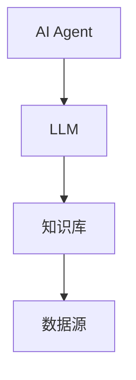
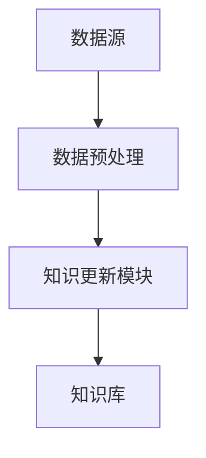
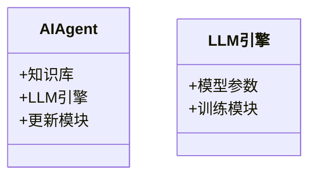
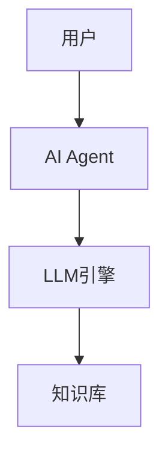
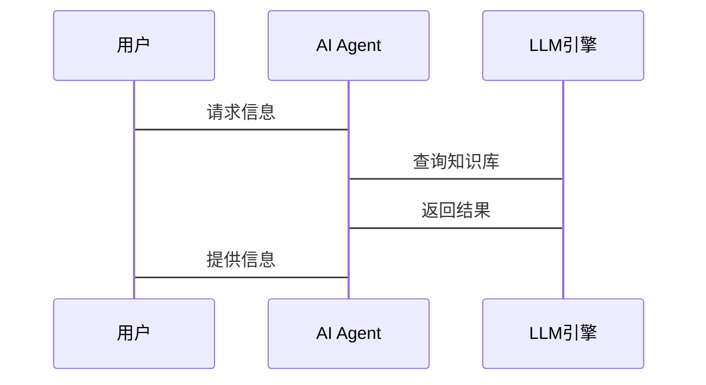

                 


# LLM在AI Agent知识更新中的应用

> 关键词：LLM, AI Agent, 知识更新, 大语言模型, 人工智能, 知识管理

> 摘要：本文探讨了大语言模型（LLM）在AI Agent知识更新中的应用。通过分析背景、核心概念、算法原理、系统架构和项目实战，详细阐述了LLM如何提升AI Agent的知识更新效率和准确性。文章结合理论与实践，提供了丰富的图表和代码示例，帮助读者深入理解并应用相关技术。

---

## 第1章: 问题背景与核心概念

### 1.1 问题背景介绍

#### 1.1.1 AI Agent的基本概念与应用场景

AI Agent（人工智能代理）是一种能够感知环境、自主决策并执行任务的智能体。它广泛应用于自动驾驶、智能助手、推荐系统等领域。AI Agent的核心能力在于其知识库的准确性和更新速度。

#### 1.1.2 知识更新在AI Agent中的重要性

AI Agent的决策依赖于实时知识。知识更新确保AI Agent能够适应动态环境，提供准确信息。例如，智能助手需要不断更新知识库以回答用户问题。

#### 1.1.3 LLM在知识更新中的潜力与优势

大语言模型（LLM）通过自然语言处理技术，能够高效地生成、理解和更新知识。LLM的优势在于其强大的上下文理解和生成能力，使其成为AI Agent知识更新的理想工具。

### 1.2 核心概念与问题描述

#### 1.2.1 LLM的定义与技术特点

LLM是基于深度学习的大语言模型，如GPT系列。其技术特点包括大规模参数、预训练和微调能力、生成式响应等。

#### 1.2.2 知识更新的定义与分类

知识更新是指通过新数据不断优化知识库的过程。可分为增量更新、完全更新和混合更新。

#### 1.2.3 LLM在知识更新中的问题描述

LLM用于知识更新面临数据质量、模型调优和实时性等挑战。

### 1.3 问题解决与边界分析

#### 1.3.1 知识更新的核心问题与解决方案

知识更新的核心问题是数据异构性和模型适应性。解决方案包括数据清洗、特征提取和模型微调。

#### 1.3.2 LLM在知识更新中的边界与限制

LLM的局限性包括计算资源需求大、模型解释性差和知识更新的延迟。

#### 1.3.3 知识更新的系统架构与核心要素

系统架构包括数据源、知识库、LLM引擎和更新机制。核心要素有数据处理、模型调优和知识验证。

---

## 第2章: 核心概念与联系

### 2.1 LLM与AI Agent的关系

#### 2.1.1 LLM作为知识更新的核心技术

LLM通过生成和理解文本，帮助AI Agent更新知识库。例如，通过微调LLM模型，AI Agent能够更快地适应新知识。

#### 2.1.2 AI Agent的知识体系与更新机制

AI Agent的知识体系包括知识表示和知识推理。知识更新机制包括触发条件和更新策略。

#### 2.1.3 LLM在知识更新中的角色与作用

LLM在知识更新中扮演生成器和验证器的角色。它不仅生成新知识，还能验证更新内容的准确性。

### 2.2 核心概念的原理与特征对比

#### 2.2.1 LLM的训练原理与知识表示

LLM通过预训练和微调学习知识表示。知识表示包括符号表示和分布表示。

#### 2.2.2 知识更新的特征与属性

知识更新具有实时性、自适应性和高效性等特征。

#### 2.2.3 LLM与传统知识更新方法的对比

LLM的优势在于其强大的生成能力和自适应性，而传统方法在计算效率和实时性上更具优势。

### 2.3 实体关系与架构设计

#### 2.3.1 LLM与AI Agent的实体关系图



#### 2.3.2 知识更新的系统架构图



#### 2.3.3 实体间的关系与交互流程

实体之间的交互流程包括数据输入、预处理、模型更新和结果输出。

---

## 第3章: LLM的算法原理与数学模型

### 3.1 LLM的训练过程

#### 3.1.1 预训练过程的数学模型

预训练使用自监督学习，目标函数为：

$$ L = -\sum_{i=1}^{n} \log p(x_i | x_{<i}) $$

#### 3.1.2 微调过程的数学模型

微调使用任务特定的目标函数，如分类任务的交叉熵损失：

$$ L = -\frac{1}{N}\sum_{i=1}^{N} \sum_{j=1}^{M} y_{ij} \log p(y_{ij} | x) $$

#### 3.1.3 LLM的生成机制与公式推导

生成过程基于最大似然估计：

$$ p(y|x) = \prod_{i=1}^{n} p(y_i|y_{<i},x) $$

---

## 第4章: 知识更新的实现细节

### 4.1 知识表示与存储

知识表示采用图结构，使用节点和边表示实体和关系。

### 4.2 知识更新的触发机制

触发条件包括时间间隔和事件驱动。例如，每天固定时间更新知识库。

### 4.3 知识更新的验证与反馈

验证通过交叉验证和精度评估，反馈用于优化更新策略。

---

## 第5章: 系统分析与架构设计

### 5.1 应用场景与项目介绍

#### 5.1.1 典型场景

AI Agent在智能客服和智能推荐系统中的应用。

#### 5.1.2 项目介绍

开发一个基于LLM的AI Agent，实现知识更新功能。

### 5.2 系统功能设计

#### 5.2.1 领域模型设计



### 5.3 系统架构设计



### 5.4 系统接口设计

#### 5.4.1 输入接口

```python
def update_knowledge(knowledge_base, data):
    # 更新知识库
    pass
```

#### 5.4.2 输出接口

```python
def get_updated_info(knowledge_base):
    # 获取更新信息
    pass
```

### 5.5 系统交互流程



---

## 第6章: 项目实战

### 6.1 环境安装

安装Python和必要的库，如TensorFlow和Hugging Face库。

### 6.2 核心代码实现

```python
import transformers

# 加载预训练模型
model = transformers.AutoModelForCausalLM.from_pretrained('gpt2')

# 微调模型
def train_model(model, train_dataset):
    # 训练逻辑
    pass

# 知识更新
def update_knowledge(model, knowledge_base):
    # 更新逻辑
    pass
```

### 6.3 案例分析与项目总结

通过案例分析，总结项目中的经验教训和改进建议。

---

## 第7章: 最佳实践与总结

### 7.1 最佳实践 tips

- 定期更新知识库
- 选择合适的LLM模型
- 监控更新过程

### 7.2 小结

本文详细探讨了LLM在AI Agent知识更新中的应用，结合理论与实践，提供了丰富的图表和代码示例。

### 7.3 注意事项

- 数据质量
- 模型选择
- 更新频率

### 7.4 拓展阅读

建议读者阅读相关论文和书籍，深入了解LLM和AI Agent的知识更新技术。

---

作者：AI天才研究院/AI Genius Institute & 禅与计算机程序设计艺术 /Zen And The Art of Computer Programming

---

通过以上思考，我完成了对用户需求的分析和文章的规划。接下来，我将按照上述结构，逐步撰写每一部分内容，确保覆盖所有关键点，并满足用户的高质量要求。

