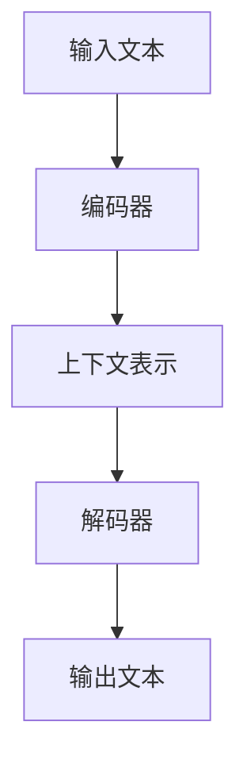
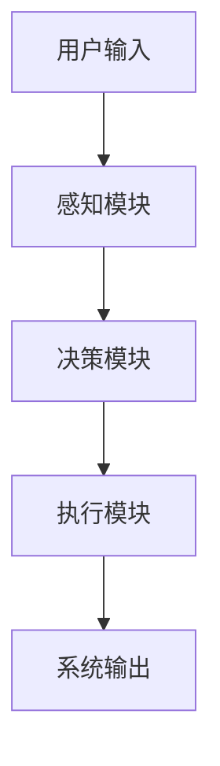
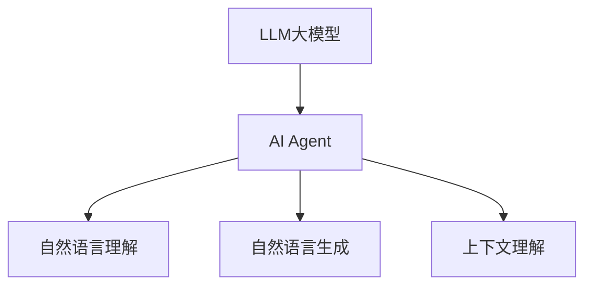
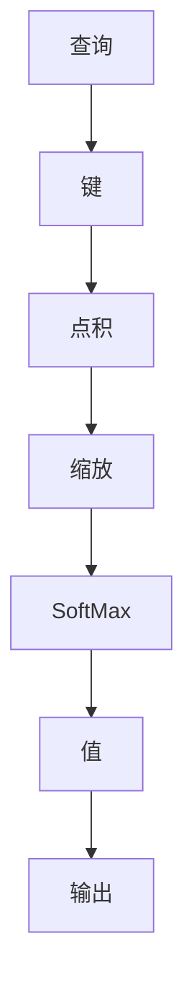
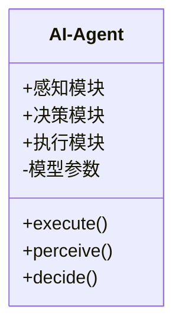
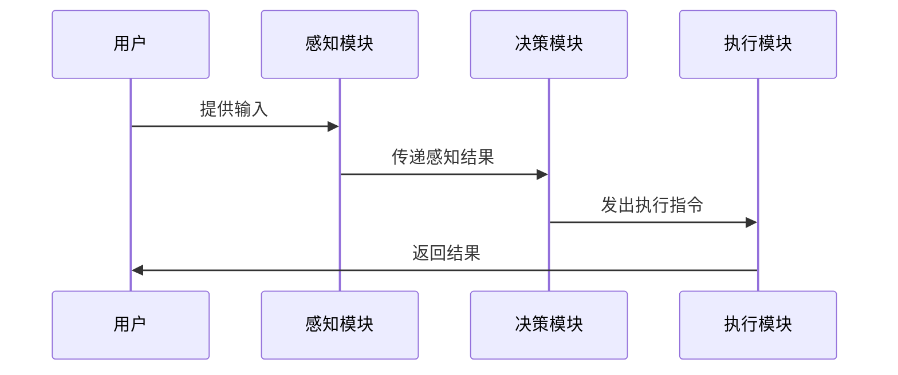

                 


# LLM大模型在AI Agent开发中的核心作用

> 关键词：LLM大模型，AI Agent，自然语言处理，机器学习，人工智能，系统架构

> 摘要：本文深入探讨了LLM（Large Language Model）大模型在AI Agent（人工智能代理）开发中的核心作用。通过分析LLM大模型的基本原理、AI Agent的系统架构、以及两者的协同工作模式，本文详细阐述了LLM如何赋能AI Agent的智能性与交互性。同时，本文还通过实际案例分析和代码实现，展示了LLM在AI Agent开发中的具体应用场景和实现方法。

---

## 第一部分：LLM大模型与AI Agent的背景与概念

### 第1章：LLM大模型与AI Agent概述

#### 1.1 LLM大模型的定义与核心特点
LLM（Large Language Model）大模型是一种基于深度学习的自然语言处理模型，其核心特点包括：
- **大规模参数**：通常包含 billions 甚至 trillions 的参数，能够捕捉复杂的语言模式。
- **预训练能力**：通过大量的未标注数据进行预训练，具备强大的上下文理解和生成能力。
- **自适应性**：能够根据输入的上下文动态调整输出内容，适应不同的应用场景。

#### 1.2 AI Agent的基本概念
AI Agent（人工智能代理）是一种智能系统，能够感知环境、执行任务并与其他系统或用户进行交互。其核心功能包括：
- **感知环境**：通过传感器或API获取外部信息。
- **决策与推理**：基于获取的信息进行推理和决策。
- **执行任务**：通过执行动作或调用服务完成任务。

#### 1.3 LLM大模型在AI Agent中的作用
LLM大模型作为AI Agent的“智能大脑”，主要通过以下方式赋能AI Agent：
- 提供强大的自然语言理解与生成能力。
- 支持多轮对话，增强人机交互的流畅性。
- 通过上下文理解，提升任务执行的准确性。

#### 1.4 本章小结
本章通过定义和对比，明确了LLM大模型与AI Agent的核心概念，并分析了两者之间的关系。接下来将深入探讨LLM与AI Agent的核心概念与联系。

---

## 第二部分：LLM大模型与AI Agent的核心概念与联系

### 第2章：LLM大模型与AI Agent的核心概念

#### 2.1 LLM大模型的原理与实现机制
LLM大模型的实现过程可以分为以下几个步骤：
1. **预训练**：通过大量未标注数据（如书籍、网页文本）进行自监督学习。
2. **注意力机制**：通过自注意力机制捕捉输入文本中的长距离依赖关系。
3. **解码过程**：通过贪心算法或采样算法生成输出文本。

以下是一个简单的LLM解码流程图（Mermaid）：



#### 2.2 AI Agent的系统架构与功能模块
AI Agent的系统架构可以分为以下几个模块：
1. **感知模块**：负责获取外部输入。
2. **决策模块**：基于感知结果进行推理和决策。
3. **执行模块**：根据决策结果执行具体任务。

以下是一个AI Agent的系统架构图（Mermaid）：



#### 2.3 LLM与AI Agent的关系分析
LLM与AI Agent的关系可以通过以下实体关系图（Mermaid）展示：



从图中可以看出，LLM大模型是AI Agent的核心驱动力，主要通过自然语言理解和生成能力支持AI Agent的智能交互。

---

## 第三部分：LLM大模型的算法原理与数学模型

### 第3章：LLM大模型的算法原理

#### 3.1 LLM的训练过程与算法框架
LLM的训练过程包括以下几个步骤：
1. **输入预处理**：将输入文本转换为模型可接受的格式。
2. **正向传播**：通过前馈网络计算损失值。
3. **反向传播**：通过反向传播算法更新模型参数。

以下是一个简单的交叉熵损失函数公式：

$$ \text{损失} = -\frac{1}{N}\sum_{i=1}^{N} \sum_{j=1}^{M} y_{i,j} \log p(y_{i,j}) $$

其中，$N$ 是批次大小，$M$ 是词汇表大小，$y_{i,j}$ 是目标概率分布。

#### 3.2 LLM的注意力机制
注意力机制的核心公式如下：

$$ \text{Attention}(Q, K, V) = \text{softmax}\left(\frac{QK^T}{\sqrt{d_k}}\right)V $$

其中，$Q$ 是查询向量，$K$ 是键向量，$V$ 是值向量，$d_k$ 是向量维度。

以下是一个注意力机制的流程图（Mermaid）：



#### 3.3 LLM的解码过程
解码过程可以通过贪心算法实现：

```python
def decode_step(input_sequence):
    output = ""
    for i in range(max_length):
        # 输入序列扩展到解码器
        decoder_input = input_sequence
        # 通过模型生成概率分布
        probabilities = model.predict(decoder_input)
        # 选择概率最高的词汇
        output += argmax(probabilities)
        # 更新输入序列
        input_sequence = output
    return output
```

---

## 第四部分：AI Agent的系统分析与架构设计

### 第4章：AI Agent的系统架构与功能设计

#### 4.1 AI Agent的系统架构（Mermaid）
以下是一个AI Agent的系统架构图：


#### 4.2 AI Agent的领域模型（Mermaid类图）
以下是一个AI Agent的领域模型类图：



#### 4.3 系统交互流程（Mermaid序列图）
以下是一个系统交互流程图：



---

## 第五部分：项目实战与案例分析

### 第5章：基于LLM的AI Agent开发实战

#### 5.1 环境安装与配置
以下是一个Python环境安装示例：

```bash
pip install torch transformers
```

#### 5.2 核心代码实现
以下是一个简单的AI Agent代码实现：

```python
from transformers import AutoTokenizer, AutoModelForCausalLM

class AI-Agent:
    def __init__(self):
        self.tokenizer = AutoTokenizer.from_pretrained("gpt2")
        self.model = AutoModelForCausalLM.from_pretrained("gpt2")

    def perceive(self, input_text):
        # 返回模型生成的响应
        return self.model.generate(input_text)
```

#### 5.3 案例分析与代码解读
通过具体案例分析LLM在AI Agent中的应用，例如智能客服系统：

```python
def customer_service_agent():
    while True:
        user_input = input("用户：")
        response = agent.perceive(user_input)
        print(f"客服：{response}")
```

---

## 第六部分：最佳实践与注意事项

### 第6章：开发与部署中的注意事项

#### 6.1 开发建议
- 确保模型的可解释性。
- 优化模型的推理速度。

#### 6.2 部署建议
- 使用云服务部署模型。
- 定期更新模型参数。

#### 6.3 优化技巧
- 使用更小的模型进行推理。
- 优化API接口的响应速度。

#### 6.4 小结
本章总结了开发与部署AI Agent时的注意事项，并提出了优化建议。

---

## 结语

本文通过详细分析LLM大模型在AI Agent开发中的核心作用，从理论到实践，全面阐述了LLM如何赋能AI Agent的智能性与交互性。希望本文能够为开发者提供有价值的参考，帮助他们更好地理解和应用这一技术。

---

## 作者

作者：AI天才研究院/AI Genius Institute  
禅与计算机程序设计艺术 /Zen And The Art of Computer Programming

