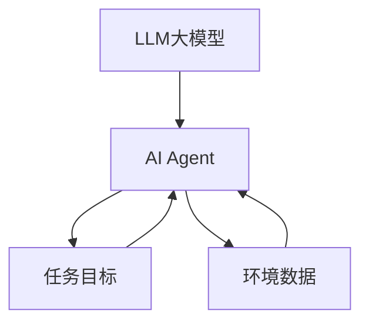
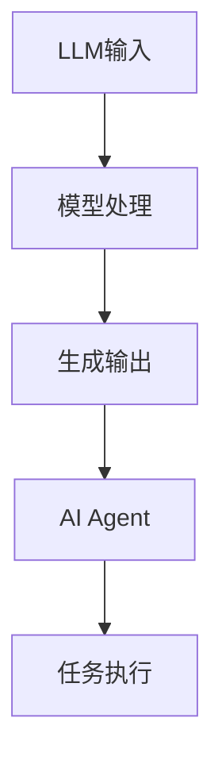
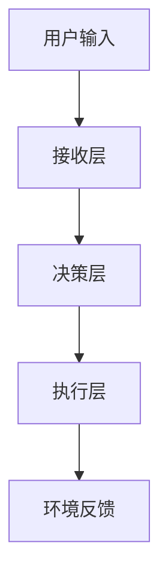

                 


# LLM大模型在AI Agent开发中的核心作用

> 关键词：LLM大模型、AI Agent、算法原理、系统架构、项目实战

> 摘要：本文探讨了LLM大模型在AI Agent开发中的核心作用，从背景介绍、核心概念、算法原理、系统架构到项目实战，详细分析了LLM大模型如何赋能AI Agent，并提供了丰富的代码示例和系统设计。

---

## 第1章: 背景介绍

### 1.1 问题背景

#### 1.1.1 传统AI开发的局限性
传统AI开发依赖于规则引擎和有限状态机，难以处理复杂场景。例如，在自然语言处理任务中，规则引擎难以应对语义理解的多样性。

#### 1.1.2 LLM大模型的出现及其优势
LLM大模型（如GPT-3、PaLM）通过大量数据预训练，具备强大的上下文理解和生成能力，能够处理复杂任务。

#### 1.1.3 AI Agent的概念与应用前景
AI Agent是一种能够感知环境并执行任务的智能体，应用于自动化系统、智能助手等领域。

### 1.2 问题描述

#### 1.2.1 LLM大模型在AI Agent中的角色
LLM作为AI Agent的核心，提供自然语言理解和生成能力，支持决策和执行。

#### 1.2.2 当前AI Agent开发中的主要挑战
传统AI Agent依赖规则，难以应对动态变化的环境。

#### 1.2.3 LLM大模型如何解决这些问题
LLM通过理解上下文和生成自然语言，增强AI Agent的智能性和适应性。

### 1.3 问题解决

#### 1.3.1 LLM大模型的核心能力
- 大规模预训练
- 上下文理解
- 多任务处理

#### 1.3.2 LLM在AI Agent中的具体应用
- 语言交互
- 决策支持
- 任务执行

#### 1.3.3 LLM与AI Agent结合的优势
- 提高交互自然性
- 增强环境适应性
- 扩展任务处理能力

### 1.4 边界与外延

#### 1.4.1 LLM大模型的适用范围
- 语言相关任务
- 需要上下文理解的场景

#### 1.4.2 AI Agent的边界条件
- 依赖于LLM能力
- 算法与环境的适配

#### 1.4.3 LLM与AI Agent结合的潜在风险
- 数据泄露风险
- 模型失控风险

### 1.5 概念结构与核心要素

#### 1.5.1 LLM大模型的组成要素
- 预训练模型
- 微调任务
- 应用接口

#### 1.5.2 AI Agent的核心组件
- 传感器
- 执行器
- 决策模块

#### 1.5.3 两者的交互关系
LLM作为决策模块，与传感器和执行器协同工作。

---

## 第2章: 核心概念与联系

### 2.1 核心概念原理

#### 2.1.1 LLM大模型的工作原理
通过大规模数据预训练，LLM能够理解和生成自然语言。

#### 2.1.2 AI Agent的基本原理
通过感知环境、决策和执行任务，实现目标。

#### 2.1.3 两者的结合机制
AI Agent利用LLM进行语言理解和生成，提升智能性。

### 2.2 概念属性特征对比

| 特征         | LLM大模型                   | AI Agent                   |
|--------------|----------------------------|----------------------------|
| 核心能力     | 语言生成与理解               | 环境感知与任务执行         |
| 输入输出     | 文本输入，文本输出           | 环境数据输入，动作输出     |
| 适应性       | 基于训练数据                 | 基于任务需求               |

### 2.3 ER实体关系图



---

## 第3章: 算法原理讲解

### 3.1 算法原理概述

#### 3.1.1 LLM大模型的训练过程
- 预训练：基于大量文本数据，使用自监督学习。
- 微调：针对特定任务进行优化。

#### 3.1.2 AI Agent的算法选择
- 选择合适的模型架构，如Transformer。
- 定义任务目标，如文本生成。

#### 3.1.3 两者的结合算法
- 将LLM作为AI Agent的决策模块，进行端到端训练。

### 3.2 算法流程图



### 3.3 核心代码实现

```python
def llm_predict(model, input_str):
    return model.generate(input_str)

def agent_execute(agent, action):
    return agent.execute_action(action)

# 示例
input_str = "帮我安排明天的会议"
llm_output = llm_predict(llm_model, input_str)
agent_execute(agent, llm_output)
```

### 3.4 数学模型与公式

#### 3.4.1 LLM大模型的数学基础
- 语言模型的目标：$\argmax p(y|x)$
- 损失函数：$\mathcal{L} = -\sum_{i=1}^{n} \log p(y_i|x_{<i})$

#### 3.4.2 AI Agent的数学模型
- 状态空间：$S$
- 行动空间：$A$
- 策略函数：$\pi(a|s)$

---

## 第4章: 系统分析与架构设计

### 4.1 问题场景介绍

#### 4.1.1 典型应用场景
- 智能客服
- 机器人助手

#### 4.1.2 系统需求分析
- 实时响应
- 高可用性

### 4.2 系统架构设计

#### 4.2.1 分层架构
- 接收层：处理用户输入
- 决策层：LLM生成响应
- 执行层：AI Agent执行任务

#### 4.2.2 组件交互
- 传感器接收环境数据
- 决策模块生成响应
- 执行器执行动作

### 4.3 系统架构图



---

## 第5章: 项目实战

### 5.1 环境安装与配置

#### 5.1.1 开发环境搭建
- 安装Python和相关库（如Hugging Face库）

#### 5.1.2 依赖库安装
```bash
pip install transformers torch
```

### 5.2 核心代码实现

```python
from transformers import AutoModelForCausalLM, AutoTokenizer

model_name = "gpt2"
tokenizer = AutoTokenizer.from_pretrained(model_name)
model = AutoModelForCausalLM.from_pretrained(model_name)

def generate_response(input_str):
    inputs = tokenizer(input_str, return_tensors="np")
    outputs = model.generate(inputs.input_ids, max_length=100)
    response = tokenizer.decode(outputs[0])
    return response
```

### 5.3 代码解读与分析

- 使用Hugging Face库加载预训练模型
- 定义生成响应的函数，处理用户输入并返回生成的文本

### 5.4 实际案例分析

- **案例：智能客服**
  - 用户输入：需要帮助安排会议
  - 系统响应：生成会议安排并执行

---

## 第6章: 最佳实践

### 6.1 开发建议

- 确保模型与任务的匹配
- 定期更新模型以保持性能

### 6.2 注意事项

- 注意模型的计算资源消耗
- 处理数据隐私问题

### 6.3 扩展阅读

- 《Large Language Models in AI Agent Development》
- 《Transformers: State-of-the-art and Beyond》

---

## 小结

通过本文的详细分析，我们可以看到LLM大模型在AI Agent开发中的核心作用。从背景介绍到项目实战，每一步都离不开LLM的支持。未来，随着技术的进步，AI Agent将更加智能化，为更多领域带来创新。

---

作者：AI天才研究院 & 禅与计算机程序设计艺术

