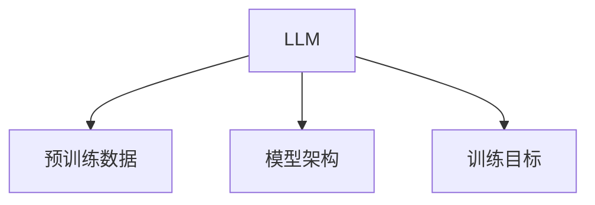
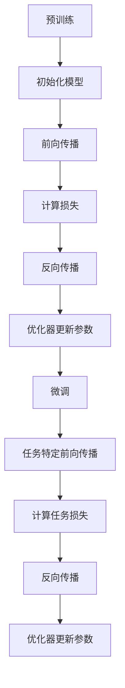
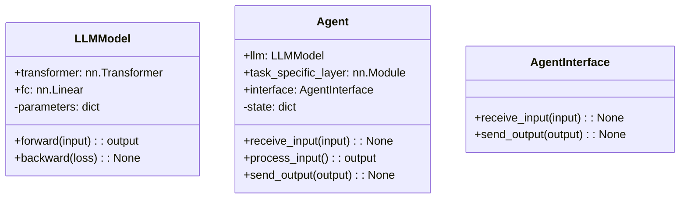
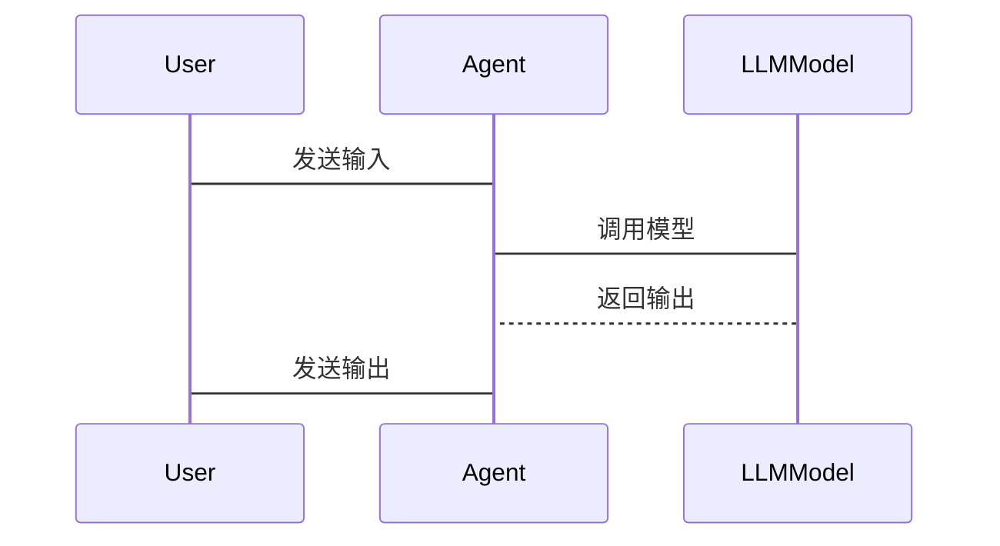

                 


---

# LLM大模型概述：AI Agent开发的基石

> 关键词：大语言模型、LLM、AI Agent、自然语言处理、深度学习、Transformer、预训练模型

> 摘要：大语言模型（LLM）作为人工智能领域的核心技术，正在推动AI Agent的快速发展。本文将从LLM的基本概念、技术原理、算法实现、系统架构到实际应用进行全面解析，深入探讨LLM如何成为AI Agent开发的基石。文章内容包括：背景介绍、核心概念与联系、算法原理、系统分析与架构设计、项目实战以及最佳实践等，帮助读者全面理解和掌握LLM大模型的相关知识。

---

# 第一部分: LLM大模型概述

## 第1章: 大语言模型（LLM）的基本概念

### 1.1 什么是大语言模型

#### 1.1.1 大语言模型的定义
大语言模型（Large Language Model，LLM）是指基于深度学习技术构建的、具有大规模参数的自然语言处理模型。LLM通过在海量文本数据上进行预训练，能够理解和生成人类语言，具有广泛的应用场景。

#### 1.1.2 LLM的核心特点
1. **大规模参数**：LLM通常拥有数亿甚至更多的模型参数，例如GPT系列模型。
2. **预训练能力**：通过在大量未标注数据上进行预训练，模型能够学习语言的语法、语义和上下文信息。
3. **通用性**：LLM能够处理多种任务，如文本生成、问答、翻译、文本摘要等。
4. **可微调性**：在预训练的基础上，可以通过微调（Fine-tuning）来适应特定任务或领域。

#### 1.1.3 LLM与传统NLP模型的区别
传统的NLP模型通常针对特定任务进行训练，例如SVM或CRF用于命名实体识别。而LLM是通过预训练的方式，学习语言的通用表示，能够处理多种任务，具有更强的通用性和灵活性。

### 1.2 大语言模型的技术发展背景

#### 1.2.1 自然语言处理的演进
自然语言处理（NLP）经历了从基于规则的方法到统计方法，再到深度学习的转变。深度学习的引入，特别是Transformer架构的出现，使得NLP模型的性能有了质的飞跃。

#### 1.2.2 大模型的兴起
随着计算能力的提升和数据量的增加，大模型（如BERT、GPT）开始在NLP任务中展现出强大的能力，尤其是在需要理解上下文的任务中表现尤为突出。

#### 1.2.3 LLM的应用场景
LLM广泛应用于文本生成、对话系统、机器翻译、问答系统、内容审核等领域。在AI Agent开发中，LLM作为核心模块，负责理解和生成人类语言，实现与用户的交互。

### 1.3 LLM在AI Agent开发中的地位

#### 1.3.1 AI Agent的基本概念
AI Agent（智能体）是指能够感知环境并采取行动以实现目标的智能系统。AI Agent可以是虚拟助手（如Siri、Alexa），也可以是自动驾驶汽车的控制系统。

#### 1.3.2 LLM作为AI Agent的核心模块
LLM在AI Agent中主要用于自然语言理解（NLU）和自然语言生成（NLG）。通过LLM，AI Agent能够理解用户的需求并生成相应的回应。

#### 1.3.3 LLM与AI Agent的结合方式
1. **任务驱动**：AI Agent通过LLM理解用户的任务需求，执行相应的操作。
2. **对话交互**：通过LLM实现自然语言对话，提升用户体验。
3. **上下文理解**：LLM帮助AI Agent理解对话的上下文，保持对话的连贯性。

---

# 第二部分: 大语言模型的核心原理

## 第2章: 大语言模型的核心原理

### 2.1 预训练目标函数

#### 2.1.1 语言模型的损失函数
语言模型的目标是最小化预测下一个词的条件概率的负对数似然。数学表达式如下：
$$ \mathcal{L} = -\sum_{i=1}^{n} \log P(w_i | w_{<i}) $$

#### 2.1.2 预训练任务的设计
预训练任务通常包括：
1. **Masked Language Model（遮蔽语言模型）**：随机遮蔽部分词，预测被遮蔽的词。
2. **Next Sentence Prediction（下一句预测）**：判断两个句子是否是连续的。

#### 2.1.3 模型的训练过程
模型通过优化损失函数，调整参数以最小化预测错误。训练过程通常采用Adam优化器，并使用学习率衰减策略。

### 2.2 模型架构

#### 2.2.1 Transformer架构
Transformer由编码器和解码器组成，每个编码器和解码器包含多个层。每一层包括多头注意力机制和前馈神经网络。

#### 2.2.2 多层注意力机制
多头注意力机制允许模型在不同的子空间中学习不同的注意力分布，从而捕捉更丰富的语义信息。

#### 2.2.3 模型的可扩展性
通过并行计算和模型剪枝等技术，可以降低模型的计算成本，提升模型的可扩展性。

### 2.3 概念属性特征对比表

| 概念       | 属性           | 特征               |
|------------|----------------|--------------------|
| LLM       | 参数量         | 高度参数化         |
|            | 训练数据       | 大规模             |
|            | 应用场景       | 多样化             |

### 2.4 ER实体关系图


---

# 第三部分: 大语言模型的算法原理

## 第3章: 大语言模型的算法原理

### 3.1 预训练过程

#### 3.1.1 语言模型的损失函数
$$ \mathcal{L} = -\sum_{i=1}^{n} \log P(w_i | w_{<i}) $$

#### 3.1.2 预训练任务
预训练任务包括遮蔽语言模型和下一句预测，通过这些任务，模型学习语言的语法和语义。

#### 3.1.3 训练过程
训练过程通常采用Adam优化器，并使用学习率衰减策略。模型通过不断迭代优化参数，降低损失函数值。

### 3.2 微调过程

#### 3.2.1 微调的目标
微调的目标是将预训练好的模型适应特定任务或领域，例如将GPT模型微调为问答系统。

#### 3.2.2 微调的实现
微调通常包括两部分：任务特定的前馈网络和共享的Transformer层。通过微调，模型可以更好地适应目标任务。

### 3.3 算法实现

#### 3.3.1 预训练代码示例
```python
import torch
import torch.nn as nn
import torch.optim as optim

class LLM(nn.Module):
    def __init__(self):
        super(LLM, self).__init__()
        # 定义模型架构
        self.transformer = nn.Transformer(...)
        self.fc = nn.Linear(...)
    
    def forward(self, input):
        output = self.transformer(input)
        output = self.fc(output)
        return output

# 初始化模型和优化器
model = LLM()
optimizer = optim.Adam(model.parameters(), lr=1e-4)
criterion = nn.CrossEntropyLoss()

# 预训练过程
for epoch in range(num_epochs):
    for batch in dataloader:
        inputs, labels = batch
        outputs = model(inputs)
        loss = criterion(outputs, labels)
        optimizer.zero_grad()
        loss.backward()
        optimizer.step()
```

#### 3.3.2 微调代码示例
```python
# 微调任务：问答系统
class QAModel(nn.Module):
    def __init__(self):
        super(QAModel, self).__init__()
        self.llm = LLM()
        self.fc = nn.Linear(...)
    
    def forward(self, input):
        output = self.llm(input)
        output = self.fc(output)
        return output

# 微调训练
model = QAModel()
optimizer = optim.Adam(model.parameters(), lr=1e-5)
criterion = nn.CrossEntropyLoss()

for epoch in range(num_epochs):
    for batch in task_dataloader:
        inputs, labels = batch
        outputs = model(inputs)
        loss = criterion(outputs, labels)
        optimizer.zero_grad()
        loss.backward()
        optimizer.step()
```

### 3.4 算法流程图



---

# 第四部分: 系统分析与架构设计

## 第4章: 系统分析与架构设计

### 4.1 问题场景介绍

#### 4.1.1 问题背景
在AI Agent开发中，需要构建一个能够理解用户需求并执行相应操作的系统。LLM作为核心模块，负责自然语言理解和生成。

#### 4.1.2 项目介绍
本项目旨在开发一个基于LLM的AI Agent，实现文本生成、问答、对话交互等功能。

### 4.2 系统功能设计

#### 4.2.1 领域模型（领域知识）
AI Agent需要具备特定领域的知识，例如医疗、法律、金融等。领域模型可以通过微调LLM实现。

#### 4.2.2 系统架构（类图）


#### 4.2.3 系统架构（交互图）


---

# 第五部分: 项目实战

## 第5章: 项目实战

### 5.1 环境配置

#### 5.1.1 安装依赖
```bash
pip install torch transformers
```

#### 5.1.2 硬件要求
- CPU或GPU（推荐使用GPU）
- 至少8GB内存

### 5.2 系统核心实现

#### 5.2.1 LLM模型实现
```python
import torch
import torch.nn as nn
import torch.optim as optim

class LLM(nn.Module):
    def __init__(self):
        super(LLM, self).__init__()
        self.transformer = nn.Transformer(...)
        self.fc = nn.Linear(...)
    
    def forward(self, input):
        output = self.transformer(input)
        output = self.fc(output)
        return output
```

#### 5.2.2 AI Agent实现
```python
class AI-Agent:
    def __init__(self):
        self.llm = LLM()
        self.task_specific_layer = nn.Linear(...)
    
    def receive_input(self, input):
        self.input = input
    
    def process_input(self):
        output = self.llm(self.input)
        output = self.task_specific_layer(output)
        return output
    
    def send_output(self, output):
        print(output)
```

### 5.3 实际案例分析

#### 5.3.1 应用场景：智能问答
```python
agent = AI-Agent()
agent.receive_input("什么是量子计算?")
agent.process_input()
agent.send_output("量子计算是研究量子力学原理用于信息处理的学科...")
```

#### 5.3.2 应用场景：文本生成
```python
agent.receive_input("生成一段关于AI的介绍。")
agent.process_input()
agent.send_output("人工智能（AI）是模拟人类智能的计算机系统...")
```

### 5.4 项目小结

#### 5.4.1 关键点总结
- LLM是AI Agent的核心模块
- 系统架构设计需要考虑模型的可扩展性和任务的多样性
- 微调LLM可以提升模型在特定任务中的性能

#### 5.4.2 注意事项
- 数据预处理和清洗是关键步骤
- 模型调参需要耐心和经验
- 保护用户隐私和数据安全

---

# 第六部分: 最佳实践

## 第6章: 最佳实践

### 6.1 小结

#### 6.1.1 核心观点总结
- LLM是AI Agent开发的重要基石
- 理解LLM的核心原理是开发的基础
- 系统架构设计需要综合考虑多个因素

#### 6.1.2 重要性总结
- LLM的性能直接影响AI Agent的表现
- 系统架构设计决定了系统的可扩展性和可维护性
- 项目实战是检验理论知识的重要途径

### 6.2 注意事项

#### 6.2.1 数据处理
- 数据清洗和预处理是关键
- 数据标注需要准确
- 数据安全需要保护

#### 6.2.2 模型调优
- 学习率和批量大小需要合理设置
- 模型剪枝和蒸馏可以降低计算成本
- 模型评估需要使用多样化的指标

#### 6.2.3 系统优化
- 并行计算可以提升训练效率
- 模型压缩可以降低资源消耗
- 系统监控可以及时发现和解决问题

### 6.3 拓展阅读

#### 6.3.1 推荐书籍
1. 《深度学习》—— Ian Goodfellow
2. 《自然语言处理入门》—— 细水长流
3. 《Transformer深入理解》—— 华章出版社

#### 6.3.2 推荐论文
1. "Attention Is All You Need"（维基百科）
2. "BERT: Pre-training of Deep Bidirectional Transformers for NLP"（Google AI）
3. "GPT-3:(Language Models are Few-Shot Learners)"（OpenAI）

---

# 作者：AI天才研究院/AI Genius Institute & 禅与计算机程序设计艺术 /Zen And The Art of Computer Programming

---

以上是《LLM大模型概述：AI Agent开发的基石》的技术博客文章的完整大纲和部分正文内容。希望对您有所帮助！

